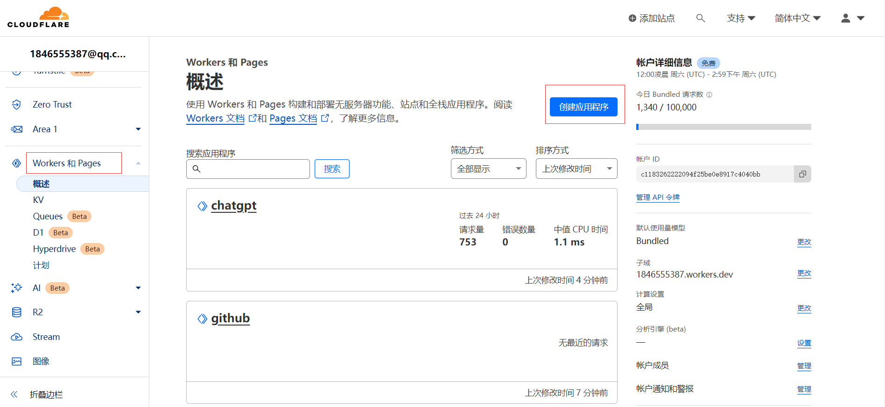
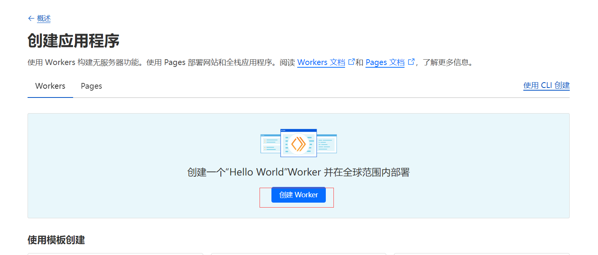
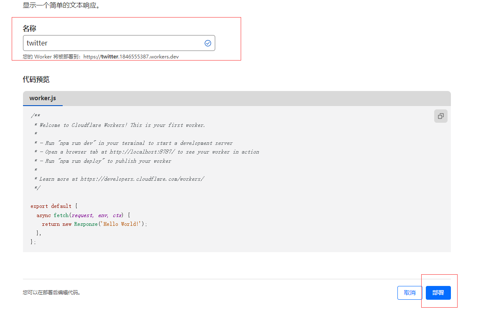
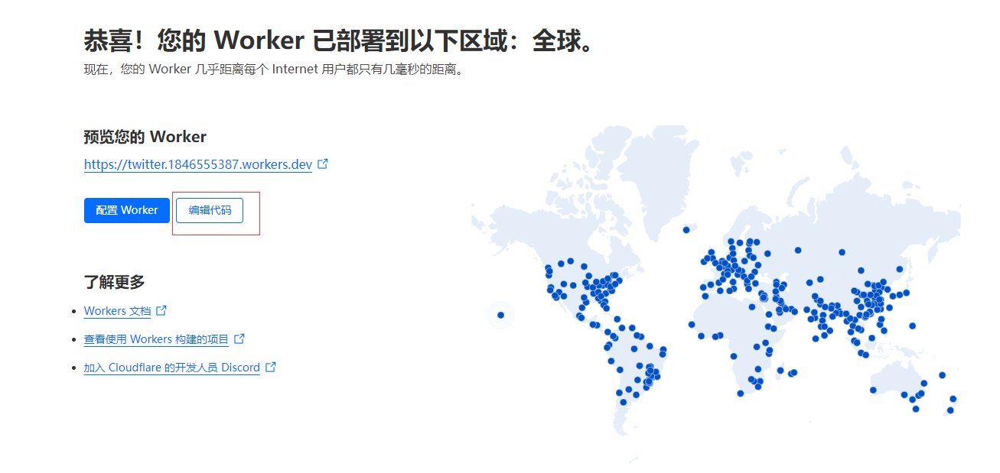
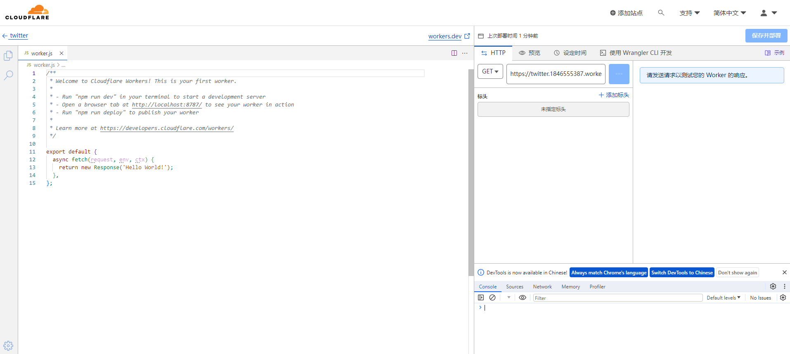
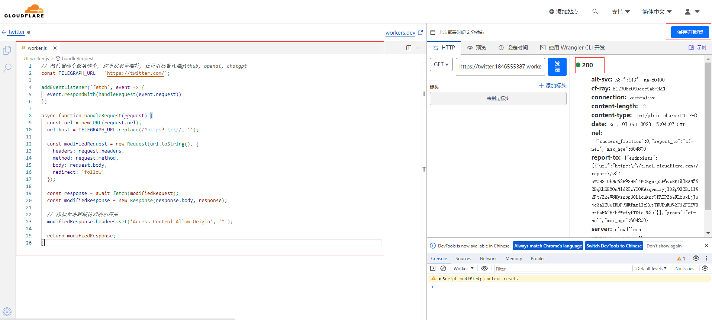
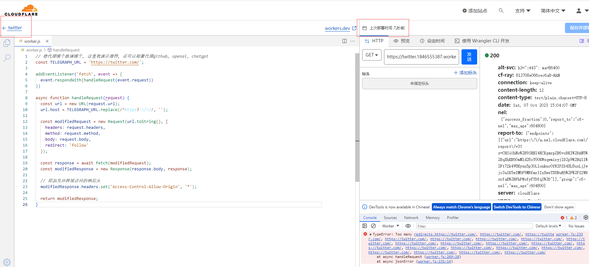
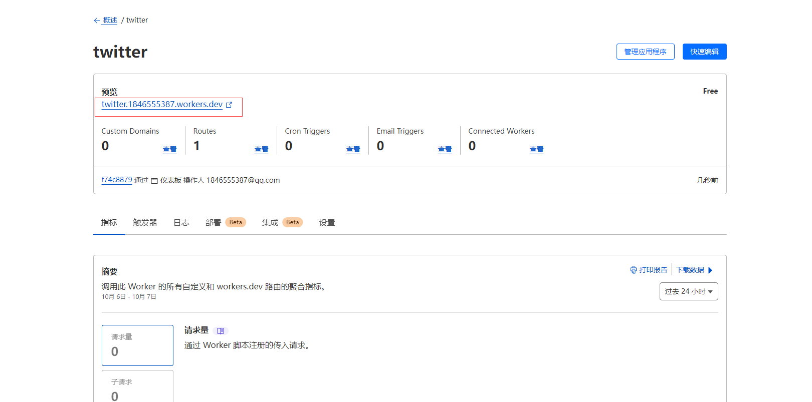
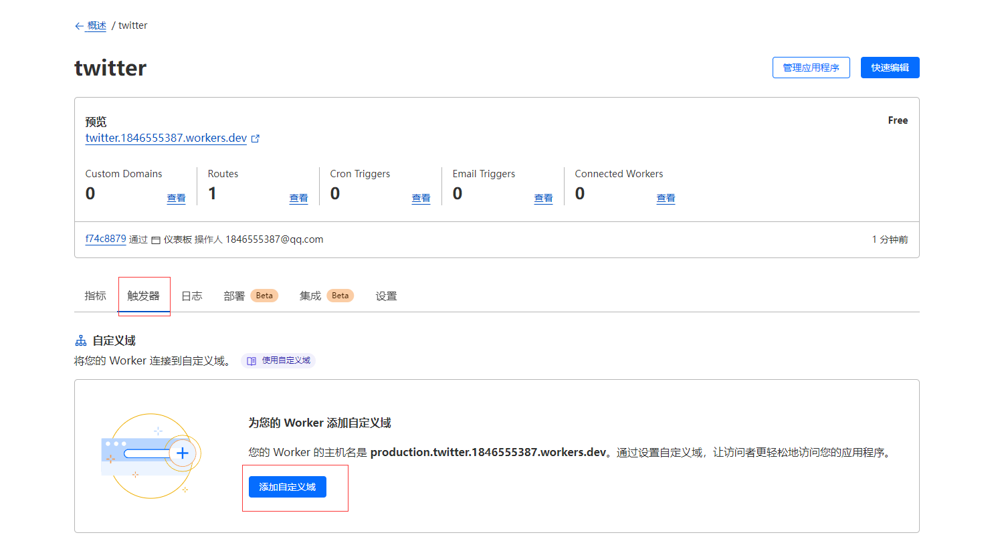
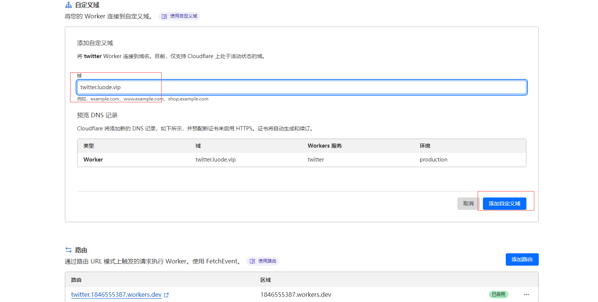

# 目标

可以不打开vpn直接访问外网, 包括github, openai, twitter等

# 打开注册cloudflare

https://dash.cloudflare.com/

- 创建一个任务



- 创建一个程序



- 填入名称, 部署



- 编辑代码



- 将下面的代码全部覆盖



```js
// 想代理哪个就填哪个, 这里我演示推特, 还可以部署代理github, openai, chatgpt
const TELEGRAPH_URL = 'https://twitter.com/';

addEventListener('fetch', event => {
  event.respondWith(handleRequest(event.request))
})

async function handleRequest(request) {
  const url = new URL(request.url);
  url.host = TELEGRAPH_URL.replace(/^https?:\/\//, '');

  const modifiedRequest = new Request(url.toString(), {
    headers: request.headers,
    method: request.method,
    body: request.body,
    redirect: 'follow'
  });

  const response = await fetch(modifiedRequest);
  const modifiedResponse = new Response(response.body, response);

  // 添加允许跨域访问的响应头
  modifiedResponse.headers.set('Access-Control-Allow-Origin', '*');

  return modifiedResponse;
}
```


- 保证右侧出现200, 即可部署



- 点击左上角回退



- 此时可以通过这个地址打开代理的网站, 并且不需要开vpn



# 使用个人的域名代理

- 点击触发器, 自定义域名



- 当然, 前提是你已经买了域名并且在这个网站进行了域名映射

