# 统一规格

> 2023/10/07

1. 可信链网络 -> 192.168.1.78,  通道mychannel, 链码mycc, 两个peer节点
2. 本机 -> 内存:16G + CPU:i5-9400 @ 2.9Ghz @ 6核
3. 达梦数据库192.168.1.211/TRUSTED_SDK_TEST: 总数据量50w
4. 90%百分位 < 3000
5. 异常% == 0%
6. 统一执行30s
7. 取最大并发数记录
8. 通道配置configtx.yaml放开打包交易, 不使用10个交易打包的默认配置

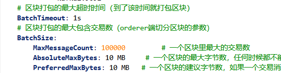

# 生成证书/certificate/generateCertificate

> 并发提升6倍, 吞吐量提升8倍

`/certificate/generateCertificate?typeCertificate=1&dataContentCertificate=数据内容&dataBelongsCertificate=数据所属&currentChainCertificate=所在链&userNameCertificate=上链者`

- java -> 最大并发数: 25 ; 吞吐量: 10/s
- 2023/10/07 16:52

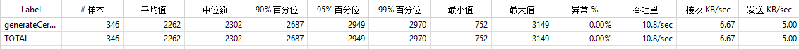

- go -> 最大并发数: 150 ; 吞吐量: 88/s
- 2023/10/07 16:58

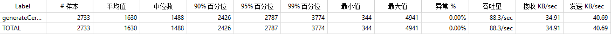

# 同步上链存证接口/contract/setEvidence

> 并发提升25%, 吞吐量提升0.5%

`/contract/setEvidence`


| key         | 0                                                    | false | text/plain | true |
| ----------- | ---------------------------------------------------- | ----- | ---------- | ---- |
| value       | {"test":"1"}                                         | false | text/plain | true |
| type        | 1                                                    | false | text/plain | true |
| contentJson | {"sourceId":"666","contentHash":"haha","userId":"1"} | false | text/plain | true |

- java -> 最大并发数: 200; 吞吐量: 137/s
- 2023/10/07 17:03

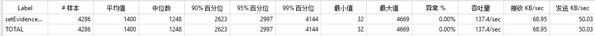

- go -> 最大并发数: 250; 吞吐量: 145/s
- 2023/10/07 17:07

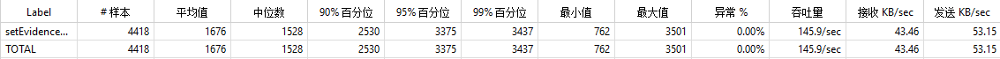

# 根据key获取当前账本数据/contract/get

> 并发提升2倍, 吞吐量提升4倍
>
> go-sdk的并发还可以提高, 但是可信链网络请求达到了并发2500的限制

`contract/get?key=2D69E563C18ED588B177B1234E4C46D4A83A512F497BCD2626C705A5BA2F5B80`

- java -> 最大并发数: 1250; 吞吐量: 427/s
- 2023/10/07 17:15

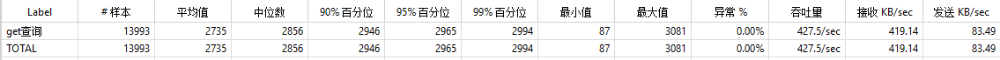

- go -> 最大并发数: 2500; 吞吐量: 1736/s
- 2023/10/07 17:15

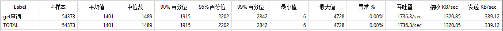

# 根据key获取下级账本数据/contract/getNextLedger

> 并发提升5倍, 吞吐量提升4.8倍
>
> go-sdk的并发还可以提高, 但是可信链网络请求达到了并发2500的限制

`contract/getNextLedger?key=2D69E563F1562D02D6703C709A98282C6F85E75DA18550C2BD9FC739C902BBB2`

- java -> 最大并发数: 500; 吞吐量: 302/s
- 2023/10/07 17:39

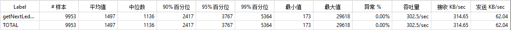

- go -> 最大并发数: 2500; 吞吐量: 1455/s
- 2023/10/07 17:44

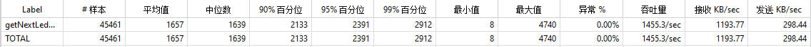

# 根据key获取上级账本数据/contract/getUpLedger

> 并发提升2倍, 吞吐量提升3倍
>
> go-sdk的并发还可以提高, 但是可信链网络请求达到了并发2500的限制

`contract/getUpLedger?key=2D69E563F1562D02D6703C709A98282C6F85E75DA18550C2BD9FC739C902BBB2`

- java -> 最大并发数: 1250; 吞吐量: 474/s
- 2023/10/07 17:51

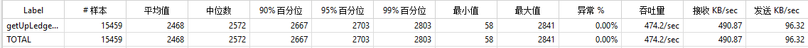

- go -> 最大并发数: 2500; 吞吐量: 1414/s
- 2023/10/07 17:54

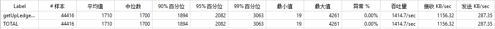

# 根据key获取完整链条/contract/getSingleChainLedger

> 并发无提升, 吞吐量提升90%

`/contract/getSingleChainLedger?key=2D69E563F1562D02D6703C709A98282C6F85E75DA18550C2BD9FC739C902BBB2`

- java -> 最大并发数: 400; 吞吐量: 173/s
- 2023/10/07 17:59

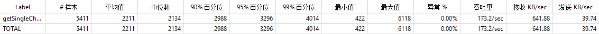

- go -> 最大并发数: 400; 吞吐量: 330/s
- 2023/10/07 18:05

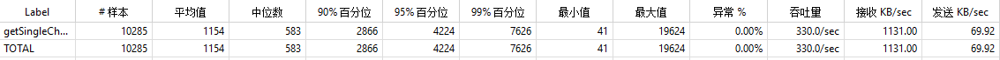

# (数据低)上级溯源 账本数据/contract/getUpLedgers

> 并发提升3.1倍, 吞吐量提升5.9倍

`/contract/getUpLedgers?key=54C3ACF7FE6A5BCEEAB71BE707C3ED9643FDC88B631C5802E01D15C2F204A686&type=5&sourceId=0320`

- java -> 最大并发数: 80; 吞吐量: 33/s
- 2023/10/07 18:15

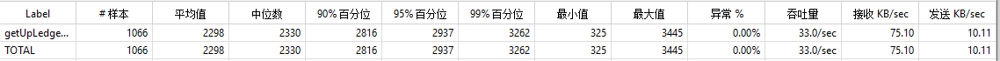

- go -> 最大并发数: 250; 吞吐量: 195/s
- 2023/10/07 18:19

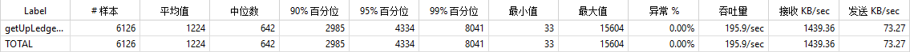

# (数据低)json内容获取账本数据列表/contract/getPresentLedgers

> 并发提升60%, 吞吐量提升2.3倍

`/contract/getPresentLedgers?sourceId=0320`

- java -> 最大并发数: 125; 吞吐量: 61/s
- 2023/10/07 18:27

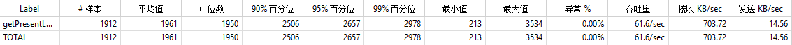

- go -> 最大并发数: 200; 吞吐量: 145/s
- 2023/10/07 18:29

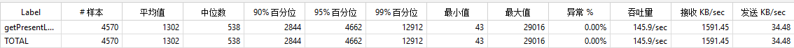

```

```

