# BCCSP源码分析

> fabric 2.4.7版本

## 整体介绍

区块链密码服务提供商（BlockChain Cryptographic Service Provider）作为Fabric的核心组件之一，为其他组件提供了密码服务。

其实现有三种，分别为**SW、PKCS11、IDEMIX**。

1. SW是基于软密码算法实现的CSP，其主要使用了Golang**现有的密码库和哈希等算法**编写而成。

2. 而PKCS11则支持PKCS11标准，主要为基于**硬件的密码**组件而设计。
3. 至于IDEMIX，则是Fabric的另一大特色，支持使用基于**零知识证明体系的密码服务**，对隐私性的保护更强。

软件实现的SW和硬件实现的PKCS11两种CSP，在Fabric程序中并不是同时支持的。

在用于Fabric编译的makefile文件中，采用了tag的方式**指定是否启用PKCS11**。

在`BCCSP/factory/pkcs11.go`等文件中，也可以看到类似这样的条件编译语句。


由于在实际应用中没有使用密码硬件支持，所以本次实践将全部关注SW实现的分析与改造，而**忽略PKCS11实现与IDEMIX实现**。

## 核心接口

对于[Fabric](https://so.csdn.net/so/search?q=Fabric&spm=1001.2101.3001.7020)源码中密码服务的提供者BCCSP而言，其核心接口`BCCSP`的方法集，将是我们顺藤摸瓜，理解其整个结构的优质参考。

`bccsp/bccsp.go`

```go
// BCCSP 是区块链加密服务提供商，它提供密码标准和算法的实现。
type BCCSP interface {

	// KeyGen 使用opts选择参数生成密钥。
	KeyGen(opts KeyGenOpts) (k Key, err error)

	// KeyDeriv 密钥派生方法，根据已有密钥，通过密码学方法衍生得到新密钥
	KeyDeriv(k Key, opts KeyDerivOpts) (dk Key, err error)

	// KeyImport 密钥导入方法，将原始二进制字节数据转换为指定密钥类型
	KeyImport(raw interface{}, opts KeyImportOpts) (k Key, err error)

	// GetKey 获取密钥，根据密钥标识符SKI查找密钥
	GetKey(ski []byte) (k Key, err error)

	// Hash 使用选项选项散列hash消息msg。如果opts为nil，则将使用默认哈希函数。
	Hash(msg []byte, opts HashOpts) (hash []byte, err error)

	// GetHash 使用选项返回hash.Hash的实例。如果opts为nil，则返回默认哈希函数。
	GetHash(opts HashOpts) (h hash.Hash, err error)

	// Sign 使用密钥k签署摘要。签名（对大数据签名需要先做hash摘要）。opts参数应适用于所使用的算法。
	Sign(k Key, digest []byte, opts SignerOpts) (signature []byte, err error)

	// Verify 验签。根据密钥k和摘要验证签名
	Verify(k Key, signature, digest []byte, opts SignerOpts) (valid bool, err error)

	// Encrypt 加密。使用密钥k加密明文。
	Encrypt(k Key, plaintext []byte, opts EncrypterOpts) (ciphertext []byte, err error)

	// Decrypt 密钥。使用密钥k解密密文。
	Decrypt(k Key, ciphertext []byte, opts DecrypterOpts) (plaintext []byte, err error)
}
```

上面的接口被不同的工具集瓜分实现

BCCSP主要提供了以下工具集来对上述方法进行支持：

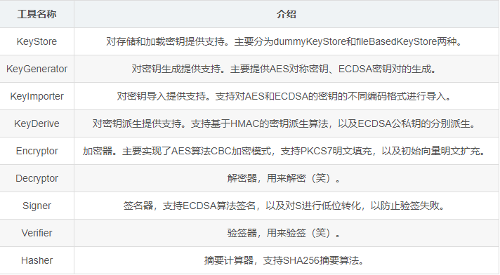

## 工厂方法

BCCSP实现上采用了工厂模式，使用工厂方法控制CSP实例的生成。

分析这块内容，我们需要重点关注3个文件（按顺序）：

1. `factory/factory.go`: 工厂入口主方法

2.  `factory/no_pkcs11.go`: 不使用硬件密码时, 工厂逻辑处理代码
   - 同理: factory/pkcs11.go 等于使用硬件的密码时, 工厂逻辑处理代码

3.  `factory/swfactory.go`: 软密码实例
   - 同理: 其他第三方的实现应该参照这个编写

直观的来说，factory的作用就是生成并获取bccsp的实例。

```go
// BCCSPFactory 用于获取 BCCSP 接口的实例。工厂有一个用来称呼它的名称。
type BCCSPFactory interface {

	// Name 返回该工厂的名称
	Name() string

	// Get 使用 opts 选择返回 BCCSP 的实例。
	Get(opts *FactoryOpts) (bccsp.BCCSP, error)
}
```

`factory/factory.go`中定义了一些全局变量如下：

```go
var (
	defaultBCCSP       bccsp.BCCSP // 默认 BCCSP 实例
	factoriesInitOnce  sync.Once   // 工厂初始化同步
	factoriesInitError error       // 工厂初始化错误

	bootBCCSP         bccsp.BCCSP // 当 InitFactories 尚未被调用时（应该只发生在测试用例中），暂时使用此 BCCSP 实例
	bootBCCSPInitOnce sync.Once   // bootBCCSP的实例化由该sync.Once的Do方法执行，即只会执行一遍

	logger = flogging.MustGetLogger("bccsp")
)
```

### 初始化实例initBCCSP

bccsp实例的初始化通过调用下面的`initBCCSP`方法来完成。这个方法本质上也是传入工厂实例，通过Get()方法生成CSP实例。

这个方法是私有的, 也就是说初始化不可能在外部执行

```go
// initBCCSP 初始化 BCCSP 实例
func initBCCSP(f BCCSPFactory, config *FactoryOpts) (bccsp.BCCSP, error) {
	// 调用工厂给出的 get 接口, 实现生成返回 BCCSP 的实例。
	csp, err := f.Get(config)
	if err != nil {
		return nil, errors.Errorf("无法初始化 BCCSP %s [%s]", f.Name(), err)
	}

	return csp, nil
}
```

### 获取实例GetDefault

因为在给出的全局变量中, defaultBCCSP 是私有的属性, 所以提了一个get方法获取实例

- 在Fabric的其他组件中，若需要使用密码服务，则需要调用下面这一GetDefault()方法来获取defaultBCCSP

```go
// GetDefault 返回 BCCSP 实例, 并非初始化。
func GetDefault() bccsp.BCCSP {
	// 如果默认的 BCCSP 实例为空, 则使用备用的 BCCSP 实例
	if defaultBCCSP == nil {
		logger.Debug("使用 BCCSP 之前,请调用 InitFactories(). 回退到 bootBCCSP.")
		bootBCCSPInitOnce.Do(func() {
			var err error
			// 使用 SWFactory 工厂来初始化备用的实例
			bootBCCSP, err = (&SWFactory{}).Get(GetDefaultOpts())
			if err != nil {
				panic("BCCSP 内部错误，使用 GetDefaultOpts 初始化失败!")
			}
		})
		return bootBCCSP
	}
	return defaultBCCSP
}
```

- 我们看到，如果defaultBCCSP为nil，它会启用备用方案
- 即使用SWFactory和默认配置生成bootBCCSP实现。
  - 当然，我们无须关注bootBCCSP的使用，因为正常情况下该CSP不会启用。


好了，到这里我们通过`factory.go`大致清楚了工厂用于实例化CSP的方法，以及**其余组件通过获取默认CSP以使用密码服务**这件事情。

> 那么接下来我们只需要跟随初始化方法就可以了解整个过程了。


## 工厂初始化流程

```go
// initBCCSP 初始化 BCCSP 实例
func initBCCSP(f BCCSPFactory, config *FactoryOpts) (bccsp.BCCSP, error) {
	// 调用工厂给出的 get 接口, 实现生成返回 BCCSP 的实例。
	csp, err := f.Get(config)
	if err != nil {
		return nil, errors.Errorf("无法初始化 BCCSP %s [%s]", f.Name(), err)
	}

	return csp, nil
}
```

### 是谁调用了`initBCCSP`

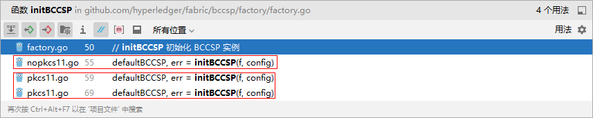

没错, 上图很明显, 因为我们暂时不关注硬件相关的密码服务`pkcs11`

所以就是`nopkcs11`了

### initFactories 初始化工厂

`bccsp/factory/nopkcs11.go`

```go
// initFactories 初始化工厂
func initFactories(config *FactoryOpts) error {
	// 如果没有任何自定义配置, 则对默认选项采取一些预防措施
	if config == nil {
		config = GetDefaultOpts()
	}

	if config.Default == "" {
		config.Default = "SW"
	}

	if config.SW == nil {
		config.SW = GetDefaultOpts().SW
	}

	// 基于软件 BCCSP
	if config.Default == "SW" && config.SW != nil {
        // 定义空的SWFactory，稍后会看到，该结构实现了Factory接口的Get()方法
		f := &SWFactory{}
		var err error
        // 这就是初始化方法了, 我们知道, 这里只是调用了 get 方法
        // 返回 BCCSP 到全局的变量中, 也就是开始的 defaultBCCSP bccsp.BCCSP
        // 很明显详细的初始化过程根本不在这里
        // 那只能在 get 方法中了, SWFactory的 get 方法中
		defaultBCCSP, err = initBCCSP(f, config)
		if err != nil {
			return errors.Wrapf(err, "初始化 BCCSP 失败")
		}
	}

	if defaultBCCSP == nil {
		return errors.Errorf("找不到默认值 `%s` BCCSP", config.Default)
	}

	return nil
}
```

在这个初始化的方法参数中, 我们最新看到的是`FactoryOpts`, 这很明显是一个配置信息, 我们可以自定义一些配置。

```go
// FactoryOpts 保存用于初始化工厂实现的配置信息
type FactoryOpts struct {
	Default string  `json:"default" yaml:"Default"`
    // SW: 软件, 里面包含可配置的属性
	SW      *SwOpts `json:"SW,omitempty" yaml:"SW,omitempty"`
}

// SwOpts 包含 SWFactory 的选项
type SwOpts struct {
	// 安全级别(如: 256位的算法和384位的算法)
	Security int `json:"security" yaml:"Security"`
	// hash算法(如: SHA2、SHA3)
	Hash string `json:"hash" yaml:"Hash"`
	// 存放密钥的路径
	FileKeystore *FileKeystoreOpts `json:"filekeystore,omitempty" yaml:"FileKeyStore,omitempty"`
}
```

这个配置相当简陋, 还标识了yaml, 那么这个配置肯定在一个 yaml中了:

- 一个`Default`, 类似于name表示的string类型的名称
- 一个`SW`, 真正的配置信息, 配置在`core.yaml/orderer.yaml`的BCCSP中


然后我们看到了调用了初始化方法:

```go
	// 基于软件 BCCSP
	if config.Default == "SW" && config.SW != nil {
        // 定义空的SWFactory，稍后会看到，该结构实现了Factory接口的Get()方法
		f := &SWFactory{}
		var err error
        // 这就是初始化方法了, 我们知道, 这里只是调用了 get 方法
        // 返回 BCCSP 到全局的变量中, 也就是开始的 defaultBCCSP bccsp.BCCSP
        // 很明显详细的初始化过程根本不在这里
        // 那只能在 get 方法中了, SWFactory的 get 方法中
		defaultBCCSP, err = initBCCSP(f, config)
		if err != nil {
			return errors.Wrapf(err, "初始化 BCCSP 失败")
		}
	}
```

- SWFactory实现了Factory接口的Get()方法, 详细的初始化在 get 方法中


### SWFactory调用get初始化

`bccsp/factory/swfactory.go`

```go
const (
	// SoftwareBasedFactoryName 是基于软件的 BCCSP 实现的工厂名称
	SoftwareBasedFactoryName = "SW"
)

// SWFactory 是基于软件的BCCSP 的工厂。
type SWFactory struct{}

// Name 返回该工厂的名称(这是 BCCSPFactory 定义的接口方法)
func (f *SWFactory) Name() string {
	return SoftwareBasedFactoryName
}

// Get 使用 Opts 返回 BCCSP 的实例(这是 BCCSPFactory 定义的接口方法)
func (f *SWFactory) Get(config *FactoryOpts) (bccsp.BCCSP, error) {
	// 验证参数
	if config == nil || config.SW == nil {
		return nil, errors.New("配置无效。它一定不能为零。")
	}

	// 获取配置信息
	swOpts := config.SW

	// 创建KeyStore
	var ks bccsp.KeyStore
	switch {
	case swOpts.FileKeystore != nil:
		// 实例化基于文件的密钥目录, 通过KeyStorePath指定密钥存放路径。
		fks, err := sw.NewFileBasedKeyStore(nil, swOpts.FileKeystore.KeyStorePath, false)
		if err != nil {
			return nil, errors.Wrapf(err, "无法初始化软件密钥存储")
		}
		ks = fks
	default:
		// 默认为临时内存密钥存储
		ks = sw.NewDummyKeyStore()
	}

	// 通过创建好的KeyStore目录，调用NewWithParams()方法获取swbccsp实例，该方法在BCCSP/sw/impl.go中
	return sw.NewWithParams(swOpts.Security, swOpts.Hash, ks)
}

// SwOpts 包含 SWFactory 的选项
type SwOpts struct {
	// 安全级别(如: 256位的算法和384位的算法)
	Security int `json:"security" yaml:"Security"`
	// hash算法(如: SHA2、SHA3)
	Hash string `json:"hash" yaml:"Hash"`
	// 存放密钥的路径
	FileKeystore *FileKeystoreOpts `json:"filekeystore,omitempty" yaml:"FileKeyStore,omitempty"`
}
```

SWCSP工厂的Get()方法关键步骤就两步

- 其一调用`NewFileBasedKeyStore`方法创建KeyStore密钥目录

- 其二是调用`NewWithParams`方法创建CSP实例。

在之前核心数据部分的介绍中我们知道，Fabric BCCSP 中的`KeyStore`结构用于存储和读取密钥数据

其有两种:

- 一种为不支持读写的`DummyKeyStore`内存存储(肯定不会看这种啦)

- 一种为基于`文件系统`加载密钥材料的`FileBasedKeyStore`

到目前为止，我们把BCCSP的工厂方法给串了一遍，知道了工厂如何创建，以及如何通过SW工厂获取SWcsp实例。那么整个`bccsp/factory`包下基本就这点内容了。

后面就是真正的实现逻辑了, 这些逻辑将会在`bccsp/sw`包下实现了

- 如果要自定义实现国密改造, 就修改一下工厂方法, 到自定义的国密包下就好了


## SW密码实现

`bccsp/sw`

在刚刚的工厂初始化中

我们看到了创建密钥目录`NewFileBasedKeyStore`方法和生成实例`NewWithParams`方法

```go
	// 创建KeyStore
	var ks bccsp.KeyStore
	switch {
	case swOpts.FileKeystore != nil:
		// 实例化基于文件的密钥存储, 通过KeyStorePath指定密钥存放路径。
		fks, err := sw.NewFileBasedKeyStore(nil, swOpts.FileKeystore.KeyStorePath, false)
		if err != nil {
			return nil, errors.Wrapf(err, "无法初始化软件密钥存储")
		}
		ks = fks
	default:
		// 默认为临时内存密钥存储
		ks = sw.NewDummyKeyStore()
	}

	// 通过创建好的KeyStore，调用NewWithParams()方法获取swbccsp实例，该方法在BCCSP/sw/impl.go中
	return sw.NewWithParams(swOpts.Security, swOpts.Hash, ks)
```

### 生成密钥目录

`bccsp/sw/fileks.go`

```go
// NewFileBasedKeyStore 在 给定位置 实例化基于文件的密钥存储。
// 如果指定非空密码，则可以对密钥存储进行加密。
// 也可以将其设置为只读。在这种情况下，任何商店操作将被禁止
func NewFileBasedKeyStore(pwd []byte, path string, readOnly bool) (bccsp.KeyStore, error) {
	ks := &fileBasedKeyStore{}
	// 使用密码、文件夹路径初始化此 KeyStore 存储密钥和只读标志的位置(只创建目录, 不创建密钥文件)。
	return ks, ks.Init(pwd, path, readOnly)
}
```

- 此方法没有过多的内容, 主要是生成指定存放密钥文件的目录, 并不是生成真正的密钥


### 生成实例

调用`NewWithParams()`方法创建swbccsp实例。这里将创建真正的CSP实例。

现在我们来看一下这个`NewWithParams`方法里面都有啥。

```go
// NewWithParams 返回基于软件的 BCCSP 的新实例
// 参数: 安全级别、哈希算法、密钥目录
func NewWithParams(securityLevel int, hashFamily string, keyStore bccsp.KeyStore) (bccsp.BCCSP, error) {
	// 初始化hash算法
	conf := &config{}
	err := conf.setSecurityLevel(securityLevel, hashFamily)
	if err != nil {
		return nil, errors.Wrapf(err, "初始化hash配置失败 [%v,%v]", securityLevel, hashFamily)
	}

	// 通过New方法构建一个空的 CSP 实例, 此处实例初步创建完成, 不过属性还没有赋值
	swbccsp, err := New(keyStore)
	if err != nil {
		return nil, err
	}

	// 这里面会通过AddWrapper方法将启用指定工具的类型，与相应工具的实例绑定到一起。
	// key = 某个结构体的反射类型; value = 实现了 AddWrapper 方法中匹配switch case接口的实现
	
	// 设置对称加密器
	swbccsp.AddWrapper(reflect.TypeOf(&aesPrivateKey{}), &aescbcpkcs7Encryptor{})

	// 设置对称 解密器
	swbccsp.AddWrapper(reflect.TypeOf(&aesPrivateKey{}), &aescbcpkcs7Decryptor{})

	// 设置签名器
	swbccsp.AddWrapper(reflect.TypeOf(&ecdsaPrivateKey{}), &ecdsaSigner{})

	// 设置非对称 验签器
	swbccsp.AddWrapper(reflect.TypeOf(&ecdsaPrivateKey{}), &ecdsaPrivateKeyVerifier{})
	swbccsp.AddWrapper(reflect.TypeOf(&ecdsaPublicKey{}), &ecdsaPublicKeyKeyVerifier{})

	// 设置哈希器
	swbccsp.AddWrapper(reflect.TypeOf(&bccsp.SHAOpts{}), &hasher{hash: conf.hashFunction})
	swbccsp.AddWrapper(reflect.TypeOf(&bccsp.SHA256Opts{}), &hasher{hash: sha256.New})
	swbccsp.AddWrapper(reflect.TypeOf(&bccsp.SHA384Opts{}), &hasher{hash: sha512.New384})
	swbccsp.AddWrapper(reflect.TypeOf(&bccsp.SHA3_256Opts{}), &hasher{hash: sha3.New256})
	swbccsp.AddWrapper(reflect.TypeOf(&bccsp.SHA3_384Opts{}), &hasher{hash: sha3.New384})

	// 设置密钥生成器
	swbccsp.AddWrapper(reflect.TypeOf(&bccsp.ECDSAKeyGenOpts{}), &ecdsaKeyGenerator{curve: conf.ellipticCurve})
	swbccsp.AddWrapper(reflect.TypeOf(&bccsp.ECDSAP256KeyGenOpts{}), &ecdsaKeyGenerator{curve: elliptic.P256()})
	swbccsp.AddWrapper(reflect.TypeOf(&bccsp.ECDSAP384KeyGenOpts{}), &ecdsaKeyGenerator{curve: elliptic.P384()})
	swbccsp.AddWrapper(reflect.TypeOf(&bccsp.AESKeyGenOpts{}), &aesKeyGenerator{length: conf.aesBitLength})
	swbccsp.AddWrapper(reflect.TypeOf(&bccsp.AES256KeyGenOpts{}), &aesKeyGenerator{length: 32})
	swbccsp.AddWrapper(reflect.TypeOf(&bccsp.AES192KeyGenOpts{}), &aesKeyGenerator{length: 24})
	swbccsp.AddWrapper(reflect.TypeOf(&bccsp.AES128KeyGenOpts{}), &aesKeyGenerator{length: 16})

	// 设置密钥派生器
	swbccsp.AddWrapper(reflect.TypeOf(&ecdsaPrivateKey{}), &ecdsaPrivateKeyKeyDeriver{})
	swbccsp.AddWrapper(reflect.TypeOf(&ecdsaPublicKey{}), &ecdsaPublicKeyKeyDeriver{})
	swbccsp.AddWrapper(reflect.TypeOf(&aesPrivateKey{}), &aesPrivateKeyKeyDeriver{conf: conf})

	// 设置密钥导入器
	swbccsp.AddWrapper(reflect.TypeOf(&bccsp.AES256ImportKeyOpts{}), &aes256ImportKeyOptsKeyImporter{})
	swbccsp.AddWrapper(reflect.TypeOf(&bccsp.HMACImportKeyOpts{}), &hmacImportKeyOptsKeyImporter{})
	swbccsp.AddWrapper(reflect.TypeOf(&bccsp.ECDSAPKIXPublicKeyImportOpts{}), &ecdsaPKIXPublicKeyImportOptsKeyImporter{})
	swbccsp.AddWrapper(reflect.TypeOf(&bccsp.ECDSAPrivateKeyImportOpts{}), &ecdsaPrivateKeyImportOptsKeyImporter{})
	swbccsp.AddWrapper(reflect.TypeOf(&bccsp.ECDSAGoPublicKeyImportOpts{}), &ecdsaGoPublicKeyImportOptsKeyImporter{})
	swbccsp.AddWrapper(reflect.TypeOf(&bccsp.X509PublicKeyImportOpts{}), &x509PublicKeyImportOptsKeyImporter{bccsp: swbccsp})

	return swbccsp, nil
}
```

这有2个需要我们关注：

1. sw包内结构究竟是怎样的？

2. 以及这么实现意欲何为？

3. Addwrapper方法究竟是做什么的？

顺着这三个点，我们基本上可以把SW的实例化和使用方法给弄明白。


#### sw包内结构：CSP

> CSP 提供基于 BCCSP 接口的通用实现

`bccsp/sw/impl.go`

```go
// CSP 提供基于 BCCSP 接口的通用实现在包装纸上。
// 它可以通过提供实现来定制以下基于算法的包装器:
// KeyGenerator, KeyDeriver, KeyImporter, Encryptor, Decryptor, Signer, Verifier, Hasher.
// 每个包装器都绑定到代表选项或键的 goland 类型。
type CSP struct {
	ks bccsp.KeyStore // 这个是必须的, 之前也看到了, 就是存放密钥的目录

	// reflect.Type作为Key类型，是Go语言反射的经典使用方式
	// 这样做的目的是，把一个类型和一个CSP工具给绑定在一起。
	// 打个比方，在 NewWithParams 方法中，有这样一句AddWrapper调用
	// swbccsp.AddWrapper(reflect.TypeOf(&bccsp.ECDSAKeyGenOpts{}), &ecdsaKeyGenerator{curve: conf.ellipticCurve})
	// 这个就是将 ECCDSAKeyGenOpts 的Type，与ecdsa的密钥生成器绑定在了一起
	// 这么多密码算法的密钥生成器工具，但是 KeyGen 方法只有这么一个
	// 那么调用时具体该用哪个生成器，就靠传入的这个类型决定。
	// 我们只需要一个传入bccsp.ECDSAKeyGenOpts类型
	// KeyGen 方法里面会调用反射API获取reflect.Type接口类型，从而自 CSP 的KeyGeneratorsMap中找到ECDSA的生成器，其他的工具也是如此。
	KeyGenerators map[reflect.Type]KeyGenerator // 密钥生成器
	KeyDerivers   map[reflect.Type]KeyDeriver   // 密钥派生器
	KeyImporters  map[reflect.Type]KeyImporter  // 密钥导入器
	Encryptors    map[reflect.Type]Encryptor    // 加密器
	Decryptors    map[reflect.Type]Decryptor    // 解密器
	Signers       map[reflect.Type]Signer       // 签名器
	Verifiers     map[reflect.Type]Verifier     // 验签器
	Hashers       map[reflect.Type]Hasher       // 哈希器
}
```

这个CSP的结构体, 同样也实现了我们最初讲到的 `bccsp.go` 中的 BCCSP接口

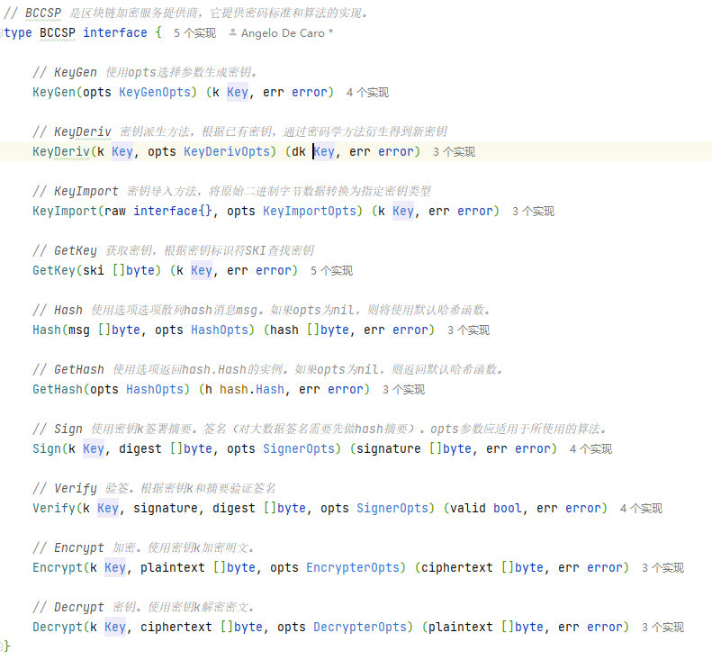

#### 为什么要这样写

- `reflect.Type`作为Key类型，是Go语言反射的经典使用方式
- 这样做的目的是，把一个类型和一个CSP工具给绑定在一起。
- 打个比方，在 `NewWithParams` 方法中，有这样一句`AddWrapper`调用
- `swbccsp.AddWrapper(reflect.TypeOf(&bccsp.ECDSAKeyGenOpts{}), &ecdsaKeyGenerator{curve: conf.ellipticCurve})`
- 这个就是将 `ECCDSAKeyGenOpts` 的Type，与`ecdsa`的密钥生成器绑定在了一起
- 这么多密码算法的密钥生成器工具，但是 `KeyGen` 方法只有这么一个
- 那么调用时具体该用哪个生成器，就靠传入的这个类型决定。
- 我们只需要一个传入`bccsp.ECDSAKeyGenOpts`类型
- `KeyGen` 方法里面会调用反射API获取`reflect.Type`接口类型，从而自 CSP 的`KeyGeneratorsMap`中找到ECDSA的生成器，其他的工具也是如此。


#### Addwrapper是做什么的

下面我们正式来看看AddWrapper方法。

```go
// AddWrapper 将传递的类型绑定到传递的包装器。
// 请注意，该包装器必须是以下接口之一的实例：
// KeyGenerator, KeyDeriver, KeyImporter, Encryptor, Decryptor, Signer, Verifier, Hasher.
func (csp *CSP) AddWrapper(t reflect.Type, w interface{}) error {
	if t == nil {
		return errors.Errorf("类型不能为 nil")
	}
	if w == nil {
		return errors.Errorf("包装器不能为nil")
	}
	// 可以看到, 工具结构实例被以空接口的形式传进来，并且使用switch搭配x.(type)用法获取工具类型
	// 与下面相应的case进行匹配，从而将工具添加进正确的Map中。
	switch dt := w.(type) {
	case KeyGenerator:
		csp.KeyGenerators[t] = dt
	case KeyImporter:
		csp.KeyImporters[t] = dt
	case KeyDeriver:
		csp.KeyDerivers[t] = dt
	case Encryptor:
		csp.Encryptors[t] = dt
	case Decryptor:
		csp.Decryptors[t] = dt
	case Signer:
		csp.Signers[t] = dt
	case Verifier:
		csp.Verifiers[t] = dt
	case Hasher:
		csp.Hashers[t] = dt
	default:
		return errors.Errorf("包装类型无效，必须位于: KeyGenerator, KeyDeriver, KeyImporter, Encryptor, Decryptor, Signer, Verifier, Hasher")
	}
	return nil
}
```

AddWrapper的绑定过程实际上就是如此直白。

那么到这样初始化其实就结束了, 生成了一个CSP的实例, 并且实例绑定了众多生成器的工具实例。

最后，我们再以加密为例，看看CSP的方法如何找到指定工具，并执行特定过程。


#### 以加密举例

```go
// Encrypt 使用密钥k加密明文。
// 参数: 加密器key的反射类型、明文、自定义配置
func (csp *CSP) Encrypt(k bccsp.Key, plaintext []byte, opts bccsp.EncrypterOpts) ([]byte, error) {
	// 验证参数
	if k == nil {
		return nil, errors.New("无效的结构体的反射类型。它不能是nil。")
	}

	// 因为 NewWithParams 方法添加Wrapper时，给加密器绑定的是 aesPrivateKey 结构类型, 该结构实现了 bccsp.Key 接口
	// 因此可以被当做 bccsp.Key 传入。
	// 而在对 bccsp.Key 使用TypeOf获取Type接口类型，可以从反射包中的rtype结构中获知详细类型信息，从而自Map中取用到正确的加密器。
	encryptor, found := csp.Encryptors[reflect.TypeOf(k)]
	if !found {
		return nil, errors.Errorf("不支持 'EncryptKey' 提供 [%v]", k)
	}
	// 然后，再通过该加密器执行加密方法即可
	return encryptor.Encrypt(k, plaintext, opts)
}
```

CSP对BCCSP接口方法集中其他方法的实现大同小异，都是先利用反射获取指定工具，再调用工具接口方法执行对应操作即可。

> 下面将会详细解释一下各种工具集

## 各自加密工具集分析

SW工具集可以被划分两部分

- 一部分为密钥生命周期，包括密钥生成（KeyGenerators）、密钥存储（KeyStore）、密钥导入（KeyImporters）、密钥派生（KeyDerivers）；
- 另一部分为密码算法，包括加密（Encryptors）、解密（Decryptors）、签名（Signers）、验签（Verifiers）、摘要（Hashers）;

### 前情回顾

我们回顾一下最开始, BCCSP有一个顶级的接口`BCCSP`, 这里面定义所有工具的调用方法:

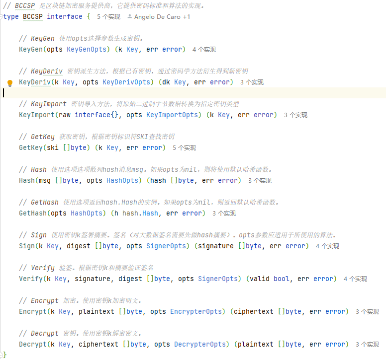

当然这只是接口, 我们还有真正实现接口的`CSP`结构, 看到下面这个大家应该也熟悉了: 

```go
type CSP struct {
	ks bccsp.KeyStore // 这个是必须的, 之前也看到了, 就是存放密钥的目录

	KeyGenerators map[reflect.Type]KeyGenerator // 密钥生成器
	KeyDerivers   map[reflect.Type]KeyDeriver   // 密钥派生器
	KeyImporters  map[reflect.Type]KeyImporter  // 密钥导入器
	Encryptors    map[reflect.Type]Encryptor    // 加密器
	Decryptors    map[reflect.Type]Decryptor    // 解密器
	Signers       map[reflect.Type]Signer       // 签名器
	Verifiers     map[reflect.Type]Verifier     // 验签器
	Hashers       map[reflect.Type]Hasher       // 哈希器
}
```

使用工具的步骤就变成

1. 先获取到顶级的接口`BCCSP`的实例`CSP`(自然是获取实例`GetDefault`)
2.  `CSP`调用想要获取工具的接口方法
3. 方法传入工具的`reflect.Type`, 获取到具体工具的实例
4. 最后工具的实例完成各自的工作

下面我们将开始分析这些工具!


### 密钥生成KeyGenerators

> 加密功能的前提自然是先生成一个密钥, 之后才会有保存、解密、签名等过程

BCCSP中的密钥生成主要包括两类，其一为AES对称密钥；其二为ECDSA非对称公私钥。

#### BCCSP.keyGen

`bccsp/sw/impl.go`

我们先看看`CSP`实例中接口方法的实现:

```go
// KeyGen 使用opts生成密钥。
func (csp *CSP) KeyGen(opts bccsp.KeyGenOpts) (k bccsp.Key, err error) {
	// 验证参数
	if opts == nil {
		return nil, errors.New("Opts参数无效。它一定不是nil.")
	}
	// 根据reflect.Type得到具体的工具
	keyGenerator, found := csp.KeyGenerators[reflect.TypeOf(opts)]
	if !found {
		return nil, errors.Errorf("提供了不受支持的 'KeyGenOpts' [%v]", opts)
	}
	// 工具生成密钥k
	k, err = keyGenerator.KeyGen(opts)
	if err != nil {
		return nil, errors.Wrapf(err, "使用opts生成密钥失败 [%v]", opts)
	}
	// 如果密钥不是临时的，则存储它。
	if !opts.Ephemeral() {
		// 存储密钥
		err = csp.ks.StoreKey(k)
		if err != nil {
			return nil, errors.Wrapf(err, "存储密钥失败 [%s]", opts.Algorithm())
		}
	}
	return k, nil
}
```

非常符合我们前情回顾的推测:

- 使用`reflect.Type`得到具体的生成密钥的工具实例
- 生成密钥的工具实例调用`KeyGen`去生成密钥
- 最后还将生成的密钥进行了保存`KeyStore`(后面马上开始分析这个)

在这里最重要的不过就是:

```go
// 工具生成密钥k
k, err = keyGenerator.KeyGen(opts)
```

#### keyGenerator.KeyGen

`bccsp/sw/keygen.go`

我们来看看这个工具调用的keyGen:

```go
import (
	"crypto/ecdsa"
	"crypto/elliptic"
	"crypto/rand"
	"fmt"

	"github.com/hyperledger/fabric/bccsp"
)

// ecdsaKeyGenerator ECDSA非对称密钥结构
type ecdsaKeyGenerator struct {
	// curve: 曲线。椭圆曲线参数
	curve elliptic.Curve
}

// KeyGen ECDSA非对称密钥生成
func (kg *ecdsaKeyGenerator) KeyGen(opts bccsp.KeyGenOpts) (bccsp.Key, error) {
	// 直接使用Go标准库的 crypto/ecdsa 加密包生成
	// 调用ecdsa.GenerateKey函数来生成一个ECDSA私钥。私钥包含了公钥的一部分信息，可以通过私钥的计算来生成完整的公钥
	// kg.curve是一个椭圆曲线参数，用于指定生成密钥对所使用的曲线。
	// rand.Reader是一个随机数生成器，用于生成私钥的随机数。
	privKey, err := ecdsa.GenerateKey(kg.curve, rand.Reader)
	if err != nil {
		return nil, fmt.Errorf("生成的ECDSA密钥失败 [%v]: [%s]", kg.curve, err)
	}
	// 包装到 ecdsaPrivateKey 中, ecdsaPrivateKey 是 bccsp.Key 接口的实现, 主要是提供了获取私钥/公钥的方法。
	return &ecdsaPrivateKey{privKey}, nil
}

// aesKeyGenerator AES对称密钥结构
type aesKeyGenerator struct {
	// 密钥长度
	length int
}

// KeyGen AES对称密钥生成
func (kg *aesKeyGenerator) KeyGen(opts bccsp.KeyGenOpts) (bccsp.Key, error) {
	// 生成一个指定长度的随机字节序列, 作为对称密钥
	lowLevelKey, err := GetRandomBytes(int(kg.length))
	if err != nil {
		return nil, fmt.Errorf("生成AES失败 %d 钥匙 [%s]", kg.length, err)
	}
	// 包装到 aesPrivateKey 中, ecdsaPrivateKey 是 bccsp.Key 接口的实现, 主要是提供了获取私钥/公钥的方法。
	return &aesPrivateKey{lowLevelKey, false}, nil
}
```

可以看到, 使用`reflect.Type`得到具体的生成密钥的工具实例, 可以调用到生成AES、ECDSA的对称和非对称密钥的方法。

密钥生成直接通过Go标准库的 crypto/ecdsa 加密包和随机数生成各自的密钥。

- 因为ECDSA的公钥是由私钥生成的，ecdsaPrivateKey中已经包含了公钥信息，所以ECDSA的KeyGen的方法只返回了一个`ecdsaPrivateKey`类型实例。
- 至于AES的密钥，则是由随机比特串组成，具体来说就是在上面的`GetRandomBytes`方法里，调用rand.Read方法获取随机串而来。
- 最后都返回到`bccsp.Key`接口实例包装起来, 目的是后续工具使用统一传参

密钥的生成属于非常普通的加密方式, 各自语言或者系统使用的都大差不差, 并没有特别的操作, 属于正常不过的加密密钥生成。


### 密钥存储KeyStore

KeyStore是一个密钥的存储系统，它可以被用来存储和加载密钥。

> 其实就是一个文件夹, 没什么特别, 将生成的密钥保存在这个目录、或者从这个目录读取生成的密钥

fabric 2.4.7版本中的BCCSP有两种KeyStore

- 一种为`dummyKeyStore`，这种不能读写，正常情况下不使用；

- 另一种为`FileBasedKeyStore`（后面缩写为fileks），它基于文件系统来加载和存储密钥。

也就是说，使用fileks可以很便捷的将密钥实例序列化并存储在指定目录下，或者从该目录中加载密钥实例。

这一节我们来看fileks的实现。

#### KeyStore接口

怎么找到KeyStore的入口呢? 

- 其实在`BCCSP`接口中, 显示给出的与`KeyStore`密钥存储相关的只有`GetKey`方法
- 就是获取一个已经存储的密钥, 而怎么存储的`BCCSP`接口是没有直接给出提示的

我们先从`BCCSP`接口`GetKey`方法找到KeyStore的结构, 也就是`CSP`接口实例:

```go
type CSP struct {
	ks bccsp.KeyStore // 这个是必须的, 之前也看到了, 就是存放密钥的目录
	...
	KeyGenerators map[reflect.Type]KeyGenerator // 密钥生成器
	...
}
```

这个`bccsp.KeyStore`就是真正的接口了, 还不算实现:

```go
// KeyStore 表示加密密钥的存储系统。
// 它允许存储和检索bccsp.Key对象。
// 密钥库可以是只读的，在这种情况下，StoreKey将返回一个错误。
type KeyStore interface {

	// ReadOnly 如果此密钥库是只读的，则返回true，否则返回false。
	// 如果ReadOnly为true，则StoreKey将失败。
	ReadOnly() bool

	// GetKey 返回一个key对象，其SKI是传递的对象。
	GetKey(ski []byte) (k Key, err error)

	// StoreKey 将密钥k存储在此密钥库中。
	// 如果此密钥库是只读的，则该方法将失败。
	StoreKey(k Key) (err error)
}
```

我们从这里就可以找到存储密钥StoreKey和获取密钥GetKey的入口了: 

KeyStore接口的方法集只有三种方法，分别为ReadOnly、GetKey和StoreKey: 

- ReadOnly是判断这个keyStore是不是只能读，先不管他。

- KeyStore的核心方法无非后面两种
  - 一个存储密钥`StoreKey`
  - 一个加载密钥`GetKey`

下面我们看那两个核心方法，首先是存储密钥方法`StoreKey`。

#### 存储密钥方法StoreKey

> 存储密钥就是将一个密钥保存到文件夹, 注意: 它并不创建密钥
>
> 密钥生成是KeyGenerators工具的功能

在密钥生成的时候, 调用了`BCCSP.keyGen`生成密钥, 并调用了存储密钥: 

```go
// 工具生成密钥k
k, err = keyGenerator.KeyGen(opts)
if err != nil {
    return nil, errors.Wrapf(err, "使用opts生成密钥失败 [%v]", opts)
}
// 如果密钥不是临时的，则存储它。
if !opts.Ephemeral() {
    // 存储密钥
    err = csp.ks.StoreKey(k)
    if err != nil {
        return nil, errors.Wrapf(err, "存储密钥失败 [%s]", opts.Algorithm())
    }
}
```

因为csp实例中, ks是一个普通的属性, 就不需要像获取工具一样使用`reflect.Type`获取了。

```go
type CSP struct {
	ks bccsp.KeyStore // 这个是必须的, 之前也看到了, 就是存放密钥的目录
	...
	KeyGenerators map[reflect.Type]KeyGenerator // 密钥生成器
	...
}
```

直接`csp.ks.StoreKey(k)`获取属性并调用存储密钥方法即可。

这个`StoreKey`方法传入我们生成的密钥怎么保存为文件呢?

```go
// StoreKey 将密钥k存储在此密钥库中。
// 如果此密钥库是只读的，则该方法将失败。
func (ks *fileBasedKeyStore) StoreKey(k bccsp.Key) (err error) {
	if ks.readOnly {
		return errors.New("只读密钥库")
	}

	if k == nil {
		return errors.New("无效密钥。它必须不等于nil")
	}

	// 首先，获取密钥的类型
	switch kk := k.(type) {
	case *ecdsaPrivateKey:
		// ECDSA 存储私钥; 传入 ski和私钥
		err = ks.storePrivateKey(hex.EncodeToString(k.SKI()), kk.privKey)
		if err != nil {
			return fmt.Errorf("存储ECDSA私钥失败 [%s]", err)
		}

	case *ecdsaPublicKey:
		// ECDSA 存储公钥; 传入 ski和公钥
		err = ks.storePublicKey(hex.EncodeToString(k.SKI()), kk.pubKey)
		if err != nil {
			return fmt.Errorf("存储ECDSA公钥失败 [%s]", err)
		}

	case *aesPrivateKey:
		// AES 存储对称密钥; 传入 ski和密钥
		err = ks.storeKey(hex.EncodeToString(k.SKI()), kk.privKey)
		if err != nil {
			return fmt.Errorf("存储AES密钥失败 [%s]", err)
		}

	default:
		return fmt.Errorf("密钥类型未确认 [%s]", k)
	}

	return
}
```

在这之前, 我们可以知道到这个`StoreKey`方法, 是接口`KeyStore`的真正实现, 并且`fileBasedKeyStore`是真正实现这个接口的实例: 

```go
// fileBasedKeyStore 是一个基于文件夹的密钥库。
// 每个密钥都存储在一个单独的文件中，该文件的名称包含密钥的 SKI 以及标识密钥类型的标志。
// 所有的密钥都存储在其路径在初始化时 提供的 文件夹下。
// KeyStore可以用密码初始化，这个密码用于加密和解密存储密钥的文件(给文件加密)。
// KeyStore 只能读取，以避免密钥被覆盖。
type fileBasedKeyStore struct {
	path string // 密钥存储文件夹

	readOnly bool // 只读, 密钥文件生成后不可更改, 避免修改出错。
	isOpen   bool // 初始化完成标志

	pwd []byte // 加密密钥文件的密码, 可以为空

	// 同步锁
	m sync.Mutex
}
```

这个结构什么时候用过呢? 当然是工厂初始化的时候, 看下面:

```go
// 初始化的get方法, 最开始的入口
func (f *SWFactory) Get(config *FactoryOpts) (bccsp.BCCSP, error) {
    ...
	// 创建KeyStore
	var ks bccsp.KeyStore
	switch {
	case swOpts.FileKeystore != nil:
		// 实例化基于文件的密钥目录, 通过KeyStorePath指定密钥存放路径(只创建目录, 不创建密钥文件)。
		fks, err := sw.NewFileBasedKeyStore(nil, swOpts.FileKeystore.KeyStorePath, false)
		if err != nil {
			return nil, errors.Wrapf(err, "无法初始化软件密钥存储")
		}
		ks = fks
	default:
		// 默认为临时内存密钥存储
		ks = sw.NewDummyKeyStore()
	}

	// 通过创建好的KeyStore，调用NewWithParams()方法获取swbccsp实例，该方法在BCCSP/sw/impl.go中
	return sw.NewWithParams(swOpts.Security, swOpts.Hash, ks)
}
```

其中的`sw.NewFileBasedKeyStore`方法就是使用了这个结构体

```go
func NewFileBasedKeyStore(pwd []byte, path string, readOnly bool) (bccsp.KeyStore, error) {
    // 这里这里这里
	ks := &fileBasedKeyStore{}
	// 使用密码、文件夹路径初始化此 KeyStore 存储密钥和只读标志的位置(只创建目录, 不创建密钥文件)。
	return ks, ks.Init(pwd, path, readOnly)
}
```

没错, 就是之前**SWFactory调用get初始化**中使用的。

下面, 我们来看看`StoreKey`方法的实现过程: 

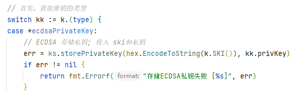

1. StoreKey方法会先判断密钥类型，并为每种类型选择对应的存储子方法。
2. 这些子方法只看函数签名的话，有个共同点，那就是两个参数都是**SKI与密钥**实例。

那么SKI是个什么玩意儿，又怎么获取呢? 

> SKI，subject key identify主题密钥标识，顾名思义是对一个密钥的标识。

看看 ECDSA 的ski到底是什么? 

我们拿一个ECDSA非对称算法举例: 

`bccsp/sw/ecdsakey.go`

```go
// SKI 返回此密钥的主题密钥标识符。
func (k *ecdsaPrivateKey) SKI() []byte {
	if k.privKey == nil {
		return nil
	}

	// Marshall公钥
	raw := elliptic.Marshal(k.privKey.Curve, k.privKey.PublicKey.X, k.privKey.PublicKey.Y)

	// 散列它
	hash := sha256.New()
	hash.Write(raw)
	return hash.Sum(nil)
}
```

可以看到用`elliptic.Marshal`什么鬼东西拿私钥的椭圆曲线、公钥的X、公钥的Y计算了一个什么东西。

然后做了一次hash, 基本上就是用这玩意生成了一个唯一标识, 可能后面变成密钥的文件名称(确实是文件名称的一部分)。

所以这种方法, 其实就类似于传入一个**唯一的名称和私钥的内容**, 生成一个文件罢了: 

```go
case *ecdsaPrivateKey:
    // ECDSA 存储私钥; 传入 (文件名, 私钥)
    err = ks.storePrivateKey(hex.EncodeToString(k.SKI()), kk.privKey)
}
```


#### 保存私钥到文件

剩下来我们只要关注`storePrivateKey(文件名, 私钥)`这样的方法就可以了: 

```go
// storePrivateKey 保存私钥到文件
func (ks *fileBasedKeyStore) storePrivateKey(alias string, privateKey interface{}) error {
	// 将私钥内容转化为pem格式的内容(密钥肯定不能是txt文本保存啊, 不然太low了吧。pem就是正常保存密钥的文件格式)
	rawKey, err := privateKeyToPEM(privateKey, ks.pwd)
	if err != nil {
		logger.Errorf("无法将私钥转换为 PEM [%s]: [%s]", alias, err)
		return err
	}
	
    // 创建文件并保存
	// 第一个参数是文件路径，第二个参数是要写入的数据，第三个参数是文件的权限
	// 文件名称使用ski_sk, 内容是rawKey, 文件所有者有读写权限，其他用户没有权限
    // (还有其他后缀, 通用(AES)是key, 公钥是pk, 私钥是sk)
	err = ioutil.WriteFile(ks.getPathForAlias(alias, "sk"), rawKey, 0o600)
	if err != nil {
		logger.Errorf("存储私钥失败 [%s]: [%s]", alias, err)
		return err
	}

	return nil
}
```

看, 除了它是怎么将一个私钥内容转化为pem格式的我们看不懂之外。

剩下的就是生成一个指定文件名的文件, 内容是pem格式的, 多么平常的代码, 一个密钥就保存完成了。

#### 私钥转换PEM格式

当然, 我们凭着做人做到底的原则, `privateKeyToPEM`怎么转化的也喵一眼, 简单的看个大概就行了(虽然根本看不懂) :

```go
// privateKeyToPEM 密钥转pem
func privateKeyToPEM(privateKey interface{}, pwd []byte) ([]byte, error) {
	// 验证输入
	if len(pwd) != 0 {
		// 使用加密的方式
		return privateKeyToEncryptedPEM(privateKey, pwd)
	}
	if privateKey == nil {
		return nil, errors.New("无效密钥。它必须不同于nil")
	}

	// 获取原型类型
	switch k := privateKey.(type) {
	case *ecdsa.PrivateKey:
		if k == nil {
			return nil, errors.New("ecdsa私钥无效。它必须不同于nil")
		}

		// 获取曲线的oid
		oidNamedCurve, ok := oidFromNamedCurve(k.Curve)
		if !ok {
			return nil, errors.New("未知椭圆曲线")
		}

		// 将私钥的字节序列进行填充，以满足ASN.1编码的要求
		// 基于 https://golang.org/src/crypto/x509/sec1.go
		privateKeyBytes := k.D.Bytes()
		paddedPrivateKey := make([]byte, (k.Curve.Params().N.BitLen()+7)/8)
		copy(paddedPrivateKey[len(paddedPrivateKey)-len(privateKeyBytes):], privateKeyBytes)
		// 使用ASN.1编码将EC私钥封装为ASN.1结构, 省略NamedCurveOID的兼容性，因为它是可选的
		asn1Bytes, err := asn1.Marshal(ecPrivateKey{
			Version:    1,
			PrivateKey: paddedPrivateKey,
			PublicKey:  asn1.BitString{Bytes: elliptic.Marshal(k.Curve, k.X, k.Y)},
		})
		if err != nil {
			return nil, fmt.Errorf("将EC密钥封送至asn1时出错: [%s]", err)
		}
		// 将其转换为PKCS#8格式的字节序列
		var pkcs8Key pkcs8Info
		pkcs8Key.Version = 0
		pkcs8Key.PrivateKeyAlgorithm = make([]asn1.ObjectIdentifier, 2)
		pkcs8Key.PrivateKeyAlgorithm[0] = oidPublicKeyECDSA
		pkcs8Key.PrivateKeyAlgorithm[1] = oidNamedCurve
		pkcs8Key.PrivateKey = asn1Bytes

		pkcs8Bytes, err := asn1.Marshal(pkcs8Key)
		if err != nil {
			return nil, fmt.Errorf("将EC密钥封送至asn1时出错: [%s]", err)
		}

		// 将PKCS#8格式的私钥转换为PEM格式，并返回PEM编码的字节序列
		return pem.EncodeToMemory(
			&pem.Block{
				Type:  "PRIVATE KEY",
				Bytes: pkcs8Bytes,
			},
		), nil

	default:
		return nil, errors.New("密钥类型无效。它必须是*ecdsa.PrivateKey")
	}
}
```

这段代码是一个将私钥转换为PEM格式的函数。

1. 首先，它检查密码（pwd）的长度，如果密码不为空，则使用加密方式进行转换，调用`privateKeyToEncryptedPEM`函数。
2. 如果密码为空，它继续检查私钥（`privateKey`）是否为nil，如果是nil，则返回一个错误。
3. 然后，它根据私钥的类型进行处理。在你提供的代码中，只处理了ECDSA私钥（*`ecdsa.PrivateKey`）。
4. 对于 ECDSA 私钥，它首先获取椭圆曲线的OID（Object Identifier），然后将私钥的字节序列进行填充，以满足ASN.1编码的要求。
5. 接下来，它使用ASN.1编码将EC私钥封装为ASN.1结构，并将其转换为PKCS#8格式的字节序列。
6. 最后，它使用`pem.EncodeToMemory`函数将PKCS#8格式的私钥转换为PEM格式，并返回PEM编码的字节序列。


#### 加载读取密钥GetKey

除了`StoreKey`存储之外, `KeyStore`接口还有一个, `GetKey`加载读取密钥

这个读取密码在顶级接口`BCCSP`中是显示给出来的

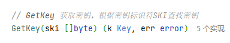

#### BCCSP.GetKey

```go
// GetKey 返回此CSP关联到的密钥
// 主题密钥标识符ski。
func (csp *CSP) GetKey(ski []byte) (k bccsp.Key, err error) {
	k, err = csp.ks.GetKey(ski)
	if err != nil {
		return nil, errors.Wrapf(err, "无法获取的密钥SKI [%v]", ski)
	}

	return
}
```

#### GetKey加载密钥

了解了存储密钥，其实加载密钥就是一个反过来的过程罢了。

我们用`_sk`作为后缀, `ski`作为前缀创建了一个文件`ski_sk`, 内容是pem格式的密钥。

- 那么加载密钥肯定就是用这个`ski_sk`去找到文件
- 读取文件的`pem`格式的内容
- 然后再`pem`转密钥
- 最后密钥`加密/解密`啦

```go
// GetKey 返回一个key对象，其SKI是传递的对象。
func (ks *fileBasedKeyStore) GetKey(ski []byte) (bccsp.Key, error) {
	// 验证参数
	if len(ski) == 0 {
		return nil, errors.New("无效SKI. 长度不能为零")
	}

	// 获取ski后缀
	suffix := ks.getSuffix(hex.EncodeToString(ski))

	// 根据后缀不同, 执行不通的策略
	switch suffix {
	case "key":
		// 从文件夹下找到文件, AES 对称密钥, 加载通用密钥
		key, err := ks.loadKey(hex.EncodeToString(ski))
		if err != nil {
			return nil, fmt.Errorf("加载失败key [%x] [%s]", ski, err)
		}

		return &aesPrivateKey{key, false}, nil
	case "sk":
		// 从文件夹下找到文件, ecdsa 私钥， 加载私钥
		key, err := ks.loadPrivateKey(hex.EncodeToString(ski))
		if err != nil {
			return nil, fmt.Errorf("加载机密失败key [%x] [%s]", ski, err)
		}
		// 强转为 ECDSA 私钥return返回
		switch k := key.(type) {
		case *ecdsa.PrivateKey:
			return &ecdsaPrivateKey{k}, nil
		default:
			return nil, errors.New("未识别密钥类型")
		}
	case "pk":
		// 从文件夹下找到文件, ecdsa 公钥，加载公钥
		key, err := ks.loadPublicKey(hex.EncodeToString(ski))
		if err != nil {
			return nil, fmt.Errorf("未能加载公共key [%x] [%s]", ski, err)
		}

		switch k := key.(type) {
		case *ecdsa.PublicKey:
			return &ecdsaPublicKey{k}, nil
		default:
			return nil, errors.New("无法识别公钥类型")
		}
	default:
        // 注意这里如果没有匹配到指定类型的话，将使用searchKeystoreForSKI方法再搜一遍目录，以找到对应SKI的密钥
		return ks.searchKeystoreForSKI(ski)
	}
}
```

因为过程十分相似

1. 就是先读文件

2. 再从PEM解密并序列化为密钥实例这样一个过程

所以密钥的加载过程不再过多叙述。

```go
	case "sk":
		// ecdsa 私钥， 根据文件名ski找到文件, 加载pem格式, 转私钥格式
		key, err := ks.loadPrivateKey(hex.EncodeToString(ski))
		if err != nil {
			return nil, fmt.Errorf("加载机密失败key [%x] [%s]", ski, err)
		}
		// 强转为 ECDSA 私钥类型return返回
		switch k := key.(type) {
		case *ecdsa.PrivateKey:
			return &ecdsaPrivateKey{k}, nil
		default:
			return nil, errors.New("未识别密钥类型")
		}
```

存储密钥就暂时结束了!


### 密钥导入KeyImporters

> 密钥导入器是干嘛的? 有什么用? 有生成、存储、加载了不是已经完全够用了吗?

密钥导入器（KeyImporter）是密码服务提供程序（CSP）的一部分，用于将原始密钥材料转换为CSP可用的密钥对象。

在密码学中，密钥是一段特定格式的二进制数据，它包含了**加密和解密、签名和验证**等操作的关键参数。

密钥导入器的作用就是**将这些关键参数提取出来**，并将它们**填充到CSP中的密钥对象**中，使其可以进行各种加密和解密、签名和验证等操作。

什么意思呢? 

就是有些密钥或者文件内容可能不是我们自己创建的, 是别人创建的, 也要求能够正常使用, 那么我们就需要拿这个密钥或者文件内容改造成满足我们自己要求的格式, 再正常进行各种加密和解密、签名和验证等操作。

BCCSP中的密钥导入器包括多个实现，每个实现用于处理一种特定类型的密钥, 可以支持外部不同算法的密钥。

像我们实例化CSP的时候就有:

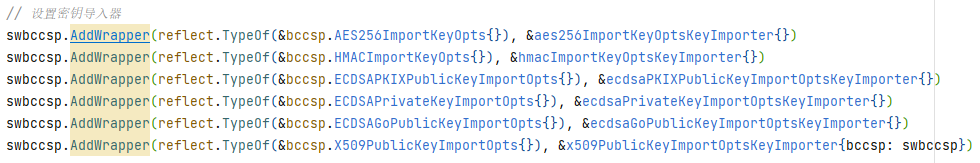

- AES256ImportKeyOpts: AES256格式的对称加密算法
- HMACImportKeyOpts: HMAC格式的Hash算法
- ECDSAPKIXPublicKeyImportOpts: ECDSA公钥的非对称加密算法
- ECDSAPrivateKeyImportOpts: ECDSA私钥的非对称加密算法
- ECDSAGoPublicKeyImportOpts: ECDSA Go公钥的非对称加密算法
- X509PublicKeyImportOpts: X509证书相关的算法

例如:

- 对于ECDSA密钥，可以使用密钥导入器`ECDSAPKIXPublicKeyImportOpts`实现将**PKIX格式**的**ECDSA公钥转换为CSP可用的公钥对象**
- Go 标准库中的` *ecdsa.PublicKey `类型，这个类型在 Go 语言中是表示 ECDSA 公钥的标准类型。也可以使用`ecdsaGoPublicKeyImportOptsKeyImporter`。

这些实现被称为密钥导入选项（KeyImportOpts），并作为参数传递给密钥导入器的`KeyImport`方法中(`bccsp/sw/keyimport.go`)。

#### X509示范

我们以X509做一个示范: 

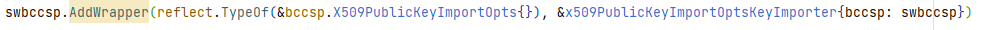

`bccsp/sw/keyimport.go`

```go
// KeyImport x 509公钥导入选择密钥导入器
func (ki *x509PublicKeyImportOptsKeyImporter) KeyImport(raw interface{}, opts bccsp.KeyImportOpts) (bccsp.Key, error) {
	// 将需要转换的x509 raw内容强转为 x509.Certificate 实例
	x509Cert, ok := raw.(*x509.Certificate)
	if !ok {
		return nil, errors.New("无效的原材料。预期 * x509.Certificate.")
	}

	// 获取公钥
	pk := x509Cert.PublicKey
	// 强转公钥类型
	switch pk := pk.(type) {
	case *ecdsa.PublicKey:
		// 根据 reflect.Type 从CSP实例中获取ECDSAGO的导入器实例
        // 并且ECDSAGo调用其KeyImport方法
		return ki.bccsp.KeyImporters[reflect.TypeOf(&bccsp.ECDSAGoPublicKeyImportOpts{})].KeyImport(
			pk,
			&bccsp.ECDSAGoPublicKeyImportOpts{Temporary: opts.Ephemeral()})
	case *rsa.PublicKey:
		// 此路径仅用于支持使用RSA证书的环境
		// 颁发ECDSA证书的机构。
		return &rsaPublicKey{pubKey: pk}, nil
	default:
		return nil, errors.New("无法识别证书的公钥类型。支持的PublicKey: [ECDSA, RSA]")
	}
}
```

`ECDSAGo`公共密钥导入选择密钥导入器: 

```go
// KeyImport ecdsa Go公共密钥导入选择密钥导入器
func (*ecdsaGoPublicKeyImportOptsKeyImporter) KeyImport(raw interface{}, opts bccsp.KeyImportOpts) (bccsp.Key, error) {
	// 将需要转换的公钥 raw内容强转为 ecdsa.PublicKey 实例
	lowLevelKey, ok := raw.(*ecdsa.PublicKey)
	if !ok {
		return nil, errors.New("无效的原材料。预期 *ecdsa.PublicKey.")
	}
	// 返回公钥
	return &ecdsaPublicKey{lowLevelKey}, nil
}
```

1. 首先，它将传入的`raw`参数强制转换为`x509.Certificate`类型的实例。如果转换失败，则返回一个错误。
2. 然后，它获取证书的公钥，并根据公钥的类型进行处理。
   - 在提供的代码中，只处理了ECDSA公钥`*ecdsa.PublicKey`和RSA公钥`*rsa.PublicKey`。
3. 对于ECDSA公钥，根据 `reflect.Type` 从**CSP实例**中获取ECDSA的导入器实例, 并且调用其`KeyImport`方法，将公钥导入为`bccsp.Key`接口的实现。这里使用了`opts.Ephemeral()`方法来获取导入选项中是否长期使用。
   - ECDSA的导入器调用其`KeyImport`方法也是公钥 raw内容强转为 ecdsa.PublicKey 实例, 然后返回。
4. 对于RSA公钥，它返回一个`rsaPublicKey`结构体的实例，该结构体实现了`bccsp.Key`接口，并将公钥存储在`pubKey`字段中。
5. 如果公钥的类型不是ECDSA或RSA，则返回一个错误。

这块的内容听起来很复杂, 实际上不过是各自强制类型转换为能处理的实例, 然后在使用罢了。


### 密钥派生KeyDerivers

密钥派生是指根据已有密钥派生出新的密钥。

密钥派生则适用于一些特定的情况和需求，例如密钥轮换、密钥扩展、密钥分层等。通过派生新的密钥，可以在保持一定的关联性的同时，满足不同的安全需求。密钥派生可以提供更灵活的密钥管理和控制，同时减少密钥的数量和复杂性。

> 派生出的密钥, 原来密钥也不能解密, 搞不懂, 我重新生成一个新的不就好了?
>
> 我无法理解...


所以, 下面仅供参考


在BCCSP中有三种实现分别为：

**AES对称密钥派生、ECDSA公钥派生、ECDSA私钥派生**

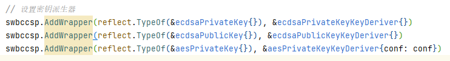

这三种`ecdsaPrivateKey、ecdsaPublicKey、aesPrivateKey`均实现了`bccsp.Key`接口

后续只要传入这三种密钥包装类型就可以获取派生器了。

**回忆一下之前这种密钥包装是怎么生成的:** 

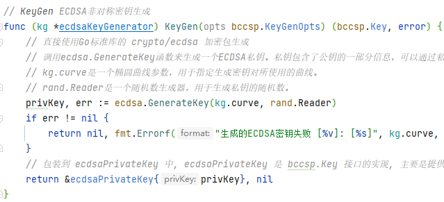


#### BCCSP.KeyDeriv

我们先来`BCCSP	`接口实例`CSP`中的实现:

```go
// KeyDeriv 密钥派生方法，根据已有密钥，通过密码学方法衍生得到新密钥
func (csp *CSP) KeyDeriv(k bccsp.Key, opts bccsp.KeyDerivOpts) (dk bccsp.Key, err error) {
	// 验证参数
	if k == nil {
		return nil, errors.New("无效密钥。它一定不是nil.")
	}
	if opts == nil {
		return nil, errors.New("无效的选择。它一定不是nil.")
	}

	// 派生工具, 传入 bccsp.Key 接口实现, 如: ecdsaPrivateKey , 就会得到 ecdsaPrivateKeyKeyDeriver 派生器
	keyDeriver, found := csp.KeyDerivers[reflect.TypeOf(k)]
	if !found {
		return nil, errors.Errorf("不支持的 'Key' 提供 [%v]", k)
	}

	// 派生工具生成新密钥
	k, err = keyDeriver.KeyDeriv(k, opts)
	if err != nil {
		return nil, errors.Wrapf(err, "使用opts派生密钥失败 [%v]", opts)
	}

	// 如果密钥不是临时的，则存储它。
	if !opts.Ephemeral() {
		// 存储密钥
		err = csp.ks.StoreKey(k)
		if err != nil {
			return nil, errors.Wrapf(err, "存储失败 key [%s]", opts.Algorithm())
		}
	}

	return k, nil
}
```

这里到没什么好看的, 因为都大差不差, 都是传入`reflect.TypeOf`, 得到工具实例

工具实例在执行方法, 信息的主要内容都在工具实例中:

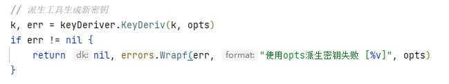

我们用派生`ECDSA`私钥举例, 其实还有`ECDSA`公钥、AES密钥等:

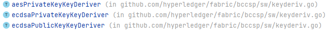

`bccsp/sw/keyderiv.go`

```go
// KeyDeriv ECDSA私钥派生
func (kd *ecdsaPrivateKeyKeyDeriver) KeyDeriv(key bccsp.Key, opts bccsp.KeyDerivOpts) (bccsp.Key, error) {
	// 验证选择
	if opts == nil {
		return nil, errors.New("opts参数无效。它一定不是nil.")
	}
	// 类型转换为ECDSA包装私钥
	ecdsaK := key.(*ecdsaPrivateKey)

	// 重新随机化ECDSA私钥
	reRandOpts, ok := opts.(*bccsp.ECDSAReRandKeyOpts)
	if !ok {
		return nil, fmt.Errorf("不支持 'KeyDerivOpts' 提供 [%v]", opts)
	}
	// 创建一个临时的ECDSA私钥tempSK，并将其公钥初始化为与原始私钥相同的曲线和参数
	tempSK := &ecdsa.PrivateKey{
		PublicKey: ecdsa.PublicKey{
			Curve: ecdsaK.privKey.Curve,
			X:     new(big.Int),
			Y:     new(big.Int),
		},
		D: new(big.Int),
	}
	
    // 它根据opts中的扩展值计算一个随机数k
	k := new(big.Int).SetBytes(reRandOpts.ExpansionValue())
	one := new(big.Int).SetInt64(1)
	n := new(big.Int).Sub(ecdsaK.privKey.Params().N, one)
	k.Mod(k, n)
	k.Add(k, one)
    
	// 将其与原始私钥的D值相加，然后取模得到新的D值。这样就生成了一个新的私钥。
	tempSK.D.Add(ecdsaK.privKey.D, k)
	tempSK.D.Mod(tempSK.D, ecdsaK.privKey.PublicKey.Params().N)

	// 计算临时公钥, 并将其公钥初始化为与原始私钥相同的曲线和参数
	tempX, tempY := ecdsaK.privKey.PublicKey.ScalarBaseMult(k.Bytes())
	
    // 使用新的私钥`tempSK`计算临时公钥的坐标`tempX`和`tempY`。
    tempSK.PublicKey.X, tempSK.PublicKey.Y =
		tempSK.PublicKey.Add(
			ecdsaK.privKey.PublicKey.X, ecdsaK.privKey.PublicKey.Y,
			tempX, tempY,
		)

	// 验证临时公钥是否在参考曲线上
	isOn := tempSK.Curve.IsOnCurve(tempSK.PublicKey.X, tempSK.PublicKey.Y)
	if !isOn {
		return nil, errors.New("临时公钥IsOnCurve检查失败。")
	}

	return &ecdsaPrivateKey{tempSK}, nil
}
```

这段代码是一个实现了`KeyDeriv`方法的`ecdsaPrivateKeyKeyDeriver`结构体的方法。它用于根据已有的ECDSA私钥派生出新的ECDSA私钥。

1. 首先，它验证传入的`opts`参数是否为`bccsp.ECDSAReRandKeyOpts`类型，如果不是则返回一个错误。
2. 然后，它将传入的`key`参数强制转换为`ecdsaPrivateKey`类型的实例，这是一个包装了ECDSA私钥的结构体。
3. 接下来，它创建一个临时的ECDSA私钥`tempSK`，并将其公钥初始化为与原始私钥相同的曲线和参数。
4. 然后，它根据`opts`中的扩展值计算一个随机数`k`，并将其与原始私钥的`D`值相加，然后取模得到新的`D`值。这样就生成了一个新的私钥。
5. 接着，它使用新的私钥`tempSK`计算临时公钥的坐标`tempX`和`tempY`。
6. 最后，它将临时公钥的坐标与原始公钥的坐标相加，得到新的临时公钥。然后，它验证临时公钥是否在参考曲线上。

最终，它返回一个包装了新的ECDSA私钥`tempSK`的`ecdsaPrivateKey`实例。

> 再说一遍, 这玩意我看不懂...


### 加密Encryptors

#### BCCSP.Encrypt

```go
// Encrypt 使用密钥k加密明文。
// 参数: 加密器key的反射类型、明文、自定义配置
func (csp *CSP) Encrypt(k bccsp.Key, plaintext []byte, opts bccsp.EncrypterOpts) ([]byte, error) {
	// 验证参数
	if k == nil {
		return nil, errors.New("无效的结构体的反射类型。它不能是nil。")
	}

	// 因为 NewWithParams 方法添加Wrapper时，给加密器绑定的是 aesPrivateKey 结构类型, 该结构实现了 bccsp.Key 接口
	// 因此可以被当做 bccsp.Key 传入。
	// 而在对 bccsp.Key 使用TypeOf获取Type接口类型，可以从反射包中的rtype结构中获知详细类型信息，从而自Map中取用到正确的加密器。
	encryptor, found := csp.Encryptors[reflect.TypeOf(k)]
	if !found {
		return nil, errors.Errorf("不支持 'EncryptKey' 提供 [%v]", k)
	}
	// 然后，再通过该加密器执行加密方法即可
	return encryptor.Encrypt(k, plaintext, opts)
}
```

这一层的实现就不多做描述了, 获取加密器执行`encryptor.Encrypt(k, plaintext, opts)`:

> fabric 的 BCCSP 是没有提供非对称加密/解密的, 只提供了AES的对称加密/解密
>
> 非对称加密算法只提供了签名和验签的功能
>
> 所以 fabric 默认是明文传输的, 只有开启TLS之后, 才会有类似https的数据加密

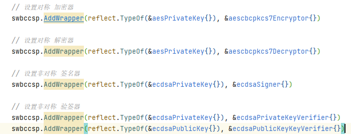

所以我们以AES举例加密:

#### Encrypt加密

```go
// Encrypt AES加密
func (e *aescbcpkcs7Encryptor) Encrypt(k bccsp.Key, plaintext []byte, opts bccsp.EncrypterOpts) ([]byte, error) {
	// 加密选项的类型是bccsp.EncrypterOpts
	// 它可以是 bccsp.AESCBCPKCS7ModeOpts 或 bccsp.AESCBCPKCS7ModeOpts 的指针类型
	switch o := opts.(type) {
	case *bccsp.AESCBCPKCS7ModeOpts:
		// 具有PKCS7填充的CBC模式下的AES
		if len(o.IV) != 0 && o.PRNG != nil {
			return nil, errors.New("选项无效。IV或PRNG应与nil不同，或两者均为nil。")
		}

		if len(o.IV) != 0 {
			// 如果加密选项中指定了初始化向量（IV），则使用指定的IV进行加密，调用 AESCBCPKCS7EncryptWithIV 函数
			return AESCBCPKCS7EncryptWithIV(o.IV, k.(*aesPrivateKey).privKey, plaintext)
		} else if o.PRNG != nil {
			// 如果加密选项中指定了伪随机数生成器（PRNG），则使用PRNG进行加密，调用 AESCBCPKCS7EncryptWithRand 函数
			return AESCBCPKCS7EncryptWithRand(o.PRNG, k.(*aesPrivateKey).privKey, plaintext)
		}

		// 如果加密选项中既没有指定IV，也没有指定PRNG随机，则使用默认的加密方式(默认也是伪随机数的)，调用 AESCBCPKCS7Encrypt 函数
		return AESCBCPKCS7Encrypt(k.(*aesPrivateKey).privKey, plaintext)
	case bccsp.AESCBCPKCS7ModeOpts:
		// 如果加密选项是 bccsp.AESCBCPKCS7ModeOpts 类型的值，代码会将其转换为指针类型，并再次调用Encrypt函数
		return e.Encrypt(k, plaintext, &o)
	default:
		return nil, fmt.Errorf("模式无法识别 [%s]", opts)
	}
}
```

在上面的代码中可以看，主要有三种方法，分别是:

1. 基于初始向量IV的加密

2. 基于伪随机数的加密

3. 默认两个都不要的加密(默认也是伪随机数的)

其实最终都要生成一个初始的向量IV, 伪随机数也是为了生成一个初始的向量IV。

#### 伪随机数加密

所以我们直接解析默认的伪随机数的加密: 

```go
// AESCBCPKCS7EncryptWithRand 结合CBC加密和PKCS7填充使用作为prng传递给函数
func AESCBCPKCS7EncryptWithRand(prng io.Reader, key, src []byte) ([]byte, error) {
    // 第一个填充: 目的是让明文长度刚好是AES块大小的倍数（通常是16字节）
	tmp := pkcs7Padding(src)

	// 然后伪随机加密
	return aesCBCEncryptWithRand(prng, key, tmp)
}
```

第一次都需要填充, 目的是让明文长度刚好是AES块大小的倍数（通常是16字节）, 这是加密算法的要求: 

```go
// aesCBCEncryptWithRand 使用AES算法和CBC模式进行加密的函数。接受一个伪随机数生成器（prng）、密钥（key）和明文（s），并返回加密后的密文
func aesCBCEncryptWithRand(prng io.Reader, key, s []byte) ([]byte, error) {
	// 首先检查明文的长度是否是AES块大小的倍数（通常是16字节）。如果明文长度不是块大小的倍数，则返回一个错误
	if len(s)%aes.BlockSize != 0 {
		return nil, errors.New("无效的明文。它必须是块大小的倍数")
	}

	// 使用提供的密钥创建一个AES密码块（cipher.Block）
	block, err := aes.NewCipher(key)
	if err != nil {
		return nil, err
	}

	// 接下来，创建一个长度为 块大小加上明文长度 的字节切片（ciphertext）。
	// 前块大小的字节用于存储初始化向量（IV），后面的字节用于存储加密后的密文。
	ciphertext := make([]byte, aes.BlockSize+len(s))
	iv := ciphertext[:aes.BlockSize]
	// 通过调用伪随机数生成器的ReadFull方法，从伪随机数生成器中读取足够的随机字节来填充IV
	if _, err := io.ReadFull(prng, iv); err != nil {
		return nil, err
	}
	// 然后，使用AES密码块和IV创建一个CBC模式的加密器（cipher.BlockMode）
	// 加密器将使用IV作为初始向量，并对明文进行加密。
	mode := cipher.NewCBCEncrypter(block, iv)
	// 将IV和加密后的密文合并到一起，并返回加密后的密文
	mode.CryptBlocks(ciphertext[aes.BlockSize:], s)

	return ciphertext, nil
}
```

在这段代码中:

1. 首先检查明文的长度是否是AES块大小的倍数（通常是16字节）。
2. 然后，使用提供的密钥创建一个AES密码块（cipher.Block）。如果创建过程中出现错误，则返回该错误。
3. 接下来，创建一个长度为块大小加上明文长度的字节切片（ciphertext）。前块大小的字节用于存储初始化向量（IV），后面的字节用于存储加密后的密文。
4. 通过调用伪随机数生成器的`ReadFull`方法，从伪随机数生成器中读取足够的随机字节来填充IV。
5. 然后，使用AES密码块和IV创建一个CBC模式的加密器（cipher.BlockMode）。加密器将使用IV作为初始向量，并对明文进行加密。
6. 最后，将IV和加密后的密文合并到一起，并返回加密后的密文。

这段代码实现了使用AES算法和CBC模式进行加密的功能。它使用提供的伪随机数生成器生成随机的初始化向量，并使用AES密码块和初始化向量对明文进行加密。返回加密后的密文。

> 加密更加详细的我就不看了, 水平达不到...

### 解密Decryptors

#### BCCSP.Decrypt

```go
// Decrypt 使用密钥k解密密文。
func (csp *CSP) Decrypt(k bccsp.Key, ciphertext []byte, opts bccsp.DecrypterOpts) (plaintext []byte, err error) {
	// 验证参数
	if k == nil {
		return nil, errors.New("无效密钥。它不能是nil")
	}
	// 获取解密器
	decryptor, found := csp.Decryptors[reflect.TypeOf(k)]
	if !found {
		return nil, errors.Errorf("不支持 'DecryptKey' 提供 [%v]", k)
	}
	// 解密
	plaintext, err = decryptor.Decrypt(k, ciphertext, opts)
	if err != nil {
		return nil, errors.Wrapf(err, "解密失败 opts [%v]", opts)
	}

	return
}
```

#### Decrypt解密

加密的时候也说了, fabric只有对称加密, 非对称算法是不提供加密的: 

```go
// Decrypt AES解密
func (*aescbcpkcs7Decryptor) Decrypt(k bccsp.Key, ciphertext []byte, opts bccsp.DecrypterOpts) ([]byte, error) {
	// 检查模式
	switch opts.(type) {
	case *bccsp.AESCBCPKCS7ModeOpts, bccsp.AESCBCPKCS7ModeOpts:
		// 具有PKCS7填充的CBC模式下的AES
		return AESCBCPKCS7Decrypt(k.(*aesPrivateKey).privKey, ciphertext)
	default:
		return nil, fmt.Errorf("模式无法识别 [%s]", opts)
	}
}
```

直接看`AESCBCPKCS7Decrypt`方法:

```go
// AESCBCPKCS7Decrypt 结合了CBC解密和PKCS7取消填充
func AESCBCPKCS7Decrypt(key, src []byte) ([]byte, error) {
	//第一次解密
	pt, err := aesCBCDecrypt(key, src)
	if err == nil {
		// 再删除加密时添加的填充数据
		return pkcs7UnPadding(pt)
	}
	return nil, err
}
```

解密加上删除加密时添加的填充数据。

虽然我知道解密的关键在`aesCBCDecrypt`方法, 但是我估计我看不懂, 再看一点点吧:

```go
// aesCBCDecrypt 使用AES算法和CBC模式进行解密的函数。它接受一个密钥（key）和密文（src），并返回解密后的明文。
func aesCBCDecrypt(key, src []byte) ([]byte, error) {
	// 使用提供的密钥创建一个AES密码块（cipher.Block）
	block, err := aes.NewCipher(key)
	if err != nil {
		return nil, err
	}

	// 检查密文的长度是否小于一个块的大小。
	if len(src) < aes.BlockSize {
		return nil, errors.New("无效的密文。它必须是块大小的倍数")
	}
	// 从密文中提取出初始化向量（IV），它的长度等于一个块的大小。然后，将密文中的IV部分截取掉，只保留密文部分。
	iv := src[:aes.BlockSize]
	src = src[aes.BlockSize:]

	// 检查密文部分的长度是否是一个块的大小的倍数。
	if len(src)%aes.BlockSize != 0 {
		return nil, errors.New("无效的密文。它必须是块大小的倍数")
	}
	// 使用AES密码块和IV创建一个CBC模式的解密器（cipher.BlockMode）。解密器将使用IV作为初始向量，并对密文部分进行解密。
	mode := cipher.NewCBCDecrypter(block, iv)
	// 解密
	mode.CryptBlocks(src, src)

	return src, nil
}
```

凑活着看吧! 反正各种判断之后`CryptBlocks`解密。


### 签名、验签、摘要

签名（Signers）、验签（Verifiers）、摘要（Hashers）

这是个放到一起会好一点, 因为都是有关联的。

ECDSA算法和Hash算法在BCCSP的主要应用是进行签名和验签。

对一段消息进行数字签名时:

1. 服务端需要先用Hash算法取得这段消息的hash摘要
2. 然后再用ECDSA的私钥对这段hash摘要做签名
3. 将签名后的hash、ECDSA的公钥放入响应数据中
4. 客户端验签时同样也是用ECDSA的公钥解签后与原文的hash摘要进行比较

我觉得这块的东西, 对于一个正常的程序员来说, 没有必要说太多了。

- 就是一套服务端对数据做hash, 使用私钥签名hash

- 然后客户端使用公钥验签, 拿到服务端对数据hash
- 客户端再对数据做一次hash

- 如果验签的hash == 客户端数据hash, 则数据完整

我们简单看看代码: 

#### Hash摘要

`BCCSP`接口提供了Hash的抽象方法:

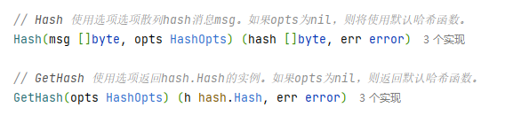

```go
// Hash 使用选项选项散列消息msg。
func (csp *CSP) Hash(msg []byte, opts bccsp.HashOpts) (digest []byte, err error) {
	// 验证参数
	if opts == nil {
		return nil, errors.New("无效的选择。它一定不是nil.")
	}
	// 获取hash器
	hasher, found := csp.Hashers[reflect.TypeOf(opts)]
	if !found {
		return nil, errors.Errorf("不支持 'HashOpt' 提供 [%v]", opts)
	}
	// 执行hash计算
	digest, err = hasher.Hash(msg, opts)
	if err != nil {
		return nil, errors.Wrapf(err, "散列失败 opts [%v]", opts)
	}

	return
}
```

`csp.Hashers[reflect.TypeOf(opts)]`会获取注册号的hash器, 默认就是SHA256

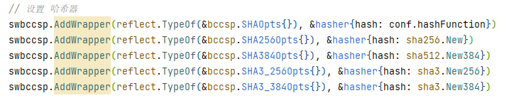

hash函数应该不需要讲太多了, 我把代码放上来吧:

`bccsp/sw/hash.go`

```go
// Hash 接受一个消息（msg）和哈希选项（opts），并返回对消息进行哈希后的结果
func (c *hasher) Hash(msg []byte, opts bccsp.HashOpts) ([]byte, error) {
	// 获取一个哈希实例（hash.Hash）
	h := c.hash()
	// 将消息写入哈希实例
	h.Write(msg)
	// 调用Sum(nil)方法获取哈希结果
	return h.Sum(nil), nil
}

// GetHash 接受一个哈希选项（opts），并返回一个哈希实例（hash.Hash）
func (c *hasher) GetHash(opts bccsp.HashOpts) (hash.Hash, error) {
	return c.hash(), nil
}
```

hash完成之后, 就是对hash进行签名了!


#### 私钥签名hash

BCCSP提供了一种签名器`ecdsaSigner`

两种验签器`ecdsaPrivateKeyVerifier`、`ecdsaPublicKeyKeyVerifier`

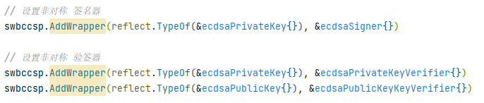

- `ecdsaSigner`是利用私钥签名
- `ecdsaPrivateKeyVerifier`与`ecdsaPublicKeyKeyVerifier`都可以验签
  - 为什么有私钥和公钥的验签器呢?
  - 因为验签必须是公钥验签, 所以公钥验签器没问题
  - 但是ECDSA的特点是私钥里就包含公钥了, 所以私钥验签提取一下公钥就可以了

先看签名`Sign`:

```go
// Sign 使用密钥k签署摘要。
//
// 请注意，当需要较大消息的哈希签名时，
// 调用者负责散列较大的消息传递哈希签名 (作为摘要)。
func (csp *CSP) Sign(k bccsp.Key, digest []byte, opts bccsp.SignerOpts) (signature []byte, err error) {
	// 验证参数
	if k == nil {
		return nil, errors.New("无效密钥。它一定不是nil.")
	}
	if len(digest) == 0 {
		return nil, errors.New("摘要无效。不能为空.")
	}
	// 获取签名器
	keyType := reflect.TypeOf(k)
	signer, found := csp.Signers[keyType]
	if !found {
		return nil, errors.Errorf("不支持 'SignKey' 提供 [%s]", keyType)
	}
	// 签名
	signature, err = signer.Sign(k, digest, opts)
	if err != nil {
		return nil, errors.Wrapf(err, "与签名失败opts [%v]", opts)
	}

	return
}
```

签名器签名`Sign`:

`bccsp/sw/ecdsa.go`

```go
func (s *ecdsaSigner) Sign(k bccsp.Key, digest []byte, opts bccsp.SignerOpts) ([]byte, error) {
    // 调用签名
	return signECDSA(k.(*ecdsaPrivateKey).privKey, digest, opts)
}
```

```go
// signECDSA 使用ECDSA算法对消息进行签名的函数。它接受一个ECDSA私钥（k）、消息的摘要（digest）和签名选项（opts），并返回对消息进行签名后的结果
func signECDSA(k *ecdsa.PrivateKey, digest []byte, opts bccsp.SignerOpts) ([]byte, error) {
	// 使用提供的私钥对消息的摘要进行签名。签名过程中会使用一个随机数生成器（rand.Reader）来生成随机数
	// 返回大整数 R 和 S 。
	// R表示在椭圆曲线上的一个点的横坐标，用于证明签名的合法性。在ECDSA算法中，
	// R 是通过对消息的哈希值应用椭圆曲线上的点乘运算得到的。
	// S 用于表示对消息的签名。
	// S 是使用私钥对消息的哈希值和 R 进行计算得到的。
	r, s, err := ecdsa.Sign(rand.Reader, k, digest)
	if err != nil {
		return nil, err
	}
	// 将签名结果中的s值转换为低位形式。ECDSA签名中的s值有两种表示方式，高位和低位。在某些情况下，需要将s值转换为低位形式
	// 对S值进行处理
	// S 是一个大整数，其取值范围是 1 到椭圆曲线的阶 N-1。
	// 在一些实现中，s 取值可能会超过 N/2，这会导致签名不可验证。
	// 因此大于 N/2 的 s 在 ToLowS方法 中会被转化为 N - s
	s, err = utils.ToLowS(&k.PublicKey, s)
	if err != nil {
		return nil, err
	}
	// 将r和s按照ASN.1编码标准进行序列化，返回字节切片
	return utils.MarshalECDSASignature(r, s)
}
```

签名就结束了, 跟加密没太大区别, 加密不过是针对所有数据

签名一般是对这个数据的hash值加密, 其他数据还是明文状态。


#### 验签Verify

验签不过就是解密被签名的hash, 叫做解签, 和解密一样。

```go
// Verify 根据密钥k和摘要验证签名
func (csp *CSP) Verify(k bccsp.Key, signature, digest []byte, opts bccsp.SignerOpts) (valid bool, err error) {
	// 验证参数
	if k == nil {
		return false, errors.New("无效密钥。它一定不是nil.")
	}
	if len(signature) == 0 {
		return false, errors.New("签名无效。不能为空。")
	}
	if len(digest) == 0 {
		return false, errors.New("摘要无效。不能为空。")
	}
	// 获取验签器
	verifier, found := csp.Verifiers[reflect.TypeOf(k)]
	if !found {
		return false, errors.Errorf("不支持 'VerifyKey' 提供 [%v]", k)
	}
	// 验签
	valid, err = verifier.Verify(k, signature, digest, opts)
	if err != nil {
		return false, errors.Wrapf(err, "验证失败opts [%v]", opts)
	}

	return
}
```

验签器`Verify`:

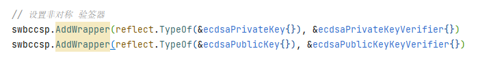

之前也说明了`ecdsaPrivateKeyVerifier`与`ecdsaPublicKeyKeyVerifier`都可以验签

- 为什么有私钥和公钥的验签器呢?
- 因为验签必须是公钥验签, 所以公钥验签器没问题
- 但是ECDSA的特点是私钥里就包含公钥了, 所以私钥验签提取一下公钥就可以了

`bccsp/sw/ecdsa.go`

```go
// Verify 私钥验签
func (v *ecdsaPrivateKeyVerifier) Verify(k bccsp.Key, signature, digest []byte, opts bccsp.SignerOpts) (bool, error) {
    // 提取公钥调用verifyECDSA
	return verifyECDSA(&(k.(*ecdsaPrivateKey).privKey.PublicKey), signature, digest, opts)
}

// Verify 公钥验签
func (v *ecdsaPublicKeyKeyVerifier) Verify(k bccsp.Key, signature, digest []byte, opts bccsp.SignerOpts) (bool, error) {
    // 直接用公钥调用verifyECDSA
	return verifyECDSA(k.(*ecdsaPublicKey).pubKey, signature, digest, opts)
}
```

`verifyECDSA`验签方法:

```go
// verifyECDSA 使用ECDSA算法对签名进行验证的函数。它接受一个ECDSA公钥（k）、签名（signature）、消息的摘要（digest）和签名选项（opts）
func verifyECDSA(k *ecdsa.PublicKey, signature, digest []byte, opts bccsp.SignerOpts) (bool, error) {
	// 对签名进行反序列化，将其拆分为r和s值
	// 返回大整数 R 和 S 。
	// R表示在椭圆曲线上的一个点的横坐标，用于证明签名的合法性。在ECDSA算法中，
	// R 是通过对消息的哈希值应用椭圆曲线上的点乘运算得到的。
	// S 用于表示对消息的签名。
	// S 是使用私钥对消息的哈希值和 R 进行计算得到的。
	r, s, err := utils.UnmarshalECDSASignature(signature)
	if err != nil {
		return false, fmt.Errorf("失败的unmasashalling签名 [%s]", err)
	}
	// 检查s值是否为低位形式。ECDSA签名中的s值有两种表示方式，高位和低位。在某些情况下，需要确保s值为低位形式
	// 对S值进行处理
	// S 是一个大整数，其取值范围是 1 到椭圆曲线的阶 N-1。
	// 在一些实现中，s 取值可能会超过 N/2，这会导致签名不可验证。
	// 因此大于 N/2 的 s 在 ToLowS方法 中会被转化为 N - s
	lowS, err := utils.IsLowS(k, s)
	if err != nil {
		return false, err
	}

	if !lowS {
		return false, fmt.Errorf("无效的S。必须小于订单的一半 [%s][%s].", s, utils.GetCurveHalfOrdersAt(k.Curve))
	}
	// 使用ECDSA公钥、消息的摘要、r值和s值调用ecdsa.Verify函数进行签名验证
	return ecdsa.Verify(k, digest, r, s), nil
}
```

> 其实更多的细节都是api调用, 我们也看不懂更细的内容...

以上就是全部内容。


