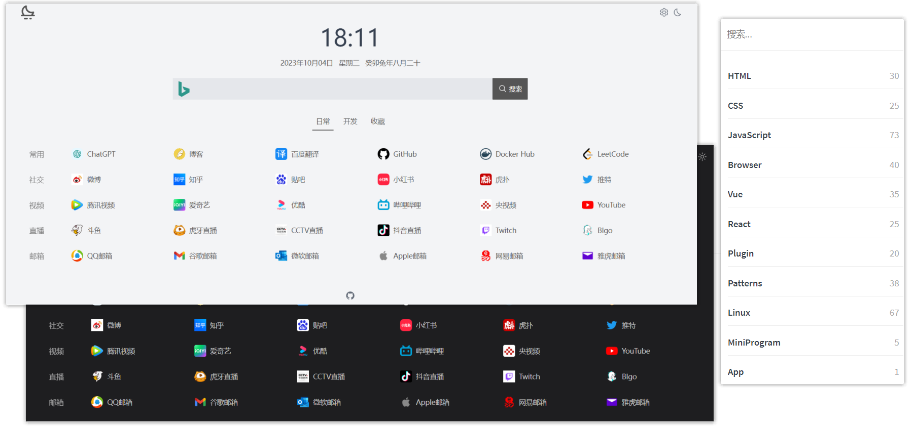

<b>种一棵树最好的时间是十年前，其次是现在</b>

&nbsp;&nbsp;&nbsp;&nbsp;&nbsp;&nbsp;&nbsp;&nbsp;十年前，有人在心中种下了一颗种子，那是一颗梦想的种子。他想要创造一片绿色的天地，为未来留下一份美好的遗产。 然而，时间匆匆流逝，他却一直没有行动。他总是告诉自己，明天再开始，明天再去实现那个梦想。

&nbsp;&nbsp;&nbsp;&nbsp;&nbsp;&nbsp;&nbsp;&nbsp;如今，十年已经过去了。他站在一片荒芜的土地上，看着周围的一切，心中充满了遗憾和后悔。如果他当初能够行动起来，种下那颗种子，现在或许已经是一片郁郁葱葱的森林了。

&nbsp;&nbsp;&nbsp;&nbsp;&nbsp;&nbsp;&nbsp;&nbsp;尽管过去的时机已经错过，现在仍然是一个种树的好时机。他深吸一口气，决定从现在开始，为自己的梦想而努力。他明白，虽然时间不再是最好的，但他仍然可以在现在行动起来，为未来播下希望的种子。

&nbsp;&nbsp;&nbsp;&nbsp;&nbsp;&nbsp;&nbsp;&nbsp;他开始研究土壤的特性，选择适合种植的树种。他学习如何正确地培育和护理树苗，以确保它们能够茁壮成长。他租借了一块土地，开始动手准备。他用心地挖掘每一个树坑，将树苗小心地种入土壤中，然后轻轻地浇上水。

&nbsp;&nbsp;&nbsp;&nbsp;&nbsp;&nbsp;&nbsp;&nbsp;随着时间的推移，树苗逐渐长大，展开了嫩绿的叶子。他每天都来到这片土地上，给树苗浇水、施肥，还会仔细观察它们的生长情况。他的努力没有白费，树苗们茁壮成长，逐渐形成了一片美丽的森林。

&nbsp;&nbsp;&nbsp;&nbsp;&nbsp;&nbsp;&nbsp;&nbsp;这片森林成为了他的骄傲，也成为了他对过去的弥补。他明白，种一棵树最好的时机是十年前，但现在也不晚。只要你有梦想，只要你行动起来，你就能够创造出属于自己的美好未来。

没错，那个人就是我，哈哈

