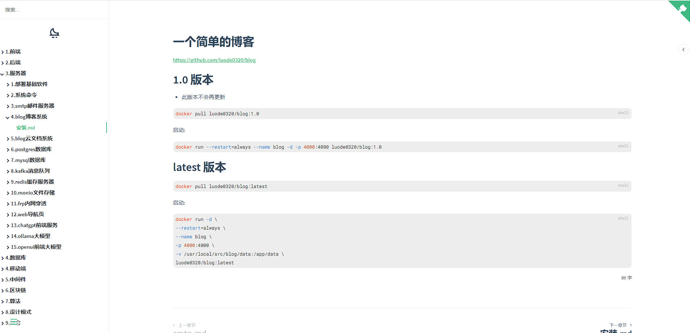

<div align="center">


<h1 align="center">Blog</h1>

欧皇小德子的个人博客。

[导航页](https://www.luode.vip) / [QQ群 542544997]()




</div>

# 启动

## 安装依赖

```shell
npm install
```

## 执行
```shell
node index.js 
```

# dokcer启动

## latest 版本

```shell
docker pull luode0320/blog:latest
```

启动:

```shell
docker run --restart=always --name blog -d -p 4000:4000 luode0320/blog:latest
```

### 挂载自己的目录

注: /data/picture 目录属于存放图片的目录, 不会展示

如有调整, 需要修改源码 index.js
```shell
docker run --restart=always \
--name blog -d -p 4000:4000 \
-v /usr/local/src/blog/data:/app/data
luode0320/blog:latest
```

# 配合云文档

一个简单的 Markdown、OpenAPI 文档服务器

https://github.com/luode0320/blog-cloud
