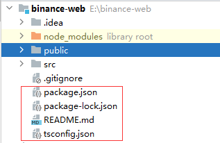
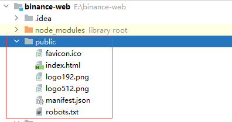
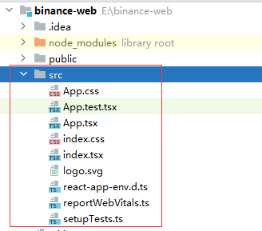

# 第一层



React 项目通常是基于 Node.js 平台开发的。这三个文件在项目中通常扮演着重要的角色：

1. **package.json**：这是 Node.js 项目的核心配置文件，其中包含了项目的元数据（如名称、版本、作者等）以及项目所依赖的第三方包信息。通过 package.json 文件，你可以管理项目的依赖项、脚本命令等。
   1. package.json 文件通常需要手动更新，特别是当您想要添加、更新或删除项目依赖时。
   2. 虽然 package.json 文件不会自动更新加载项目中使用的依赖项，但可以通过运行特定的 npm 命令来更新它。
   3. 当您使用 `npm install`、`npm uninstall`、`npm install <package-name>` 等命令来添加、更新或删除依赖项时，package.json 文件会自动更新以反映这些变化。
   4. 这些 npm 命令会修改 package.json 文件中的 "dependencies" 或 "devDependencies" 部分，以确保项目依赖的准确性和一致性。
   5. 因此，虽然 package.json 文件不会自动更新加载项目中使用的依赖项，但通过使用 npm 命令来管理依赖项，可以自动更新 package.json 文件，以便跟踪项目所需的依赖项。
2. **package-lock.json**：这个文件是 npm 5 之后引入的用于锁定项目依赖包版本的文件。它会确保在不同环境中安装相同版本的依赖包，防止由于依赖包版本不一致导致的问题。
   1. package-lock.json 文件是自动更新的，不需要手动操作。
   2. 当您运行 `npm install` 或 `npm update` 命令时，npm 会自动更新 package-lock.json 文件以记录当前安装的确切依赖项的版本信息。
   3. 这有助于确保在不同环境中安装相同的依赖项版本，以避免可能出现的版本冲突问题。因此，您无需手动编辑或更新 package-lock.json 文件，npm 会在必要时自动处理这些更新。
3. **tsconfig.json**：如果你的项目使用 TypeScript 进行开发，这个文件是 TypeScript 的配置文件，其中包含了 TypeScript 编译器的配置选项，比如编译目标、模块解析方式等。这个文件决定了 TypeScript 编译器如何处理你的 TypeScript 代码。
   1. tsconfig.json 文件通常也是自动更新的，不需要手动控制。
   2. tsconfig.json 文件是 TypeScript 项目的配置文件，用于指定 TypeScript 编译器的编译选项和项目配置。
   3. 当您运行 TypeScript 编译器时（例如使用 `tsc` 命令），它会根据 tsconfig.json 文件中的配置来编译您的 TypeScript 代码。
   4. 通常情况下，您可以手动编辑 tsconfig.json 文件来配置 TypeScript 编译器的行为，但大多数情况下，您不需要手动更新该文件。
   5. 当您使用 TypeScript 编译器编译代码时，它会自动根据 tsconfig.json 文件中的配置进行编译，无需手动干预。
   6. 如果您需要更改编译选项或项目配置，可以编辑 tsconfig.json 文件，但编译器会在下一次编译时自动应用这些更改。

# package.json

```json
  "eslintConfig": {
    "extends": [
      "react-app",
      "react-app/jest"
    ]
  },
  "browserslist": {
    "production": [
      ">0.2%",
      "not dead",
      "not op_mini all"
    ],
    "development": [
      "last 1 chrome version",
      "last 1 firefox version",
      "last 1 safari version"
    ]
  }
```

1. **eslintConfig**:
   - `"eslintConfig"` 用于指定 ESLint 的配置信息，其中包含了继承的规则集。在这个例子中，`"extends"` 中列出了两个规则集："react-app" 和 "react-app/jest"。
   - `"react-app"` 规则集是 Create React App 默认的 ESLint 配置，包含了适用于 React 项目的一些常见规则。
   - `"react-app/jest"` 规则集是用于 Jest 测试框架的 ESLint 配置，包含了适用于 Jest 单元测试的规则。
2. **browserslist**:
   - `"browserslist"` 用于指定项目在不同环境下的目标浏览器列表。这对于根据不同环境（如生产环境和开发环境）来确定需要支持的浏览器版本非常有用。
   - 在这个例子中，`"production"` 指定了生产环境下支持的浏览器版本，而 `"development"` 指定了开发环境下支持的浏览器版本。这些配置可以影响到 Babel 和 Autoprefixer 等工具在编译和处理 CSS、JS 代码时的行为。

# public



在一个基于 React 的项目中，`public` 目录通常用于存放静态资源和公共文件，这些文件会直接被复制到最终打包后的输出目录中，而不经过 webpack 的处理。下面是这些文件的作用：

1. `favicon.ico`:
   - 这是网站的图标文件，通常会显示在浏览器标签页上或书签栏中，用于标识网站。
2. `index.html`:
   - 这是整个应用的入口 HTML 文件，包含了应用的根元素和其他必要的标签，比如 `<head>` 和 `<body>`。
   - React 应用通常会将其根元素挂载到这个 HTML 文件中的某个 DOM 节点上。
3. `logo192.png` 和 `logo512.png`:
   - 这些是应用的 logo 图片，可能会在应用中使用到，或者在社交媒体分享等场合展示。
4. `manifest.json`:
   - 这是一个 Web App Manifest 文件，用于提供关于应用的元数据，比如名称、描述、图标等信息。
   - 这个文件可以让用户将应用添加到桌面或启动屏幕，并具有类似原生应用的体验。
5. `robots.txt`:
   - 这是一个用于搜索引擎爬虫的文件，用于指示哪些页面可以被爬取，哪些页面不应该被爬取。

# src



这是一个典型的 React 项目中 `src` 目录下的文件列表，让我为您解释一下每个文件的作用：

1. `src` 目录：React 项目的源代码目录，包含了项目的主要代码文件。
2. `App.css`：用于存放与 `App.tsx` 组件相关的 CSS 样式文件。
3. `App.test.tsx`：包含了用于对 `App.tsx` 组件进行单元测试的测试文件。
4. `App.tsx`：React 应用的主要组件，通常包含应用的根组件。
5. `index.css`：用于存放全局的 CSS 样式文件，会被应用到整个项目中。
6. `index.tsx`：React 应用的入口文件，通常包含了应用的渲染逻辑。
7. `logo.svg`：应用的 Logo 图标文件，通常用于显示在应用的页面上。
8. `react-app-env.d.ts`：TypeScript 环境声明文件，用于声明全局的类型定义。
9. `reportWebVitals.ts`：用于报告 Web Vitals 指标的文件，用于监控应用的性能。
10. `setupTests.ts`：用于配置 Jest 测试框架的文件，通常包含一些测试的初始化配置。