## 表单输入绑定

在前端处理表单时，我们常常需要将表单输入框的内容同步给 JavaScript 中相应的变量。

手动连接值绑定和更改事件监听器可能会很麻烦：

```vue
<input
  :value="text"
  @input="event => text = event.target.value">
```

`v-model` 指令帮我们简化了这一步骤：

```vue
<input v-model="text">
```

另外，`v-model` 还可以用于各种不同类型的输入，`<textarea>`、`<select>` 元素。它会根据所使用的元素自动使用对应的 DOM 属性和事件组合：

- 文本类型的 `<input>` 和 `<textarea>` 元素会绑定 `value` property 并侦听 `input` 事件；
- `<input type="checkbox">` 和 `<input type="radio">` 会绑定 `checked` property 并侦听 `change` 事件；
- `<select>` 会绑定 `value` property 并侦听 `change` 事件。

> `v-model` 会忽略任何表单元素上初始的 `value`、`checked` 或 `selected` attribute。
>
> 它将始终将当前绑定的 JavaScript 状态视为数据的正确来源。


## 基本用法

### 文本input

```vue
<p>Message is: {{ message }}</p>
<input v-model="message" placeholder="edit me" />
```

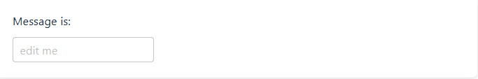

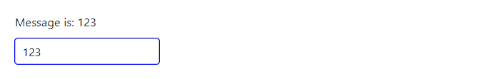

### 多行文本textarea

```vue
<span>Multiline message is:</span>
<p style="white-space: pre-line;">{{ message }}</p>
<textarea v-model="message" placeholder="add multiple lines"></textarea>
```

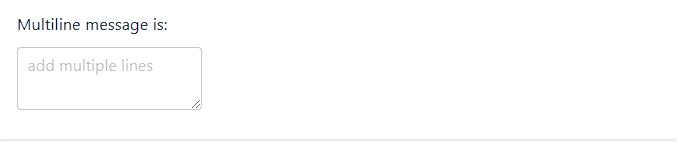

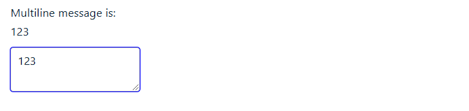

注意在 `<textarea>` 中是不支持插值表达式的。请使用 `v-model` 来替代：

```vue
<!-- 错误 -->
<textarea>{{ text }}</textarea>

<!-- 正确 -->
<textarea v-model="text"></textarea>
```

### 复选框label-checkbox

单一的复选框，绑定布尔类型值：

- `<label>` 元素和 `<input>` 元素可以通过 `for` 属性和 `input` 元素的 `id` 属性进行关联。
- 这样，点击 `<label>` 的内容就相当于点击了 `<input>`，这使得用户体验更好，尤其是对于复选框、单选框和长文本输入框。

```vue
<input type="checkbox" id="checkbox" v-model="checked" />
<label for="checkbox">{{ checked }}</label>
```

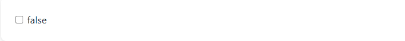

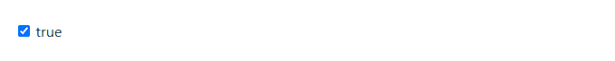

我们也可以将多个复选框绑定到同一个数组或集合的值：

```js
const checkedNames = ref([])
```

```vue
<div>Checked names: {{ checkedNames }}</div>

<input type="checkbox" id="jack" value="Jack" v-model="checkedNames" />
<label for="jack">Jack</label>

<input type="checkbox" id="john" value="John" v-model="checkedNames" />
<label for="john">John</label>

<input type="checkbox" id="mike" value="Mike" v-model="checkedNames" />
<label for="mike">Mike</label>
```

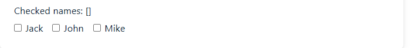

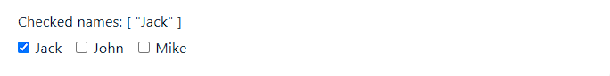

### 单选按钮label-radio

```vue
<div>Picked: {{ picked }}</div>

<input type="radio" id="one" value="One" v-model="picked" />
<label for="one">One</label>

<input type="radio" id="two" value="Two" v-model="picked" />
<label for="two">Two</label>
```

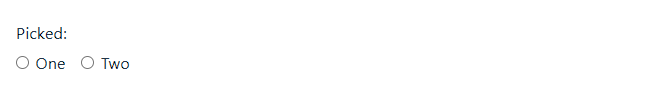

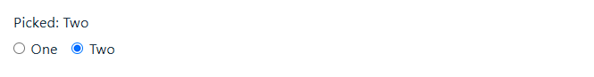

### 选择器select

单个选择器的示例如下：

```vue
<div>Selected: {{ selected }}</div>

<select v-model="selected">
  <option disabled value="">Please select one</option>
  <option>A</option>
  <option>B</option>
  <option>C</option>
</select>
```

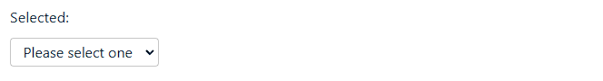

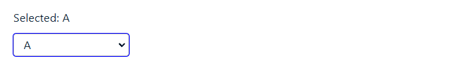

> 如果 `v-model` 表达式的初始值不匹配任何一个选择项，`<select>` 元素会渲染成一个“未选择”的状态。
>
> 在 iOS 上，这将导致用户无法选择第一项，因为 iOS 在这种情况下不会触发一个 change 事件。
>
> 因此，我们建议提供一个空值的禁用选项，如上面的例子所示。

多选 (值绑定到一个数组)：

```js
const selected = ref([])
```

```vue
<div>Selected: {{ selected }}</div>

<select v-model="selected" multiple>
  <option>A</option>
  <option>B</option>
  <option>C</option>
</select>
```

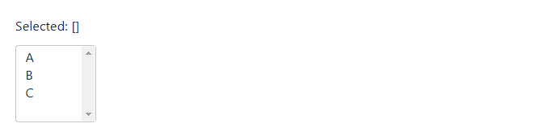

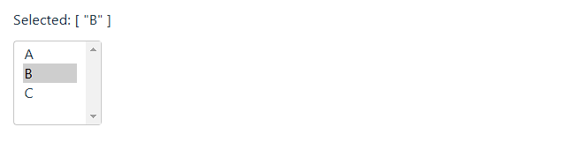

选择器的选项可以使用 `v-for` 动态渲染：

```js
const selected = ref('A')

const options = ref([
  { text: 'One', value: 'A' },
  { text: 'Two', value: 'B' },
  { text: 'Three', value: 'C' }
])
```

```vue
<select v-model="selected">
  <option v-for="option in options" :value="option.value">
    {{ option.text }}
  </option>
</select>

<div>Selected: {{ selected }}</div>
```

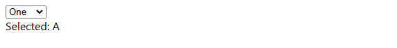

## 值绑定

对于单选按钮，复选框和选择器选项，`v-model` 绑定的值通常是静态的字符串 (或者对复选框是布尔值)：

```vue
<template>
  <!-- `picked` 在被选择时是字符串 "a" -->
  <input type="radio" v-model="picked" value="a" />
  <div>picked: {{ picked }}</div>

  <!-- `toggle` 只会为 true 或 false -->
  <input type="checkbox" v-model="toggle" />
  <div>toggle: {{ toggle }}</div>

  <!-- `selected` 在第一项被选中时为字符串 "abc" -->
  <select v-model="selected">
    <option value="abc">ABC</option>
  </select>
</template>
```

```vue
<script setup>
import { ref } from 'vue'

const selected = ref('')
const toggle = ref('')
const picked = ref('')

</script>
```

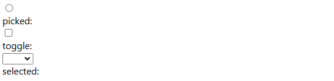

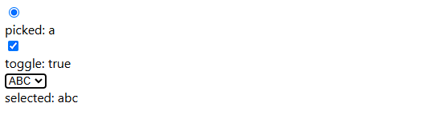

### 复选框checkbox

```vue
<script setup>
import { ref } from 'vue'
const toggle = ref('')
</script>

<template>
    <input
      type="checkbox"
      v-model="toggle"
      true-value="yes"
      false-value="no"
    />
    <p>复选框的值：{{ toggle }}</p>
</template>
```

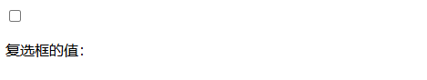

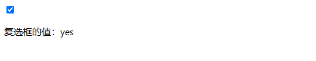


`true-value` 和 `false-value` 是 Vue 特有的 attributes，仅支持和 `v-model` 配套使用。

这里 `toggle` 属性的值会在选中时被设为 `'yes'`，取消选择时设为 `'no'`。

你同样可以通过 `v-bind` 将其绑定为其他动态值：

```vue
<input
  type="checkbox"
  v-model="toggle"
  :true-value="dynamicTrueValue"
  :false-value="dynamicFalseValue" />
```

> `true-value` 和 `false-value` attributes 不会影响 `value` attribute，因为浏览器在表单提交时，并不会包含未选择的复选框。
>
> 为了保证这两个值 (例如：“yes”和“no”) 的其中之一被表单提交，请使用单选按钮作为替代。


### 单选按钮radio

```vue
<script setup>
import { ref } from 'vue'
const pick = ref('')
const first = ref('first')
const second = ref('second')
</script>

<template>
    <input type="radio" v-model="pick" :value="first" />
    <input type="radio" v-model="pick" :value="second" />
    <p>你选择了：{{ pick }}</p>
    <div v-if="pick === first">
      <p>你选择了 "选项 1"！</p>
    </div>
    <div v-else-if="pick === second">
      <p>你选择了 "选项 2"！</p>
    </div>
</template>
```

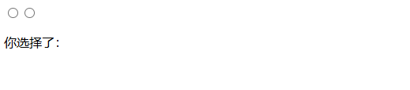

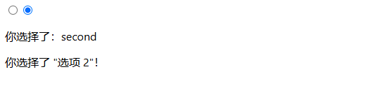

`pick` 会在第一个按钮选中时被设为 `first`，在第二个按钮选中时被设为 `second`。

### 选择器选项

```vue
<script setup>
import { ref } from 'vue'
const selected = ref(null)
</script>

<template>
  <div>
    <select v-model="selected">
      <option :value="{ number: 123, label: '选项 1' }">选项 1</option>
      <option :value="{ number: 456, label: '选项 2' }">选项 2</option>
      <option :value="{ number: 789, label: '选项 3' }">选项 3</option>
    </select>

    <p>你选择的数字是：{{ selected?.number }}</p>
    <p>你选择的标签是：{{ selected?.label }}</p>
  </div>
</template>
```

`v-model` 同样也支持非字符串类型的值绑定！

在上面这个例子中，当某个选项被选中，`selected` 会被设为该对象字面量值 `{ number: 123, label: '选项 1'  }`。

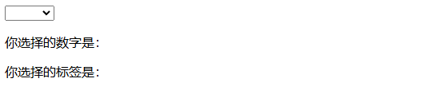

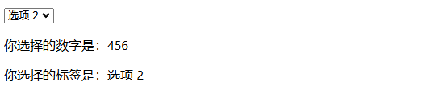

## 修饰符

### `.lazy`

默认情况下，`v-model` 会在每次 `input` 事件后更新数据

这意味着，每次用户在文本框中输入内容时，`v-model` 会立即更新绑定的变量（例如 `msg`）。

然而，在某些场景下，你可能希望只有在用户 **提交输入**（例如点击 "提交" 按钮，或者离开文本框）时才更新数据。

这时，你可以使用 `.lazy` 修饰符，改变默认的行为，使得 `v-model` 在 `change` 事件后才更新数据，而不是在每个 `input` 事件后更新。

```vue
<script setup>
import { ref } from 'vue'

const msg1 = ref('Hello World!')
const msg2 = ref('Hello World!')
</script>

<template>
  <div>
    <input v-model="msg1" placeholder="输入内容..." />
    <p>实时更新的 msg：{{ msg1 }}</p>
  </div>

  <div>
    <input v-model.lazy="msg2" placeholder="输入内容..." />
    <p>更新的 msg（延迟更新）：{{ msg2 }}</p>
  </div>
</template>
```

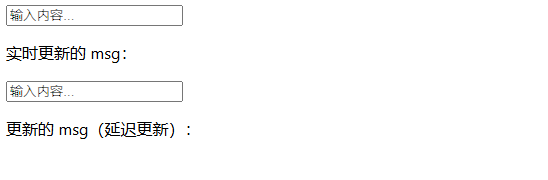

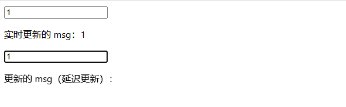

对我们更新延迟msg的时候, 输入时不会更新的, 但是当我们将鼠标点击外部元素的时候就会更新。


### `.number`

如果你想让用户输入自动转换为数字，你可以在 `v-model` 后添加 `.number` 修饰符来管理输入：

```vue
<script setup>
import { ref } from 'vue'

const age = ref('')
</script>

<template>
  <div>
    <input v-model.number="age" />
    <p>更新 age: {{ age }}</p>
  </div>

</template>
```

如果该值无法被 `parseFloat()` 处理，那么将返回原始值。

`number` 修饰符会在输入框有 `type="number"` 时自动启用。


### `.trim`

如果你想要默认自动去除用户输入内容中两端的空格，你可以在 `v-model` 后添加 `.trim` 修饰符：

```vue
<script setup>
import { ref } from 'vue'

const msg = ref('')
</script>

<template>
  <div>
    <input v-model.trim="msg" />
    <p>更新 msg: {{ msg }}</p>
  </div>

</template>
```

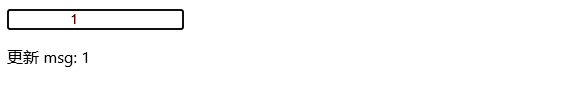

## 组件上的 `v-model`

> 如果你还不熟悉 Vue 的组件，那么现在可以跳过这个部分。

HTML 的内置表单输入类型并不总能满足所有需求。幸运的是，我们可以使用 Vue 构建具有自定义行为的可复用输入组件，并且这些输入组件也支持 `v-model`！要了解更多关于此的内容，请在组件指引中阅读[配合 `v-model` 使用](https://cn.vuejs.org/guide/components/v-model.html)。