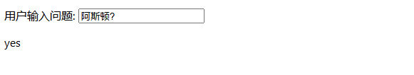

## 侦听器

## 基本示例

计算属性允许我们声明性地计算衍生值。

然而在有些情况下，我们需要在状态变化时执行一些“副作用”：例如更改 DOM，或是根据异步操作的结果去修改另一处的状态。

在组合式 API 中，我们可以使用 [`watch` 函数](https://cn.vuejs.org/api/reactivity-core.html#watch)在每次响应式状态发生变化时触发回调函数：

```vue
<script setup>
import { ref, watch } from 'vue'

// 创建响应式变量 `question` 用于存储用户的输入问题
const question = ref('')
// 创建响应式变量 `answer` 用于存储答案
const answer = ref('')
// 创建响应式变量 `loading` 用于表示是否正在加载中
const loading = ref(false)

// 使用 watch 监听 `question` 变量的变化
// newQuestion：表示你正在观察的响应式数据的新值，也就是当 question 发生变化后，变化后的值。
// oldQuestion：表示你正在观察的响应式数据的旧值，也就是 question 在变化之前的值。
// 由于只监听一个数据源 question，watch 会在数据变化时传递这两个参数，让你可以比较变化前后的数据。
watch(question, async (newQuestion, oldQuestion) => {
  // 如果用户的输入包含问号，表示这是一个问题
  if (newQuestion.includes('?')) {
    loading.value = true  // 设置 loading 为 true，表示正在加载
    answer.value = 'Thinking...'  // 显示加载中的提示

    try {
      // 调用 API 获取随机的 Yes/No 答案
      const res = await fetch('https://yesno.wtf/api')
      // 更新 `answer` 为 API 返回的答案
      answer.value = (await res.json()).answer
    } catch (error) {
      // 捕获错误，显示错误信息
      answer.value = 'Error! Could not reach the API. ' + error
    } finally {
      // 无论成功或失败，都将 loading 设置为 false，表示加载完成
      loading.value = false
    }
  }
})
</script>

<template>
  <p>
    <!-- 用户输入问题 -->
    用户输入问题:
    <!-- 输入框，绑定 `question` 变量，同时禁用输入框在加载时 -->
    <input v-model="question" :disabled="loading" />
  </p>
  <!-- 显示回答 -->
  <p>{{ answer }}</p>
</template>
```



### 侦听数据源类型

`watch` 的第一个参数可以是不同形式的“数据源”：

它可以是一个 ref (包括计算属性)、一个响应式对象、一个 [getter 函数](https://developer.mozilla.org/zh-CN/docs/Web/JavaScript/Reference/Functions/get#description)、或多个数据源组成的数组：

1. **单个 `ref`**：
   这里的 `x` 是一个 `ref` 对象，我们监听 `x` 的变化。如果 `x` 的值发生变化，回调函数就会触发，输出 `x` 的新值。

```js
const x = ref(0)
watch(x, (newX) => {
  console.log(`x is ${newX}`)
})
```

2. **`getter` 函数**： 

   `watch` 还可以接受一个函数作为第一个参数，这个函数用于返回一个值（例如 `x.value + y.value`）。当该值发生变化时，回调函数会被触发。

```js
const x = ref(0)
const y = ref(0)

watch(
  () => x.value + y.value,
  (sum) => { console.log(`sum of x + y is: ${sum}`) } 
)
```

**行为**：

- 这里，`watch` 监听的是 `x.value + y.value` 这个计算结果。
- 当 `x` 或 `y` 发生变化时，`x + y` 的总和就会变化，回调函数会触发，输出新的总和。
- 例如，当 `x` 为 `2`，`y` 为 `3` 时，输出 `sum of x + y is: 5`。


3. **多个数据源组成的数组**： 

   你还可以传递一个数组，数组中的每一项可以是一个响应式数据或 `getter` 函数。

   `watch` 会监听数组中的每个数据源的变化，一旦任一项变化，回调函数就会触发。

```js
const x = ref(0)
const y = ref(0)

// newX: x 变化后的值
// newY: () => y.value 回调完成后的值
watch([x, () => y.value], ([newX, newY]) => {
  console.log(`x is ${newX} and y is ${newY}`)
})
```

**行为**：

- 这里，`watch` 监听 `x` 和 `y` 两个数据源。
- 如果 `x` 或 `y` 的值发生变化，回调函数会触发，并输出这两个值的最新值。
- 例如，当 `x` 为 `5`，`y` 为 `7` 时，输出 `x is 5 and y is 7`。


**注意:** 

你不能直接侦听响应式**对象**的属性值，例如:

```js
const obj = reactive({ count: 0 })

// 错误，因为 watch() 得到的参数是一个 number
watch(obj.count, (count) => {
  console.log(`Count is: ${count}`)
})
```

这里需要用一个返回该属性的 getter 函数：

```js
// 提供一个 getter 函数
watch(
  () => obj.count,
  (count) => {
    console.log(`Count is: ${count}`)
  }
)
```

