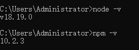
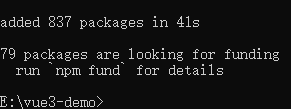
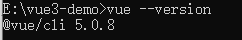

### 开始之前

计算机上安装了 Node.js 和 npm（Node.js 的包管理工具），因为它们是运行 Vue CLI（命令行接口）和其他开发工具所必需的。

你可以通过以下命令检查是否已安装：

```sh
node -v
npm -v
```



如果未安装，可以从 [Node.js 官方网站](https://nodejs.org/)下载并安装最新版本。


### 安装 Vue CLI

Vue CLI 是官方提供的命令行工具，用于快速搭建大型单页应用。

可以通过 npm 安装它:


```sh
# 这可能需要一点时间
npm install -g @vue/cli
```



安装完成后，你可以使用 `vue --version` 来验证安装是否成功。

```sh
vue --version
```



### 学习基础概念

一旦项目创建完成，你需要理解一些基本概念，比如：

- **组件**：Vue 应用的基本构建块，每个组件都有自己的视图、数据和逻辑。
- **模板**：HTML 模板用来定义组件的结构。
- **脚本**：JavaScript 或 TypeScript 代码，用来处理逻辑和交互。
- **样式**：CSS 样式用来控制组件的外观。
- **响应式数据**：Vue 中的数据绑定机制，当数据变化时，视图会自动更新。
- **事件处理**：如何监听 DOM 事件并在发生时执行特定操作。
- **生命周期钩子**：组件不同生命周期阶段触发的函数。


### 使用 Composition API

Vue 3 引入了 Composition API，它是对 Options API 的补充。

Composition API 提供了一种更灵活的方式来组织和重用逻辑代码，尤其是在构建复杂的组件时。

要开始使用 Composition API，你可以从 `<script setup>` 语法开始，这是 Vue 3 推荐的新方式来编写组件脚本。