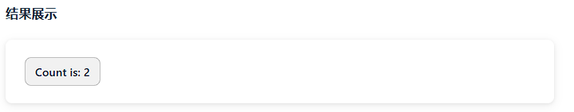

# 简历

这一章请先看看, 而不需要编写正在代码。


## 什么是 Vue？

Vue (发音为 /vjuː/，类似 **view**) 是一款用于构建用户界面的 JavaScript 框架。

它基于标准 HTML、CSS 和 JavaScript 构建，并提供了一套声明式的、组件化的编程模型，帮助你高效地开发用户界面。

无论是简单还是复杂的界面，Vue 都可以胜任。

下面是一个最基本的示例：

```js
import { createApp, ref } from 'vue'

createApp({
  setup() {
    return {
      count: ref(0)
    }
  }
}).mount('#app')
```

```vue
<div id="app">
  <button @click="count++">
    Count is: {{ count }}
  </button>
</div>
```



上面的示例展示了 Vue 的两个核心功能：

- **声明式渲染**：Vue 基于标准 HTML 拓展了一套模板语法，使得我们可以声明式地描述最终输出的 HTML 和 JavaScript 状态之间的关系。
- **响应性**：Vue 会自动跟踪 JavaScript 状态并在其发生变化时响应式地更新 DOM。

你可能已经有了些疑问——先别急，在后续的文档中我们会详细介绍每一个细节。

现在，请继续看下去，以确保你对 Vue 作为一个框架到底提供了什么有一个宏观的了解。


## 单文件组件

我们可以使用一种类似 HTML 格式的文件来书写 Vue 组件，它被称为**单文件组件** (也被称为 `*.vue` 文件，英文 Single-File Components，缩写为 **SFC**)。

顾名思义，Vue 的单文件组件会将一个组件的逻辑 (JavaScript)，模板 (HTML) 和样式 (CSS) 封装在同一个文件里。

下面我们将用单文件组件的格式重写上面的计数器示例：

```vue
<script setup>
import { ref } from 'vue'
const count = ref(0)
</script>

<template>
  <button @click="count++">Count is: {{ count }}</button>
</template>

<style scoped>
button {
  font-weight: bold;
}
</style>
```

单文件组件是 Vue 的标志性功能。如果你的用例需要进行构建，我们推荐用它来编写 Vue 组件。


## API 风格

Vue 的组件可以按两种不同的风格书写：**选项式 API** 和**组合式 API**。

### 选项式 API (Options API)

使用选项式 API，我们可以用包含多个选项的对象来描述组件的逻辑，例如 `data`、`methods` 和 `mounted`。

选项所定义的属性**都会**暴露在函数内部的 `this` 上，它会指向当前的组件实例。

```vue
<script>
export default {
  // data() 返回的属性将会成为响应式的状态, 这里返回了一个 count 的属性
  // 并且暴露在 `this` 上
  data() {
    return {
      count: 0
    }
  },

  // methods 是一些用来更改状态与触发更新的函数,它们可以在模板中作为事件处理器绑定
  // 这里可以用 this 获取 count
  methods: {
    increment() {
      this.count++
    }
  },

  // 生命周期钩子会在组件生命周期的各个不同阶段被调用,例如这个函数就会在组件挂载完成后被调用
  // 这里可以用 this 获取 count
  mounted() {
    console.log(`The initial count is ${this.count}.`)
  }
}
</script>

<template>
  <button @click="increment">Count is: {{ count }}</button>
</template>
```

### 组合式 API (Composition API)

通过组合式 API，我们可以使用导入的 API 函数来描述组件逻辑。在单文件组件中，组合式 API 通常会与 [``](https://cn.vuejs.org/api/sfc-script-setup.html) 搭配使用。

这个 `setup` attribute 是一个标识，告诉 Vue 需要在编译时进行一些处理，让我们可以更简洁地使用组合式 API。

比如，`<script setup>` 中的导入和顶层变量/函数都能够在模板中直接使用。

下面是使用了组合式 API 与 `<script setup>` 改造后和上面的模板完全一样的组件：

```vue
<script setup>
import { ref, onMounted } from 'vue'

// 响应式状态
const count = ref(0)

// 用来修改状态、触发更新的函数
function increment() {
  count.value++
}

// 生命周期钩子
onMounted(() => {
  console.log(`The initial count is ${count.value}.`)
})
</script>

<template>
  <button @click="increment">Count is: {{ count }}</button>
</template>
```


### 该选哪一个？

我们目前的项目使用**组合式 API**。