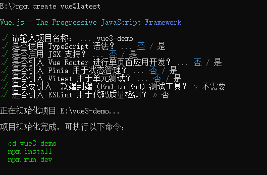
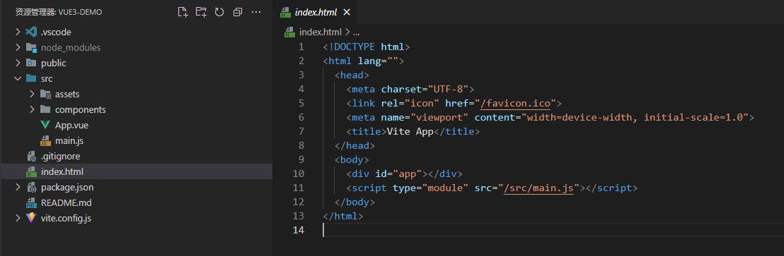
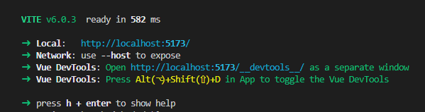

## 创建一个 Vue 应用

在本节中，我们将介绍如何在本地搭建 Vue 单页应用

创建的项目将使用基于 [Vite](https://vitejs.dev/) 的构建设置，并允许我们使用 Vue 的单文件组件 (SFC)。

确保你安装了最新版本的 [Node.js](https://nodejs.org/)，并且你的当前工作目录正是打算创建项目的目录(创建后会新建项目名称的目录)。

在命令行中运行以下命令, 一直默认回车即可：

```sh
npm create vue@latest
```



在项目被创建后，通过以下步骤安装依赖：

```sh
cd <your-project-name>
npm install
```



启动开发服务器:

```sh
npm run dev
```




当你准备将应用发布到生产环境时，请运行：

```sh
npm run build
```

此命令会在 `./dist` 文件夹中为你的应用创建一个生产环境的构建版本。关于将应用上线生产环境的更多内容，请阅读[生产环境部署指南](https://cn.vuejs.org/guide/best-practices/production-deployment.html)。