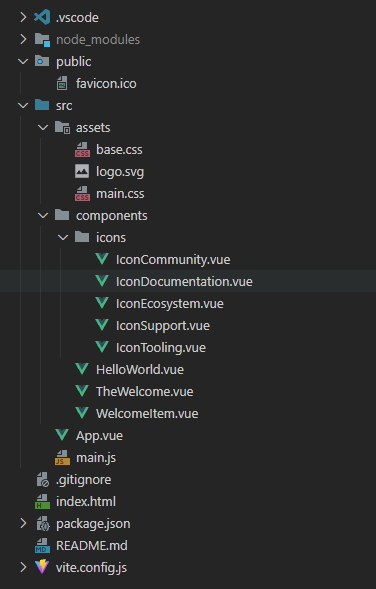

### 目录结构分析

1. **.vscode**:
   - 这是 Visual Studio Code 的配置文件夹，包含项目特定的设置和扩展配置。

2. **node_modules**:
   - 存储项目依赖的 Node.js 模块。这些模块是通过 `npm install` 命令安装的。

3. **public**:
   - 存放静态资源文件，如 `favicon.ico`。这些文件在构建时会被直接复制到输出目录，不会被 Webpack 处理。

4. **src**:
   - **assets**:
     - 存放静态资源文件，如 `base.css`、`logo.svg` 和 `main.css`。这些文件通常用于全局样式和图标等静态资源。
   - **components**:
     - 存放 Vue 组件文件。
       - **icons**:
         - 存放图标相关的组件，如 `IconCommunity.vue`、`IconDocumentation.vue` 等。
       - 其他组件文件，如 `HelloWorld.vue`、`TheWelcome.vue` 和 `WelcomeItem.vue`。
   - **App.vue**:
     - 应用的主要组件文件，通常包含应用的根组件。
   - **main.js**:
     - 应用的入口文件，通常在这里初始化 Vue 应用。

5. **.gitignore**:
   - 配置 Git 忽略哪些文件或文件夹不进行版本控制。

6. **index.html**:
   - 应用的 HTML 模板文件，所有动态内容将插入到这个模板中。

7. **package.json**:
   - 包含项目依赖、脚本命令和其他元数据。

8. **README.md**:
   - 项目的说明文档，通常包含项目介绍、安装步骤、使用方法等信息。

9. **vite.config.js**:
   - Vite 的配置文件，用于自定义 Vite 的行为，如设置代理、修改构建输出等。

### 详细说明

- **public**:
  - `favicon.ico`: 网站图标。
  
- **src/assets**:
  - `base.css`: 基础样式文件。
  - `logo.svg`: 项目图标。
  - `main.css`: 主要样式文件。

- **src/components**:
  - **icons**:
    - `IconCommunity.vue`: 社区图标组件。
    - `IconDocumentation.vue`: 文档图标组件。
    - `IconEcosystem.vue`: 生态系统图标组件。
    - `IconSupport.vue`: 支持图标组件。
    - `IconTooling.vue`: 工具图标组件。
  - `HelloWorld.vue`: 示例组件。
  - `TheWelcome.vue`: 欢迎组件。
  - `WelcomeItem.vue`: 欢迎项组件。

- **src/App.vue**:
  - 应用的根组件。

- **src/main.js**:
  - 应用的入口文件，通常在这里创建和挂载 Vue 实例。

### 总结

- **public** 文件夹用于存放不需要编译处理的静态资源。
- **src** 文件夹是项目的核心，包含了所有的源代码和资源。
  - **assets** 存放静态资源。
  - **components** 存放 Vue 组件。
  - **App.vue** 是应用的主要组件。
  - **main.js** 是应用的入口文件。
- 其他文件如 `.gitignore`、`package.json`、`README.md` 和 `vite.config.js` 分别用于版本控制配置、项目依赖管理、项目说明和 Vite 构建配置。

这样的目录结构有助于保持项目组织清晰，便于团队协作和维护。