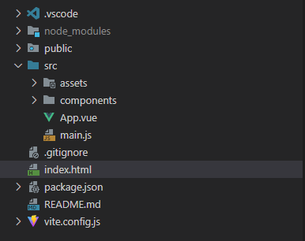

# Vue3 起步

了解起步阶段, 我们需要找到切入的入口。



也就是三个文件: 

- index.html -> 启动后默认指向加载的主页html, 理论上我们用逻辑改动后的都应该动态调整到这个html
- main.js -> 程序逻辑的主入口, 程序的第一行命令一定是从这里开始的
- App.vue -> 第一个基础的 vue 组件

 main是主入口, 所以我们一个先查看 `main.js`


# index.html

```html
<!DOCTYPE html>
<!-- 设置文档的语言为简体中文 -->
<html lang="zh-CN">
  <head>
    <!-- 指定字符编码为 UTF-8，确保页面能够正确显示各种语言的字符 -->
    <meta charset="UTF-8" />
    <!-- 设置网站图标，这里使用的是位于根目录下的 /public/favicon.ico 文件 -->
    <link rel="icon" href="/favicon.ico" />
    <!-- 设置视口（viewport）元标签，以确保网页在移动设备上的显示效果。width=device-width 表示宽度等于当前设备的宽度，initial-scale=1.0 表示初始缩放比例为 1:1 -->
    <meta name="viewport" content="width=device-width, initial-scale=1.0" />
    <!-- 设置网页标题，显示在浏览器标签页上 -->
    <title>Vite App</title>
  </head>
    
  <body>
    <!-- 定义一个 div 元素，id 为 "app"。Vue 应用将会挂载到这个元素上，所有由 Vue 管理的内容将插入或替换这个元素 -->
    <div id="app"></div>
    <!-- 引入 JavaScript 模块文件 main.js，它是 Vue 应用的入口文件。type="module" 属性表示这是一个 ES6 模块脚本 -->
    <script type="module" src="/src/main.js"></script>
  </body>
</html>
```

从 body 标签中我们可以看到 `id="app"`, 并且引入了 `main.js`。

我们的基本逻辑已经形成了: 

1. 页面访问的时候先打开默认的 `index.html`
2. `index.html`引入了 `main.js`
3. `main.js`执行逻辑后, 应该是将 Vue 应用渲染到了  `id="app"` 的这个div元素上
4. Vue 应用替换了  `id="app"`元素的内容
5. 最后浏览器展示出 Vue 的页面, 同时 Vue 也是一个嵌套式的内容, 所以页面最后由嵌套完成的形式展示到浏览器


# main.js

```js
// 位于 ./assets/ 文件夹中的 main.css 样式文件。通过这种方式，你可以确保所有的全局样式在应用启动时就被加载。
import "./assets/main.css";
// 这里从 vue 包中导入了 createApp 函数。createApp 是 Vue 3 中用来创建应用程序实例的方法。
import { createApp } from "vue";
// 从 ./App.vue 文件中导入了顶层组件 App。App.vue 是整个应用程序的根组件，所有的其他组件都将嵌套在这个根组件内。
import App from "./App.vue";

// 最后这一行是创建应用实例, 指定根组件 APP, 并将其挂载到具有 id="app" 的 DOM 元素上
createApp(App).mount("#app");
```

- `createApp(App)` 创建了一个新的应用实例，并将 `App` 组件设置为该应用的根组件。
- `.mount('#app')` 方法用于将应用实例挂载到页面上的某个特定元素（这里是指定 ID 为 `app` 的元素）。
- 这意味着所有由 Vue 管理的内容将会插入或替换这个元素的内容。


从这里我们获取到了2个信息:

1. vue最终挂载到了一个 id="app" 的 DOM 元素上
2. vue渲染 DOM 是用 App 这个组件为入口的, 所有的其他组件都将嵌套在这个根组件内。


# App.vue

```vue
<script setup>
// 导入 HelloWorld 和 TheWelcome 组件，它们将用于模板中。
import HelloWorld from "./components/HelloWorld.vue";
import TheWelcome from "./components/TheWelcome.vue";
</script>

<template>
  <header>
    <!-- 显示 Vue logo 图像，指定 alt 属性为 "Vue logo"，并设置了类名和宽高 -->
    

    <div class="wrapper">
      <!-- 使用 HelloWorld 嵌入组件，并通过属性传递消息 "You did it!" -->
      <HelloWorld msg="You did it!" />
    </div>
  </header>

  <main>
    <!-- 使用 TheWelcome 嵌入组件 -->
    <TheWelcome />
  </main>
</template>

<style scoped>
/* 样式作用域仅限于当前组件 */
header {
  line-height: 1.5; /* 设置 header 内文本的行高 */
}

.logo {
  display: block; /* 将图像设置为块级元素 */
  margin: 0 auto 2rem; /* 上下外边距为 0，左右居中，底部外边距为 2rem */
}

/* 媒体查询：当屏幕最小宽度为 1024px 时应用以下样式 */
@media (min-width: 1024px) {
  header {
    display: flex; /* 使用弹性布局 */
    place-items: center; /* 对齐项目至中心 */
    padding-right: calc(
      var(--section-gap) / 2
    ); /* 右侧内边距为 --section-gap 的一半 */
  }

  .logo {
    margin: 0 2rem 0 0; /* 修改 logo 的外边距 */
  }

  header .wrapper {
    display: flex; /* 使用弹性布局 */
    place-items: flex-start; /* 对齐项目至顶部 */
    flex-wrap: wrap; /* 允许子元素换行 */
  }
}
</style>

```


- **script setup**：这是 Vue 3 引入的一种新的脚本标签，它提供了一种更简洁的方式来编写组合式 API 代码。

  - 所有在script setup中定义的内容（如导入的组件或变量）都默认是暴露给模板使用的。

  ```vue
  <script setup>
  // 导入 HelloWorld 和 TheWelcome 组件，它们将用于模板中。
  import HelloWorld from "./components/HelloWorld.vue";
  import TheWelcome from "./components/TheWelcome.vue";
  </script>
  ```

  

- **template**：这部分包含了 HTML 模板，用于描述组件的结构。

  - 你可以在这里使用任何有效的 HTML，以及 Vue 特定的语法，比如动态属性绑定、条件渲染、列表渲染等。

  ```vue
  <template>
    <header>
      <!-- 显示 Vue logo 图像，指定 alt 属性为 "Vue logo"，并设置了类名和宽高 -->
      
  
      <div class="wrapper">
        <!-- 使用 HelloWorld 组件，并通过属性传递消息 "You did it!" -->
        <HelloWorld msg="You did it!" />
      </div>
    </header>
  
    <main>
      <!-- 使用 TheWelcome 组件 -->
      <TheWelcome />
    </main>
  </template>
  ```

  

- **style scoped**：这里的 scoped 属性确保这些样式只应用于当前组件，不会影响到全局或其他组件。

  - 这有助于避免样式冲突，同时也使得组件更加独立和可重用。


到现在, 我们已经理清了 Vue 加载的流程, 这么让一个页面渲染成 Vue 编写后的样子

- 原来是将一个根 App.vue 挂载到了 index.html 的 id="app" 的标签元素上
- 然后周末只要调整 App.vue 的内容就可以再页面上看到想要看到的内容了
- 同时 App.vue 是可以嵌套修改的, 这样就为我们展示不同页面提供了可能性
- 如果有一个 js 的逻辑可以动态调整哪一个嵌套的 vue 组件被显示, 其他的隐藏或者不加载就可以达到浏览器页面的效果了


# 标签说明

## header标签

- **用途**：`<header>` 标签代表了一个引入节（section）或者导航链接的容器。它可以包含与节相关的介绍性内容或导航链接。
  - 请注意，一个页面可以有多个 `<header>` 元素，每个都可以用于不同的节。
- **典型内容**：
  - 网站的标志或标题
  - 导航菜单
  - 搜索框
  - 登录/注册链接等

```vue
<header>
  <h1>网站标题</h1>
  <nav>
    <ul>
      <li><a href="#home">首页</a></li>
      <li><a href="#about">关于我们</a></li>
      <li><a href="#contact">联系我们</a></li>
    </ul>
  </nav>
</header>
```

主要作用是标识页面或节的头部区域，并且它提供了语义化信息，以增强代码的可读性和维护性。

而对于只是用 `<div>` 的标签，则需要依赖于内部元素（如 `<h1>` 和 `<nav>`）来推测这部分代码的用途是否是头部区域。

当然也可以用 div 来完成。


## main标签

- **用途**：`<main>` 标签指定了文档的主要内容区域。每个页面应该只包含一个 `<main>` 元素，并且该元素不应被包含在其他具有主要角色的内容块内（如 `<article>`、`<aside>`、`<footer>`、`<header>` 或 `<nav>` 中）。
- **典型内容**：
  - 文章主体
  - 博客帖子
  - 应用程序的主要交互区
  - 动态更新的内容

```vue
<main>
  <article>
    <h2>文章标题</h2>
    <p>这是文章的内容...</p>
  </article>
</main>
```

