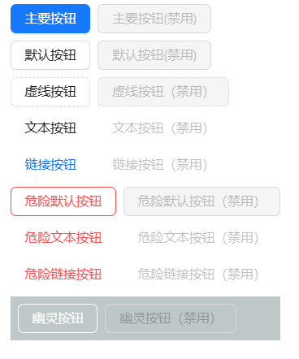

## Button按钮

按钮用于开始一个即时操作。

## 何时使用 [#](https://antdv.com/components/button-cn#何时使用)

标记了一个（或封装一组）操作命令，响应用户点击行为，触发相应的业务逻辑。

在 Ant Design Vue 中我们提供了五种按钮。

- 主按钮：用于主行动点，一个操作区域只能有一个主按钮。
- 默认按钮：用于没有主次之分的一组行动点。
- 虚线按钮：常用于添加操作。
- 文本按钮：用于最次级的行动点。
- 链接按钮：一般用于链接，即导航至某位置。


以及四种状态属性与上面配合使用。

- 危险：删除/移动/修改权限等危险操作，一般需要二次确认。
- 幽灵：用于背景色比较复杂的地方，常用在首页/产品页等展示场景。
- 禁用：行动点不可用的时候，一般需要文案解释。
- 加载中：用于异步操作等待反馈的时候，也可以避免多次提交。


## 代码演示

### 1.按钮类型


```vue
<template>
	<!-- a-space 组件用于在其子元素之间提供均匀的间隔，wrap 属性允许换行 -->
	<a-space wrap>
		<!-- 创建一个主要按钮（Primary Button），通常用于强调重要的操作 -->
		<a-button type="primary">主要按钮</a-button>
		<!-- 创建一个默认样式的按钮（Default Button），这是最普通的按钮样式 -->
		<a-button>普通按钮</a-button>
		<!-- 创建一个虚线按钮（Dashed Button），适用于次要或轻量级的操作 -->
		<a-button type="dashed">虚线按钮</a-button>
		<!-- 创建一个文本按钮（Text Button），只显示文字，没有背景颜色或边框 -->
		<a-button type="text">文本按钮</a-button>
		<!-- 创建一个链接按钮（Link Button），外观像链接，可以用来替代 <a> 标签 -->
		<a-button type="link">链接按钮</a-button>
	</a-space>
</template>
```

### 2.按钮loading


```vue
<template>
	<!-- 使用 a-space 组件来组织按钮，并设置 direction="vertical" 来垂直排列子元素 -->
	<a-space direction="vertical">
		<!-- 第一行按钮：展示不同大小的加载中按钮 -->
		<a-space>
			<!-- 带有 loading 状态的主要按钮，显示默认尺寸 -->
			<a-button type="primary" loading>Loading</a-button>
			<!-- 带有 loading 状态的主要按钮，显示小尺寸 -->
			<a-button type="primary" size="small" loading>小尺寸</a-button>
		</a-space>

		<!-- 第二行按钮：带有交互效果的加载中按钮 -->
		<a-space>
			<!-- 当鼠标悬停时触发加载状态的主要按钮 -->
			<a-button type="primary" :loading="loading" @mouseenter="loading = true">将鼠标悬停在此处</a-button>
			<!-- 点击后延迟1秒进入加载状态的主要按钮，并在6秒后自动关闭加载状态 -->
			<a-button type="primary" :loading="iconLoading" @click="enterIconLoading">
				<!-- 使用 #icon 插槽自定义按钮内的图标 -->
				<template #icon><PoweroffOutlined /></template>
				延迟1s
			</a-button>
		</a-space>

		<!-- 第三行按钮：展示不同形状和颜色的加载中按钮 -->
		<a-space>
			<!-- 默认样式的主要按钮，带有加载状态 -->
			<a-button type="primary" loading />
			<!-- 圆形的主要按钮，带有加载状态 -->
			<a-button type="primary" shape="circle" loading />
			<!-- 圆角的危险按钮（通常是红色），带有加载状态 -->
			<a-button danger shape="round" loading />
		</a-space>
	</a-space>
</template>

<script setup>
	import { ref } from 'vue';
	// 导入图标组件 PoweroffOutlined （假设已经正确安装并配置）
	import { PoweroffOutlined } from '@ant-design/icons-vue';

	// 定义响应式变量 loading 用于控制第一行按钮的加载状态
	const loading = ref(false);
	// 定义响应式变量 iconLoading 用于控制第二行按钮的加载状态
	const iconLoading = ref(false);

	// 定义点击事件处理函数 enterIconLoading，当按钮被点击时，设置加载状态并延迟关闭
	const enterIconLoading = () => {
		// 设置带有延迟属性的对象给 iconLoading，表示开启加载状态并指定延迟时间
		iconLoading.value = { delay: 1000 };

		// 设置一个定时器，在6秒后重置 iconLoading，即关闭加载状态
		setTimeout(() => {
			iconLoading.value = false; // 关闭加载状态
		}, 6000);
	};
</script>

<!-- 可选：如果你需要在 <style> 标签中添加样式，可以在这里添加 -->
<style scoped></style>
```

### 3.按钮尺寸


```vue
<template>
	<!-- 使用 a-space 组件来组织布局，并设置 direction="vertical" 来垂直排列子元素 -->
	<a-space direction="vertical">
		<!-- 使用 a-radio-group 和 a-radio-button 创建一组用于切换按钮尺寸的单选按钮 -->
		<a-radio-group v-model:value="size">
			<a-radio-button value="large">大尺寸</a-radio-button>
			<a-radio-button value="default">默认尺寸</a-radio-button>
			<a-radio-button value="small">小尺寸</a-radio-button>
		</a-radio-group>

		<!-- 第一行按钮：展示不同类型的按钮，它们的尺寸会根据上面的选择而变化 -->
		<a-space>
			<a-button type="primary" :size="size">主要按钮</a-button>
			<a-button :size="size">普通按钮</a-button>
			<a-button type="dashed" :size="size">虚线按钮</a-button>
			<a-button danger :size="size">危险按钮</a-button>
			<a-button type="link" :size="size">链接按钮</a-button>
		</a-space>

		<!-- 第二行按钮：展示带有图标的按钮，以及圆形和圆角形状的按钮 -->
		<a-space>
			<!-- 主要按钮，仅包含图标 -->
			<a-button type="primary" :size="size">
				<template #icon>
					<DownloadOutlined />
				</template>
			</a-button>
			<!-- 圆形的主要按钮，仅包含图标 -->
			<a-button type="primary" shape="circle" :size="size">
				<template #icon>
					<DownloadOutlined />
				</template>
			</a-button>
			<!-- 圆角的主要按钮，包含图标和文字 -->
			<a-button type="primary" shape="round" :size="size">
				<template #icon>
					<DownloadOutlined />
				</template>
				下载
			</a-button>
			<!-- 圆角的主要按钮，仅包含图标 -->
			<a-button type="primary" shape="round" :size="size">
				<template #icon>
					<DownloadOutlined />
				</template>
			</a-button>
			<!-- 主要按钮，包含图标和文字 -->
			<a-button type="primary" :size="size">
				<template #icon>
					<DownloadOutlined />
				</template>
				下载
			</a-button>
		</a-space>
	</a-space>
</template>
<script setup>
	import { ref } from 'vue';
	// 导入图标组件 DownloadOutlined （假设已经正确安装并配置）
	import { DownloadOutlined } from '@ant-design/icons-vue';
	// 定义响应式变量 size 用于存储当前选中的按钮尺寸，默认为 "large"
	const size = ref('large');
</script>
```

### 4.按钮图标


```vue
<template>
	<!-- 使用 a-space 组件来组织布局，并设置 direction="vertical" 来垂直排列子元素 -->
	<a-space direction="vertical">
		<!-- 第一行按钮：展示不同类型和样式的圆形按钮与带图标的按钮 -->
		<a-space warp>
			<!-- 带有工具提示的圆形主要按钮，点击后不会导航，只显示搜索图标 -->
			<a-tooltip title="搜索">
				<a-button type="primary" shape="circle">
					<template #icon><SearchOutlined /></template>
				</a-button>
			</a-tooltip>

			<!-- 简单的圆形主要按钮，显示字母 A -->
			<a-button type="primary" shape="circle">A</a-button>

			<!-- 主要按钮，包含文本 "Search" 和搜索图标 -->
			<a-button type="primary">
				<template #icon><SearchOutlined /></template>搜索
			</a-button>

			<!-- 带有工具提示的圆形按钮，没有背景色或边框，仅显示搜索图标 -->
			<a-tooltip title="搜索">
				<a-button shape="circle">
					<template #icon><SearchOutlined /></template>
				</a-button>
			</a-tooltip>

			<!-- 普通按钮，包含文本 "Search" 和搜索图标 -->
			<a-button>
				<template #icon><SearchOutlined /></template>搜索
			</a-button>
		</a-space>

		<!-- 第二行按钮：进一步展示不同样式（如虚线）和功能（如链接）的按钮 -->
		<a-space warp>
			<!-- 带有工具提示的圆形按钮，没有背景色或边框，仅显示搜索图标 -->
			<a-tooltip title="搜索">
				<a-button shape="circle">
					<template #icon><SearchOutlined /></template>
				</a-button>
			</a-tooltip>

			<!-- 普通按钮，包含文本 "Search" 和搜索图标 -->
			<a-button>
				<template #icon><SearchOutlined /></template>搜索
			</a-button>

			<!-- 带有工具提示的圆形虚线按钮，仅显示搜索图标 -->
			<a-tooltip title="搜索">
				<a-button type="dashed" shape="circle">
					<template #icon><SearchOutlined /></template>
				</a-button>
			</a-tooltip>

			<!-- 虚线按钮，包含文本 "Search" 和搜索图标 -->
			<a-button type="dashed">
				<template #icon><SearchOutlined /></template>搜索
			</a-button>

			<!-- 链接按钮，点击后会在_blank新窗口中跳转到指定 URL -->
			<a-button :href="googleLink" target="_blank">
				<template #icon><SearchOutlined /></template>前往 Google
			</a-button>
		</a-space>
	</a-space>
</template>
<script setup>
	import { ref } from 'vue';
	// 导入图标组件 SearchOutlined （假设已经正确安装并配置）
	import { SearchOutlined } from '@ant-design/icons-vue';

	// 定义一个响应式变量用于存储链接地址
	const googleLink = ref('https://www.google.com');
</script>

<!-- 可选：如果你需要在 <style> 标签中添加样式，可以在这里添加 -->
<style scoped></style>
```

### 5.启用禁用按钮



```vue
<template>
	<!-- 使用 a-space 组件来组织布局，并设置 direction="vertical" 来垂直排列子元素 -->
	<a-space direction="vertical">
		<!-- 第一行按钮：主要按钮（Primary Button）及其禁用状态 -->
		<a-space>
			<!-- 启用的主要按钮 -->
			<a-button type="primary">主要按钮</a-button>
			<!-- 禁用的主要按钮 -->
			<a-button type="primary" disabled>主要按钮(禁用)</a-button>
		</a-space>

		<!-- 第二行按钮：默认按钮（Default Button）及其禁用状态 -->
		<a-space>
			<!-- 启用的默认按钮 -->
			<a-button>默认按钮</a-button>
			<!-- 禁用的默认按钮 -->
			<a-button disabled>默认按钮(禁用)</a-button>
		</a-space>

		<!-- 第三行按钮：虚线按钮（Dashed Button）及其禁用状态 -->
		<a-space>
			<!-- 启用的虚线按钮 -->
			<a-button type="dashed">虚线按钮</a-button>
			<!-- 禁用的虚线按钮 -->
			<a-button type="dashed" disabled>虚线按钮（禁用）</a-button>
		</a-space>

		<!-- 第四行按钮：文本按钮（Text Button）及其禁用状态 -->
		<a-space>
			<!-- 启用的文本按钮 -->
			<a-button type="text">文本按钮</a-button>
			<!-- 禁用的文本按钮 -->
			<a-button type="text" disabled>文本按钮（禁用）</a-button>
		</a-space>

		<!-- 第五行按钮：链接按钮（Link Button）及其禁用状态 -->
		<a-space>
			<!-- 启用的链接按钮 -->
			<a-button type="link">链接按钮</a-button>
			<!-- 禁用的链接按钮 -->
			<a-button type="link" disabled>链接按钮（禁用）</a-button>
		</a-space>

		<!-- 第六行按钮：危险默认按钮（Danger Default Button）及其禁用状态 -->
		<a-space>
			<!-- 启用的危险默认按钮 -->
			<a-button danger>危险默认按钮</a-button>
			<!-- 禁用的危险默认按钮 -->
			<a-button danger disabled>危险默认按钮（禁用）</a-button>
		</a-space>

		<!-- 第七行按钮：危险文本按钮（Danger Text Button）及其禁用状态 -->
		<a-space>
			<!-- 启用的危险文本按钮 -->
			<a-button danger type="text">危险文本按钮</a-button>
			<!-- 禁用的危险文本按钮 -->
			<a-button danger type="text" disabled>危险文本按钮（禁用）</a-button>
		</a-space>

		<!-- 第八行按钮：危险链接按钮（Danger Link Button）及其禁用状态 -->
		<a-space>
			<!-- 启用的危险链接按钮 -->
			<a-button danger type="link">危险链接按钮</a-button>
			<!-- 禁用的危险链接按钮 -->
			<a-button danger type="link" disabled>危险链接按钮（禁用）</a-button>
		</a-space>

		<!-- 特殊区域：幽灵按钮（Ghost Button）及其禁用状态 -->
		<div :style="{ padding: '8px', background: 'rgb(190, 200, 200)' }">
			<!-- 幽灵按钮在不同的背景颜色下会显示不同的效果 -->
			<a-space>
				<!-- 启用的幽灵按钮 -->
				<a-button ghost>幽灵按钮</a-button>
				<!-- 禁用的幽灵按钮 -->
				<a-button ghost disabled>幽灵按钮（禁用）</a-button>
			</a-space>
		</div>
	</a-space>
</template>
<script setup>
	// 此处无需导入额外的依赖或定义方法，因为组件已经自包含。
</script>

<!-- 可选：如果你需要在 <style> 标签中添加样式，可以在这里添加 -->
<style scoped></style>
```

### 6.下拉菜单按钮


```vue
<template>
	<!-- 使用 a-space 组件来组织布局，并在其内部放置多个按钮 -->
	<a-space>
		<!-- 下拉菜单按钮组件（Dropdown Button） -->
		<a-dropdown>
			<!-- #overlay 插槽定义下拉菜单的内容 -->
			<template #overlay>
				<a-menu @click="handleMenuClick">
					<a-menu-item key="1">第1项</a-menu-item>
					<a-menu-item key="2">第2项</a-menu-item>
					<a-menu-item key="3">第3项</a-menu-item>
				</a-menu>
			</template>

			<!-- 鼠标悬停触发下拉菜单的按钮，显示 "操作" 文本和一个向下的图标 -->
			<a-button>
				操作
				<DownOutlined />
			</a-button>
		</a-dropdown>
	</a-space>
</template>
<script setup>
	import { ref } from 'vue';
	// 导入图标组件 DownOutlined （假设已经正确安装并配置）
	import { DownOutlined } from '@ant-design/icons-vue';

	// 定义处理菜单点击事件的方法
	const handleMenuClick = (e) => {
		// 当用户点击菜单项时，会触发此方法，并打印点击事件信息到控制台
		console.log('点击', e);
	};
</script>

<!-- 可选：如果你需要在 <style> 标签中添加样式，可以在这里添加 -->
<style scoped></style>
```

## API[#](https://antdv.com/components/button-cn#api)

通过设置 Button 的属性来产生不同的按钮样式，推荐顺序为：`type` -> `shape` -> `size` -> `loading` -> `disabled`。

按钮的属性说明如下：

|          |                                                              |                                                              |           |       |
| :------- | :----------------------------------------------------------- | :----------------------------------------------------------- | :-------- | :---- |
| 属性     | 说明                                                         | 类型                                                         | 默认值    | 版本  |
| block    | 将按钮宽度调整为其父宽度的选项                               | boolean                                                      | `false`   |       |
| danger   | 设置危险按钮                                                 | boolean                                                      | `false`   | 2.2.0 |
| disabled | 按钮失效状态                                                 | boolean                                                      | `false`   |       |
| ghost    | 幽灵属性，使按钮背景透明                                     | boolean                                                      | `false`   |       |
| href     | 点击跳转的地址，指定此属性 button 的行为和 a 链接一致        | string                                                       | -         |       |
| htmlType | 设置 `button` 原生的 `type` 值，可选值请参考 [HTML 标准](https://developer.mozilla.org/en-US/docs/Web/HTML/Element/button#attr-type) | string                                                       | `button`  |       |
| icon     | 设置按钮的图标类型                                           | v-slot                                                       | -         |       |
| loading  | 设置按钮载入状态                                             | boolean \| { delay: number }                                 | `false`   |       |
| shape    | 设置按钮形状                                                 | `default` | `circle` | `round`                               | `default` |       |
| size     | 设置按钮大小                                                 | `large` | `middle` | `small`                                 | `middle`  |       |
| target   | 相当于 a 链接的 target 属性，href 存在时生效                 | string                                                       | -         |       |
| type     | 设置按钮类型                                                 | `primary` | `ghost` | `dashed` | `link` | `text` | `default` | `default` |       |

### 事件 [#](https://antdv.com/components/button-cn#事件)

| 事件名称 | 说明             | 回调参数        | 版本 |
| :------- | :--------------- | :-------------- | :--- |
| click    | 点击按钮时的回调 | (event) => void |      |

支持原生 button 的其他所有属性。

### 方法 [#](https://antdv.com/components/button-cn#方法)

#### Button [#](https://antdv.com/components/button-cn#button)

| 名称    | 描述     | 版本 |
| :------ | :------- | :--- |
| blur()  | 移除焦点 |      |
| focus() | 获取焦点 |      |

## FAQ [#](https://antdv.com/components/button-cn#faq)

### 如何移除 2 个汉字之间的空格 [#](https://antdv.com/components/button-cn#如何移除-2-个汉字之间的空格)

根据 Ant Design 设计规范要求，我们会在按钮内(文本按钮和链接按钮除外)只有两个汉字时自动添加空格，如果你不需要这个特性，可以设置 [ConfigProvider](https://antdv.com/components/config-provider/#api) 的 `autoInsertSpaceInButton` 为 `false`。