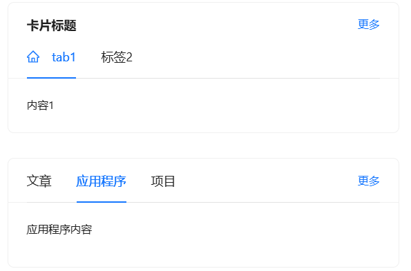

## Card卡片

通用卡片容器

## 何时使用 [#](https://antdv.com/components/card-cn#何时使用)

最基础的卡片容器，可承载文字、列表、图片、段落，常用于后台概览页面。

## 代码演示

### 1.简洁卡片


```vue
<template>
	<!-- 使用 a-card 组件创建一个宽度为 300px 的卡片，并设置标题 -->
	<a-card style="width: 300px">
		<!-- 卡片内容：三段文本内容 -->
		<p>卡片内容</p>
		<p>卡片内容</p>
		<p>卡片内容</p>
	</a-card>
</template>

<script setup>
	// 此处无需导入额外的依赖或定义方法，因为组件已经自包含。
</script>

<!-- 可选：如果你需要在 <style> 标签中添加样式，可以在这里添加 -->
<style scoped></style>
```


### 2.基础卡片


```vue
<template>
	<!-- 默认大小的卡片 -->
	<a-card title="默认大小卡片" style="width: 300px">
		<!-- 使用 #extra 插槽定义卡片右上角的额外操作链接 -->
		<template #extra>
			<a href="#">更多</a>
		</template>

		<!-- 卡片内容 -->
		<p>卡片内容</p>
		<p>卡片内容</p>
		<p>卡片内容</p>
	</a-card>
	<br />

	<!-- 小尺寸的卡片 -->
	<a-card size="small" title="小尺寸卡片" style="width: 300px">
		<!-- 使用 #extra 插槽定义卡片右上角的额外操作链接 -->
		<template #extra>
			<a href="#">更多</a>
		</template>

		<!-- 卡片内容 -->
		<p>卡片内容</p>
		<p>卡片内容</p>
		<p>卡片内容</p>
	</a-card>
</template>

<script setup>
	// 此处无需导入额外的依赖或定义方法，因为组件已经自包含。
</script>

<!-- 可选：如果你需要在 <style> 标签中添加样式，可以在这里添加 -->
<style scoped></style>
```

### 3.栅格卡片


```vue
<template>
	<!-- 使用 div 容器设置背景颜色和内边距 -->
	<div style="background-color: #ececec; padding: 20px">
		<!-- 使用 a-row 组件创建一行布局，并通过 :gutter 属性设置列之间的间距 -->
		<a-row :gutter="16">
			<!-- 第一列：使用 a-col 组件设置栅格宽度为 8（占总宽度的 1/3）,（Ant Design 的栅格系统默认分为 24 栅格） -->
			<a-col :span="8">
				<!-- 卡片组件，设置标题为 "卡片标题" 并禁用边框 -->
				<a-card title="卡片标题" :bordered="false">
					<p>卡片内容</p>
				</a-card>
			</a-col>

			<!-- 第二列：使用 a-col 组件设置栅格宽度为 8（占总宽度的 1/3） -->
			<a-col :span="8">
				<!-- 卡片组件，设置标题为 "卡片标题" 并禁用边框 -->
				<a-card title="卡片标题" :bordered="false">
					<p>卡片内容</p>
				</a-card>
			</a-col>

			<!-- 第三列：使用 a-col 组件设置栅格宽度为 8（占总宽度的 1/3） -->
			<a-col :span="8">
				<!-- 卡片组件，设置标题为 "卡片标题" 并禁用边框 -->
				<a-card title="卡片标题" :bordered="false">
					<p>卡片内容</p>
				</a-card>
			</a-col>
		</a-row>
	</div>
</template>

<script setup>
	// 此处无需导入额外的依赖或定义方法，因为组件已经自包含。
</script>

<!-- 可选：如果你需要在 <style> 标签中添加样式，可以在这里添加 -->
<style scoped></style>
```

### 4.网格卡片


```vue
<template>
	<!-- 使用 a-card 组件创建一个带有标题 "卡片标题" 的卡片 -->
	<a-card title="卡片标题">
		<!-- 使用 a-card-grid 组件创建多个网格，每个网格占据 25% 的宽度，文本内容居中对齐 -->
		<a-card-grid style="width: 25%; text-align: center">Content</a-card-grid>

		<!-- 禁用悬停效果的网格 -->
		<a-card-grid style="width: 25%; text-align: center" :hoverable="false">内容</a-card-grid>
		<a-card-grid style="width: 25%; text-align: center">内容</a-card-grid>
		<a-card-grid style="width: 25%; text-align: center">内容</a-card-grid>
		<a-card-grid style="width: 25%; text-align: center">内容</a-card-grid>
		<a-card-grid style="width: 25%; text-align: center">内容</a-card-grid>
		<a-card-grid style="width: 25%; text-align: center">内容</a-card-grid>
		<a-card-grid style="width: 25%; text-align: center">内容</a-card-grid>
	</a-card>
</template>

<script setup>
	// 此处无需导入额外的依赖或定义方法，因为组件已经自包含。
</script>

<!-- 可选：如果你需要在 <style> 标签中添加样式，可以在这里添加 -->
<style scoped></style>
```

### 5.封面头像卡片


```vue
<template>
	<!-- 使用 a-card 组件创建一个宽度为 300px 的卡片，并启用悬停效果 -->
	<a-card hoverable style="width: 300px">
		<!-- 使用 #cover 插槽定义卡片的封面图片 -->
		<template #cover>
			
		</template>

		<!-- 使用 #actions 插槽定义卡片底部的操作按钮 -->
		<template #actions>
			<!-- 操作按钮：设置 -->
			<setting-outlined key="setting" />
			<!-- 操作按钮：编辑 -->
			<edit-outlined key="edit" />
			<!-- 操作按钮：更多 -->
			<ellipsis-outlined key="ellipsis" />
		</template>

		<!-- 使用 a-card-meta 组件定义卡片的元数据，包括标题和描述 -->
		<a-card-meta title="卡片标题" description="这是描述内容">
			<!-- 使用 #avatar 插槽定义卡片的头像 -->
			<template #avatar>
				<a-avatar src="../../../public/favicon.ico" />
			</template>
		</a-card-meta>
	</a-card>
</template>

<script setup>
	// 导入所需的图标组件
	import { SettingOutlined, EditOutlined, EllipsisOutlined } from '@ant-design/icons-vue';

	// 此处无需定义额外的方法或响应式变量，因为组件已经自包含。
</script>

<!-- 可选：如果你需要在 <style> 标签中添加样式，可以在这里添加 -->
<style scoped></style>
```

### 6.标签页卡片



```vue
<template>
	<!-- 第一个 a-card 组件，设置宽度为100%，并指定了标题和标签列表 -->
	<a-card style="width: 100%" title="卡片标题" :tab-list="tabList" :active-tab-key="key" @tabChange="(key) => onTabChange(key, 'key')">
		<!-- 自定义标签模板，仅当标签key为 'tab1' 时显示 Home 图标, customItem 是 tabList 中的一个对象, 可以覆盖默认行为 -->
		<template #customTab="customItem">
			<span v-if="customItem.key === 'tab1'">
				<home-outlined />
				{{ customItem.tab }}
			</span>
		</template>

		<!-- 卡片额外的操作链接 -->
		<template #extra>
			<a href="#">更多</a>
		</template>

		<!-- 动态显示与当前激活标签对应的tab内容 -->
		{{ contentList[key] }}
	</a-card>
	<br />
	<br />

	<!-- 第二个 a-card 组件，不设置标题，但有标签列表 -->
	<a-card style="width: 100%" :tab-list="tabListNoTitle" :active-tab-key="noTitleKey" @tabChange="(key) => onTabChange(key, 'noTitleKey')">
		<!-- 根据 noTitleKey 的值显示不同的内容 -->
		<p v-if="noTitleKey === 'article'">文章内容</p>
		<p v-else-if="noTitleKey === 'app'">应用程序内容</p>
		<p v-else>项目内容</p>

		<!-- 在标签栏右侧显示额外内容 -->
		<template #tabBarExtraContent>
			<a href="#">更多</a>
		</template>
	</a-card>
</template>
<script setup>
	import { ref } from 'vue';
	// 导入所需的图标组件（例如 HomeOutlined）
	import { HomeOutlined } from '@ant-design/icons-vue';

	// 使用 ref 创建响应式变量 key 和 noTitleKey 来跟踪当前激活的标签
	const key = ref('tab1');
	const noTitleKey = ref('app');

	// 定义标签列表，每个对象包含 key 和 tab 属性
	const tabList = [
		{ key: 'tab1', tab: '标签1' },
		{ key: 'tab2', tab: '标签2' },
	];

	// 定义与标签对应的卡片内容
	const contentList = {
		tab1: '内容1',
		tab2: '内容2',
	};

	// 定义无标题的标签列表
	const tabListNoTitle = [
		{ key: 'article', tab: '文章' },
		{ key: 'app', tab: '应用程序' },
		{ key: 'project', tab: '项目' },
	];

	// 定义标签切换处理函数
	const onTabChange = (value, type) => {
		console.log(value, type); // 打印选择的标签键和类型以供调试

		// 根据传入的类型更新相应的激活标签键
		if (type === 'key') {
			key.value = value;
		} else if (type === 'noTitleKey') {
			noTitleKey.value = value;
		}
	};
</script>
```

