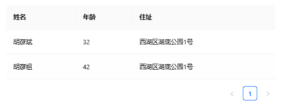
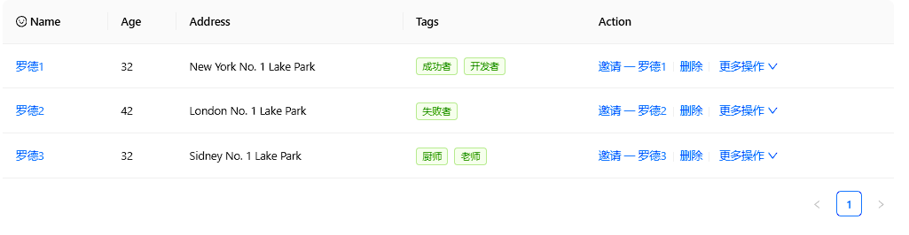
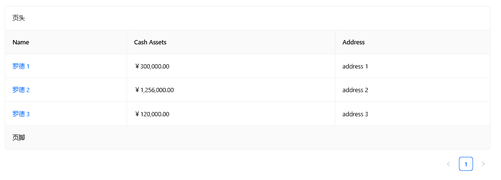
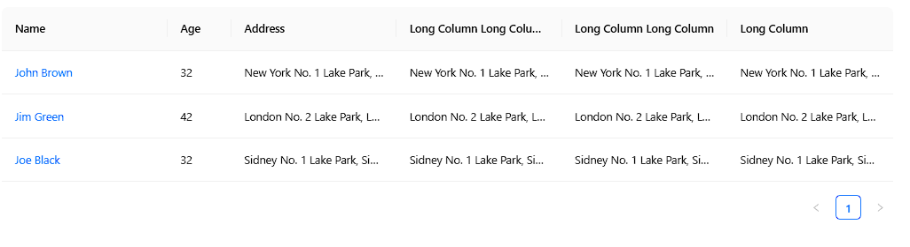
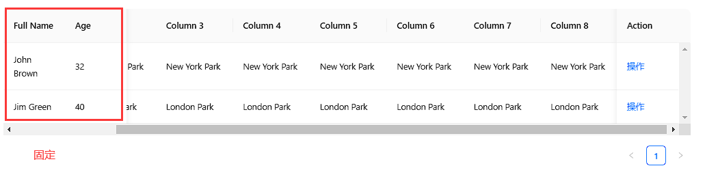
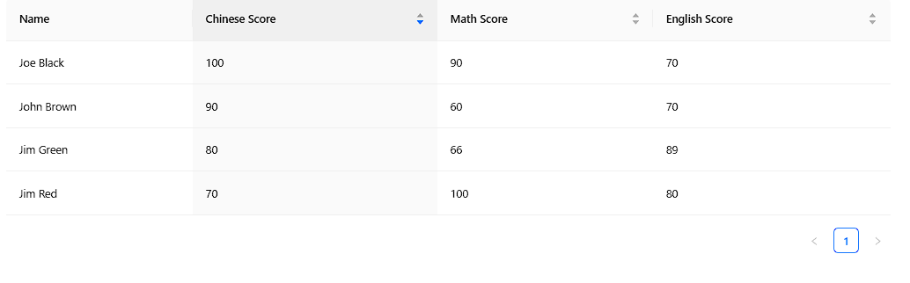
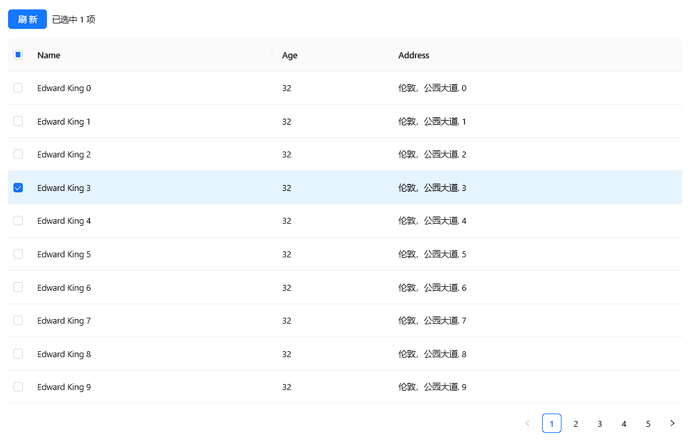
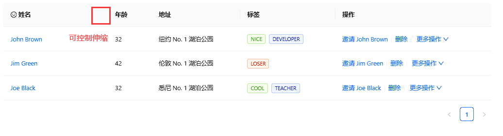
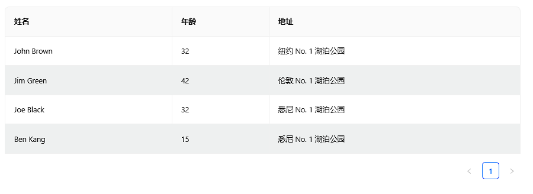

## Table 表格

展示行列数据。

## 何时使用 [#](https://antdv.com/components/table-cn#何时使用)

- 当有大量结构化的数据需要展现时；
- 当需要对数据进行排序、搜索、分页、自定义操作等复杂行为时。

## 代码演示

### 1.简单表格



```vue
<template>
	<!-- 使用 a-table 组件创建表格
        dataSource: 实际的数据行
        columns: 表格标题等配置
    -->
	<a-table :data-source="dataSource" :columns="columns" />
</template>

<script setup>
	// 导入所需的 Vue API 函数（如果需要）
	import { ref } from 'vue';

	// 数据源：定义表格中实际的数据行
	const dataSource = ref([
		{ key: '1', name: '胡彦斌', age: 32, address: '西湖区湖底公园1号' },
		{ key: '2', name: '胡彦祖', age: 42, address: '西湖区湖底公园1号' },
	]);

	// 表格列配置：定义表格的列标题、数据索引等信息
	const columns = [
		{ title: '姓名', dataIndex: 'name', key: 'name' },
		{ title: '年龄', dataIndex: 'age', key: 'age' },
		{ title: '住址', dataIndex: 'address', key: 'address' },
	];
</script>

<style scoped>
	/* 这里可以添加样式 */
</style>
```

### 2.带编辑的表格



```vue
<template>
	<!-- 使用 a-table 组件创建表格
        dataSource: 实际的数据行
        columns: 表格标题等配置
    -->
	<a-table :columns="columns" :data-source="data">
		<!-- 自定义表头单元格内容, column是表格标题配置数据 -->
		<template #headerCell="{ column }">
			<template v-if="column.key === 'name'">
				<!-- 添加一个笑脸图标 -->
				<span>
					<SmileOutlined />
					Name
				</span>
			</template>
		</template>

		<!-- 自定义表格列内容, column是表格标题配置数据,record是行实际数据 -->
		<template #bodyCell="{ column, record }">
			<!-- name姓名列的自定义渲染 -->
			<template v-if="column.key === 'name'">
				<a>
					{{ record.name }}
				</a>
			</template>

			<!-- tags标签列的自定义渲染 -->
			<template v-else-if="column.key === 'tags'">
				<span>
					<!-- 遍历record.tags标签数组,动态设置标签color颜色,将标签文本转换为toUpperCase大写 -->
					<a-tag v-for="tag in record.tags" :key="tag" :color="getTagColor(tag)">
						{{ tag.toUpperCase() }}
					</a-tag>
				</span>
			</template>

			<!-- 操作列的自定义渲染 -->
			<template v-else-if="column.key === 'action'">
				<span>
					<!-- 邀请操作 -->
					<a>邀请 一 {{ record.name }}</a>
					<!-- 竖直分隔符 -->
					<a-divider type="vertical" />
					<!-- 删除操作 -->
					<a @click="deleteRecord(record.key)">删除</a>
					<!-- 竖直分隔符 -->
					<a-divider type="vertical" />
					<!-- 更多操作 -->
					<a class="ant-dropdown-link" @click="showMoreActions">
						更多操作
						<DownOutlined />
					</a>
				</span>
			</template>
		</template>
	</a-table>
</template>
<script setup>
	import { ref } from 'vue';
	import { SmileOutlined, DownOutlined } from '@ant-design/icons-vue'; // 导入 Ant Design 图标组件

	// 表格列配置：定义表格的列标题、数据索引等信息
	const columns = [
		{ name: 'Name', dataIndex: 'name', key: 'name' },
		{ title: 'Age', dataIndex: 'age', key: 'age' },
		{ title: 'Address', dataIndex: 'address', key: 'address' },
		{ title: 'Tags', key: 'tags', dataIndex: 'tags' },
		{ title: 'Action', key: 'action' },
	];

	// 数据源：定义表格中的数据行
	const data = [
		{ key: '1', name: '罗德1', age: 32, address: 'New York No. 1 Lake Park', tags: ['成功者', '开发者'] },
		{ key: '2', name: '罗德2', age: 42, address: 'London No. 1 Lake Park', tags: ['失败者'] },
		{ key: '3', name: '罗德3', age: 32, address: 'Sidney No. 1 Lake Park', tags: ['厨师', '老师'] },
	];

	// 获取标签颜色的方法
	const getTagColor = (tag) => {
		if (tag === 'loser') return 'volcano';
		if (tag.length > 5) return 'geekblue';
		return 'green';
	};

	// 删除记录的方法（模拟）
	const deleteRecord = (key) => {
		console.log(`删除记录 ${key}`);
		// 实际应用中可以在这里实现删除逻辑
	};

	// 显示更多操作的方法（模拟）
	const showMoreActions = () => {
		console.log('显示更多操作');
		// 实际应用中可以在这里实现显示更多操作的逻辑
	};
</script>

<style scoped>
	/* 这里可以添加样式 */
	.ant-dropdown-link {
		cursor: pointer;
	}
</style>
```

### 3.带边框的表格



```vue
<template>
	<!-- 使用 a-table 组件创建表格
        columns: 表格列配置
        row-key: 设置行键，确保每行数据唯一
        data-source: 数据源
        pagination: 分页配置
        loading: 加载状态
        change: 处理表格变化事件
    -->
	<a-table :columns="columns" :data-source="data" bordered>
		<!-- 自定义表格列内容, column是表格标题配置数据, text是行实际数据 -->
		<template #bodyCell="{ column, text }">
			<!-- name姓名列的自定义渲染 -->
			<template v-if="column.dataIndex === 'name'">
				<a>{{ text }}</a>
			</template>
		</template>

		<!-- 表格页头 -->
		<template #title>页头</template>
		<!-- 表格页脚 -->
		<template #footer>页脚</template>
	</a-table>
</template>
<script setup>
	// 表格列配置：定义表格的列标题、数据索引等信息
	// title: 列标题
	// dataIndex: 对应数据项中的字段名
	// className: 自定义样式类名，用于对齐方式调整
	const columns = [
		{ title: 'Name', dataIndex: 'name' },
		{ title: 'Cash Assets', className: 'column-money', dataIndex: 'money' },
		{ title: 'Address', dataIndex: 'address' },
	];

	// 数据源：定义表格中的数据行
	const data = [
		{ key: '1', name: '罗德 1', money: '￥300,000.00', address: 'address 1' },
		{ key: '2', name: '罗德 2', money: '￥1,256,000.00', address: 'address 2' },
		{ key: '3', name: '罗德 3', money: '￥120,000.00', address: 'address 3' },
	];
</script>

<style scoped>
	/* 样式作用范围仅限于当前组件 */
	th.column-money,
	td.column-money {
		text-align: right !important; /* 设置现金资产列的内容右对齐 */
	}
</style>
```

### 4.带省略符的表格



```vue
<template>
	<!-- 使用 a-table 组件创建表格
        columns: 表格列配置
        row-key: 设置行键，确保每行数据唯一
        data-source: 数据源
        pagination: 分页配置
        loading: 加载状态
        change: 处理表格变化事件
    -->
	<a-table :columns="columns" :data-source="data">
		<!-- 自定义表格列内容
            column: 表格标题配置数据
            record: 行实际数据
            text: 基于 column.dataIndex 从 record 中提取出来的具体字段值
        -->
		<template #bodyCell="{ column, text }">
			<!-- 姓名列的自定义渲染 -->
			<template v-if="column.dataIndex === 'name'">
				<a>{{ text }}</a>
			</template>
		</template>
	</a-table>
</template>
<script setup>
	// 表格列配置：定义表格的列标题、数据索引等信息
	// title: 列标题
	// dataIndex: 对应数据项中的字段名
	// className: 自定义样式类名，用于对齐方式调整
	// width:  设置该列的宽度
	// key:  每列的唯一标识符
	// ellipsis:  当内容超出时显示省略号
	const columns = [
		{
			title: 'Name',
			dataIndex: 'name',
			key: 'name',
		},
		{
			title: 'Age',
			dataIndex: 'age',
			key: 'age',
			width: 80,
		},
		{
			title: 'Address',
			dataIndex: 'address',
			key: 'address 1',
			ellipsis: true,
		},
		{
			title: 'Long Column Long Column Long Column',
			dataIndex: 'address',
			key: 'address 2',
			ellipsis: true,
		},
		{
			title: 'Long Column Long Column',
			dataIndex: 'address',
			key: 'address 3',
			ellipsis: true,
		},
		{
			title: 'Long Column',
			dataIndex: 'address',
			key: 'address 4',
			ellipsis: true,
		},
	];

	// 数据源：定义表格中的数据行
	const data = [
		{
			key: '1',
			name: 'John Brown',
			age: 32,
			address: 'New York No. 1 Lake Park, New York No. 1 Lake Park',
			tags: ['nice', 'developer'],
		},
		{
			key: '2',
			name: 'Jim Green',
			age: 42,
			address: 'London No. 2 Lake Park, London No. 2 Lake Park',
			tags: ['loser'],
		},
		{
			key: '3',
			name: 'Joe Black',
			age: 32,
			address: 'Sidney No. 1 Lake Park, Sidney No. 1 Lake Park',
			tags: ['cool', 'teacher'],
		},
	];
</script>

<style scoped></style>
```

### 5.固定列移动的表格



```vue
<template>
	<!-- 使用 a-table 组件创建表格
        columns: 表格列配置
        row-key: 设置行键，确保每行数据唯一
        data-source: 数据源
        pagination: 分页配置
        loading: 加载状态
        change: 处理表格变化事件
        bordered: 有边的
    -->
	<a-table :columns="columns" :data-source="data" :scroll="{ x: 1300, y: 1000 }">
		<!-- 自定义表格列内容
            column: 表格标题配置数据
            record: 行实际数据
            text: 基于 column.dataIndex 从 record 中提取出来的具体字段值
        -->
		<template #bodyCell="{ column }">
			<!-- 当列名是 'operation' 时，显示操作链接 -->
			<template v-if="column.key === 'operation'">
				<a>操作</a>
			</template>
		</template>
	</a-table>
</template>

<script setup>
	// 表格列配置：定义表格的列标题、数据索引等信息
	// title: 列标题
	// dataIndex: 对应数据项中的字段名
	// className: 自定义样式类名，用于对齐方式调整
	// width: 设置该列的宽度
	// key: 每列的唯一标识符
	// ellipsis: 当内容超出时显示省略号
	// fixed: 固定在左(left)/右(right)侧
	const columns = [
		{
			title: 'Full Name',
			width: 100,
			dataIndex: 'name',
			key: 'name',
			fixed: 'left',
		},
		{
			title: 'Age',
			width: 100,
			dataIndex: 'age',
			key: 'age',
			fixed: 'left',
		},
		{
			title: 'Column 1',
			dataIndex: 'address',
			key: '1',
		},
		{
			title: 'Column 2',
			dataIndex: 'address',
			key: '2',
		},
		{
			title: 'Column 3',
			dataIndex: 'address',
			key: '3',
		},
		{
			title: 'Column 4',
			dataIndex: 'address',
			key: '4',
		},
		{
			title: 'Column 5',
			dataIndex: 'address',
			key: '5',
		},
		{
			title: 'Column 6',
			dataIndex: 'address',
			key: '6',
		},
		{
			title: 'Column 7',
			dataIndex: 'address',
			key: '7',
		},
		{
			title: 'Column 8',
			dataIndex: 'address',
			key: '8',
		},
		{
			title: 'Action',
			key: 'operation',
			fixed: 'right',
			width: 100,
		},
	];

	// 数据源，即表格中展示的数据列表
	const data = [
		{
			key: '1',
			name: 'John Brown',
			age: 32,
			address: 'New York Park',
		},
		{
			key: '2',
			name: 'Jim Green',
			age: 40,
			address: 'London Park',
		},
	];
</script>

<style scoped></style>
```

### 6.带排序的表格



```vue
<template>
	<!-- 使用 a-table 组件创建表格
        columns: 表格列配置
        row-key: 设置行键，确保每行数据唯一
        data-source: 数据源
        pagination: 分页配置
        loading: 加载状态
        change: 处理表格变化事件
        bordered: 有边的
    -->
	<a-table :columns="columns" :data-source="data" @change="onChange" />
</template>

<script setup>
	// 表格列配置：定义表格的列标题、数据索引等信息
	// title: 列标题
	// dataIndex: 对应数据项中的字段名
	// className: 自定义样式类名，用于对齐方式调整
	// width: 设置该列的宽度
	// key: 每列的唯一标识符
	// ellipsis: 当内容超出时显示省略号
	// fixed: 固定在左(left)/右(right)侧
	// sorter: 排序器配置(只能对当前加载的数据排序, 分页排序接口本身控制)
	const columns = [
		{
			title: 'Name',
			dataIndex: 'name',
		},
		{
			title: 'Chinese Score',
			dataIndex: 'chinese',
			sorter: {
				// 排序器配置
				compare: (a, b) => a.chinese - b.chinese, // 比较函数，用于确定两个项目的相对顺序
				multiple: 3, // 排序优先级（数字越大，优先级越高）
			},
		},
		{
			title: 'Math Score',
			dataIndex: 'math',
			sorter: {
				// 排序器配置
				compare: (a, b) => a.chinese - b.chinese, // 比较函数，用于确定两个项目的相对顺序
				multiple: 2, // 排序优先级（数字越大，优先级越高）
			},
		},
		{
			title: 'English Score',
			dataIndex: 'english',
			sorter: {
				// 排序器配置
				compare: (a, b) => a.chinese - b.chinese, // 比较函数，用于确定两个项目的相对顺序
				multiple: 1, // 排序优先级（数字越大，优先级越高）
			},
		},
	];
	const data = [
		{
			key: '1',
			name: 'John Brown',
			chinese: 90,
			math: 60,
			english: 70,
		},
		{
			key: '2',
			name: 'Jim Green',
			chinese: 80,
			math: 66,
			english: 89,
		},
		{
			key: '3',
			name: 'Joe Black',
			chinese: 100,
			math: 90,
			english: 70,
		},
		{
			key: '4',
			name: 'Jim Red',
			chinese: 70,
			math: 100,
			english: 80,
		},
	];

	// 当表格状态发生变化时触发此方法，例如分页、筛选或排序变化
	// 参数说明：
	// pagination：分页信息对象，包含当前页码、总页数等信息。
	// filters：过滤条件对象，表示用户选择的过滤条件。
	// sorter：排序信息对象，包含排序字段及排序方向。
	// extra：额外信息对象，通常包含 action 属性，指示是哪种操作触发了变更。
	function onChange(pagination, filters, sorter, extra) {
		console.log('params:', pagination, filters, sorter, extra);
	}
</script>
```

### 7.带多选全选的表格



```vue
<template>
	<div>
		<!-- 操作按钮区域 -->
		<div style="margin-bottom: 16px">
			<!-- 加载数据按钮，只有当有选中行时disabled才可用，点击后触发start重新加载 -->
			<a-button type="primary" :disabled="!hasSelected" :loading="state.loading" @click="start"> 刷新 </a-button>
			<span style="margin-left: 8px">
				<!-- 当前选中的行数提示 -->
				<template v-if="hasSelected">
					{{ `已选中 ${state.selectedRowKeys.length} 项` }}
				</template>
			</span>
		</div>

		<!-- 使用 a-table 组件创建表格
        columns: 表格列配置
        row-key: 设置行键，确保每行数据唯一
        data-source: 数据源
        pagination: 分页配置
        loading: 加载状态
        change: 处理表格变化事件
        bordered: 有边的
        row-selection: 行选择功能
        row-selection.selectedRowKeys: 当前已经选中项的 key 数组，需要和 onChange 进行配合更新
        row-selection.onSelectChange: 选中项发生变化时的回调
		-->
		<a-table :row-selection="{ selectedRowKeys: state.selectedRowKeys, onChange: onSelectChange }" :columns="columns" :data-source="data"> </a-table>
	</div>
</template>
<script setup>
	import { computed, reactive } from 'vue';

	// 定义表格列配置
	const columns = [
		{ title: 'Name', dataIndex: 'name' },
		{ title: 'Age', dataIndex: 'age' },
		{ title: 'Address', dataIndex: 'address' },
	];

	// 初始化数据源，模拟从服务器获取的数据
	const data = [];
	for (let i = 0; i < 46; i++) {
		data.push({
			key: i, // 确保 key 是字符串类型
			name: `Edward King ${i}`,
			age: 32,
			address: `伦敦，公园大道. ${i}`,
		});
	}

	// 使用 reactive 创建响应式状态对象
	const state = reactive({
		selectedRowKeys: [], // 用于存储当前选中的行键值数组
		loading: false, // 表示是否正在加载数据的状态
	});

	// 计算属性，判断是否有选中行
	const hasSelected = computed(() => state.selectedRowKeys.length > 0);

	// 点击重新加载按钮后的处理函数
	const start = () => {
		state.loading = true; // 开始加载状态

		// 模拟异步操作（如 AJAX 请求），完成后重置加载状态和选中行
		setTimeout(() => {
			state.loading = false; // 操作完成后关闭加载状态
			state.selectedRowKeys = []; // 清空已选中的行
		}, 1000); // 这里用 setTimeout 模拟异步延迟
	};

	// 当表格行选择发生变化时调用此方法, selectedRowKeys是最新被选择的所有key
	const onSelectChange = (selectedRowKeys) => {
		console.log('选中的行键值发生了变化：', selectedRowKeys);
		state.selectedRowKeys = selectedRowKeys; // 更新选中的行键值
	};
</script>

<!-- 可选：如果你需要在 <style> 标签中添加样式，可以在这里添加 -->
<style scoped></style>
```

### 8.带伸缩的表格



```vue
<template>
	<!-- 使用 a-table 组件创建表格
        columns: 表格列配置
        row-key: 设置行键，确保每行数据唯一
        data-source: 数据源
        pagination: 分页配置
        loading: 加载状态
        change: 处理表格变化事件
        bordered: 有边的
        row-selection: 行选择功能
        row-selection.selectedRowKeys: 当前已经选中项的 key 数组，需要和 onChange 进行配合更新
        row-selection.onSelectChange: 选中项发生变化时的回调
        resizeColumn: 监听列调整事件
		-->
	<a-table :columns="columns" :data-source="data" @resizeColumn="handleResizeColumn">
		<!-- 自定义表头单元格内容渲染 -->
		<template #headerCell="{ column }">
			<template v-if="column.key === 'name'">
				<!-- 插入一个笑脸图标 -->
				<span>
					<SmileOutlined />
					姓名
				</span>
			</template>
		</template>

		<!-- 自定义表格列内容
            column: 表格标题配置数据
            record: 行实际数据
            text: 基于 column.dataIndex 从 record 中提取出来的具体字段值
        -->
		<template #bodyCell="{ column, record }">
			<template v-if="column.key === 'name'">
				<a>
					{{ record.name }}
				</a>
			</template>

			<template v-else-if="column.key === 'tags'">
				<span>
					<!-- 根据标签内容设置不同颜色 -->
					<a-tag v-for="tag in record.tags" :key="tag" :color="tag === 'loser' ? 'volcano' : tag.length > 5 ? 'geekblue' : 'green'">
						{{ tag.toUpperCase() }}
					</a-tag>
				</span>
			</template>

			<template v-else-if="column.key === 'action'">
				<span>
					<!-- 操作链接：邀请、删除、更多操作 -->
					<a>邀请 {{ record.name }}</a>
					<a-divider type="vertical" />
					<a @click="onDelete(record)">删除</a>
					<a-divider type="vertical" />
					<a class="ant-dropdown-link">
						更多操作
						<DownOutlined />
					</a>
				</span>
			</template>
		</template>
	</a-table>
</template>

<script setup>
	import { ref } from 'vue';
	// 引入 Ant Design Vue 组件（假设这些已经在项目中安装）
	import { SmileOutlined, DownOutlined } from '@ant-design/icons-vue';

	// 数据源，即表格中展示的数据列表
	const data = [
		{
			key: '1',
			name: 'John Brown',
			age: 32,
			address: '纽约 No. 1 湖泊公园',
			tags: ['nice', 'developer'],
		},
		{
			key: '2',
			name: 'Jim Green',
			age: 42,
			address: '伦敦 No. 1 湖泊公园',
			tags: ['loser'],
		},
		{
			key: '3',
			name: 'Joe Black',
			age: 32,
			address: '悉尼 No. 1 湖泊公园',
			tags: ['cool', 'teacher'],
		},
	];

	// 表格列配置：定义表格的列标题、数据索引等信息
	// title: 列标题
	// dataIndex: 对应数据项中的字段名
	// className: 自定义样式类名，用于对齐方式调整
	// width: 设置该列的宽度
	// key: 每列的唯一标识符
	// ellipsis: 当内容超出时显示省略号
	// fixed: 固定在左(left)/右(right)侧
	// sorter: 排序器配置(只能对当前加载的数据排序, 分页排序接口本身控制)
	// resizable: 允许调整列宽
	// minWidth: 最小宽度
	// maxWidth: 最大宽度
	const columns = ref([
		{
			dataIndex: 'name',
			key: 'name',
			resizable: true, // 允许调整列宽
			width: 150, // 初始宽度
		},
		{
			title: '年龄',
			dataIndex: 'age',
			key: 'age',
			resizable: true,
			width: 100,
			minWidth: 100, // 最小宽度
			maxWidth: 200, // 最大宽度
		},
		{
			title: '地址',
			dataIndex: 'address',
			key: 'address',
		},
		{
			title: '标签',
			key: 'tags',
			dataIndex: 'tags',
		},
		{
			title: '操作',
			key: 'action',
		},
	]);

	// 当用户调整列宽时触发此方法
	function handleResizeColumn(w, col) {
		console.log('调整后的宽度:', w);
		col.width = w; // 更新列宽
	}

	// 删除功能示例（假设需要实现）
	function onDelete(record) {
		console.log('删除记录:', record);
		// 实现删除逻辑...
	}
</script>

<!-- 可选：如果你需要在 <style> 标签中添加样式，可以在这里添加 -->
<style scoped></style>
```

### 9.带斑马纹的表格



```vue
<template>
	<!-- 使用 a-table 组件创建表格
        columns: 表格列配置
        row-key: 设置行键，确保每行数据唯一
        data-source: 数据源
        pagination: 分页配置
        loading: 加载状态
        change: 处理表格变化事件
        bordered: 有边的
        row-selection: 行选择功能
        row-selection.selectedRowKeys: 当前已经选中项的 key 数组，需要和 onChange 进行配合更新
        row-selection.onSelectChange: 选中项发生变化时的回调
        resizeColumn: 监听列调整事件
        size: 表格大小(large | middle | small)
		-->
	<a-table class="ant-table-striped" size="large" :columns="columns" :data-source="data" :row-class-name="(_record, index) => (index % 2 === 1 ? 'table-striped' : null)" bordered />
</template>

<script setup>
	// 定义表格的列信息
	const columns = [
		{
			title: '姓名',
			dataIndex: 'name', // 数据字段名，用于从数据源中获取显示值
		},
		{
			title: '年龄',
			dataIndex: 'age',
		},
		{
			title: '地址',
			dataIndex: 'address',
		},
	];

	// 数据源，即表格中展示的数据列表
	const data = [
		{
			key: '1',
			name: 'John Brown',
			age: 32,
			address: '纽约 No. 1 湖泊公园',
		},
		{
			key: '2',
			name: 'Jim Green',
			age: 42,
			address: '伦敦 No. 1 湖泊公园',
		},
		{
			key: '3',
			name: 'Joe Black',
			age: 32,
			address: '悉尼 No. 1 湖泊公园',
		},
		{
			key: '4',
			name: 'Ben Kang',
			age: 15,
			address: '悉尼 No. 1 湖泊公园',
		},
	];
</script>

<style scoped>
	/* 默认主题下的条纹背景 */
	.ant-table-striped :deep(.table-striped) td {
		background-color: #dee2e286; /* 浅色背景 */
	}
</style>
```

## API[#](https://antdv.com/components/table-cn#api)

\#

### Table [#](https://antdv.com/components/table-cn#table)

| 参数                     | 说明                                                         | 类型                                                         | 默认值                                                       | 版本  |
| :----------------------- | :----------------------------------------------------------- | :----------------------------------------------------------- | :----------------------------------------------------------- | :---- |
| bodyCell                 | 个性化单元格                                                 | v-slot:bodyCell="{text, record, index, column}"              | -                                                            | 3.0   |
| bordered                 | 是否展示外边框和列边框                                       | boolean                                                      | false                                                        |       |
| childrenColumnName       | 指定树形结构的列名                                           | string                                                       | `children`                                                   |       |
| columns                  | 表格列的配置描述，具体项见[下表](https://antdv.com/components/table-cn#column) | array                                                        | -                                                            |       |
| components               | 覆盖默认的 table 元素                                        | object                                                       | -                                                            |       |
| customFilterDropdown     | 自定义筛选菜单，需要配合 `column.customFilterDropdown` 使用  | v-slot:customFilterDropdown="[FilterDropdownProps](https://antdv.com/components/table-cn#filterdropdownprops)" | -                                                            | 3.0   |
| customFilterIcon         | 自定义筛选图标                                               | v-slot:customFilterIcon="{filtered, column}"                 | -                                                            | 3.0   |
| customHeaderRow          | 设置头部行属性                                               | Function(columns, index)                                     | -                                                            |       |
| customRow                | 设置行属性                                                   | Function(record, index)                                      | -                                                            |       |
| dataSource               | 数据数组                                                     | object[]                                                     |                                                              |       |
| defaultExpandAllRows     | 初始时，是否展开所有行                                       | boolean                                                      | false                                                        |       |
| defaultExpandedRowKeys   | 默认展开的行                                                 | string[]                                                     | -                                                            |       |
| emptyText                | 自定义空数据时的显示内容                                     | v-slot:emptyText                                             | -                                                            | 3.0   |
| expandedRowKeys(v-model) | 展开的行，控制属性                                           | string[]                                                     | -                                                            |       |
| expandedRowRender        | 额外的展开行                                                 | Function(record, index, indent, expanded):VNode \| v-slot:expandedRowRender="{record, index, indent, expanded}" | -                                                            |       |
| expandFixed              | 控制展开图标是否固定，可选 true `left` `right`               | boolean \| string                                            | false                                                        | 3.0   |
| expandColumnTitle        | 自定义展开列表头                                             | v-slot                                                       | -                                                            | 4.0.0 |
| expandIcon               | 自定义展开图标                                               | Function(props):VNode \| v-slot:expandIcon="props"           | -                                                            |       |
| expandRowByClick         | 通过点击行来展开子行                                         | boolean                                                      | `false`                                                      |       |
| footer                   | 表格尾部                                                     | Function(currentPageData)\|v-slot:footer="currentPageData"   |                                                              |       |
| getPopupContainer        | 设置表格内各类浮层的渲染节点，如筛选菜单                     | (triggerNode) => HTMLElement                                 | `() => TableHtmlElement`                                     | 1.5.0 |
| headerCell               | 个性化头部单元格                                             | v-slot:headerCell="{title, column}"                          | -                                                            | 3.0   |
| indentSize               | 展示树形数据时，每层缩进的宽度，以 px 为单位                 | number                                                       | 15                                                           |       |
| loading                  | 页面是否加载中                                               | boolean\|[object](https://antdv.com/components/spin-cn)      | false                                                        |       |
| locale                   | 默认文案设置，目前包括排序、过滤、空数据文案                 | object                                                       | filterConfirm: `确定` filterReset: `重置` emptyText: `暂无数据` |       |
| pagination               | 分页器，参考[配置项](https://antdv.com/components/table-cn#pagination)或 [pagination](https://antdv.com/components/pagination-cn/)文档，设为 false 时不展示和进行分页 | object \| `false`                                            |                                                              |       |
| rowClassName             | 表格行的类名                                                 | Function(record, index):string                               | -                                                            |       |
| rowExpandable            | 设置是否允许行展开                                           | (record) => boolean                                          | -                                                            | 3.0   |
| rowKey                   | 表格行 key 的取值，可以是字符串或一个函数                    | string\|Function(record):string                              | 'key'                                                        |       |
| rowSelection             | 列表项是否可选择，[配置项](https://antdv.com/components/table-cn#rowselection) | object                                                       | null                                                         |       |
| scroll                   | 表格是否可滚动，也可以指定滚动区域的宽、高，[配置项](https://antdv.com/components/table-cn#scroll) | object                                                       | -                                                            |       |
| showExpandColumn         | 设置是否展示行展开列                                         | boolean                                                      | true                                                         | 3.0   |
| showHeader               | 是否显示表头                                                 | boolean                                                      | true                                                         |       |
| showSorterTooltip        | 表头是否显示下一次排序的 tooltip 提示。当参数类型为对象时，将被设置为 Tooltip 的属性 | boolean \| [Tooltip props](https://antdv.com/components/tooltip/) | true                                                         | 3.0   |
| size                     | 表格大小                                                     | `large` | `middle` | `small`                                 | `large`                                                      |       |
| sortDirections           | 支持的排序方式，取值为 `ascend` `descend`                    | Array                                                        | [`ascend`, `descend`]                                        |       |
| sticky                   | 设置粘性头部和滚动条                                         | boolean \| `{offsetHeader?: number, offsetScroll?: number, getContainer?: () => HTMLElement}` | -                                                            | 3.0   |
| summary                  | 总结栏                                                       | v-slot:summary                                               | -                                                            | 3.0   |
| tableLayout              | 表格元素的 [table-layout](https://developer.mozilla.org/zh-CN/docs/Web/CSS/table-layout) 属性，设为 `fixed` 表示内容不会影响列的布局 | - \| 'auto' \| 'fixed'                                       | 无固定表头/列或使用了 `column.ellipsis` 时，默认值为 `fixed` | 1.5.0 |
| title                    | 表格标题                                                     | Function(currentPageData)\|v-slot:title="currentPageData"    |                                                              |       |
| transformCellText        | 数据渲染前可以再次改变，一般用于空数据的默认配置，可以通过 [ConfigProvider](https://antdv.com/components/config-provider-cn/) 全局统一配置 | Function({ text, column, record, index }) => any，此处的 text 是经过其它定义单元格 api 处理后的数据，有可能是 VNode \| string \| number 类型 | -                                                            | 1.5.4 |

### 事件 [#](https://antdv.com/components/table-cn#事件)

| 事件名称           | 说明                       | 回调参数                                                     |
| :----------------- | :------------------------- | :----------------------------------------------------------- |
| change             | 分页、排序、筛选变化时触发 | Function(pagination, filters, sorter, { action, currentDataSource }) |
| expand             | 点击展开图标时触发         | Function(expanded, record)                                   |
| expandedRowsChange | 展开的行变化时触发         | Function(expandedRows)                                       |
| resizeColumn       | 拖动列时触发               | Function(width, column)                                      |

### Column [#](https://antdv.com/components/table-cn#column)

列描述数据对象，是 columns 中的一项，Column 使用相同的 API。

| 参数                              | 说明                                                         | 类型                                                         | 默认值                  | 版本                       |
| :-------------------------------- | :----------------------------------------------------------- | :----------------------------------------------------------- | :---------------------- | :------------------------- |
| align                             | 设置列的对齐方式                                             | `left` | `right` | `center`                                  | `left`                  |                            |
| colSpan                           | 表头列合并,设置为 0 时，不渲染                               | number                                                       |                         |                            |
| customCell                        | 设置单元格属性                                               | Function(record, rowIndex, column)                           | -                       | column add from 3.0        |
| customFilterDropdown              | 启用 v-slot:customFilterDropdown，优先级低于 filterDropdown  | boolean                                                      | false                   | 3.0                        |
| customHeaderCell                  | 设置头部单元格属性                                           | Function(column)                                             | -                       |                            |
| customRender                      | 生成复杂数据的渲染函数，参数分别为当前行的值，当前行数据，行索引 | Function({text, record, index, column}) {}                   | -                       |                            |
| dataIndex                         | 列数据在数据项中对应的路径，支持通过数组查询嵌套路径         | string \| string[]                                           | -                       |                            |
| defaultFilteredValue              | 默认筛选值                                                   | string[]                                                     | -                       | 1.5.0                      |
| filterResetToDefaultFilteredValue | 点击重置按钮的时候，是否恢复默认筛选值                       | boolean                                                      | false                   | 3.3.0                      |
| defaultSortOrder                  | 默认排序顺序                                                 | `ascend` | `descend`                                         | -                       |                            |
| ellipsis                          | 超过宽度将自动省略，暂不支持和排序筛选一起使用。 设置为 `true` 或 `{ showTitle?: boolean }` 时，表格布局将变成 `tableLayout="fixed"`。 | boolean \| { showTitle?: boolean }                           | false                   | 3.0                        |
| filterDropdown                    | 可以自定义筛选菜单，此函数只负责渲染图层，需要自行编写各种交互 | VNode \| (props: FilterDropdownProps) => VNode               | -                       |                            |
| filterDropdownOpen                | 用于控制自定义筛选菜单是否可见                               | boolean                                                      | -                       |                            |
| filtered                          | 标识数据是否经过过滤，筛选图标会高亮                         | boolean                                                      | false                   |                            |
| filteredValue                     | 筛选的受控属性，外界可用此控制列的筛选状态，值为已筛选的 value 数组 | string[]                                                     | -                       |                            |
| filterIcon                        | 自定义 filter 图标。                                         | VNode \| ({filtered: boolean, column: Column}) => vNode      | false                   |                            |
| filterMode                        | 指定筛选菜单的用户界面                                       | 'menu' \| 'tree'                                             | 'menu'                  | 3.0                        |
| filterMultiple                    | 是否多选                                                     | boolean                                                      | true                    |                            |
| filters                           | 表头的筛选菜单项                                             | object[]                                                     | -                       |                            |
| filterSearch                      | 筛选菜单项是否可搜索                                         | boolean \| function(input, filter):boolean                   | false                   | boolean:3.0 function:3.3.0 |
| fixed                             | 列是否固定，可选 `true`(等效于 left) `'left'` `'right'`      | boolean\|string                                              | false                   |                            |
| key                               | Vue 需要的 key，如果已经设置了唯一的 `dataIndex`，可以忽略这个属性 | string                                                       | -                       |                            |
| maxWidth                          | 拖动列最大宽度，会受到表格自动调整分配宽度影响               | number                                                       | -                       | 3.0                        |
| minWidth                          | 拖动列最小宽度，会受到表格自动调整分配宽度影响               | number                                                       | 50                      | 3.0                        |
| resizable                         | 是否可拖动调整宽度，此时 width 必须是 number 类型            | boolean                                                      | -                       | 3.0                        |
| responsive                        | 响应式 breakpoint 配置列表。未设置则始终可见。               | [Breakpoint](https://antdv.com/components/table-cn#breakpoint)[] | -                       | 3.0                        |
| rowScope                          | 设置列范围                                                   | `row` | `rowgroup`                                           | -                       | 4.0                        |
| showSorterTooltip                 | 表头显示下一次排序的 tooltip 提示, 覆盖 table 中 `showSorterTooltip` | boolean \| [Tooltip props](https://antdv.com/components/tooltip/#api) | true                    |                            |
| sortDirections                    | 支持的排序方式，取值为 `'ascend'` `'descend'`                | Array                                                        | `['ascend', 'descend']` | 1.5.0                      |
| sorter                            | 排序函数，本地排序使用一个函数(参考 [Array.sort](https://developer.mozilla.org/en-US/docs/Web/JavaScript/Reference/Global_Objects/Array/sort) 的 compareFunction)，需要服务端排序可设为 true | Function\|boolean                                            | -                       |                            |
| sortOrder                         | 排序的受控属性，外界可用此控制列的排序，可设置为 `'ascend'` `'descend'` `null` | string                                                       | -                       |                            |
| title                             | 列头显示文字                                                 | string                                                       | -                       |                            |
| width                             | 列宽度                                                       | string\|number                                               | -                       |                            |
| onFilter                          | 本地模式下，确定筛选的运行函数, 使用 template 或 jsx 时作为`filter`事件使用 | Function                                                     | -                       |                            |
| onFilterDropdownOpenChange        | 自定义筛选菜单可见变化时调用，使用 template 或 jsx 时作为`filterDropdownOpenChange`事件使用 | function(open) {}                                            | -                       | 4.0                        |

### ColumnGroup [#](https://antdv.com/components/table-cn#columngroup)

| 参数  | 说明         | 类型         | 默认值 |
| :---- | :----------- | :----------- | :----- |
| title | 列头显示文字 | string\|slot | -      |

### pagination [#](https://antdv.com/components/table-cn#pagination)

分页的配置项。

| 参数     | 说明                                                         | 类型  | 默认值          |
| :------- | :----------------------------------------------------------- | :---- | :-------------- |
| position | 指定分页显示的位置， 取值为`topLeft` | `topCenter` | `topRight` |`bottomLeft` | `bottomCenter` | `bottomRight` | Array | [`bottomRight`] |

更多配置项，请查看 [`Pagination`](https://antdv.com/components/pagination/)。

### rowSelection [#](https://antdv.com/components/table-cn#rowselection)

选择功能的配置。

| 参数                    | 说明                                                         | 类型                                                  | 默认值     | 版本 |
| :---------------------- | :----------------------------------------------------------- | :---------------------------------------------------- | :--------- | :--- |
| checkStrictly           | checkable 状态下节点选择完全受控（父子数据选中状态不再关联） | boolean                                               | true       | 3.0  |
| columnTitle             | 自定义列表选择框标题                                         | string\|VNode                                         | -          |      |
| columnWidth             | 自定义列表选择框宽度                                         | string\|number                                        | -          |      |
| fixed                   | 把选择框列固定在左边                                         | boolean                                               | -          |      |
| getCheckboxProps        | 选择框的默认属性配置                                         | Function(record)                                      | -          |      |
| hideDefaultSelections   | 去掉『全选』『反选』两个默认选项                             | boolean                                               | false      |      |
| hideSelectAll           | 隐藏全选勾选框与自定义选择项                                 | boolean                                               | false      | 3.0  |
| preserveSelectedRowKeys | 当数据被删除时仍然保留选项的 `key`                           | boolean                                               | -          | 3.0  |
| selectedRowKeys         | 指定选中项的 key 数组，需要和 onChange 进行配合              | string[]                                              | []         |      |
| selections              | 自定义选择项 [配置项](https://antdv.com/components/table-cn#selection), 设为 `true` 时使用默认选择项 | object[] \| boolean                                   | true       |      |
| type                    | 多选/单选，`checkbox` or `radio`                             | string                                                | `checkbox` |      |
| onChange                | 选中项发生变化时的回调                                       | Function(selectedRowKeys, selectedRows)               | -          |      |
| onSelect                | 用户手动选择/取消选择某列的回调                              | Function(record, selected, selectedRows, nativeEvent) | -          |      |
| onSelectAll             | 用户手动选择/取消选择所有列的回调                            | Function(selected, selectedRows, changeRows)          | -          |      |
| onSelectInvert          | 用户手动选择反选的回调                                       | Function(selectedRows)                                | -          |      |
| onSelectNone            | 用户清空选择的回调                                           | function()                                            | -          | 3.0  |

### scroll [#](https://antdv.com/components/table-cn#scroll)

| 参数                     | 说明                                                         | 类型                     | 默认值 |
| :----------------------- | :----------------------------------------------------------- | :----------------------- | :----- |
| scrollToFirstRowOnChange | 当分页、排序、筛选变化后是否滚动到表格顶部                   | boolean                  | -      |
| x                        | 设置横向滚动，也可用于指定滚动区域的宽，可以设置为像素值，百分比，true 和 ['max-content'](https://developer.mozilla.org/zh-CN/docs/Web/CSS/width#max-content) | string \| number \| true | -      |
| y                        | 设置纵向滚动，也可用于指定滚动区域的高，可以设置为像素值     | string \| number         | -      |

### selection [#](https://antdv.com/components/table-cn#selection)

自定义选择配置项

| 参数     | 说明                     | 类型                        | 默认值 |
| :------- | :----------------------- | :-------------------------- | :----- |
| key      | Vue 需要的 key，建议设置 | string                      | -      |
| text     | 选择项显示的文字         | string\|VNode               | -      |
| onSelect | 选择项点击回调           | Function(changeableRowKeys) | -      |

## 注意 [#](https://antdv.com/components/table-cn#注意)

在 Table 中，`dataSource` 和 `columns` 里的数据值都需要指定 `key` 值。对于 `dataSource` 默认将每列数据的 `key` 属性作为唯一的标识。

如果你的数据没有这个属性，务必使用 `rowKey` 来指定数据列的主键。若没有指定，控制台会出现缺少 key 的提示，表格组件也会出现各类奇怪的错误。

```jsx
// 比如你的数据主键是 uid
return <Table rowKey="uid" />;
// 或
return <Table rowKey={record => record.uid} />;
```

## FAQ [#](https://antdv.com/components/table-cn#faq)

### 如何在没有数据或只有一页数据时隐藏分页栏 [#](https://antdv.com/components/table-cn#如何在没有数据或只有一页数据时隐藏分页栏)

你可以设置 `pagination` 的 `hideOnSinglePage` 属性为 `true`。

### 表格过滤时会回到第一页？ [#](https://antdv.com/components/table-cn#表格过滤时会回到第一页？)

前端过滤时通常条目总数会减少，从而导致总页数小于筛选前的当前页数，为了防止当前页面没有数据，我们默认会返回第一页。

如果你在使用远程分页，很可能需要保持当前页面，你可以手动控制当前页面不变。

### 表格分页为何会出现 size 切换器？ [#](https://antdv.com/components/table-cn#表格分页为何会出现-size-切换器？)

自 `3.0` 起，Pagination 在 `total` 大于 50 条时会默认显示 size 切换器以提升用户交互体验。如果你不需要该功能，可以通过设置 `showSizeChanger` 为 `false` 来关闭。

### 固定列穿透到最上层该怎么办？ [#](https://antdv.com/components/table-cn#固定列穿透到最上层该怎么办？)

固定列通过 `z-index` 属性将其悬浮于非固定列之上，这使得有时候你会发现在 Table 上放置遮罩层时固定列会被透过的情况。为遮罩层设置更高的 `z-index` 覆盖住固定列即可。

