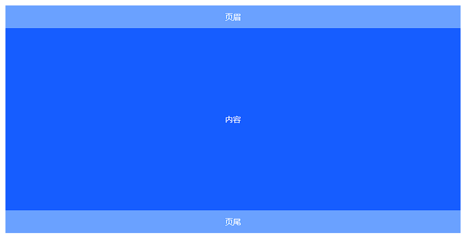
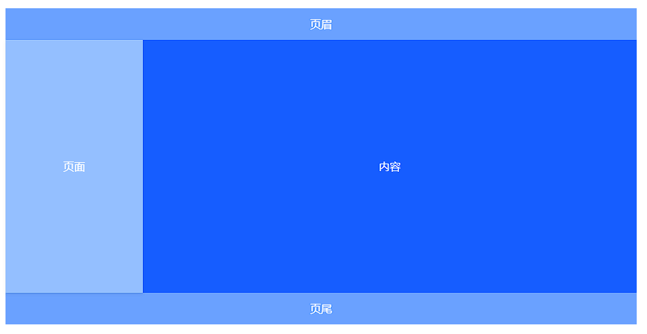
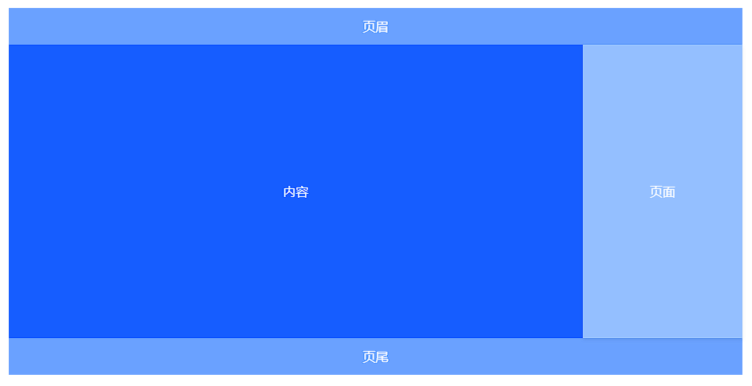

# 布局 Layout

页面的基础布局框架，常与组件嵌套使用，构建页面整体布局。

## 基础用法

典型的页面布局(一般来说页眉和页尾都是用不到的, 会使用空的)

1. 页眉-内容-页尾



```vue
<template>
	<!-- 定义了一个包含布局组件的div容器 -->
	<div class="layout-demo">
		<!-- 
        a-layout组件用于创建一个布局结构，通过设置高度宽度百分比限制整个布局的高度。
        内部包含了三个子组件：Header、Content和Footer。
        -->
		<a-layout style="height: 50vh; width: 100vh">
			<a-layout-header>页眉</a-layout-header>
			<a-layout-content>内容</a-layout-content>
			<a-layout-footer>页尾</a-layout-footer>
		</a-layout>
	</div>
</template>
<style scoped>
	/* 使用 :deep() 深度选择器来覆盖 Arco Design 组件内部元素的样式 */
	.layout-demo :deep(.arco-layout-header),
	.layout-demo :deep(.arco-layout-footer),
	.layout-demo :deep(.arco-layout-content) {
		/* 使用Flexbox布局使内容垂直居中 */
		display: flex;
		flex-direction: column;
		justify-content: center;

		/* 设置文本颜色、字体大小、字体拉伸方式和文本对齐方式 */
		color: var(--color-white); /* 文本颜色为白色 */
		font-size: 16px; /* 字体大小为16像素 */
		font-stretch: condensed; /* 字体拉伸为紧凑型 */
		text-align: center; /* 文本居中对齐 */
	}

	/* Header 和 Footer 样式 */
	.layout-demo :deep(.arco-layout-header),
	.layout-demo :deep(.arco-layout-footer) {
		height: 5vh; /* 高度为5% */
		background-color: var(--color-primary-light-4); /* 背景颜色使用稍微深一点的主题变量 */
	}

	/* 背景颜色使用稍微深一点的主题变量 */
	.layout-demo :deep(.arco-layout-content) {
		background-color: rgb(var(--arcoblue-6)); /* 背景颜色使用特定的蓝色调 */
	}
</style>
```


2. 页眉-页面-内容-页尾



```vue
<template>
	<!-- 定义了一个包含布局组件的div容器 -->
	<div class="layout-demo">
		<!-- 
        a-layout组件用于创建一个布局结构，通过设置高度宽度百分比限制整个布局的高度。
        内部包含了三个子组件：Header、Content和Footer。
        -->
		<a-layout style="height: 50vh; width: 100vh">
			<a-layout-header>页眉</a-layout-header>
			<a-layout>
				<a-layout-sider>页面</a-layout-sider>
				<a-layout-content>内容</a-layout-content>
			</a-layout>
			<a-layout-footer>页尾</a-layout-footer>
		</a-layout>
	</div>
</template>
<style scoped>
	/* 使用 :deep() 深度选择器来覆盖 Arco Design 组件内部元素的样式 */
	.layout-demo :deep(.arco-layout-header),
	.layout-demo :deep(.arco-layout-footer),
	.layout-demo :deep(.arco-layout-sider-children),
	.layout-demo :deep(.arco-layout-content) {
		/* 使用Flexbox布局使内容垂直居中 */
		display: flex;
		flex-direction: column;
		justify-content: center;

		/* 设置文本颜色、字体大小、字体拉伸方式和文本对齐方式 */
		color: var(--color-white); /* 文本颜色为白色 */
		font-size: 16px; /* 字体大小为16像素 */
		font-stretch: condensed; /* 字体拉伸为紧凑型 */
		text-align: center; /* 文本居中对齐 */
	}

	/* Header 和 Footer 样式 */
	.layout-demo :deep(.arco-layout-header),
	.layout-demo :deep(.arco-layout-footer) {
		height: 5vh; /* 高度为5% */
		background-color: var(--color-primary-light-4); /* 背景颜色使用稍微深一点的主题变量 */
	}

	/* Side Bar 样式  */
	.layout-demo :deep(.arco-layout-sider) {
		width: 20vh; /* 宽度为20% */
		background-color: var(--color-primary-light-3); /* 背景颜色使用特定的蓝色调 */
	}

	/* 背景颜色使用稍微深一点的主题变量 */
	.layout-demo :deep(.arco-layout-content) {
		background-color: rgb(var(--arcoblue-6)); /* 背景颜色使用特定的蓝色调 */
	}
</style>
```


3. 页眉+内容+页面+页尾



```vue
<template>
	<!-- 定义了一个包含布局组件的div容器 -->
	<div class="layout-demo">
		<!-- 
        a-layout组件用于创建一个布局结构，通过设置高度宽度百分比限制整个布局的高度。
        内部包含了三个子组件：Header、Content和Footer。
        -->
		<a-layout style="height: 50vh; width: 100vh">
			<a-layout-header>页眉</a-layout-header>
			<a-layout>
				<a-layout-content>内容</a-layout-content>
				<a-layout-sider>页面</a-layout-sider>
			</a-layout>
			<a-layout-footer>页尾</a-layout-footer>
		</a-layout>
	</div>
</template>
<style scoped>
	/* 使用 :deep() 深度选择器来覆盖 Arco Design 组件内部元素的样式 */
	.layout-demo :deep(.arco-layout-header),
	.layout-demo :deep(.arco-layout-footer),
	.layout-demo :deep(.arco-layout-sider-children),
	.layout-demo :deep(.arco-layout-content) {
		/* 使用Flexbox布局使内容垂直居中 */
		display: flex;
		flex-direction: column;
		justify-content: center;

		/* 设置文本颜色、字体大小、字体拉伸方式和文本对齐方式 */
		color: var(--color-white); /* 文本颜色为白色 */
		font-size: 16px; /* 字体大小为16像素 */
		font-stretch: condensed; /* 字体拉伸为紧凑型 */
		text-align: center; /* 文本居中对齐 */
	}

	/* Header 和 Footer 样式 */
	.layout-demo :deep(.arco-layout-header),
	.layout-demo :deep(.arco-layout-footer) {
		height: 5vh; /* 高度为5% */
		background-color: var(--color-primary-light-4); /* 背景颜色使用稍微深一点的主题变量 */
	}

	/* Side Bar 样式  */
	.layout-demo :deep(.arco-layout-sider) {
		width: 20vh; /* 宽度为20% */
		background-color: var(--color-primary-light-3); /* 背景颜色使用特定的蓝色调 */
	}

	/* 背景颜色使用稍微深一点的主题变量 */
	.layout-demo :deep(.arco-layout-content) {
		background-color: rgb(var(--arcoblue-6)); /* 背景颜色使用特定的蓝色调 */
	}
</style>
```

## API

### `<layout>` Props

| 参数名    | 描述                                                         | 类型      | 默认值  |
| :-------- | :----------------------------------------------------------- | :-------- | :------ |
| has-sider | 表示子元素里有 Sider，一般不用指定。可用于服务端渲染时避免样式闪动 | `boolean` | `false` |

### `<layout-header>` Slots

| 插槽名  | 描述 | 参数 |
| :------ | :--- | :--- |
| default | 内容 | -    |

### `<layout-content>` Slots

| 插槽名  | 描述 | 参数 |
| :------ | :--- | :--- |
| default | 内容 | -    |

### `<layout-footer>` Slots

| 插槽名  | 描述 | 参数 |
| :------ | :--- | :--- |
| default | 内容 | -    |

### `<layout-sider>` Props

| 参数名            | 描述                                                         | 类型                                         | 默认值    |
| :---------------- | :----------------------------------------------------------- | :------------------------------------------- | :-------- |
| theme             | 主题颜色                                                     | `'dark' | 'light'`                           | `'light'` |
| collapsed         | 当前收起状态                                                 | `boolean`                                    | `-`       |
| default-collapsed | 默认的收起状态                                               | `boolean`                                    | `false`   |
| collapsible       | 是否可收起                                                   | `boolean`                                    | `false`   |
| width             | 宽度                                                         | `number`                                     | `200`     |
| collapsed-width   | 收缩宽度                                                     | `number`                                     | `48`      |
| reverse-arrow     | 翻转折叠提示箭头的方向，当 Sider 在右边时可以使用            | `boolean`                                    | `false`   |
| breakpoint        | 触发响应式布局的断点, 详见[响应式栅格](https://arco.design/vue/component/grid) | `'xxl' | 'xl' | 'lg' | 'md' | 'sm' | 'xs'`   | `-`       |
| resize-directions | 可以用 ResizeBox 替换原生的 `aside` 标签，这个参数即 ResizeBox的 `directions` 参数。详情请看 [ResizeBox](https://arco.design/vue/component/resize-box)。 | `Array<'left' | 'right' | 'top' | 'bottom'>` | `-`       |
| hide-trigger      | 隐藏底部折叠触发器                                           | `boolean`                                    | `false`   |

### `<layout-sider>` Events

| 事件名     | 描述                                                         | 参数                                                     |
| :--------- | :----------------------------------------------------------- | :------------------------------------------------------- |
| collapse   | 展开-收起时的事件，有点击 trigger 以及响应式反馈两种方式可以触发 | collapsed: `boolean` type: `'clickTrigger'|'responsive'` |
| breakpoint | 触发响应式布局断点时的事件                                   | collapsed: `boolean`                                     |

### `<layout-sider>` Slots

| 插槽名  | 描述                 | 参数                 |
| :------ | :------------------- | :------------------- |
| trigger | 自定义底部折叠触发器 | collapsed: `boolean` |