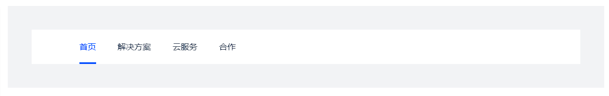
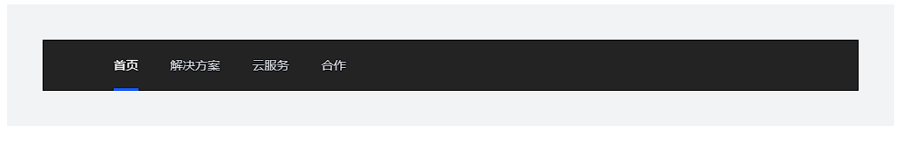
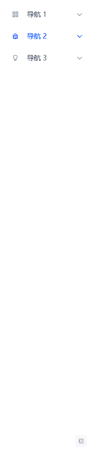
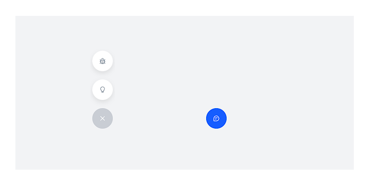

## 菜单 Menu

收纳、排列并展示一系列选项的列表。

## 顶部水平导航

设置 `mode` 为 `horizontal` 时，使用水平菜单。



```vue
<template>
	<!-- 定义了一个包含菜单的div容器 -->
	<div class="menu-demo">
		<!-- a-menu组件用于创建一个水平（horizontal）菜单，通过默认选中的键值（default-selected-keys）来设置初始激活项 -->
		<a-menu mode="horizontal" :default-selected-keys="['1']" style="width: 100vh">
			<!-- 
                a-menu-item组件表示菜单中的每一个项目。
                第一项（key="0"）被禁用（disabled），并且设置了自定义样式，包括宽度、高度、圆角、背景颜色和鼠标指针样式。
                此项可能作为一个占位符或装饰元素。
            -->
			<a-menu-item key="0" disabled></a-menu-item>
			<!-- 菜单项，代表首页链接 -->
			<a-menu-item key="1">首页</a-menu-item>
			<!-- 菜单项，代表解决方案链接 -->
			<a-menu-item key="2">解决方案</a-menu-item>
			<!-- 菜单项，代表云服务链接 -->
			<a-menu-item key="3">云服务</a-menu-item>
			<!-- 菜单项，代表合作链接 -->
			<a-menu-item key="4">合作</a-menu-item>
		</a-menu>
	</div>
</template>

<style scoped>
	.menu-demo {
		box-sizing: border-box;
		width: 100%;
		padding: 40px;
		background-color: var(--color-neutral-2);
	}
</style>
```

## 深色模式水平导航

通过 `theme` 指定主题，分为 `light` 和 `dark` 两种。



```vue
<template>
	<!-- 定义了一个包含菜单的div容器 -->
	<div class="menu-demo">
		<!-- a-menu组件用于创建一个水平（horizontal）菜单，通过默认选中的键值（default-selected-keys）来设置初始激活项 -->
		<a-menu mode="horizontal" theme="dark" :default-selected-keys="['1']" style="width: 100vh">
			<!-- 
                a-menu-item组件表示菜单中的每一个项目。
                第一项（key="0"）被禁用（disabled），并且设置了自定义样式，包括宽度、高度、圆角、背景颜色和鼠标指针样式。
                此项可能作为一个占位符或装饰元素。
            -->
			<a-menu-item key="0" disabled></a-menu-item>
			<!-- 菜单项，代表首页链接 -->
			<a-menu-item key="1">首页</a-menu-item>
			<!-- 菜单项，代表解决方案链接 -->
			<a-menu-item key="2">解决方案</a-menu-item>
			<!-- 菜单项，代表云服务链接 -->
			<a-menu-item key="3">云服务</a-menu-item>
			<!-- 菜单项，代表合作链接 -->
			<a-menu-item key="4">合作</a-menu-item>
		</a-menu>
	</div>
</template>

<style scoped>
	.menu-demo {
		box-sizing: border-box;
		width: 100%;
		padding: 40px;
		background-color: var(--color-neutral-2);
	}
</style>
```

## 垂直收缩

设置 `breakpoint` 可触发响应式收缩, `showCollapseButton`显示折叠按钮。



```vue
<template>
	<!-- 定义了一个包含菜单的div容器 -->
	<div class="menu-demo">
		<!--
        a-menu组件用于创建一个垂直（默认）菜单，设置了宽度、高度、默认打开的子菜单键值（default-open-keys）、默认选中的菜单项键值（default-selected-keys）。
        showCollapseButton属性显示折叠按钮，breakpoint设置响应式断点为超大屏幕（xl），@collapse事件监听器绑定到onCollapse方法上。
        -->
		<a-menu :style="{ width: '100%', height: '100%' }" :default-open-keys="['0']" :default-selected-keys="['0_2']" showCollapseButton breakpoint="xl" @collapse="onCollapse">
			<!-- a-sub-menu组件表示菜单中的子菜单，可以包含多个a-menu-item。 -->
			<a-sub-menu key="0">
				<!-- #icon插槽用于定义子菜单前的图标 -->
				<template #icon><icon-apps></icon-apps></template>
				<!-- #icon插槽用于定义子菜单前的图标 -->
				<template #title>导航 1</template>
				<!-- a-menu-item组件代表子菜单下的每个菜单项 -->
				<a-menu-item key="0_0">菜单 1</a-menu-item>
				<a-menu-item key="0_1">菜单 2</a-menu-item>
				<a-menu-item key="0_2">菜单 3</a-menu-item>
				<a-menu-item key="0_3">菜单 4</a-menu-item>
			</a-sub-menu>

			<a-sub-menu key="1">
				<template #icon><icon-bug></icon-bug></template>
				<template #title>导航 2</template>
				<a-menu-item key="1_0">菜单 1</a-menu-item>
				<a-menu-item key="1_1">菜单 2</a-menu-item>
				<a-menu-item key="1_2">菜单 3</a-menu-item>
			</a-sub-menu>

			<a-sub-menu key="2">
				<template #icon><icon-bulb></icon-bulb></template>
				<template #title>导航 3</template>
				<a-menu-item key="2_0">菜单 1</a-menu-item>
				<a-menu-item key="2_1">菜单 2</a-menu-item>
				<a-sub-menu key="2_2" title="导航 4">
					<a-menu-item key="2_2_0">菜单 1</a-menu-item>
					<a-menu-item key="2_2_1">菜单 2</a-menu-item>
				</a-sub-menu>
			</a-sub-menu>
		</a-menu>
	</div>
</template>

<script setup>
	// 引入Vue的ref函数和Message组件，以及所需的所有图标组件
	import { ref, defineEmits } from 'vue';
	import { Message } from '@arco-design/web-vue';
	import '@arco-design/web-vue/es/icon';

	// 定义onCollapse方法，用于处理菜单折叠或展开时触发的事件
	const emit = defineEmits(['collapse']);
	const onCollapse = (val, type) => {
		// 根据触发类型（响应式或点击）显示不同的信息提示
		const content = type === 'responsive' ? '触发响应式收缩' : '点击触发收缩';
		Message.info({
			content,
			duration: 2000, // 消息持续时间，单位毫秒
		});
	};

	// 注册所有用到的图标组件，<script setup>会自动将导入的组件注册为局部组件
</script>

<style scoped>
	/* 
    设置.menu-demo类的样式，包括盒模型行为（box-sizing）、宽度、高度、内边距（padding）和背景颜色。
    */
	.menu-demo {
		box-sizing: border-box;
		width: 20vh;
		height: 99vh;
		background-color: var(--color-neutral-2); /* 使用CSS变量作为背景色 */
	}
</style>
```

## 悬浮按钮

指定 `mode` 为 `popButton` 使用按钮组样式的悬浮菜单。



```vue
<template>
	<!-- 定义了一个包含两个触发器菜单的div容器 -->
	<div class="menu-demo">
		<!-- 
        a-trigger组件用于创建一个弹出式菜单，通过点击或悬停来触发。
        clickToClose属性确保在点击外部时关闭弹出菜单。
        position设置弹出位置为顶部（top），v-model:popupVisible绑定到popupVisible1控制第一个触发器的可见性。
        -->
		<a-trigger :trigger="['click', 'hover']" clickToClose position="top" v-model:popupVisible="popupVisible1">
			<!-- 触发按钮，根据popupVisible1的状态切换图标 -->
			<div :class="`button-trigger ${popupVisible1 ? 'button-trigger-active' : ''}`">
				<IconClose v-if="popupVisible1" />
				<IconMessage v-else />
			</div>

			<!-- 弹出内容：包含菜单项的a-menu -->
			<template #content>
				<a-menu :style="{ marginBottom: '-4px' }" mode="popButton" :tooltipProps="{ position: 'left' }" showCollapseButton>
					<a-menu-item key="1">
						<template #icon><IconBug></IconBug></template>
						Bugs
					</a-menu-item>
					<a-menu-item key="2">
						<template #icon><IconBulb></IconBulb></template>
						Ideas
					</a-menu-item>
				</a-menu>
			</template>
		</a-trigger>

		<!-- 第二个触发器，与第一个类似，但使用popupVisible2控制其可见性 -->
		<a-trigger :trigger="['click', 'hover']" clickToClose position="top" v-model:popupVisible="popupVisible2">
			<div :class="`button-trigger ${popupVisible2 ? 'button-trigger-active' : ''}`">
				<IconClose v-if="popupVisible2" />
				<IconMessage v-else />
			</div>
			<template #content>
				<a-menu :style="{ marginBottom: '-4px' }" mode="popButton" :tooltipProps="{ position: 'left' }" showCollapseButton>
					<a-menu-item key="1">
						<template #icon><IconBug></IconBug></template>
						Bugs
					</a-menu-item>
					<a-menu-item key="2">
						<template #icon><IconBulb></IconBulb></template>
						Ideas
					</a-menu-item>
				</a-menu>
			</template>
		</a-trigger>
	</div>
</template>

<script setup>
	// 使用<script setup>语法，直接引入需要的模块，并定义响应式的变量
	import { ref } from 'vue';
	import { IconBug, IconBulb, IconClose, IconMessage } from '@arco-design/web-vue/es/icon';

	// 使用ref创建两个响应式的布尔变量，用于控制两个触发器的可见性
	const popupVisible1 = ref(false);
	const popupVisible2 = ref(false);

	// 注册所有用到的图标组件，<script setup>会自动将导入的组件注册为局部组件
</script>

<style scoped>
	/* 
    设置.menu-demo类的样式，包括盒模型行为（box-sizing）、宽度、高度、内边距（padding）和背景颜色。
    */
	.menu-demo {
		box-sizing: border-box;
		width: 660px;
		height: 300px;
		padding: 40px;
		background-color: var(--color-fill-2); /* 使用CSS变量作为背景色 */
		position: relative; /* 使子元素能够相对于此容器定位 */
	}

	.button-trigger {
		position: absolute; /* 绝对定位，相对于最近的非static父级元素 */
		bottom: 80px; /* 距离底部的距离 */
		display: flex;
		align-items: center;
		justify-content: center;
		width: 40px;
		height: 40px;
		color: var(--color-white); /* 图标颜色 */
		font-size: 14px;
		border-radius: 50%; /* 圆形按钮 */
		cursor: pointer; /* 指针样式 */
		transition: all 0.1s; /* 过渡效果 */
	}

	/* 左侧触发按钮的样式 */
	.button-trigger:nth-child(1) {
		left: 150px; /* 距离左侧的距离 */
		background-color: var(--color-neutral-5); /* 默认背景色 */
	}
	.button-trigger:nth-child(1).button-trigger-active {
		background-color: var(--color-neutral-4); /* 激活状态下的背景色 */
	}

	/* 右侧触发按钮的样式 */
	.button-trigger:nth-child(2) {
		left: 372px; /* 距离左侧的距离 */
		background-color: rgb(var(--arcoblue-6)); /* 默认背景色 */
	}
	.button-trigger:nth-child(2).button-trigger-active {
		background-color: var(--color-primary-light-4); /* 激活状态下的背景色 */
	}
</style>
```

## API

### `<menu>` Props

| 参数名                      | 描述                                                         | 类型                                              | 默认值       | 版本   |
| :-------------------------- | :----------------------------------------------------------- | :------------------------------------------------ | :----------- | :----- |
| theme                       | 菜单的主题                                                   | `'light' | 'dark'`                                | `'light'`    |        |
| mode                        | 菜单的模式                                                   | `'vertical' | 'horizontal' | 'pop' | 'popButton'` | `'vertical'` |        |
| level-indent                | 层级之间的缩进量                                             | `number`                                          | `-`          |        |
| auto-open                   | 默认展开所有多级菜单                                         | `boolean`                                         | `false`      |        |
| collapsed **(v-model)**     | 是否折叠菜单                                                 | `boolean`                                         | `-`          |        |
| default-collapsed           | 默认是否折叠菜单                                             | `boolean`                                         | `false`      |        |
| collapsed-width             | 折叠菜单宽度                                                 | `number`                                          | `-`          |        |
| accordion                   | 开启手风琴效果                                               | `boolean`                                         | `false`      |        |
| auto-scroll-into-view       | 是否自动滚动选中项目到可见区域                               | `boolean`                                         | `false`      |        |
| show-collapse-button        | 是否内置折叠按钮                                             | `boolean`                                         | `false`      |        |
| selected-keys **(v-model)** | 选中的菜单项 key 数组                                        | `string[]`                                        | `-`          |        |
| default-selected-keys       | 默认选中的菜单项 key 数组                                    | `string[]`                                        | `[]`         |        |
| open-keys **(v-model)**     | 展开的子菜单 key 数组                                        | `string[]`                                        | `-`          |        |
| default-open-keys           | 默认展开的子菜单 key 数组                                    | `string[]`                                        | `[]`         |        |
| scroll-config               | 滚动到可见区域的配置项，接收所有[scroll-into-view-if-needed](https://github.com/stipsan/scroll-into-view-if-needed)的参数 | `{ [key: string]: any }`                          | `-`          |        |
| trigger-props               | 弹出模式下可接受所有 `Trigger` 的 `Props`                    | `TriggerProps`                                    | `-`          |        |
| tooltip-props               | 弹出模式下可接受所有 `ToolTip` 的 `Props`                    | `object`                                          | `-`          |        |
| auto-open-selected          | 默认展开选中的菜单                                           | `boolean`                                         | `false`      | 2.8.0  |
| breakpoint                  | 响应式的断点, 详见[响应式栅格](https://arco.design/vue/component/grid) | `'xxl' | 'xl' | 'lg' | 'md' | 'sm' | 'xs'`        | `-`          | 2.18.0 |
| popup-max-height            | 弹出框的最大高度                                             | `boolean | number`                                | `true`       | 2.23.0 |

### `<menu>` Events

| 事件名          | 描述               | 参数                                                     |
| :-------------- | :----------------- | :------------------------------------------------------- |
| collapse        | 折叠状态改变时触发 | collapsed: `boolean` type: `'clickTrigger'|'responsive'` |
| menu-item-click | 点击菜单项时触发   | key: `string`                                            |
| sub-menu-click  | 点击子菜单时触发   | key: `string` openKeys: `string[]`                       |

### `<menu>` Slots

| 插槽名            | 描述           | 参数                 |
| :---------------- | :------------- | :------------------- |
| collapse-icon     | 折叠图标       | collapsed: `boolean` |
| expand-icon-right | 向右展开的图标 | -                    |
| expand-icon-down  | 向下展开的图标 | -                    |

### `<sub-menu>` Props

| 参数名           | 描述                                                         | 类型                                     | 默认值  | 版本   |
| :--------------- | :----------------------------------------------------------- | :--------------------------------------- | :------ | :----- |
| title            | 子菜单的标题                                                 | `string`                                 | `-`     |        |
| selectable       | 弹出模式下，是否将多级菜单头也作为一个菜单项，支持点击选中等状态 | `boolean`                                | `false` |        |
| popup            | 是否强制使用弹出模式，`level` 表示当前子菜单的层级           | `boolean | ((level: number) => boolean)` | `false` |        |
| popup-max-height | 弹出框的最大高度                                             | `boolean | number`                       | `true`  | 2.23.0 |

### `<sub-menu>` Slots

| 插槽名            | 描述           | 参数 | 版本   |
| :---------------- | :------------- | :--- | :----- |
| title             | 标题           | -    |        |
| expand-icon-right | 向右展开的图标 | -    |        |
| expand-icon-down  | 向下展开的图标 | -    |        |
| icon              | 菜单的图标     | -    | 2.11.0 |

### `<menu-item-group>` Props

| 参数名 | 描述         | 类型     | 默认值 |
| :----- | :----------- | :------- | :----- |
| title  | 菜单组的标题 | `string` | `-`    |

### `<menu-item-group>` Slots

| 插槽名 | 描述 | 参数 |
| :----- | :--- | :--- |
| title  | 标题 | -    |

### `<menu-item>` Props

| 参数名   | 描述     | 类型      | 默认值  |
| :------- | :------- | :-------- | :------ |
| disabled | 是否禁用 | `boolean` | `false` |

### `<menu-item>` Slots

| 插槽名 | 描述       | 参数 | 版本   |
| :----- | :--------- | :--- | :----- |
| icon   | 菜单的图标 | -    | 2.11.0 |

## FAQ

### `<MenuItem>` 和 `<SubMenu>` 组件的 `key` 属性为必填

在 `<Menu>` 组件中使用 `<MenuItem>` 和 `<SubMenu>` 组件时，请传入唯一的 `key` 属性。
组件内部在进行计算时会依赖此值，如果没有赋值会导致部分场景下异常