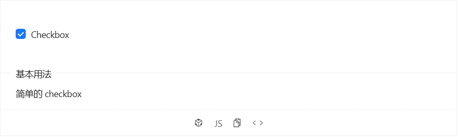
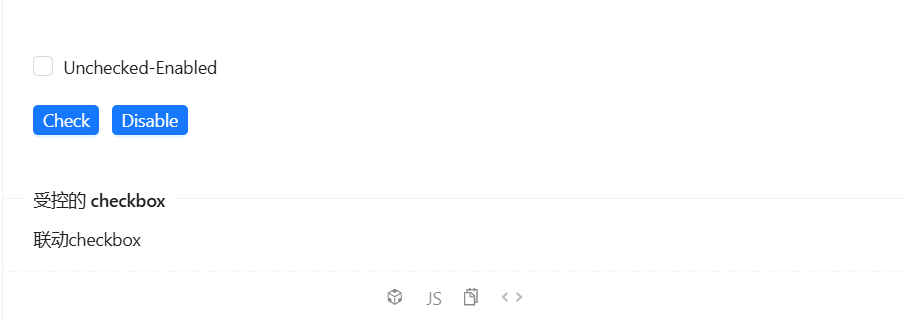
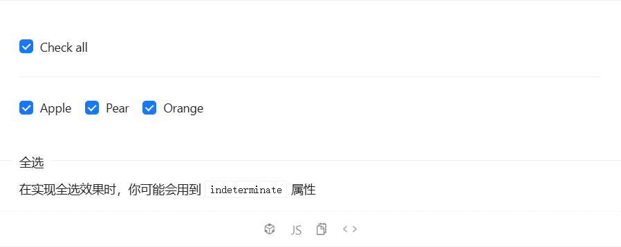
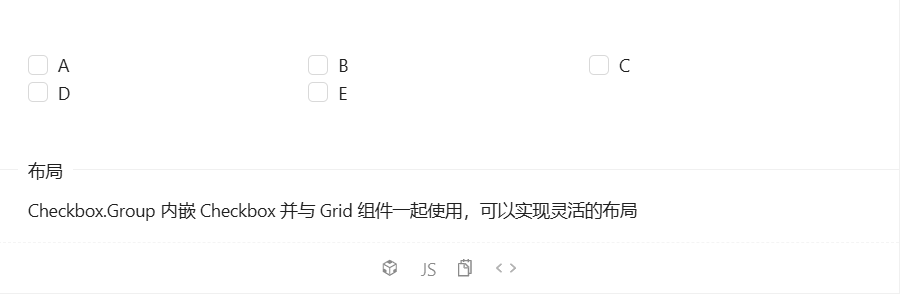

# Checkbox 多选

多选框。

# 何时使用[#](https://antdv.com/components/checkbox-cn#何时使用)

- 在一组可选项中进行多项选择时；
- 单独使用可以表示两种状态之间的切换，和 `switch` 类似。
- 区别在于切换 `switch` 会直接触发状态改变，而 `checkbox` 一般用于状态标记，需要和提交操作配合。


# 代码演示


## 1.一个简单的多选



```vue
<template>
  <a-checkbox v-model:checked="checked">Checkbox</a-checkbox>
</template>

<script setup>
import { ref } from 'vue';
const checked = ref(false);
</script>
```

1. **`v-model:checked`**：
   - 这是 Vue 的一种语法糖，专门用于处理类似复选框和单选按钮这种需要通过特定属性（如 `checked`）来控制状态的组件。
   - 在 `<a-checkbox>` 组件中，`checked` 属性决定了复选框是否被选中。
2. **`"checked"`**：
   - 这是你定义的一个响应式变量，用来存储复选框的选中状态。当用户点击复选框时，`checked` 的值会自动更新为 `true` 或 `false`，反之亦然。

### 运行效果

**初始渲染**：

- 当组件首次渲染时，`checked` 的初始值（例如 `false`）会被设置为复选框的 `checked` 属性。
- 如果 `checked` 为 `true`，则复选框显示为选中状态；如果为 `false`，则显示为未选中状态。

**用户交互**：

- 当用户点击复选框时，浏览器会触发 `change` 事件。
- Vue 捕获这个事件，并根据新的状态更新 `checked` 的值。如果复选框从未选中变为选中，则 `checked` 将变为 `true`；反之，如果从选中变为未选中，则 `checked` 将变为 `false`。

**界面更新**：

- 更新后的 `checked` 值会立即反映在界面上，确保复选框的状态与 `checked` 的值始终保持同步。


## 2.一个联动其他标签的多选



```vue
<template>
  <p :style="{ marginBottom: '20px' }">
    <a-checkbox v-model:checked="checked" :disabled="disabled">
      {{ label }}
    </a-checkbox>
  </p>
  <p>
    <a-button type="primary" size="small" @click="toggleChecked">
      {{ !checked ? 'Check' : 'Uncheck' }}
    </a-button>
    <a-button :style="{ marginLeft: '10px' }" type="primary" size="small" @click="toggleDisable">
      {{ !disabled ? 'Disable' : 'Enable' }}
    </a-button>
  </p>
</template>

<script setup>
import { computed, ref } from 'vue';
const checked = ref(false);
const disabled = ref(false);

// 控制多选按钮, 可以通过这个方法同时控制多选按钮的点击效果
const toggleChecked = () => {
  checked.value = !checked.value;
};

// 控制多选按钮是否能点击
const toggleDisable = () => {
  disabled.value = !disabled.value;
};

// 计算属性, 通过checked.value,disabled.value变化动态计算
const label = computed(() => {
  return `${checked.value ? 'Checked' : 'Unchecked'}-${disabled.value ? 'Disabled' : 'Enabled'}`;
});
</script>
```

1. **复选框 (`<a-checkbox>`)**
   - `v-model:checked="checked"`：将复选框的状态与 `checked` 变量进行双向绑定。
   - `:disabled="disabled"`：根据 `disabled` 变量的值决定复选框是否被禁用。
   - `{{ label }}`：动态显示复选框的标签文本，这个文本由 `label` 计算属性生成。
2. **按钮组 (`<a-button>`)**
   - 第一个按钮用于切换复选框的选中状态：
     - `@click="toggleChecked"`：点击时调用 `toggleChecked` 方法。
     - 按钮文本根据 `checked` 的状态动态变化：`!checked ? 'Check' : 'Uncheck'`。
   - 第二个按钮用于切换复选框的禁用状态：
     - `@click="toggleDisable"`：点击时调用 `toggleDisable` 方法。
     - 按钮文本根据 `disabled` 的状态动态变化：`!disabled ? 'Disable' : 'Enable'`。
   - `:style="{ marginLeft: '10px' }"`：为第二个按钮添加左侧边距，以分隔两个按钮。

### 运行效果

**初始状态**：

- 复选框未选中且启用，标签显示为 `'Unchecked-Enabled'`。
- 第一个按钮显示为 `'Check'`，第二个按钮显示为 `'Disable'`。

**用户交互**：

- 点击第一个按钮会切换复选框的选中状态，并更新按钮文本为 `'Uncheck'` 或 `'Check'`。
- 点击第二个按钮会切换复选框的禁用状态，并更新按钮文本为 `'Enable'` 或 `'Disable'`。
- 标签文本会根据 `checked` 和 `disabled` 的状态实时更新，反映当前的复选框状态。


## 3.全选



```vue
<template>
  <div>
    <!-- 全选复选框 -->
    <a-checkbox
      v-model:checked="state.checkAll"
      :indeterminate="state.indeterminate"
      @change="onCheckAllChange"
    >
      Check all
    </a-checkbox>
  </div>
  <a-divider />
  <!-- 多选复选框组 -->
  <a-checkbox-group v-model:value="state.checkedList" :options="plainOptions" />
</template>

<script setup>
import { reactive, watch } from 'vue';

// 定义选项列表，用于多选复选框组
const plainOptions = ['Apple', 'Pear', 'Orange'];

// 使用 reactive 创建响应式状态对象
const state = reactive({
  indeterminate: true, // 是否部分选中
  checkAll: false,   // 是否全选
  checkedList: ['Apple', 'Orange'],// 当前默认选中的项
});

// 全选/取消全选事件处理函数
const onCheckAllChange = e => {
  // 更新选中项列表和不确定状态	 
  Object.assign(state, {
    checkedList: e.target.checked ? plainOptions : [], // 全选或取消全选所有项
    indeterminate: false, // 取消不确定状态
  });
};

// 监听 checkedList 的变化，动态更新 indeterminate 和 checkAll 状态
watch(
  () => state.checkedList,
  val => {
    // 如果有选中的项但不是全部，则设置为部分选中状态
    state.indeterminate = !!val.length && val.length < plainOptions.length;
    // 如果选中的项数量等于选项总数，则设置为全选状态
    state.checkAll = val.length === plainOptions.length;
  },
);
</script>
```

1. **全选复选框 (`<a-checkbox>`)**
   - `v-model:checked="state.checkAll"`：将复选框的状态与 `state.checkAll` 进行双向绑定。
   - `:indeterminate="state.indeterminate"`：根据 `state.indeterminate` 设置复选框是否处于不确定状态（部分选中）。
   - `@change="onCheckAllChange"`：当复选框状态改变时调用 `onCheckAllChange` 方法。
2. **分隔线 (`<a-divider />`)**
   - 用于视觉上分隔全选复选框和多选复选框组。
3. **多选复选框组 (`<a-checkbox-group>`)**
   - `v-model:value="state.checkedList"`：将多选复选框组的选择状态与 `state.checkedList` 进行双向绑定。
   - `:options="plainOptions"`：提供选项列表，用户可以选择这些选项。

### 运行效果

**初始状态**：

- 全选复选框未选中且处于不确定状态（部分选中），标签显示为 `'Check all'`。
- 多选复选框组默认选中 `'Apple'` 和 `'Orange'`。

**用户交互**：

- 点击全选复选框：
  - 如果当前未全选，则选中所有项并取消不确定状态。
  - 如果当前已全选，则取消所有选中项并取消不确定状态。
- 手动选择或取消多选复选框组中的某一项：
  - 根据选中的项数量自动更新全选复选框的状态（全选、部分选中或未选中）。


## 4.一行多列多选



```vue
<template>
  <a-checkbox-group v-model:value="value" style="width: 100%">
    <a-row>
      <a-col :span="8">
        <a-checkbox value="A">A</a-checkbox>
      </a-col>
      <a-col :span="8">
        <a-checkbox value="B">B</a-checkbox>
      </a-col>
      <a-col :span="8">
        <a-checkbox value="C">C</a-checkbox>
      </a-col>
      <a-col :span="8">
        <a-checkbox value="D">D</a-checkbox>
      </a-col>
      <a-col :span="8">
        <a-checkbox value="E">E</a-checkbox>
      </a-col>
    </a-row>
  </a-checkbox-group>
</template>
<script setup>
import { ref } from 'vue';
const value = ref([]);
</script>
```

- **`<a-checkbox-group>`**：这是一个来自 Ant Design Vue 的组件，用于创建一组关联的复选框。它允许用户同时选择多个选项，并且可以通过 `v-model:value` 绑定到一个数组，以跟踪哪些选项被选中。
- **`v-model:value="value"`**：这是双向绑定指令，用来将复选框组的状态与数据属性 `value` 关联起来。每当用户选择或取消选择复选框时，`value` 数组会自动更新；反之亦然。
- **`style="width: 100%"`**：设置复选框组的宽度为 100%，使其占据父容器的全部宽度。
- **`<a-row>` 和 `<a-col>`**：这些是 Ant Design Vue 提供的布局组件，用于创建响应式网格布局。`<a-row>` 是一行，`<a-col>` 是列，`span` 属性定义了每列占用的栅格数（总共有24个栅格）。这里每个复选框占据一行的三分之一宽度（即 `span=8`）。
- **`<a-checkbox>`**：这是单个复选框组件，每个复选框都有一个唯一的 `value` 属性，表示它的标识符。文本内容（如 "A", "B", "C"）是复选框旁边显示的标签。


# API

### 属性

### Checkbox

| 参数             | 说明                                    | 类型                        | 默认值 | 版本 |
| :--------------- | :-------------------------------------- | :-------------------------- | :----- | :--- |
| autofocus        | 自动获取焦点                            | boolean                     | false  |      |
| checked(v-model) | 指定当前是否选中                        | boolean                     | false  |      |
| disabled         | 失效状态                                | boolean                     | false  |      |
| indeterminate    | 设置 indeterminate 状态，只负责样式控制 | boolean                     | false  |      |
| value            | 与 CheckboxGroup 组合使用时的值         | boolean \| string \| number | -      |      |

#### Checkbox事件

| 事件名称 | 说明           | 回调参数          | 版本 |      |
| :------- | :------------- | :---------------- | :--- | :--- |
| change   | 变化时回调函数 | Function(e:Event) | -    |      |

### Checkbox Group

| 参数           | 说明                                                         | 类型                                                         | 默认值 | 版本  |
| :------------- | :----------------------------------------------------------- | :----------------------------------------------------------- | :----- | :---- |
| disabled       | 整组失效                                                     | boolean                                                      | false  |       |
| name           | CheckboxGroup 下所有 `input[type="checkbox"]` 的 `name` 属性 | string                                                       | -      | 1.5.0 |
| options        | 指定可选项，可以通过 slot="label" slot-scope="option" 定制`label` | string[] \| Array<{ label: string value: string disabled?: boolean, indeterminate?: boolean, onChange?: function }> | []     |       |
| value(v-model) | 指定选中的选项                                               | (boolean \| string \| number)[]                              | []     |       |

#### Checkbox Group事件

| 事件名称 | 说明           | 回调参数               | 版本 |      |
| :------- | :------------- | :--------------------- | :--- | :--- |
| change   | 变化时回调函数 | Function(checkedValue) | -    |      |

### 方法

#### Checkbox

| 名称    | 描述     | 版本 |
| :------ | :------- | :--- |
| blur()  | 移除焦点 |      |
| focus() | 获取焦点 |      |