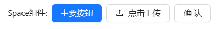
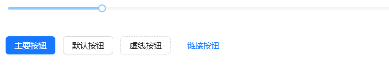
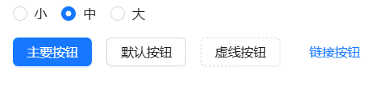
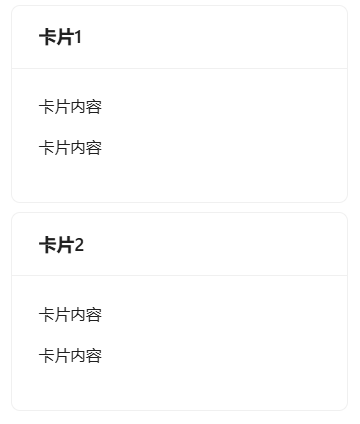
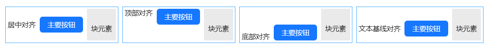
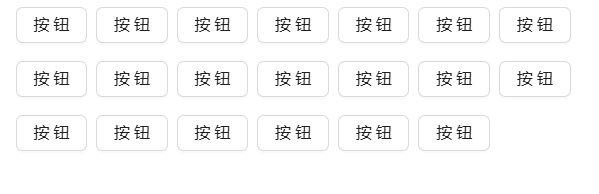
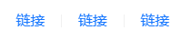
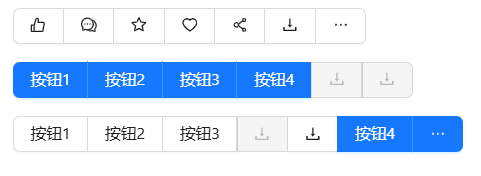
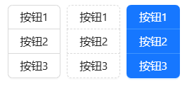

## Space间距

设置组件之间的间距。

## 何时使用 [#](https://antdv.com/components/space-cn#何时使用)

避免组件紧贴在一起，拉开统一的空间。

- 适合行内元素的水平间距。
- 可以设置各种水平对齐方式。
- 需要表单组件之间紧凑连接且合并边框时，使用 Space.Compact（自 `ant-design-vue@4.0.0` 版本开始提供该组件）。

## 代码演示

### 1.水平间距



```vue
<template>
	<!-- 使用 a-space 组件来组织布局，并在其内部放置多个组件, 默认是水平间距 -->
	<a-space>
		<!-- 简单文本 "Space" 用于占位或展示 -->
		Space组件:

		<!-- 主要按钮（Primary Button），通常用于强调重要的操作 -->
		<a-button type="primary">主要按钮</a-button>

		<!-- 文件上传组件（a-upload），包含一个按钮作为触发器 -->
		<a-upload>
			<a-button>
				<UploadOutlined />
				点击上传
			</a-button>
		</a-upload>

		<!-- 弹出确认框组件（a-popconfirm），用于在执行某些操作前提示用户确认 -->
		<a-popconfirm title="确定要删除此任务吗？" ok-text="是" cancel-text="否">
			<a-button>确认</a-button>
		</a-popconfirm>
	</a-space>
</template>
<script setup>
	import { ref } from 'vue';
	// 导入图标组件 UploadOutlined （假设已经正确安装并配置）
	import { UploadOutlined } from '@ant-design/icons-vue';
</script>

<!-- 可选：如果你需要在 <style> 标签中添加样式，可以在这里添加 -->
<style scoped></style>
```

### 2.自定义间距



```vue
<template>
	<div>
		<!-- 使用 a-slider 组件创建一个滑块，用于动态调整 a-space 组件中子元素之间的间距 -->
		<a-slider v-model:value="size" />

		<br />
		<br />

		<!-- 使用 a-space 组件来组织布局，并通过 :size="size" 绑定滑块的值，以动态控制子元素间的间距 -->
		<a-space :size="size">
			<!-- 主要按钮（Primary Button），通常用于强调重要的操作 -->
			<a-button type="primary">主要按钮</a-button>
			<!-- 默认按钮（Default Button），这是最普通的按钮样式 -->
			<a-button>默认按钮</a-button>
			<!-- 虚线按钮（Dashed Button），适用于次要或轻量级的操作 -->
			<a-button type="dashed">虚线按钮</a-button>
			<!-- 链接按钮（Link Button），外观像链接，可以用来替代 <a> 标签 -->
			<a-button type="link">链接按钮</a-button>
		</a-space>
	</div>
</template>
<script setup>
	import { ref } from 'vue';
	// 定义一个响应式变量 size，默认值为 8，用于存储滑块的当前值，并绑定到 a-space 的 size 属性
	const size = ref(8);
</script>

<!-- 可选：如果你需要在 <style> 标签中添加样式，可以在这里添加 -->
<style scoped></style>
```

### 3.间距大小



```vue
<template>
	<div>
		<!-- 使用 a-radio-group 组件创建一组单选按钮，用于选择不同的间距大小 -->
		<a-radio-group v-model:value="size">
			<!-- 单选按钮项，每个都有唯一的 value 属性，对应不同的间距大小 -->
			<a-radio value="small">小</a-radio>
			<a-radio value="middle">中</a-radio>
			<a-radio value="large">大</a-radio>
		</a-radio-group>
		<br /><br />

		<!-- 使用 a-space 组件来组织布局，并通过 :size="size" 绑定单选按钮组的值，以动态控制子元素间的间距 -->
		<a-space :size="size">
			<!-- 主要按钮（Primary Button），通常用于强调重要的操作 -->
			<a-button type="primary">主要按钮</a-button>
			<!-- 默认按钮（Default Button），这是最普通的按钮样式 -->
			<a-button>默认按钮</a-button>
			<!-- 虚线按钮（Dashed Button），适用于次要或轻量级的操作 -->
			<a-button type="dashed">虚线按钮</a-button>
			<!-- 链接按钮（Link Button），外观像链接，可以用来替代 <a> 标签 -->
			<a-button type="link">链接按钮</a-button>
		</a-space>
	</div>
</template>
<script setup>
	import { ref } from 'vue';

	// 定义一个响应式变量 size，默认值为 'small'，用于存储当前选择的间距大小，并绑定到 a-space 的 size 属性
	const size = ref('small');
</script>

<!-- 可选：如果你需要在 <style> 标签中添加样式，可以在这里添加 -->
<style scoped></style>
```

### 4.垂直间距



```vue
<template>
	<!-- 使用 a-space 组件来组织布局，并设置 direction="vertical" 来垂直排列子元素 -->
	<a-space direction="vertical">
		<!-- 第一张卡片组件 (a-card)，设置了宽度为 300px 和标题 "Card" -->
		<a-card title="卡片1" style="width: 300px">
			<p>卡片内容</p>
			<p>卡片内容</p>
		</a-card>

		<!-- 第二张卡片组件 (a-card)，同样设置了宽度为 300px 和标题 "Card" -->
		<a-card title="卡片2" style="width: 300px">
			<p>卡片内容</p>
			<p>卡片内容</p>
		</a-card>
	</a-space>
</template>

<script setup>
	// 此处无需导入额外的依赖或定义方法，因为组件已经自包含。
</script>

<!-- 可选：如果你需要在 <style> 标签中添加样式，可以在这里添加 -->
<style scoped></style>
```

### 5.对齐间距



```vue
<template>
	<!-- 使用 div 容器包裹所有内容，并应用类名 space-align-container 来设置整体布局 -->
	<div class="space-align-container">
		<!-- 每个 space-align-block 包含一个 a-space 组件，用于展示不同的对齐方式 -->

		<!-- 第一个区块：居中对齐 (align="center") -->
		<div class="space-align-block">
			<!-- 使用 a-space 组件，设置 align="center" 实现子元素垂直居中对齐 -->
			<a-space align="center">
				居中对齐
				<a-button type="primary">主要按钮</a-button>
				<span class="mock-block">块元素</span>
			</a-space>
		</div>

		<!-- 第二个区块：顶部对齐 (align="start") -->
		<div class="space-align-block">
			<!-- 使用 a-space 组件，设置 align="start" 实现子元素顶部对齐 -->
			<a-space align="start">
				顶部对齐
				<a-button type="primary">主要按钮</a-button>
				<span class="mock-block">块元素</span>
			</a-space>
		</div>

		<!-- 第三个区块：底部对齐 (align="end") -->
		<div class="space-align-block">
			<!-- 使用 a-space 组件，设置 align="end" 实现子元素底部对齐 -->
			<a-space align="end">
				底部对齐
				<a-button type="primary">主要按钮</a-button>
				<span class="mock-block">块元素</span>
			</a-space>
		</div>

		<!-- 第四个区块：基线对齐 (align="baseline") -->
		<div class="space-align-block">
			<!-- 使用 a-space 组件，设置 align="baseline" 实现子元素基于文本基线对齐 -->
			<a-space align="baseline">
				文本基线对齐
				<a-button type="primary">主要按钮</a-button>
				<span class="mock-block">块元素</span>
			</a-space>
		</div>
	</div>
</template>

<style scoped>
	/* 设置容器的整体布局 */
	.space-align-container {
		display: flex;
		align-items: flex-start; /* 子元素从顶部开始对齐 */
		flex-wrap: wrap; /* 允许子元素换行 */
	}
	/* 设置每个区块的样式 */
	.space-align-block {
		margin: 8px 4px; /* 外边距 */
		border: 1px solid #40a9ff; /* 边框 */
		padding: 4px; /* 内边距 */
		flex: none; /* 不允许拉伸或收缩 */
	}
	/* 设置模拟块元素的样式 */
	.space-align-block .mock-block {
		display: inline-block; /* 行内块显示 */
		padding: 32px 8px 16px; /* 内边距 */
		background: rgba(150, 150, 150, 0.2); /* 背景颜色 */
	}
</style>
```

### 6.自动换行



```vue
<template>
	<!-- 使用 a-space 组件来组织布局，并设置 size 属性为 [8px, 16px] 分别表示水平和垂直间距 -->
	<a-space :size="[8, 16]" wrap>
		<!-- 使用 v-for 指令循环生成 20 个按钮，每个按钮都有唯一的 key 值 -->
		<template v-for="_i in 20" :key="_i">
			<a-button>按钮</a-button>
		</template>
	</a-space>
</template>

<script setup>
	// 此处无需导入额外的依赖或定义方法，因为组件已经自包含。
</script>

<!-- 可选：如果你需要在 <style> 标签中添加样式，可以在这里添加 -->
<style scoped></style>
```

### 7.组件分隔符



```vue
<template>
	<!-- 使用 a-space 组件来组织布局，并在其内部放置多个组件 -->
	<a-space>
		<!-- 使用 #split 插槽定义子元素之间的分隔符 -->
		<template #split>
			<!-- 垂直分隔线组件 (a-divider)，type="vertical" 设置为垂直方向的分隔线 -->
			<a-divider type="vertical" />
		</template>

		<!-- 第一个链接组件 (a-typography-link)，显示文本 "Link" -->
		<a-typography-link>链接</a-typography-link>
		<!-- 第二个链接组件 (a-typography-link)，显示文本 "Link" -->
		<a-typography-link>链接</a-typography-link>

		<!-- 第三个链接组件 (a-typography-link)，显示文本 "Link" -->
		<a-typography-link>链接</a-typography-link>
	</a-space>
</template>

<script setup>
	// 此处无需导入额外的依赖或定义方法，因为组件已经自包含。
</script>

<!-- 可选：如果你需要在 <style> 标签中添加样式，可以在这里添加 -->
<style scoped></style>
```

### 8.水平紧凑布局



```vue
<template>
	<div>
		<!-- 第一组：紧凑排列的按钮组，带有工具提示和图标的按钮 -->
		<a-space-compact block>
			<!-- 使用 a-tooltip 组件为每个按钮提供工具提示 -->
			<a-tooltip title="点赞">
				<a-button>
					<LikeOutlined />
				</a-button>
			</a-tooltip>

			<a-tooltip title="评论">
				<a-button>
					<CommentOutlined />
				</a-button>
			</a-tooltip>

			<a-tooltip title="收藏">
				<a-button>
					<StarOutlined />
				</a-button>
			</a-tooltip>

			<a-tooltip title="喜欢">
				<a-button>
					<HeartOutlined />
				</a-button>
			</a-tooltip>

			<a-tooltip title="分享">
				<a-button>
					<ShareAltOutlined />
				</a-button>
			</a-tooltip>

			<a-tooltip title="下载">
				<a-button>
					<DownloadOutlined />
				</a-button>
			</a-tooltip>

			<!-- 下拉菜单按钮，click点击触发下拉菜单 -->
			<a-dropdown placement="bottomRight" :trigger="['click']">
				<a-button>
					<EllipsisOutlined />
				</a-button>

				<!-- 下拉菜单的内容 -->
				<template #overlay>
					<a-menu>
						<a-menu-item>
							<a href="javascript:;">第一个菜单项</a>
						</a-menu-item>
						<a-menu-item>
							<a href="javascript:;">第二个菜单项</a>
						</a-menu-item>
						<a-menu-item>
							<a href="javascript:;">第三个菜单项</a>
						</a-menu-item>
					</a-menu>
				</template>
			</a-dropdown>
		</a-space-compact>
		<br />

		<!-- 第二组：紧凑排列的主要按钮组，带有禁用状态的按钮 -->
		<a-space-compact block>
			<a-button type="primary">按钮1</a-button>
			<a-button type="primary">按钮2</a-button>
			<a-button type="primary">按钮3</a-button>
			<a-button type="primary">按钮4</a-button>

			<!-- 带有工具提示的禁用按钮 -->
			<a-tooltip title="工具提示">
				<a-button type="primary" disabled>
					<DownloadOutlined />
				</a-button>
			</a-tooltip>
			<a-tooltip title="工具提示">
				<a-button type="primary" disabled>
					<DownloadOutlined />
				</a-button>
			</a-tooltip>
		</a-space-compact>
		<br />

		<!-- 第三组：紧凑排列的普通按钮组，带有工具提示和主要按钮 -->
		<a-space-compact block>
			<a-button>按钮1</a-button>
			<a-button>按钮2</a-button>
			<a-button>按钮3</a-button>

			<a-tooltip title="工具提示(禁用)">
				<a-button disabled>
					<DownloadOutlined />
				</a-button>
			</a-tooltip>
			<a-tooltip title="工具提示">
				<a-button>
					<DownloadOutlined />
				</a-button>
			</a-tooltip>

			<!-- 主要按钮 -->
			<a-button type="primary">按钮4</a-button>

			<!-- 带有下拉菜单的主要按钮，click点击触发下拉菜单 -->
			<a-dropdown placement="bottomRight" :trigger="['click']">
				<a-button type="primary">
					<EllipsisOutlined />
				</a-button>

				<!-- 下拉菜单的内容 -->
				<template #overlay>
					<a-menu>
						<a-menu-item>
							<a href="javascript:;">第一个菜单项</a>
						</a-menu-item>
						<a-menu-item>
							<a href="javascript:;">第二个菜单项</a>
						</a-menu-item>
						<a-menu-item>
							<a href="javascript:;">第三个菜单项</a>
						</a-menu-item>
					</a-menu>
				</template>
			</a-dropdown>
		</a-space-compact>
	</div>
</template>

<script setup>
	import { ref } from 'vue';
	import { LikeOutlined, CommentOutlined, StarOutlined, HeartOutlined, ShareAltOutlined, DownloadOutlined, EllipsisOutlined } from '@ant-design/icons-vue';
</script>

<!-- 可选：如果你需要在 <style> 标签中添加样式，可以在这里添加 -->
<style scoped></style>
```

### 9.垂直紧凑布局



```vue
<template>
	<!-- 使用 a-space 组件来组织布局，默认情况下会为其内部的子元素提供水平间距 -->
	<a-space>
		<!-- 第一个紧凑按钮组：默认样式按钮，垂直排列 -->
		<a-space-compact direction="vertical">
			<a-button>按钮1</a-button>
			<a-button>按钮2</a-button>
			<a-button>按钮3</a-button>
		</a-space-compact>

		<!-- 第二个紧凑按钮组：虚线样式按钮，垂直排列 -->
		<a-space-compact direction="vertical">
			<a-button type="dashed">按钮1</a-button>
			<a-button type="dashed">按钮2</a-button>
			<a-button type="dashed">按钮3</a-button>
		</a-space-compact>

		<!-- 第三个紧凑按钮组：主要样式按钮，垂直排列 -->
		<a-space-compact direction="vertical">
			<a-button type="primary">按钮1</a-button>
			<a-button type="primary">按钮2</a-button>
			<a-button type="primary">按钮3</a-button>
		</a-space-compact>
	</a-space>
</template>

<script setup>
	// 此处无需导入额外的依赖或定义方法，因为组件已经自包含。
</script>

<!-- 可选：如果你需要在 <style> 标签中添加样式，可以在这里添加 -->
<style scoped></style>
```

## API[#](https://antdv.com/components/space-cn#api)

### Space [#](https://antdv.com/components/space-cn#space)

| 参数      | 说明                                         | 类型                                    | 默认值       | 版本  |
| :-------- | :------------------------------------------- | :-------------------------------------- | :----------- | :---- |
| align     | 对齐方式                                     | `start` | `end` |`center` |`baseline`   | -            | 1.6.5 |
| direction | 间距方向                                     | `vertical` | `horizontal`               | `horizontal` | 1.6.5 |
| size      | 间距大小                                     | `small` | `middle` | `large` | `number` | `small`      | 1.6.5 |
| split     | 设置拆分                                     | VueNode \| v-slot                       | -            | 2.2.0 |
| wrap      | 是否自动换行，仅在 `horizontal` 水平间距有效 | boolean                                 | false        | 2.2.0 |

### Space.Compact [#](https://antdv.com/components/space-cn#space-compact)

> 自 ant-design-vue@4.0.0 版本开始提供该组件。

需要表单组件之间紧凑连接且合并边框时，使用 Space.Compact。支持的组件有：

- Button
- AutoComplete
- Cascader
- DatePicker
- Input/Input.Search
- Select
- TimePicker
- TreeSelect

| 参数      | 说明                         | 类型                         | 默认值       | 版本  |
| :-------- | :--------------------------- | :--------------------------- | :----------- | :---- |
| block     | 将宽度调整为父元素宽度的选项 | boolean                      | false        | 4.0.0 |
| direction | 指定排列方向                 | `vertical` | `horizontal`    | `horizontal` | 4.0.0 |
| size      | 子组件大小                   | `large` | `middle` | `small` | `middle`     | 4.0.0 |