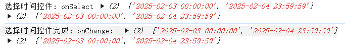

# 安装依赖

```sh
npm install date-fns
npm install date-fns-tz
```


# 格式化时间

主要用于时间控件, 选择 开始时间(00:00:00)-结束时间(23:59:59)


```vue
<a-range-picker @change="onChange" @select="onSelect" style="width: 254px; marginbottom: 20px" />
```

```js
// time.js
import { setSeconds, setMinutes, setHours } from 'date-fns';
import { formatInTimeZone } from 'date-fns-tz';

/**
 * 将 UTC 时间字符串或日期字符串转换为指定时区的时间并格式化
 * 主要用于时间控件, 选择 开始时间(00:00:00)-结束时间(23:59:59)
 * @param {(string|string[])} utcStrings - 单个或多个 UTC 时间字符串或日期字符串（例如："2025-02-04" 或 "2025-02-04T16:00:00.000Z"）
 * @returns {(string|string[])} 格式化后的时间字符串或字符串数组
 */
export function convertUtcWidget(utcStrings) {
	// 判断输入是否为数组
	const isArrayOfStrings = Array.isArray(utcStrings);

	// 定义内部处理函数，用于处理单个时间字符串
	const processSingleDate = (utcString, index) => {
		let date;

		if (!utcString) {
			throw new Error('Invalid date string');
		}

		if (/^\d{4}-\d{2}-\d{2}$/.test(utcString)) {
			// 如果是仅包含日期的字符串，则假设时间为午夜0点（北京时间）
			date = new Date(`${utcString}T00:00:00+08:00`);
		} else {
			date = new Date(utcString);
		}

		// 如果是数组中的第二个元素，则设置时间为当天最后一秒
		if (index === 1) {
			date = setSeconds(setMinutes(setHours(date, 23), 59), 59);
		}

		return formatInTimeZone(date, 'Asia/Shanghai', 'yyyy-MM-dd HH:mm:ss');
	};

	// 提前返回单个值的情况
	if (!isArrayOfStrings) {
		return processSingleDate(utcStrings, 0);
	}

	// 对于数组的情况，映射每个元素进行处理
	return utcStrings.map((utcStr, idx) => processSingleDate(utcStr, idx));
}
```


# 导入

```js
<script setup>
	import { convertUtcWidget } from '@/api/tools/time';

	const onSelect = (dateString, date) => {
		console.log('选择时间控件: onSelect', convertUtc(dateString), convertUtc(date));
	};
	const onChange = (dateString, date) => {
		console.log('选择时间控件完成: onChange: ', convertUtc(dateString), convertUtc(date));
	};
<script>
```

