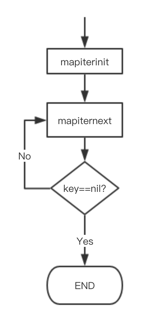

# 简介

在 Go 语言中，迭代 map 的结果确实是无序的。

1. 这是因为 Go 的 map 类型底层实现是哈希表，而哈希表的特性之一就是元素的存储位置由键的哈希值决定，这使得元素的顺序在插入后是不确定的。

2. map会在扩容之后数据发生迁移, 搬迁后，key 的位置发生了重大的变化, 遍历 map 的结果就不可能按原来的顺序了

3. 当你使用一个 for-range 循环来迭代 map 时，Go 的运行时会选择一个内部的顺序(随机开始位置)来访问 map 的元素

   但这个顺序对于外部用户是不保证的，并且在每次运行程序时都可能不同。


# map迭代源码



`src/runtime/hmap.go`

```go
// 初始化用于遍历映射的 hiter 结构。
// hiter 结构由编译器的 order pass 在栈上分配，
// 或者通过 reflect_mapiterinit 在堆上分配，
// 两者都需要一个已清零的 hiter 结构，因为它包含指针。
func mapiterinit(t *maptype, h *hmap, it *hiter) {
    // 检查
	...

	// 决定开始位置
	// 使用 fastrand 或 fastrand64 生成随机数，
	// 具体取决于映射的基数 B 是否大于 31 - bucketCntBits。
	var r uintptr
	if h.B > 31-bucketCntBits {
		r = uintptr(fastrand64())
	} else {
		r = uintptr(fastrand())
	}
	...
}
```

源码中可以看到, 遍历的开始位置是不固定的, 每次迭代开始的位置都是随机的


# 示例

```go
package main

import (
	"fmt"
)

func main() {
	fruits := map[string]int{
		"apple":  1,
		"banana": 2,
		"cherry": 3,
	}

	for k, v := range fruits {
		fmt.Printf("Fruit: %s, Count: %d\n", k, v)
	}
}
```

运行结果1:

```go
Fruit: apple, Count: 1
Fruit: banana, Count: 2
Fruit: cherry, Count: 3
```

运行结果2:

```go
Fruit: cherry, Count: 3
Fruit: apple, Count: 1
Fruit: banana, Count: 2
```

运行结果3:

```go
Fruit: banana, Count: 2
Fruit: cherry, Count: 3
Fruit: apple, Count: 1 
```

