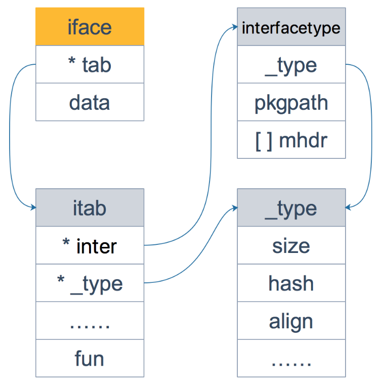
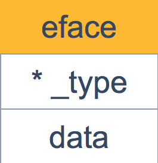

# 简介

在 Go 语言中，`iface` 和 `eface` 是内部数据结构，用于实现接口值。它们之间的主要区别在于它们处理的接口类型：

1. **`iface`**: 这是用于表示具有具体方法集的非空接口(包含方法)的内部结构。`iface` 包含两个字段：
   - `tab`: 指向 `itab` 的指针，`itab` 包含了关于接口类型和实现类型的信息，以及实现类型对接口中方法的指针。
   - `data`: 指向实现接口的具体类型的值的指针。
2. **`eface`**: 这是用于表示空接口 `interface{}` 的内部结构。`eface` 同样包含两个字段：
   - `_type`: 指向 `_type` 的指针，包含了具体类型的类型信息。
   - `data`: 指向具体类型的值的指针。

`iface` 和 `eface` 的主要区别在于 `iface` 需要额外的 `itab` 结构来存储方法表，而 `eface` 只需要存储类型信息和数据值。


# iface

## iface源码

`runtime/runtime2.go`

```golang
// 定义一个 iface 结构体，用于表示接口值
type iface struct {
	tab  *itab          // 指向 itab 结构体的指针
	data unsafe.Pointer // 存储具体值的指针,一般而言是一个指向堆内存的指针
}
```

`iface` 内部维护两个指针

- `tab` 指向一个 `itab` 实体， 它表示**接口的类型**以及赋给这个接口的**实体类型**。

- `data`则指向接口具体的值，一般而言是一个指向堆内存的指针。

```go
// Itab 的布局已知于编译器
// 在非垃圾回收内存中分配
// 需要与 ../cmd/compile/internal/reflectdata/reflect.go 文件中的 func.WriteTabs 函数保持同步
type itab struct {
	inter *interfacetype // 接口类型描述
	_type *_type         // 具体类型描述
	hash  uint32         // _type.hash 的副本，用于类型切换
	_     [4]byte        // 未使用的字节
	fun   [1]uintptr     // 变长字段。fun[0]==0 表示 _type 未实现接口
}
```

再来仔细看一下 `itab` 结构体：

- `inter` 字段则描述了接口的类型。

- `_type` 字段描述了实体的类型，包括内存对齐方式，大小等；
- `fun`字段放置和接口方法对应的**具体数据类型的方法地址**，实现接口调用方法的动态分派，一般在每次给接口赋值发生转换时会更新此表，或者直接拿缓存的
  itab。

这里只会列出实体类型和接口相关的方法，实体类型的其他方法并不会出现在这里。

另外，你可能会觉得奇怪，为什么 `fun` 数组的大小为1，要是接口定义了多个方法可怎么办？

- 实际上，这里存储的是第一个方法的函数指针，如果有更多的方法，在它之后的内存空间里继续存储。
- 从汇编角度来看，通过增加地址就能获取到这些函数指针，没什么影响。
- 顺便提一句，这些方法是**按照函数名称**的字典序进行**排列**的。


## interfacetype源码

再看一下 `interfacetype` 类型，它描述的是接口的类型：

`src/internal/abi/type.go`

```golang
// InterfaceType 定义了接口类型的结构
type InterfaceType struct {
	Type    Type      // 类型信息
	PkgPath Name      // 导入路径
	Methods []Imethod // 按哈希排序的方法列表
}

// Type 是 Go 类型的运行时表示
//
// Type 也会被隐式引用
// （以常量和 arch.PtrSize 相关的表达式形式）
// 在 cmd/compile/internal/reflectdata/reflect.go 和 cmd/link/internal/ld/decodesym.go 中被引用,
// （例如 data[2*arch.PtrSize+4] 引用了 TFlag 字段）
// 在那些地方无法直接使用 unsafe.OffsetOf(Type{}.TFlag)，因为它会随着交叉编译和实验而变化。
type Type struct {
	Size_       uintptr // 大小
	PtrBytes    uintptr // 类型中可以包含指针的前缀字节数
	Hash        uint32  // 类型哈希值；避免在哈希表中计算
	TFlag       TFlag   // 额外的类型信息标志
	Align_      uint8   // 变量与此类型的对齐方式
	FieldAlign_ uint8   // 结构字段与此类型的对齐方式
	Kind_       uint8   // 用于 C 的枚举
	// 用于比较该类型对象的函数
	// (指向对象 A 的指针, 指向对象 B 的指针) -> 是否相等?
	Equal func(unsafe.Pointer, unsafe.Pointer) bool
	// GCData 用于垃圾回收器存储 GC 类型数据
	// 如果 kind 中设置了 KindGCProg 位, GCData 是一个 GC 程序
	// 否则它是一个指针掩码位图。详细信息请参见 mbitmap.go
	GCData    *byte
	Str       NameOff // 字符串形式
	PtrToThis TypeOff // 指向此类型的指针的类型，可能为零
}
```

可以看到，它包装了 `Type` 类型，`Type` 实际上是描述 Go 语言中各种数据类型的结构体。

我们注意到，这里还包含一个 `Methods`字段，表示接口所定义的函数列表， `PkgPath` 记录定义了接口的包名。


## iface全貌

这里通过一张图来看下 `iface` 结构体的全貌：




# eface

## eface源码

接着来看一下 `eface` 的源码：

```golang
// eface 是空接口的内部表示
type eface struct {
	_type *_type         // 存储类型信息的指针
	data  unsafe.Pointer // 存储实际数据的指针
}
```

相比 `iface`，`eface` 就比较简单了。

- 只维护了一个 `_type` 字段，表示空接口所承载的具体的实体类型。

- `data` 描述了具体的值。




# 示例

```go
package main

import (
	"fmt"
	"unsafe"
)

type Animal interface {
	Speak()
}

type Dog struct{}

func (d Dog) Speak() {
	fmt.Println("Woof!")
}

func main() {
	var animal Animal = Dog{}
	// 打印iface结构的地址
	fmt.Printf("%p\n", (*(*[2]interface{})(unsafe.Pointer(&animal)))[0])
    
	// 打印eface结构的地址
	var anyVar interface{} = Dog{}
	fmt.Printf("%p\n", (*(*[2]interface{})(unsafe.Pointer(&anyVar)))[0])
}
```

在这个示例中，`Animal` 接口定义了一个 `Speak` 方法。

- 当我们创建一个 `Dog` 类型的变量并将其赋值给 `Animal` 接口类型的变量时，实际上创建了一个 `iface` 结构。
- 同样，当我们把 `Dog` 类型的变量赋值给 `interface{}` 类型的变量时，创建了一个 `eface` 结构。


总之，`iface` 和 `eface` 是 Go 运行时用于处理接口值的内部实现细节，理解它们有助于深入了解 Go 的接口和类型系统的工作原理。

但在日常编码中，你通常不需要直接与 `iface` 和 `eface` 打交道，因为 Go 的类型系统和编译器已经为你处理了这些细节。