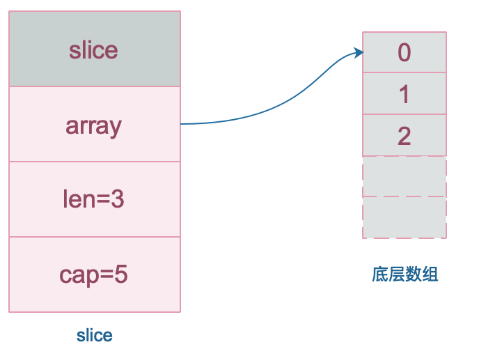
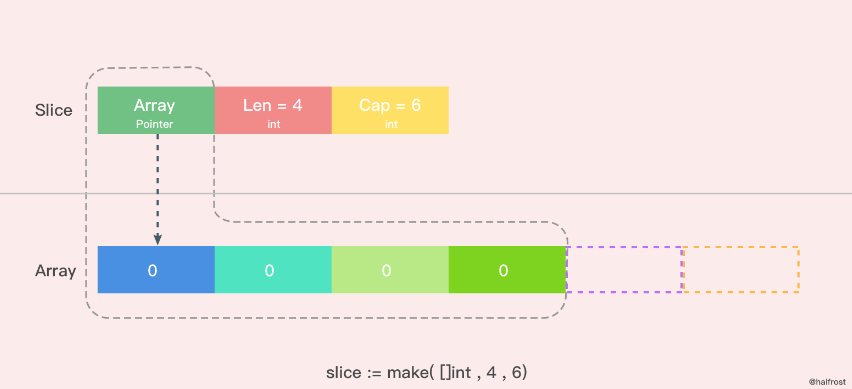
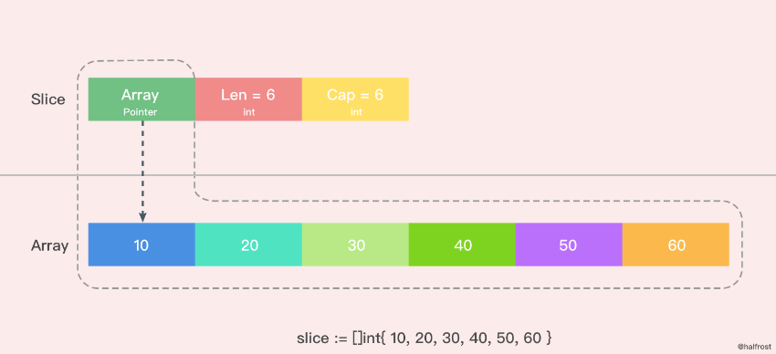
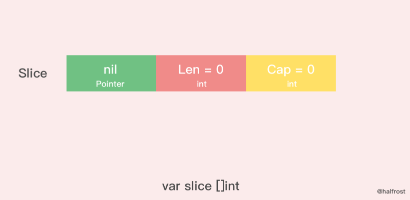
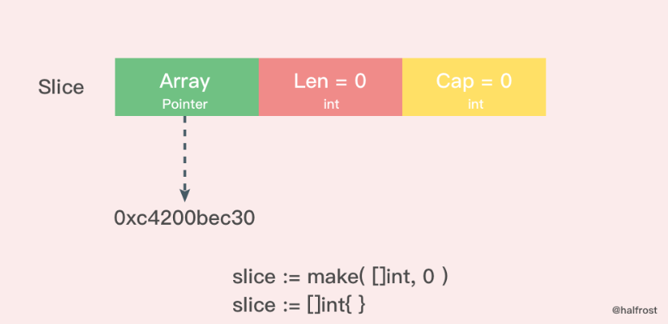

# 什么是切片


slice 切片的底层数据是数组，slice 切片是对数组的封装，两者都可以通过下标来访问单个元素。

- 数组是定长的，长度定义好之后，不能再更改。

- 在 Go 中，数组是不常见的，因为其长度是类型的一部分，限制了它的表达能力
- 比如 [3]int和 [4]int 就是不同的类型。

而slice 切片则非常灵活，它可以动态地扩容。切片的类型和长度无关。


# 数据结构

数组就是一片连续的内存， slice 切片实际上是一个结构体

包含三个字段：**长度、容量、底层数组**。

`src/runtime/slice.go`

```golang
type slice struct {
	array unsafe.Pointer // 数组指针
	len   int            // 长度
	cap   int            // 容量
}
```

slice 的数据结构如下：



切片的结构体由3部分构成

- Pointer 是指向一个数组的指针
- len 代表当前切片的长度
- cap 是当前切片的容量
  - cap 总是大于等于 len 的。

注意，底层数组是可以被多个 slice 同时指向的，因此对一个 slice 切片的元素进行操作是有可能影响到其他 slice 切片的。


如果想从 slice 中得到一块内存地址，可以这样做：

```go
s := make([]byte, 200)
ptr := unsafe.Pointer(&s[0]) // 拿到索引 0 位置的数组地址
```


# 创建切片

make 函数允许在运行期动态指定数组长度，绕开了数组类型必须使用编译期常量的限制。



```go
slice := make([]int,4,6)
```

上图是用 make 函数创建的一个 len = 4， cap = 6 的切片。

- 内存空间申请了6个 int 类型的内存大小。

- 由于 len = 4，所以后面2个暂时访问不到，但是容量还是在的。

- 这时候数组里面每个变量都是0 。


除了 make 函数可以创建切片以外，字面量也可以创建切片。



```go
slice := []int{10,20,30,40,50,60}
```

这里是用字面量创建的一个 len = 6，cap = 6 的切片，这时候数组里面每个元素的值都初始化完成了。

**需要注意的是 [ ] 里面不要写数组的容量，因为如果写了个数以后就是数组了，而不是切片了。**


## 创建切片源码解析

```go
	// 根据切片的数据类型，获取切片的最大容量
	maxElements := maxSliceCap(et.size)
    // 比较切片的长度，长度值域应该在[0,maxElements]之间
	if len < 0 || uintptr(len) > maxElements {
		panic(errorString("makeslice: len out of range"))
	}
    // 比较切片的容量，容量值域应该在[len,maxElements]之间
	if cap < len || uintptr(cap) > maxElements {
		panic(errorString("makeslice: cap out of range"))
	}
    // 根据切片的容量申请内存
	p := mallocgc(et.size*uintptr(cap), et, true)
    // 返回申请好内存的切片的首地址
	return slice{p, len, cap}
}
```


# nil 和空切片

nil 切片和空切片也是常用的。



```go
var slice []int
```

nil 切片被用在很多标准库和内置函数中，描述一个不存在的切片的时候，就需要用到 nil 切片。

比如函数在发生异常的时候，返回的切片就是 nil 切片。

nil 切片的指针指向 nil。


> 空切片一般会用来表示一个空的集合。比如数据库查询，一条结果也没有查到，那么就可以返回一个空切片。



```go
silce := make( []int , 0 )
slice := []int{ }
```

空切片和 nil 切片的区别在于，空切片指向的地址不是nil，指向的是一个内存地址

但是它没有分配任何内存空间，即底层元素包含0个元素。


最后需要说明的一点是。不管是使用 nil 切片还是空切片，对其调用内置函数 append，len 和 cap 的效果都是一样的。