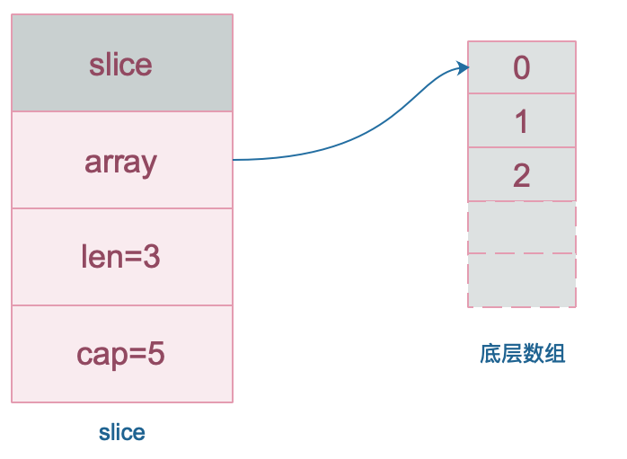

# 什么是切片

slice 切片的底层数据是数组，slice 切片是对数组的封装，两者都可以通过下标来访问单个元素。

- 数组是定长的，长度定义好之后，不能再更改。

- 在 Go 中，数组是不常见的，因为其长度是类型的一部分，限制了它的表达能力
- 比如 [3]int和 [4]int 就是不同的类型。

而slice 切片则非常灵活，它可以动态地扩容。切片的类型和长度无关。

# 数据结构

数组就是一片连续的内存， slice 切片实际上是一个结构体

包含三个字段：**长度、容量、底层数组**。

```golang
// runtime/slice.go
type slice struct {
    array unsafe.Pointer // 元素指针
    len   int // 长度 
    cap   int // 容量
}
```

slice 的数据结构如下：



注意，底层数组是可以被多个 slice 同时指向的，因此对一个 slice 切片的元素进行操作是有可能影响到其他 slice 切片的。

