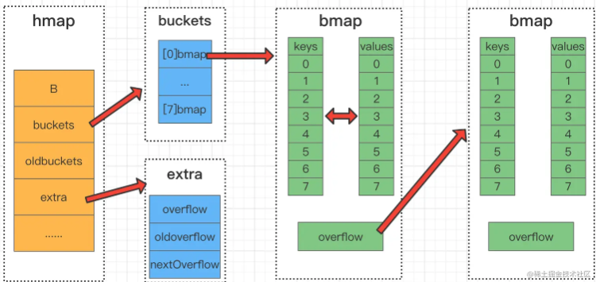
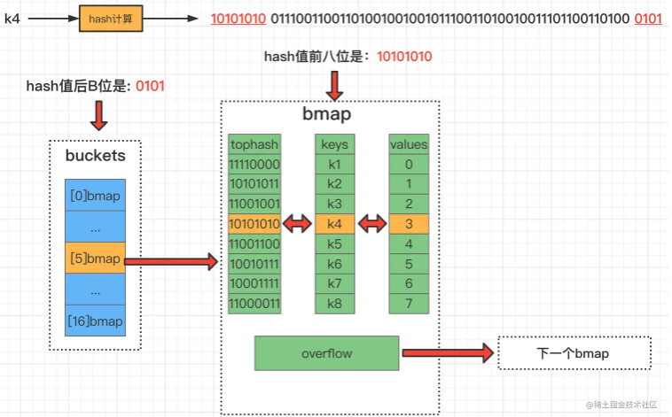
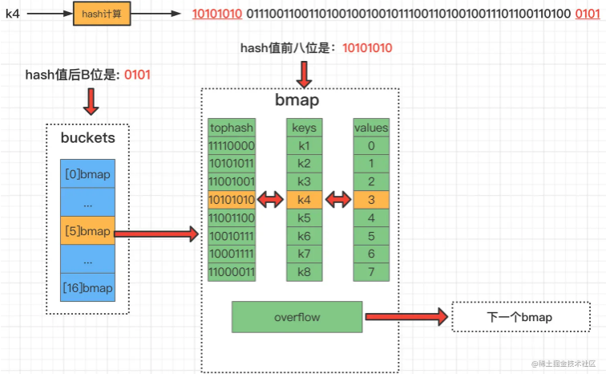
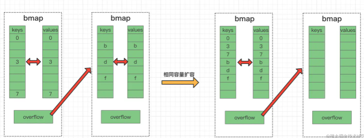
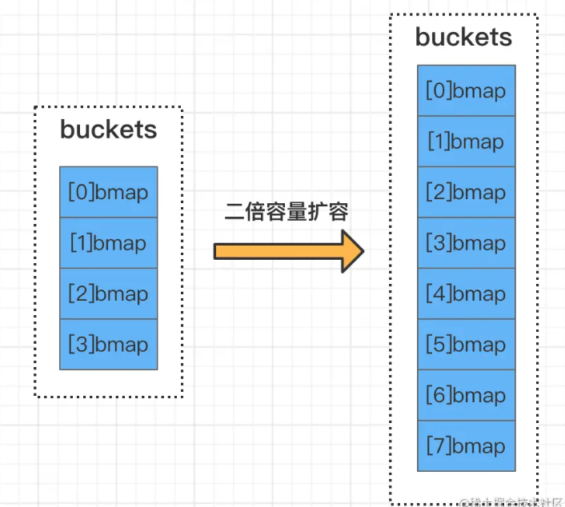

# 什么是 map

> 在计算机科学里，被称为相关数组、map、符号表或者字典，是由一组 `<key, value>` 对组成的抽象数据结构, 并且同一个
> key 只会出现一次。


# 简单操作

两个关键点：map 是由 `key-value` 对组成的；`key` 只会出现一次。

map 相关的操作主要是：

- 增加一个 key-value 对 —— Add or insert；
- 删除一个 key-value 对 —— Remove or delete；
- 修改某个 key 对应的 value —— Reassign；
- 查询某个 key 对应的 value —— Lookup；


# 数据结构

哈希查找表:

- 用一个哈希函数将 key 分配到不同的桶（bucket，也就是数组的不同 index）。

- 这样，开销主要在哈希函数的计算以及数组的常数访问时间。在很多场景下，哈希查找表的性能很高。

- 哈希查找表一般会存在“碰撞”的问题，就是说不同的 key 被哈希函数计算到了同一个 bucket 桶。

- 一般有两种应对方法：`链表法`和`开放地址法`。

    - `链表法`将一个 bucket 桶实现成一个链表，被哈希函数计算落在同一个 bucket 桶中的 key 都会插入这个链表。
    - `开放地址法`则是碰撞发生后，通过一定的规律，在数组的后面挑选“空位”，用来放置新的 key, 所有值都在数组中。


# map 的底层如何实现

## 关键知识点

1. 对于一个key-value, 先对key执行hash计算获得哈希值的二进制01的值
2. 根据桶的数量计算 B 的值, 获取二进制哈希的后低 B 位的二进制值, 转换为 十进制后得到桶数组的索引位置
3. 得到拥有8个key-value的桶之后, 利用二进制哈希的前高8位, 遍历所有key-value找到对应的位置

## map数据结构

在源码`src/runtime/map.go`中，表示 map 的结构体是 hmap，它是 hashmap 的“缩写”：

```go
// 一个Go语言map的头部结构定义。
type hmap struct {
	// 存活的单元格数 == map的大小。必须放在首位（被len()内建函数使用）
	count int

	// 标志位
	flags uint8

	// log_2(# 桶的数量)
	B uint8

	// 大概的溢出桶数量；详细见incrnoverflow
	noverflow uint16

	// 哈希种子,计算 key 的哈希的时候会传入哈希函数
	hash0 uint32

	// 存放2^B个桶的数组。如果count==0，可能为nil。
	buckets unsafe.Pointer

	// 先前的桶数组
	// 等量扩容的时候，buckets 长度和 oldbuckets 相等
	// 双倍扩容的时候，buckets 长度会是 oldbuckets 的两倍
	oldbuckets unsafe.Pointer

	// 指示扩容进度，小于此地址的 buckets 迁移完成
	nevacuate uintptr

	// 可选字段
	extra *mapextra
}
```

说明一下

- `B` 是 buckets 数组的长度的对数，也就是说 buckets 数组的长度就是 2^B。

- bucket 里面存储了 key 和 value，后面会再讲。


## buckets桶数据结构

> bucket 里面存储了 key 和 value

buckets 是一个指针，最终它源码指向的是一个结构体：

**但这只是表面的结构，编译期间会给它加料**

```go
minTopHash = 5 // 正常填充单元格的最小 tophash 。

// Go map中的一个桶的定义。
type bmap struct {
	// tophash 通常包含哈希值的高字节，用于每个键在此桶中。
    // 如果 tophash[0] < minTopHash，tophash[0] 实际上是一个桶撤离状态(buckets 迁移完成)。
	tophash [bucketCnt]uint8
	// 后面跟着 bucketCnt 个键，然后是 bucketCnt 个元素。
	// 注意：将所有键连续存放，然后是所有元素，虽然代码会比交替键/元素/键/元素... 更加复杂，
	// 但这样可以消除填充，否则可能需要填充，例如对于map[int64]int8。
	// 接着是溢出指针。
}
```

动态地创建一个新的结构：

```go
type bmap struct {
    topbits  [8]uint8    	// 存储哈希值的高8位
    keys     [8]keytype  	// 存储 长度为8的key 的数组
    values   [8]valuetype   // 存储 长度为8value 的数组
    pad      uintptr  		// 内存对齐保留字段
    overflow uintptr  		// 溢出指针，用于处理哈希冲突
}
```

`bmap` 就是我们常说的“桶”

- 一个桶里面会装 8 个 key，这些 key 之所以会落入同一个桶，是因为它们经过哈希计算后，哈希结果是“一类”的
- 在桶内，又会根据 key 计算出来的 hash 值的 **高 8 位** 来决定 key 到底落入桶内的哪个位置（一个桶内有8个位置）


来一个整体的图：



- 在一个整体的 map 中, 有一个 buckets 桶数组, 包含了多个 bmap 的 k-v 结构
- 我们通过对一个 key 执行哈希计算得到一个  buckets 桶数组的索引, 获取到指定的 bmap
- key 计算出来的 hash 值的 **高 8 位** 来决定 key 到底落入桶内的哪个索引的 keys 位置
- 然后这个索引位置对应 values 的位置就是值位置
  - 我们会在 [map中数据操作的get获取数据] 部分说明这个取值的步骤


# map创建

从语法层面上来说，创建 map 很简单：

```go
ageMp := make(map[string]int)
// 指定 map 长度, 桶数量=8, B=2^3=3
ageMp := make(map[string]int, 8)

// ageMp 为 nil，不能向其添加元素，会直接panic
var ageMp map[string]int
```

通过汇编语言可以看到，实际上底层调用的是 `makemap` 函数，主要做的工作就是初始化 `hmap` 结构体的各种字段

```go
// 函数实现了Go map的创建 make(map[k]v, hint)。
// 如果编译器确定 map 或第一个桶可以在堆栈上创建，h和/或bucket可能非nil。
// 如果 h != nil，则 map 可以直接在 h 中创建。
// 如果 h.buckets != nil ，则指向的桶可以用作第一个桶。
func makemap(t *maptype, hint int, h *hmap) *hmap {
	mem, overflow := math.MulUintptr(uintptr(hint), t.Bucket.Size_)
	if overflow || mem > maxAlloc {
		hint = 0
	}

	// 初始化 hmap
	if h == nil {
		h = new(hmap)
	}
	h.hash0 = fastrand()

	// 找到大小参数B以容纳请求的元素数量。
	// 比较 hint 是否超过 6.5 的负载因子, 如果超过 B++
	B := uint8(0)
	for overLoadFactor(hint, B) {
		B++
	}
	h.B = B

	// 分配初始哈希表
	// 如果B == 0，则buckets字段稍后会延迟分配（在mapassign中）
	// 如果hint很大，将内存清零可能需要一段时间。
	if h.B != 0 {
		var nextOverflow *bmap
		h.buckets, nextOverflow = makeBucketArray(t, h.B, nil)
		if nextOverflow != nil {
			h.extra = new(mapextra)
			h.extra.nextOverflow = nextOverflow
		}
	}

	return h
}
```


# map中数据操作

了解了map的数据结构后，下面让我们学习一下在map中存取数据的过程：


## get获取数据

>  **假设当前 B=4 即桶数量为2^B=16个**，要从map中获取 k4 对应的 value



**参考上图，k4的get流程可以归纳为如下几步：**

- **计算k4的hash值**。[由于当前主流机都是64位操作系统，所以计算结果有64个比特位]

- **通过最后的“B”位来确定在哪号桶**，此时B为4，所以取k4对应哈希值的后4位，也就是0101，0101用十进制表示为5，所以在5号桶）

- **根据k4对应的hash值前8位快速确定是在这个桶的哪个bmap位置**, 一旦发现前8位一致，则会执行下一步
  - 额外说明一下，快速其实不是定位, 而是用高8位去遍历比较

- **对比该地址的k与查询的k4是否相等**，如果匹配则获取对应索引位置的 value 值

- **如果都没有找到，就去连接的下一个溢出桶中找**


### get源码解析

`src/runtime/map.go`

```go
// 返回指向h[key]的指针。永远不返回nil，而是如果key不在map中，则返回elem类型的零对象的引用。
// 注意：返回的指针可能会保持整个map活跃，所以不要长时间保留它。
func mapaccess1(t *maptype, h *hmap, key unsafe.Pointer) unsafe.Pointer {
    // 123访问检查
	...
    
	// 计算hash值
	hash := t.Hasher(key, uintptr(h.hash0))
	// 返回 1 << b-1，针对代码生成进行了优化。
	m := bucketMask(h.B)
	// 将哈希表的buckets指针与哈希值hash进行运算，并根据掩码值m得到桶索引位置，最终计算出要查找的桶的指针位置
	b := (*bmap)(add(h.buckets, (hash&m)*uintptr(t.BucketSize)))
	// 处理旧buckets
	if c := h.oldbuckets; c != nil {
		if !h.sameSizeGrow() {
			// 之前有一半的桶；再掩码一次向下减少2的幂次
			m >>= 1
		}
		oldb := (*bmap)(add(c, (hash&m)*uintptr(t.BucketSize)))
		if !evacuated(oldb) {
			b = oldb
		}
	}
    // 计算高8位hash
	top := tophash(hash)

bucketloop: // 遍历bucket链表
	for ; b != nil; b = b.overflow(t) {
		// 遍历桶中条目
		for i := uintptr(0); i < bucketCnt; i++ {
			// 如果当前桶中的 tophash[i] 不等于 top
			if b.tophash[i] != top {
				// 如果当前桶中的 tophash[i] 等于 emptyRest(空)，则跳出 bucketloop
				if b.tophash[i] == emptyRest {
					break bucketloop
				}
				// 继续下一轮循环
				continue
			}
			// 计算当前 key 对应的指针地址
			k := add(unsafe.Pointer(b), dataOffset+i*uintptr(t.KeySize))
			// 如果需要间接引用key，则进行间接引用
			if t.IndirectKey() {
				k = *((*unsafe.Pointer)(k))
			}
			// 如果找到匹配的key，则返回对应的value指针
			if t.Key.Equal(key, k) {
				// 计算当前 value 对应的指针地址
				e := add(unsafe.Pointer(b), dataOffset+bucketCnt*uintptr(t.KeySize)+i*uintptr(t.ValueSize))
				// 如果需要间接引用elem，则进行间接引用
				if t.IndirectElem() {
					e = *((*unsafe.Pointer)(e))
				}
				// 返回找到的 value 指针
				return e
			}
		}
	}

	// 未找到匹配的key，返回elem类型的零对象的引用
	return unsafe.Pointer(&zeroVal[0])
}
```

1. 进行一系列的内存访问检查：
   - 如果启用了 race 检查，并且 h 不为 nil，则进行 race 检查。
   - 如果启用了 msan 检查，并且 h 不为 nil，则进行 msan 检查。
   - 如果启用了 asan 检查，并且 h 不为 nil，则进行 asan 检查。
2. 检查 map 是否为空或计数为 0，若满足条件，则返回 elem 类型的零对象的引用。
3. 检查并发写入标记，如果标记为 hashWriting，表示发生并发 map 读写，程序报错。
4. 计算 key 的哈希值 hash。
5. 根据 hash 计算出掩码值 m，用于确定桶的位置。
6. 根据 hash 和 m 计算出要查找的桶的指针位置 b。
7. 处理旧 buckets：
   - 如果存在旧 buckets，根据情况对 m 进行调整。
   - 获取旧 buckets 中对应哈希值位置的桶指针 oldb，如果未迁移完成，则使用 oldb。
8. 确定待查找的 tophash 高8位值 top。
9. 遍历当前桶及溢出桶中的条目，逐个比较 key：
   - 匹配到对应的 key 时，返回对应的 value 指针。
10. 如果未找到匹配的 key，则返回 elem 类型的零对象的引用。


## put存放数据



**map的赋值流程可总结位如下几步：**

- **通过key的hash值后“B”位确定是哪一个桶**，图中示例为5号桶。

- 遍历当前桶bmap，通过 key 的 tophash (高8位101010) 和 完整key ,  **找到第一个可以插入的位置**，即空位置处存储数据。

- 如果**当前桶元素已满，会通过 overflow 链接创建一个新的桶**，来存储数据。


**关于hash冲突**：当两个不同的 key 落在同一个桶中，就是发生了哈希冲突。

冲突的解决手段是采用链表法：在 桶 中，从前往后找到第一个空位进行插入。如果8个kv满了，那么当前桶就会连接到下一个溢出桶（bmap）。


### put源码解析

`src/runtime/map.go`

```go
// 函数的作用是在 map 中分配或更新一个键值对。
// 如果键已经存在于 map 中，函数会更新其对应的值；
// 如果键不存在，则函数会为该键分配一个新的位置并插入键值对。
func mapassign(t *maptype, h *hmap, key unsafe.Pointer) unsafe.Pointer {
    // 123访问检查
	...

	// 计算 key 的哈希值
	hash := t.Hasher(key, uintptr(h.hash0))
	// 设置写标志
	h.flags ^= hashWriting

	// 如果 map 的 buckets 未初始化，则初始化 buckets
	if h.buckets == nil {
		h.buckets = newobject(t.Bucket) // newarray(t.Bucket, 1)
	}

again:
	// 计算 key 应该存放的 bucket 的索引
	bucket := hash & bucketMask(h.B)
	// 如果 map 正在增长，执行增长操作
	if h.growing() {
		growWork(t, h, bucket)
	}
	// 获取当前 bucket 的地址
	b := (*bmap)(add(h.buckets, bucket*uintptr(t.BucketSize)))
	// 获取高8位，用于快速查找和比较
	top := tophash(hash)

	// 高8位
	var inserti *uint8
	// key
	var insertk unsafe.Pointer
	// value
	var elem unsafe.Pointer
bucketloop:
	for {
		// 遍历 bucket 中的所有键值对, 如果相同key则更新, 如果遇到一个空位则写入
		for i := uintptr(0); i < bucketCnt; i++ {
			if b.tophash[i] != top {
				// 如果当前槽的 top hash 不匹配，检查是否为空可以插入
				if isEmpty(b.tophash[i]) && inserti == nil {
					// 存储高8位
					inserti = &b.tophash[i]
					// 存储key
					insertk = add(unsafe.Pointer(b), dataOffset+i*uintptr(t.KeySize))
					// 存储value
					elem = add(unsafe.Pointer(b), dataOffset+bucketCnt*uintptr(t.KeySize)+i*uintptr(t.ValueSize))
				}
				if b.tophash[i] == emptyRest {
					break bucketloop
				}
				continue
			}
			// 获取键的地址
			k := add(unsafe.Pointer(b), dataOffset+i*uintptr(t.KeySize))
			// 如果需要间接引用key，则进行间接引用
			if t.IndirectKey() {
				k = *((*unsafe.Pointer)(k))
			}
			// 比较如果key与当前地址的key不相同, 则退出继续遍历下一个
			if !t.Key.Equal(key, k) {
				continue
			}
			// 如果 key 匹配，更新值
			if t.NeedKeyUpdate() {
				typedmemmove(t.Key, k, key)
			}
			elem = add(unsafe.Pointer(b), dataOffset+bucketCnt*uintptr(t.KeySize)+i*uintptr(t.ValueSize))
			goto done
		}
		// 如果 bucket 已满，遍历下一个 bucket
		ovf := b.overflow(t)
		if ovf == nil {
			break
		}
		b = ovf
	}

	// 未找到键的映射。分配新 bucket 并链接到上一个 bucket 后面。

	// 如果 map 达到了最大负载因子，或者溢出桶的数量过多，
	if !h.growing() && (overLoadFactor(h.count+1, h.B) || tooManyOverflowBuckets(h.noverflow, h.B)) {
		// 如果需要对 map 进行扩容，执行扩容操作
		hashGrow(t, h)
		// 执行扩容之后重新开始查找，因为 map 结构可能已经发生变化导致插入的位置改变
		goto again
	}

	// 如果没有找到空槽，需要处理 map 的增长或创建新的 overflow bucket
	if inserti == nil {
		// 如果 bucket 和 overflow bucket 都满了，创建新的 overflow bucket
		newb := h.newoverflow(t, b)
		// 存储高8位
		inserti = &newb.tophash[0]
		// 存储key
		insertk = add(unsafe.Pointer(newb), dataOffset)
		// 存储value
		elem = add(insertk, bucketCnt*uintptr(t.KeySize))
	}

	// 插入新的键值对
	if t.IndirectKey() {
		kmem := newobject(t.Key)
		*(*unsafe.Pointer)(insertk) = kmem
		insertk = kmem
	}
	// 返回值的地址，如果 key 是间接的，则返回间接地址
	if t.IndirectElem() {
		vmem := newobject(t.Elem)
		*(*unsafe.Pointer)(elem) = vmem
	}
	typedmemmove(t.Key, insertk, key)
	// 存储高8位
	*inserti = top
	// 计数
	h.count++

done:
	// 清除写标志
	if h.flags&hashWriting == 0 {
		fatal("并发 map 写入")
	}
	h.flags &^= hashWriting
	// 返回值的地址，如果 key 是间接的，则返回间接地址
	if t.IndirectElem() {
		elem = *((*unsafe.Pointer)(elem))
	}
	return elem
}
```

1. 检查 map 是否为 nil，如果为 nil，则抛出异常。
3. 检查并发写入标记，如果标记为 hashWriting，表示发生并发写入，程序报错。
4. 计算 key 的哈希值。
5. 设置写标志，表示当前正在写入 map。
6. 若 map 的 buckets 为 nil，则初始化 buckets。
7. 计算 key 应该存放的 bucket 的索引。
8. 如果 map 正在增长，则执行增长操作。
9. 获取当前 bucket 的地址，获取高 8 位哈希值作为快速查找和比较标识 top。
10. 遍历 bucket 中的键值对：
    - 如果当前槽的 tophash 与 top 不匹配，检查是否为空，如果为空则标记可以插入。
    - 如果当前槽的 tophash 为 emptyRest，跳出循环。
    - 比较 key，如果 key 匹配，则更新值并直接结束。
11. 若 bucket 已满，遍历下一个溢出桶。
12. 如果未找到键的映射，考虑增长 map 的操作：
    - 如果需要增长，则执行增长操作。
    - 如果没有找到空槽，创建新的 overflow bucket。
13. 考虑分配新 bucket ,插入新的键值对：
    - 如果 key 是间接的，分配新的空间存储 key 的值；
    - 如果 value 是间接的，分配新的空间存储 value 的值；
    - 复制 key 的值到指定位置；
    - 设置新槽的 tophash；
    - 更新计数。
14. 清除写标志，表示写入操作结束。
15. 返回值的地址，如果 value 是间接的，则返回间接地址。


# map扩容

## 扩容的方式

### 相同 buckets 容量扩容



由于map中不断的put和delete key，桶中可能会出现很多断断续续的空位

这些空位会导致连接的bmap溢出桶很长，导致扫描时间边长。

这种扩容实际上是一种整理，把后置位的数据整理到前面。

**这种情况下，元素会发生重排，但不会换桶。**


### 2倍 buckets 容量扩容



这种2倍扩容是由于当前 buckets 桶数组确实不够用了，**发生这种扩容时，元素会重排，可能会发生桶迁移**。

如图中所示

- 扩容前`B=2(size=2^B)` -> 扩容后`B=3(size=2^B)`

- 假设新元素 key 的 hash值 后三位为101(B=3)

那么由上文的介绍可知

- 在扩容前，由 hash值 的**后两位**(B=2)来决定几号桶
  
-  01 所以元素在1号桶。 
  
- 在扩容后，由 hash值 得**后三位**来决定几号桶

    - **原来01结尾的001的所有元素不变, 还是在1号桶**
    - **原来01结尾的101所有元素会迁移到5号桶**

  

**扩容的条件**

首先我们了解下**装载因子(loadFactor)**的概念

```go
loadFactor := count / (2^B) // 装载因子 = map中元素的个数 / map中当前桶的个数
```

通过计算公式我们可以得知，**装载因子是指当前map中，每个桶中的平均元素个数。**


**扩容条件1**：**装载因子 > 6.5 **(源码中定义的)

这个也非常容易理解，正常情况下

- 如果没有溢出桶，那么一个桶中最多有8个元素
- 当平均每个桶中的数据超过了6.5个，那就意味着当前容量要不足了，发生扩容

**扩容条件2**:  **溢出桶的数量不能大于桶数组 buckets 的长度**

- 当 B < 15 时,  overflow 的 bucket 数量超过 2^B -> 扩容。

- 当 B >= 15 时, overflow 的 bucket 数量超过 2^15 -> 扩容。

简单来讲，新加入key的hash值后B位都一样，使得个别桶一直在插入新数据，进而导致它的溢出桶链条越来越长。

如此一来，当map在操作数据时，扫描速度就会变得很慢。及时的扩容，可以对这些元素进行重排，使元素在桶的位置更平均一些。


**扩容时的细节**

1. 在我们的 hmap 结构中有一个 oldbuckets，扩容刚发生时，会先将老数据存到这个里面。
2. 每次对 map 进行删改操作时，会触发从 oldbucket 中迁移到 bucket 的操作【非一次性，分多次】
3. 在扩容没有完全迁移完成之前，每次 get 或者 put 遍历数据时，都会先遍历 oldbuckets，然后再遍历buckets

### 扩容源码解析

> 这部分的源码入口其实就是put的过程中发生的

`src/runtime/map.go`

```go
// 函数的作用是在 map 中分配或更新一个键值对。
// 如果键已经存在于 map 中，函数会更新其对应的值；
// 如果键不存在，则函数会为该键分配一个新的位置并插入键值对。
func mapassign(t *maptype, h *hmap, key unsafe.Pointer) unsafe.Pointer {
    ...
	again:
        // 计算 key 应该存放的 bucket 的索引
        bucket := hash & bucketMask(h.B)
        // 如果 map 正在增长，执行增长操作
        if h.growing() {
            growWork(t, h, bucket)
        }
    ...
    
	// 如果 map 达到了最大负载因子，或者溢出桶的数量过多，
	if !h.growing() && (overLoadFactor(h.count+1, h.B) || tooManyOverflowBuckets(h.noverflow, h.B)) {
		// 如果需要对 map 进行扩容，执行扩容操作
		hashGrow(t, h)
		// 执行扩容之后重新开始查找，因为 map 结构可能已经发生变化导致插入的位置改变
        // 重新查找会执行数据迁移
		goto again
	}
    ...
}	
```

```go
// 报告放置在 1<<B 存储桶中的count items是否超过 loadFactor=6.5 加载因子 。
func overLoadFactor(count int, B uint8) bool {
	return count > bucketCnt && uintptr(count) > loadFactorNum*(bucketShift(B)/loadFactorDen)
}
```

```go
// 判断溢出桶的数量是否过多对于一个拥有 1<<B 个桶的哈希表来说。
func tooManyOverflowBuckets(noverflow uint16, B uint8) bool {
	// 如果阈值过低，会带来多余的工作；
	// 如果阈值过高，增长和缩小的哈希表可能会占用大量未使用的内存。
	if B > 15 {
		B = 15
	}
    // 1. noverflow 的 bucket 数量超过 2^B
	// 2. noverflow 的 bucket 数量超过 2^15
	return noverflow >= uint16(1)<<(B&15)
}
```
**扩容但是不迁移**

```go
// 扩容
func hashGrow(t *maptype, h *hmap) {
	// 如果达到了负载因子，需要扩容
	// 否则，溢出桶太多，保持相同桶数，稍后进行水平"扩容"
	bigger := uint8(1)
	if !overLoadFactor(h.count+1, h.B) {
		bigger = 0
		h.flags |= sameSizeGrow
	}
	oldbuckets := h.buckets
	// 创建新的桶数组
	newbuckets, nextOverflow := makeBucketArray(t, h.B+bigger, nil)

	// 处理标志位，保留与迭代器相关的标志位
	flags := h.flags &^ (iterator | oldIterator)
	if h.flags&iterator != 0 {
		flags |= oldIterator
	}

	// 提交扩容操作（与 GC 原子操作）

	// 更新桶的数量
	h.B += bigger
	h.flags = flags
	// 记录旧桶
	h.oldbuckets = oldbuckets
	// 使用新桶
	h.buckets = newbuckets
    // 搬迁进度为 0
	h.nevacuate = 0
	h.noverflow = 0

	if h.extra != nil && h.extra.overflow != nil {
		// 将当前的溢出桶提升为旧的一代
		if h.extra.oldoverflow != nil {
			throw("oldoverflow is not nil")
		}
		h.extra.oldoverflow = h.extra.overflow
		h.extra.overflow = nil
	}
	if nextOverflow != nil {
		// 将新的溢出桶链接到链表中
		if h.extra == nil {
			h.extra = new(mapextra)
		}
		h.extra.nextOverflow = nextOverflow
	}

	// 实际的哈希表数据复制是由 growWork() 和 evacuate() 函数逐步进行的
}
```

1. 旧数据的引用指向`oldbuckets`, 重新new一个新的newbuckets
2. 初始化一下搬迁的进度 0。

**扩容**

```go
// 扩容迁移数据
func growWork(t *maptype, h *hmap, bucket uintptr) {
	// 用于在 map 扩容期间迁移旧 bucket 中的数据到新 bucket
	evacuate(t, h, bucket&h.oldbucketmask())

	// 再搬迁一个 bucket，以加快搬迁进程
	if h.growing() {
		// 迁移一个额外的旧桶以推动扩容进度
		// nevacuate 指示扩容进度，小于此地址的 buckets 迁移完成
		evacuate(t, h, h.nevacuate)
	}
}
```

```go
// 函数用于在 map 扩容期间迁移旧 bucket 中的数据到新 bucket。
// 它根据新的 bucket 数量和大小，将数据从旧的 bucket 分发到新的 bucket。
func evacuate(t *maptype, h *hmap, oldbucket uintptr) {
    // 获取旧 bucket 的地址
    // 将 oldbucket 位置的地址,转换为指向 bmap 结构体类型的指针
    // 最后，将这个指针赋值给结构体 x 中的字段 b，这样结构体 x 就可以通过字段 b 访问到哈希表中旧桶的数据。
	b := (*bmap)(add(h.oldbuckets, oldbucket*uintptr(t.BucketSize)))
	// 新的 bucket 数量的位表示, 结果是 2^B，如 B = 5，结果为 2^5 = 32
	newbit := h.noldbuckets()
	// 检查 bucket 是否已经被迁移过
	if !evacuated(b) {
		// xy包含x和y (低和高) 疏散目标。
		var xy [2]evacDst
		// x 是目的地之一
		x := &xy[0]
		// 将 oldbucket 位置的地址,转换为指向 bmap 结构体类型的指针
		// 最后，将这个指针赋值给结构体 x 中的字段 b，这样结构体 x 就可以通过字段 b 访问到哈希表中旧桶的数据。
		x.b = (*bmap)(add(h.buckets, oldbucket*uintptr(t.BucketSize)))
		// x 的 key 开始地址
		x.k = add(unsafe.Pointer(x.b), dataOffset)
		// x 的 value 开始地址
		x.e = add(x.k, bucketCnt*uintptr(t.KeySize))

		// 报告当前增长是否为相同大小的映射
		if !h.sameSizeGrow() {
			// 如果不是同尺寸扩容
			// y 是另一个目的地
			y := &xy[1]
          	// y 代表的 bucket 序号增加了 2^B
			// 将 oldbucket+newbit 位置的地址,转换为指向 bmap 结构体类型的指针
			// 最后，将这个指针赋值给结构体 y 中的字段 b，这样结构体 y 就可以通过字段 b 访问到哈希表中新桶的数据。
			y.b = (*bmap)(add(h.buckets, (oldbucket+newbit)*uintptr(t.BucketSize)))
			// y 的 key 开始地址
			y.k = add(unsafe.Pointer(y.b), dataOffset)
			// y 的 value 开始地址
			y.e = add(y.k, bucketCnt*uintptr(t.KeySize))
		}

		// 遍历旧 bucket
		for ; b != nil; b = b.overflow(t) {
			// 当前 bucket 的 key 开始地址
			k := add(unsafe.Pointer(b), dataOffset)
			// 当前 bucket 的 value 开始地址
			e := add(k, bucketCnt*uintptr(t.KeySize))

			// 遍历 bucket 中的每一个槽
			for i := 0; i < bucketCnt; i, k, e = i+1, add(k, uintptr(t.KeySize)), add(e, uintptr(t.ValueSize)) {
				// 当前槽的 tophash 高8位值
				top := b.tophash[i]
				// 如果槽是空的
				if isEmpty(top) {
					// 标记槽为空且已被迁移
					b.tophash[i] = evacuatedEmpty
					continue
				}
				// 检查 tophash 高8位的有效性
				if top < minTopHash {
					throw("bad map state") // 如果无效，抛出错误
				}

				// 赋值k的地址
				k2 := k
				if t.IndirectKey() {
					k2 = *((*unsafe.Pointer)(k2))
				}

				// 用于决定使用 x 还是 y 目的地
				var useY uint8
				// 如果不是等量扩容
				if !h.sameSizeGrow() {
					// 计算 key 的哈希值
					hash := t.Hasher(k2, uintptr(h.hash0))
					// 如果有协程正在遍历 map
					// 如果出现 相同的 key 值，算出来的 hash 值不同
					if h.flags&iterator != 0 && !t.ReflexiveKey() && !t.Key.Equal(k2, k2) {
						useY = top & 1      // 用 tophash 的最低位决定
						top = tophash(hash) // 重计算 tophash
					} else {
						// 取决于新哈希值的 oldB+1 位是 0 还是 1, 是留在旧桶还是迁移新桶
						if hash&newbit != 0 {
							useY = 1
						}
					}
				}

				// 确保 evacuatedX 和 evacuatedY 的关系正确
				if evacuatedX+1 != evacuatedY || evacuatedX^1 != evacuatedY {
					throw("bad evacuatedN")
				}

				// 标志老的 cell 的 top hash 值，表示搬移到 X 部分
				// 搬迁完毕的 key 的 tophash 值会是一个状态值，表示 key 的搬迁去向
				b.tophash[i] = evacuatedX + useY // evacuatedX + 1 == evacuatedY
				// 选择目的地
				dst := &xy[useY]
				// 如果目的地的槽已满, 创建一个新的扩容, 否则在同一个 bucket 中迁移
				if dst.i == bucketCnt {
					// 创建新的 overflow bucket
					dst.b = h.newoverflow(t, dst.b)
					dst.i = 0
					// 更新 key 开始地址
					dst.k = add(unsafe.Pointer(dst.b), dataOffset)
					// 更新 value 开始地址
					dst.e = add(dst.k, bucketCnt*uintptr(t.KeySize))
				}

				// 将 key 和 value 移动到 dst 目的地, 元素的目标位置对应到新桶中的索引位置
				dst.b.tophash[dst.i&(bucketCnt-1)] = top // 设置目的地的 tophash
				if t.IndirectKey() {
					*(*unsafe.Pointer)(dst.k) = k2 // 如果 key 是间接的，复制指针
				} else {
					typedmemmove(t.Key, dst.k, k) // 否则，复制 key
				}
				if t.IndirectElem() {
					*(*unsafe.Pointer)(dst.e) = *(*unsafe.Pointer)(e) // 如果 value 是间接的，复制指针
				} else {
					typedmemmove(t.Elem, dst.e, e) // 否则，复制 value
				}

				// 更新目的地的槽计数
				dst.i++
				// 更新 key 和 value 的地址，准备下一次迭代
				dst.k = add(dst.k, uintptr(t.KeySize))
				dst.e = add(dst.e, uintptr(t.ValueSize))
			}
		}
		// 清理旧 bucket 的溢出桶并清除 key 和 value，帮助 GC
		if h.flags&oldIterator == 0 && t.Bucket.PtrBytes != 0 {
			b := add(h.oldbuckets, oldbucket*uintptr(t.BucketSize))
			// 保留b.tophash，因为疏散状态保持在那里。
			ptr := add(b, dataOffset)
			n := uintptr(t.BucketSize) - dataOffset
			memclrHasPointers(ptr, n)
		}
	}

	// 更新 map 的 evacuation 标记
	if oldbucket == h.nevacuate {
		advanceEvacuationMark(h, t, newbit)
	}
}
```

1. 获取旧桶的地址以及新桶总数的位表示。
2. 检查旧桶是否已经被迁移处理过。
3. 将目的地 x 设置为新桶中与旧桶对应位置的桶。
4. 遍历旧桶中的每个槽，准备迁移键值对。
5. 对每个槽中的键值对进行处理：
   - 标记空槽为已迁移空状态。
   - 如果不是等量扩容，确定目的地 x 或 y，并处理特殊情况。
   - 如果目的地的槽已满, 创建一个新的扩容, 否则在同一个 bucket 中迁移
   - 将键值对复制移动到新位置。
6. 清理旧 bucket 的溢出桶并清除 key 和 value，以帮助垃圾回收。
7. 更新 map 的 evacuation 标记，进入下一轮迁移处理。