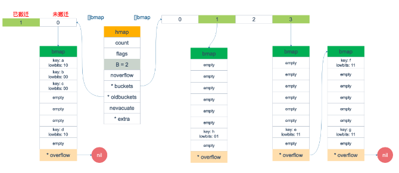
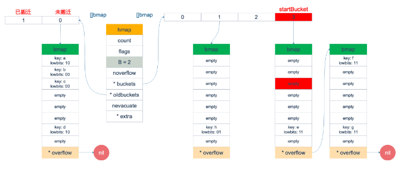
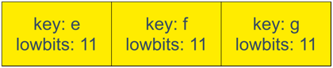
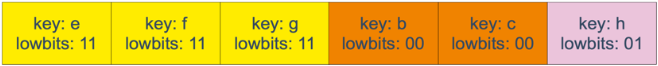
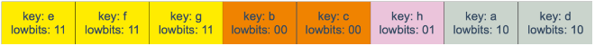

# 步骤

本来 map 的遍历过程比较简单：

- 遍历所有的 bucket 以及它后面挂的 overflow bucket，然后挨个遍历 bucket 中的所有 cell 键值对。
- 每个 bucket 中包含 8 个 cell 键值对，从有 key 的 cell 中取出 key 和 value，这个过程就完成了。


但是，现实并没有这么简单。还记得前面讲过的扩容过程吗？

扩容过程不是一个原子的操作，它每次最多只搬运 2 个 bucket

所以如果触发了扩容操作，那么在很长时间里，map 的状态都是处于一个中间态：

- 有些 bucket 已经搬迁到新家
- 而有些 bucket还待在老地方

因此，遍历如果发生在扩容的过程中，就会涉及到遍历新老 bucket 的过程，这是难点所在。


# 源码解析

关于 map 迭代，先是调用 `mapiterinit` 函数初始化迭代器，然后循环调用 `mapiternext` 函数进行map 迭代。


迭代器的结构体定义：

```golang
type hiter struct {
    // key 指针
    key         unsafe.Pointer
    // value 指针
    value       unsafe.Pointer
    // map 类型，包含如 key size 大小等
    t           *maptype
    // map header
    h           *hmap
    // 初始化时指向的 bucket
    buckets     unsafe.Pointer
    // 当前遍历到的 bmap
    bptr        *bmap
    overflow    [2]*[]*bmap
    // 起始遍历的 bucket 编号
    startBucket uintptr
    // 遍历开始时 cell 的编号（每个 bucket 中有 8 个 cell）
    offset      uint8
    // 是否从头遍历了
    wrapped     bool
    // B 的大小
    B           uint8
    // 指示当前 cell 序号
    i           uint8
    // 指向当前的 bucket
    bucket      uintptr
    // 因为扩容，需要检查的 bucket
    checkBucket uintptr
}
```

`mapiterinit` 就是对 hiter 结构体里的字段进行初始化赋值操作。

即使是对一个写死的 map 进行遍历，每次出来的结果也是无序的。下面我们就可以近距离地观察他们的实现了。

```golang
// 初始化用于遍历映射的 hiter 结构。
// hiter 结构由编译器的 order pass 在栈上分配，
// 或者通过 reflect_mapiterinit 在堆上分配，
// 两者都需要一个已清零的 hiter 结构，因为它包含指针。
func mapiterinit(t *maptype, h *hmap, it *hiter) {
	// 如果启用了竞态检测并且 h 不为 nil，
	// 记录对 h 的读取范围和调用者 PC。
	if raceenabled && h != nil {
		callerpc := getcallerpc()
		racereadpc(unsafe.Pointer(h), callerpc, abi.FuncPCABIInternal(mapiterinit))
	}

	// 设置迭代器的映射类型
	it.t = t
	// 如果 h 为 nil 或者映射没有元素，直接返回。
	if h == nil || h.count == 0 {
		return
	}

	// 检查 hiter 结构的大小是否正确，
	// 这个检查在编译阶段的反射数据生成中很重要。
	if unsafe.Sizeof(hiter{})/goarch.PtrSize != 12 {
		throw("hash_iter size incorrect") // see cmd/compile/internal/reflectdata/reflect.go
	}

	// 设置迭代器指向的 hmap
	it.h = h

	// 获取 bucket 的状态快照
	it.B = h.B             // 记录映射的基数（B值）
	it.buckets = h.buckets // 记录桶数组
	if t.Bucket.PtrBytes == 0 {
		// 如果桶内元素不是指针类型，
		// 创建溢出桶的切片并记住指向当前和旧的溢出桶的指针。
		// 这样可以保证即使在迭代期间映射增长或者添加了新的溢出桶，
		// 所有相关溢出桶仍然存活。
		h.createOverflow()
		it.overflow = h.extra.overflow
		it.oldoverflow = h.extra.oldoverflow
	}

	// 决定开始位置
	// 使用 fastrand 或 fastrand64 生成随机数，
	// 具体取决于映射的基数 B 是否大于 31 - bucketCntBits。
	var r uintptr
	if h.B > 31-bucketCntBits {
		r = uintptr(fastrand64())
	} else {
		r = uintptr(fastrand())
	}
	// 计算开始的 bucket 索引
	it.startBucket = r & bucketMask(h.B)
	// 计算 bucket 内的偏移量
	it.offset = uint8(r >> h.B & (bucketCnt - 1))
	// 设置迭代器的初始 bucket 状态
	it.bucket = it.startBucket

	// 标记此映射已经有迭代器在运行
	// 可以与另一个 mapiterinit() 函数并发执行。
	if old := h.flags; old&(iterator|oldIterator) != iterator|oldIterator {
		atomic.Or8(&h.flags, iterator|oldIterator)
	}

	// 调用 mapiternext 来定位下一个可访问的键值对。
	mapiternext(it)
}
```

在 `mapiternext` 函数中就会从 `it.startBucket` 的 `it.offset` 号的 cell 开始遍历，取出其中的 key 和 value，直到又回到起点 bucket，完成遍历过程。

```go

// 更新 hiter 结构，使其指向映射中的下一个元素。
// 这个函数用于遍历映射，找到下一个有效的键值对。
func mapiternext(it *hiter) {
	// 当前映射的 hmap 结构
	h := it.h
	if raceenabled {
		callerpc := getcallerpc()
		racereadpc(unsafe.Pointer(h), callerpc, abi.FuncPCABIInternal(mapiternext))
	}
	if h.flags&hashWriting != 0 {
		fatal("concurrent map iteration and map write")
	}

	t := it.t                     // 映射的类型
	bucket := it.bucket           // 当前桶的索引
	b := it.bptr                  // 当前桶的指针
	i := it.i                     // 当前桶中的元素索引
	checkBucket := it.checkBucket // 需要检查的桶

next:
	if b == nil {
		// 如果当前桶为空
		if bucket == it.startBucket && it.wrapped {
			// 当前桶回到起始桶并且已经遍历了一轮，迭代结束
			it.key = nil
			it.elem = nil
			return
		}
		if h.growing() && it.B == h.B {
			// 如果哈希表正在扩容并且迭代器的 bucket值 等于哈希表的 bucket数
			// 表示迭代器在映射扩容中启动，映射尚未完成扩容
			// 需要处理旧桶和新桶之间元素的迁移

			// 确定要处理的旧桶
			oldbucket := bucket & it.h.oldbucketmask()
			b = (*bmap)(add(h.oldbuckets, oldbucket*uintptr(t.BucketSize)))
			// 是否已经被搬迁过
			if !evacuated(b) {
				// 如果当前桶还没有被迁移，需要遍历旧桶并且仅返回那些将要迁移到当前桶的元素
				checkBucket = bucket
			} else {
				// 如果当前桶已经迁移完成，则直接指向当前桶
				b = (*bmap)(add(it.buckets, bucket*uintptr(t.BucketSize)))
				checkBucket = noCheck
			}
		} else {
			// 非扩容状态下直接处理当前桶
			b = (*bmap)(add(it.buckets, bucket*uintptr(t.BucketSize)))
			checkBucket = noCheck
		}

		// 处理完当前桶后，准备处理下一个桶
		bucket++
		if bucket == bucketShift(it.B) {
			// 如果已经处理完整个哈希表，回到第一个桶，同时标记为已经遍历过一轮
			bucket = 0
			it.wrapped = true
		}
		// 重置桶中元素的索引
		i = 0
	}
	for ; i < bucketCnt; i++ {
		// 计算当前桶中元素的索引
		offi := (i + it.offset) & (bucketCnt - 1)
		// 如果当前位置是空的或者被迁移为空标记，继续遍历下一个位置
		if isEmpty(b.tophash[offi]) || b.tophash[offi] == evacuatedEmpty {
			continue
		}

		// 计算键和值的指针位置
		k := add(unsafe.Pointer(b), dataOffset+uintptr(offi)*uintptr(t.KeySize))
		if t.IndirectKey() {
			k = *((*unsafe.Pointer)(k))
		}
		e := add(unsafe.Pointer(b), dataOffset+bucketCnt*uintptr(t.KeySize)+uintptr(offi)*uintptr(t.ValueSize))

		// 特殊情况：迭代开始于映射扩容至更大尺寸的过程中，且扩容尚未完成。
		if checkBucket != noCheck && !h.sameSizeGrow() {
			// 我们正在处理一个其旧桶尚未清空的桶。需要检查元素是否属于当前新桶。
			if t.ReflexiveKey() || t.Key.Equal(k, k) {
				// 如果 oldbucket 中的项目不是指定给迭代中的当前新存储桶，则跳过它。
				hash := t.Hasher(k, uintptr(h.hash0))
				if hash&bucketMask(it.B) != checkBucket {
					continue
				}
			} else {
				// 处理 key 不等于自身的情况
				if checkBucket>>(it.B-1) != uintptr(b.tophash[offi]&1) {
					continue
				}
			}
		}
		if (b.tophash[offi] != evacuatedX && b.tophash[offi] != evacuatedY) ||
			!(t.ReflexiveKey() || t.Key.Equal(k, k)) {
			// 找到有效的键值对，设置迭代器的键和值
			it.key = k
			if t.IndirectElem() {
				e = *((*unsafe.Pointer)(e))
			}
			it.elem = e
		} else {
			// 映射已经扩容，当前键的有效数据现在位于其他地方，重新查找键值对
			rk, re := mapaccessK(t, h, k)
			if rk == nil {
				continue // 键已被删除
			}
			it.key = rk
			it.elem = re
		}

		// 设置迭代器的桶、当前处理的桶指针、元素索引等信息
		it.bucket = bucket
		if it.bptr != b { // 避免不必要的写入障碍; 请参阅问题14921
			it.bptr = b
		}
		it.i = i + 1
		it.checkBucket = checkBucket
		return
	}
	b = b.overflow(t) // 如果桶中有溢出链表，移动到溢出链表继续查找。
	i = 0
	goto next
}
```

源码部分比较好看懂，尤其是理解了前面注释的几段代码后，再看这部分代码就没什么压力了。

所以，接下来，我将通过图形化的方式讲解整个遍历过程，希望能够清晰易懂。


# 图形化讲解

假设我们有下图所示的一个 map

- 起始时 B = 1，有两个 bucket 0,1 (图片的左边部分的bmap)
- 后来触发了扩容（这里不要深究扩容条件，只是一个设定），B 变成 2 (图片右边部分的bmap)
- 并且，1 号 bucket 中的内容搬迁到了新的 bucket，`1 号`裂变成 `1 号`和 `3 号`；
  - 1号部分留在原地, 一部分因为扩容移动到了3号
- `0 号` bucket 暂未搬迁 (最终也会搬迁为 0 和 2 号)
- 老的 bucket 挂在在 `*oldbuckets` 指针上面，新的 bucket 则挂在 `*buckets` 指针上面。



这时，我们对此 map 进行遍历。

- 假设经过初始化后，`startBucket = 3，offset = 2`。

- 于是，遍历的起点将是 3 号 bucket 的 索引为 2 的 cell (图中红色部分)

下面这张图就是开始遍历时的状态：



标红的表示起始位置，buckets 遍历顺序为：`3 -> 0 -> 1 -> 2`。

因为 3 号 bucket 对应老的 1 号 bucket，因此先检查老 1 号 bucket 是否已经被搬迁过。

判断方法就是：

```golang
// 是否已经被搬迁过
if !evacuated(b) {
    // 如果当前桶还没有被迁移，需要遍历旧桶并且仅返回那些将要迁移到当前桶的元素
    checkBucket = bucket
} else {
    // 如果当前桶已经迁移完成，则直接指向当前桶
    b = (*bmap)(add(it.buckets, bucket*uintptr(t.BucketSize)))
    checkBucket = noCheck
}
```

在本例中，老 1 号 bucket 已经被搬迁过了。所以它的 tophash[0] 值在 (0,4) 范围内，因此只用遍历新的 3 号 bucket。

- 依次遍历 3 号 bucket 的 cell，这时候会找到第一个非空的 key：元素 e。

- 到这里，mapiternext 函数返回，这时我们的遍历结果仅有一个元素：
  - 这里我们必须回忆一下扩容和迁移
  - 开始有2个bucket, 他们计算的hash分别为: **0 号 = 0, 1 号 = 1**
  - 扩容变成了4个, hash分别为: **0 号 = 00, 1 号 = 01,2 号= 10, 3 号 = 11**
  - 也就是说: 
    - 最开始 0 号里面本来有00,10的低位hash的, 扩容之后, 10 的低位需要迁移到 2 号 = 10
    - 最开始 1 号里面本来有11,01的低位hash的, 扩容之后, 11 的低位需要迁移到 3 号 = 11


由于返回的 key 不为空，所以会继续调用 mapiternext 函数。

- 继续从上次遍历到的地方往后遍历，从新 3 号 overflow bucket 中找到了元素 f 和 元素 g。

- 遍历结果集也因此壮大：



新 3 号 bucket 遍历完之后，回到了新 0 号 bucket。

0 号 bucket 对应老的 0 号 bucket，经检查，老 0 号 bucket 并未搬迁，因此对新 0 号 bucket 的遍历就改为遍历老 0 号 bucket。

那是不是把老 0 号 bucket 中的**所有 key 都取出来呢**？

- 并没有这么简单，回忆一下，老 0 号 bucket 在搬迁后将裂变成 2 个 bucket：新 0 号、新 2 号。

- 而我们此时正在遍历的只是新 0 号 bucket（ 注意，遍历都是遍历的 `*bucket` 指针，也就是所谓的新 buckets ）。

- 所以，我们只会取出老 0 号 bucket 中那些在裂变之后，分配到新 0 号 bucket 中的那些 key。

- 因此，我们需要获取hash计算后低位是 `lowbits==00` 的遍历结果集：


和之前的流程一样，继续遍历新 1 号 bucket，发现老 1 号 bucket 已经搬迁，只用遍历新 1 号 bucket 中现有的元素就可以了。结果集变成：



继续遍历新 2 号 bucket，它来自老 0 号 bucket，因此需要在老 0 号 bucket 中那些会裂变到新 2 号 bucket 中的 key，也就是 `lowbit == 10` 的那些 key。

这样，遍历结果集变成：



最后，继续遍历到新 3 号 bucket 时，发现所有的 bucket 都已经遍历完毕，整个迭代过程执行完毕。

