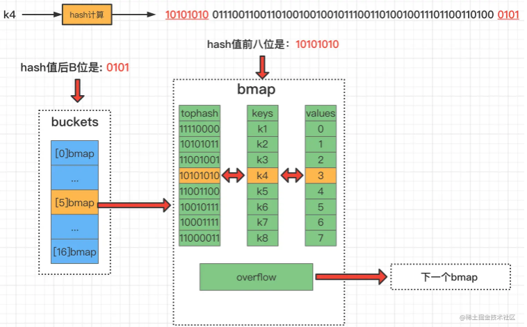

# get获取数据

>  **假设当前 B=4 即桶数量为2^B=16个**，要从map中获取 k4 对应的 value



**参考上图，k4的get流程可以归纳为如下几步：**

- **计算k4的hash值**。[由于当前主流机都是64位操作系统，所以计算结果有64个比特位]

- **通过最后的“B”位来确定在哪号桶**，此时B为4，所以取k4对应哈希值的后4位，也就是0101，0101用十进制表示为5，所以在5号桶）

- **根据k4对应的hash值前8位快速确定是在这个桶的哪个bmap位置**, 一旦发现前8位一致，则会执行下一步
  - 额外说明一下，快速其实不是定位, 而是用高8位去遍历比较

- **对比该地址的k与查询的k4是否相等**，如果匹配则获取对应索引位置的 value 值

- **如果都没有找到，就去连接的下一个溢出桶中找**


### get源码解析

`src/runtime/map.go`

```go
// 返回指向h[key]的指针。永远不返回nil，而是如果key不在map中，则返回elem类型的零对象的引用。
// 注意：返回的指针可能会保持整个map活跃，所以不要长时间保留它。
func mapaccess1(t *maptype, h *hmap, key unsafe.Pointer) unsafe.Pointer {
    // 123访问检查
	...
    
	// 计算hash值
	hash := t.Hasher(key, uintptr(h.hash0))
	// 返回 1 << b-1，针对代码生成进行了优化。
	m := bucketMask(h.B)
	// 将哈希表的buckets指针与哈希值hash进行运算，并根据掩码值m得到桶索引位置，最终计算出要查找的桶的指针位置
	b := (*bmap)(add(h.buckets, (hash&m)*uintptr(t.BucketSize)))
	// 处理旧buckets
	if c := h.oldbuckets; c != nil {
		if !h.sameSizeGrow() {
			// 之前有一半的桶；再掩码一次向下减少2的幂次
			m >>= 1
		}
		oldb := (*bmap)(add(c, (hash&m)*uintptr(t.BucketSize)))
		if !evacuated(oldb) {
			b = oldb
		}
	}
    // 计算高8位hash
	top := tophash(hash)

bucketloop: // 遍历bucket链表
	for ; b != nil; b = b.overflow(t) {
		// 遍历桶中条目
		for i := uintptr(0); i < bucketCnt; i++ {
			// 如果当前桶中的 tophash[i] 不等于 top
			if b.tophash[i] != top {
				// 如果当前桶中的 tophash[i] 等于 emptyRest(空)，则跳出 bucketloop
				if b.tophash[i] == emptyRest {
					break bucketloop
				}
				// 继续下一轮循环
				continue
			}
			// 计算当前 key 对应的指针地址
			k := add(unsafe.Pointer(b), dataOffset+i*uintptr(t.KeySize))
			// 如果需要间接引用key，则进行间接引用
			if t.IndirectKey() {
				k = *((*unsafe.Pointer)(k))
			}
			// 如果找到匹配的key，则返回对应的value指针
			if t.Key.Equal(key, k) {
				// 计算当前 value 对应的指针地址
				e := add(unsafe.Pointer(b), dataOffset+bucketCnt*uintptr(t.KeySize)+i*uintptr(t.ValueSize))
				// 如果需要间接引用elem，则进行间接引用
				if t.IndirectElem() {
					e = *((*unsafe.Pointer)(e))
				}
				// 返回找到的 value 指针
				return e
			}
		}
	}

	// 未找到匹配的key，返回elem类型的零对象的引用
	return unsafe.Pointer(&zeroVal[0])
}
```

1. 进行一系列的内存访问检查：
   - 如果启用了 race 检查，并且 h 不为 nil，则进行 race 检查。
   - 如果启用了 msan 检查，并且 h 不为 nil，则进行 msan 检查。
   - 如果启用了 asan 检查，并且 h 不为 nil，则进行 asan 检查。
2. 检查 map 是否为空或计数为 0，若满足条件，则返回 elem 类型的零对象的引用。
3. 检查并发写入标记，如果标记为 hashWriting，表示发生并发 map 读写，程序报错。
4. 计算 key 的哈希值 hash。
5. 根据 hash 计算出掩码值 m，用于确定桶的位置。
6. 根据 hash 和 m 计算出要查找的桶的指针位置 b。
7. 处理旧 buckets：
   - 如果存在旧 buckets，根据情况对 m 进行调整。
   - 获取旧 buckets 中对应哈希值位置的桶指针 oldb，如果未迁移完成，则使用 oldb。
8. 确定待查找的 tophash 高8位值 top。
9. 遍历当前桶及溢出桶中的条目，逐个比较 key：
   - 匹配到对应的 key 时，返回对应的 value 指针。
10. 如果未找到匹配的 key，则返回 elem 类型的零对象的引用。