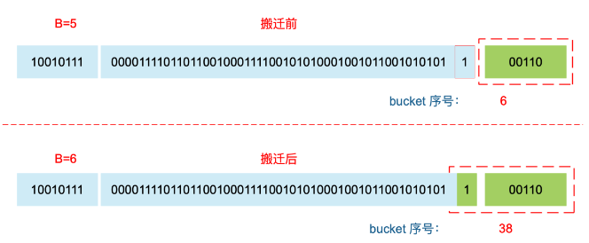
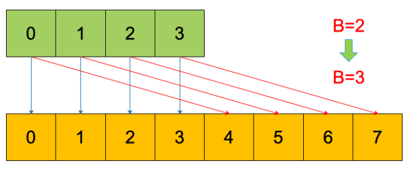
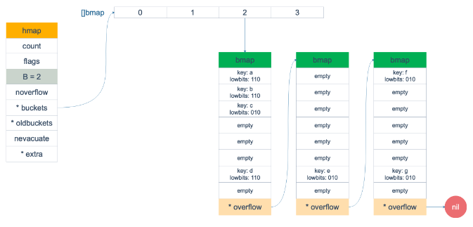
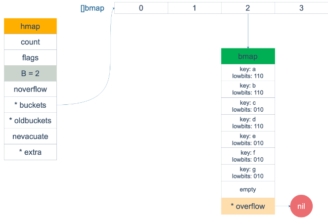
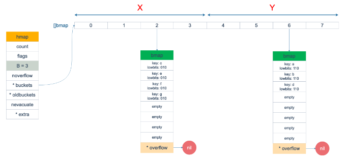

# 简介

使用哈希表的目的就是要快速查找到目标 key，然而，随着向 map 中添加的 key 越来越多，key 发生碰撞的概率也越来越大。

- bucket 中的 8 个 cell 会被逐渐塞满，查找、插入、删除 key 的效率也会越来越低。

- 最理想的情况是一个 bucket 只装一个 key，这样，就能达到 `O(1)`的效率，但这样空间消耗太大，用空间换时间的代价太高。

- Go 语言采用一个 bucket 里装载 8 个 key，定位到某个 bucket 后，还需要再定位到具体的 key，这实际上又用了时间换空间。

- 当然，这样做，要有一个度，不然所有的 key 都落在了同一个 bucket 里，直接退化成了链表，各种操作的效率直接降为 O(n)，是不行的。

因此，需要有一个指标来衡量前面描述的情况，这就是`装载因子`。Go 源码里这样定义 `装载因子`：


# 扩容的条件

首先我们了解下**装载因子(loadFactor)**的概念

```go
loadFactor := count / (2^B) // 装载因子 = map中元素的个数 / map中当前桶的个数
```

通过计算公式我们可以得知，**装载因子是指当前map中，每个桶中的平均元素个数。**


## 扩容条件1

**装载因子 > 6.5 (源码中定义的)**

这个也非常容易理解，正常情况下

- 如果没有溢出桶，那么一个桶中最多有8个元素
- 当平均每个桶中的数据超过了6.5个，那就意味着当前容量要不足了，发生扩容


## 扩容条件2  

**溢出桶的数量过多**

- 当 B < 15 时，如果 overflow 的 bucket 数量超过 2^B -> 扩容。

- 当 B >= 15 时，overflow 的 bucket 数量超过 2^15 -> 扩容。


**扩容时的细节**

1. 在我们的 hmap 结构中有一个 oldbuckets，扩容刚发生时，会先将老数据存到这个里面。
2. 每次对 map 进行删改操作时，会触发从 oldbucket 中迁移到 bucket 的操作【非一次性，分多次】
3. 在扩容没有完全迁移完成之前，每次 get 或者 put 遍历数据时，都会先遍历 oldbuckets，然后再遍历buckets


> 解释一下：

1. 我们知道，每个 bucket 有 8 个空位，在没有溢出，且所有的桶都装满了的情况下，装载因子算出来的结果是 8。

   因此当装载因子超过 6.5 时，表明很多 bucket 都快要装满了，查找效率和插入效率都变低了。在这个时候进行扩容是有必要的。

2. 是对第 1 点的补充。就是说在装载因子比较小的情况下 -> 8个空位只有3个有数据

   这时候 map 的查找和插入效率也很低，而第 1 点识别不出来这种情况 -> 加载因子没有超过 6.5

   表面现象就是计算装载因子的分子比较小，即 map 里元素总数少，但是 bucket 数量多

   包括大量的 overflow bucket

   

不难想像造成这种情况的原因：

- 不停地插入、删除元素。

- 先插入很多元素，导致创建了很多 bucket，但是装载因子达不到第 1点的临界值，未触发扩容来缓解这种情况。
- 之后，删除元素降低元素总数量，再插入很多元素，导致创建很多的 overflow bucket，但就是不会触犯第 1 点的规定，你能拿我怎么办？
- overflow bucket 数量太多，导致 key 会很分散，查找插入效率低得吓人，因此出台第 2 点规定。
- 这就像是一座空城，房子很多，但是住户很少，都分散了，找起人来很困难。


> 解决方案:

对于条件 1，元素太多，而 bucket 数量太少，很简单：

- 将 B 加 1，bucket 最大数量（2^B）直接变成原来 bucket 数量的 2 倍。
- 于是，就有新老 bucket 了。
- 注意，这时候元素都在老 bucket 里，还没迁移到新的 bucket 来。
- 而且，新 bucket 只是最大数量变为原来最大数量（2^B）的 2 倍（2^B * 2）


对于条件 2，其实元素没那么多，但是 overflow bucket 数特别多，说明很多 bucket 都没装满。

- 解决办法就是开辟一个新 bucket 空间，将老 bucket 中的元素移动到新 bucket，使得同一个 bucket 中的 key 排列地更紧密。
- 这样，原来，在 overflow bucket 中的 key 可以移动到 bucket 中来。
- 结果是节省空间，提高 bucket 利用率，map 的查找和插入效率自然就会提升。


# 扩容源码

`src/runtime/map.go`

## mapassign(): 插入

```golang
// 函数的作用是在 map 中分配或更新一个键值对。
// 如果键已经存在于 map 中，函数会更新其对应的值；
// 如果键不存在，则函数会为该键分配一个新的位置并插入键值对。
func mapassign(t *maptype, h *hmap, key unsafe.Pointer) unsafe.Pointer {
    ...
	again:
        // 计算 key 应该存放的 bucket 的索引
        bucket := hash & bucketMask(h.B)
        // 如果 map 正在增长，执行增长操作
        if h.growing() {
            growWork(t, h, bucket)
        }
    ...
    
	// 如果 map 达到了最大负载因子，或者溢出桶的数量过多，
	if !h.growing() && (overLoadFactor(h.count+1, h.B) || tooManyOverflowBuckets(h.noverflow, h.B)) {
		// 如果需要对 map 进行扩容，执行扩容操作
		hashGrow(t, h)
		// 执行扩容之后重新开始查找，因为 map 结构可能已经发生变化导致插入的位置改变
        // 重新查找会执行数据迁移
		goto again
	}
    ...
}	
```

```go
// 报告放置在 1<<B 存储桶中的count items是否超过 loadFactor=6.5 加载因子 。
func overLoadFactor(count int, B uint8) bool {
	return count > bucketCnt && uintptr(count) > loadFactorNum*(bucketShift(B)/loadFactorDen)
}
```

```go
// 判断溢出桶的数量是否过多对于一个拥有 1<<B 个桶的哈希表来说。
func tooManyOverflowBuckets(noverflow uint16, B uint8) bool {
	// 如果阈值过低，会带来多余的工作；
	// 如果阈值过高，增长和缩小的哈希表可能会占用大量未使用的内存。
	if B > 15 {
		B = 15
	}
    // 1. noverflow 的 bucket 数量超过 2^B
	// 2. noverflow 的 bucket 数量超过 2^15
	return noverflow >= uint16(1)<<(B&15)
}
```

上面源码的 `hashGrow()` 函数实际上并没有真正地“搬迁”，它只是分配好了新的 buckets，并将老的 buckets 挂到了 oldbuckets 字段上。

- 真正搬迁 buckets 的动作在 `growWork()` 函数中，而调用 `growWork()` 函数的动作是在 mapassign 和 mapdelete 函数中。
- 也就是插入或修改、删除 key 的时候，都会尝试进行搬迁 buckets 的工作。
- 先检查 oldbuckets 是否搬迁完毕，具体来说就是检查 oldbuckets 是否为 nil。


由于 map 扩容需要将原有的 key/value 重新搬迁到新的内存地址，如果有大量的 key/value 需要搬迁，会非常影响性能。

因此 Go map 的扩容采取了一种称为“渐进式”地方式，原有的 key 并不会一次性搬迁完毕，每次最多只会搬迁 2 个 bucket。


## hashGrow(): 扩容

我们先看 `hashGrow()` 函数所做的工作，再来看具体的搬迁 buckets 是如何进行的。

```golang
// 扩容
func hashGrow(t *maptype, h *hmap) {
	// 如果达到了负载因子，需要扩容
	// 否则，溢出桶太多，保持相同桶数，稍后进行水平"扩容"
	bigger := uint8(1)
	if !overLoadFactor(h.count+1, h.B) {
		bigger = 0
		h.flags |= sameSizeGrow
	}
	oldbuckets := h.buckets
	// 创建新的桶数组
	newbuckets, nextOverflow := makeBucketArray(t, h.B+bigger, nil)

	// 处理标志位，保留与迭代器相关的标志位
	flags := h.flags &^ (iterator | oldIterator)
	if h.flags&iterator != 0 {
		flags |= oldIterator
	}

	// 提交扩容操作（与 GC 原子操作）

	// 更新桶的数量
	h.B += bigger
	h.flags = flags
	// 记录旧桶
	h.oldbuckets = oldbuckets
	// 使用新桶
	h.buckets = newbuckets
    // 搬迁进度为 0
	h.nevacuate = 0
	h.noverflow = 0

	if h.extra != nil && h.extra.overflow != nil {
		// 将当前的溢出桶提升为旧的一代
		if h.extra.oldoverflow != nil {
			throw("oldoverflow is not nil")
		}
		h.extra.oldoverflow = h.extra.overflow
		h.extra.overflow = nil
	}
	if nextOverflow != nil {
		// 将新的溢出桶链接到链表中
		if h.extra == nil {
			h.extra = new(mapextra)
		}
		h.extra.nextOverflow = nextOverflow
	}

	// 实际的哈希表数据复制是由 growWork() 和 evacuate() 函数逐步进行的
}
```

主要是申请到了新的 buckets 空间，把相关的标志位都进行了处理：

- 例如标志 nevacuate 被置为 0， 表示当前搬迁进度为 0。

值得一说的是对 `h.flags` 的处理：

```golang
// 处理标志位，保留与迭代器相关的标志位
flags := h.flags &^ (iterator | oldIterator)
if h.flags&iterator != 0 {
    flags |= oldIterator
}
```

这里得先说下运算符：&^。这叫`按位置 0`运算符。例如：

```golang
x = 01010011
y = 01010100
z = x &^ y = 00000011
```

如果` y bit`位为 1，那么结果 z 对应 bit 位就为 0，否则 z 对应 bit 位就和 x 对应 bit 位的值相同。

所以上面那段对 flags 一顿操作的代码的意思是：

- 先把 `h.flags` 中 iterator 和 oldIterator 对应位清 0
- 然后如果发现 iterator 位为 1，那就把它转接到 oldIterator 位，使得 oldIterator 标志位变成 1。
- 潜台词就是：buckets 现在挂到了 oldBuckets 名下了，对应的标志位也转接过去吧。


几个标志位如下：

```golang
// 可能有迭代器使用 buckets
iterator     = 1
// 可能有迭代器使用 oldbuckets
oldIterator  = 2
// 有协程正在向 map 中写入 key
hashWriting  = 4
// 等量扩容（对应条件2, 整理空位）
sameSizeGrow = 8
```


## growWork(): 迁移数据

再来看看真正执行搬迁工作的 `growWork()` 函数。

```golang
// 扩容迁移数据
func growWork(t *maptype, h *hmap, bucket uintptr) {
	// 用于在 map 扩容期间迁移旧 bucket 中的数据到新 bucket
	evacuate(t, h, bucket&h.oldbucketmask())

	// 再搬迁一个 bucket，以加快搬迁进程
	if h.growing() {
		// 迁移一个额外的旧桶以推动扩容进度
		// nevacuate 指示扩容进度，小于此地址的 buckets 迁移完成
		evacuate(t, h, h.nevacuate)
	}
}
```

`h.growing()` 函数非常简单：

```golang
// 报告h是否在扩容迁移数据。h.oldbuckets != nil
func (h *hmap) growing() bool {
	return h.oldbuckets != nil
}
```

如果 `oldbuckets` 不为空，说明还没有搬迁完毕，还得继续搬。

- `bucket&h.oldbucketmask()` 这行代码，如源码注释里说的，是为了确认搬迁的 bucket 是我们正在使用的 bucket。
- `oldbucketmask()`函数返回扩容前的 map 的 bucketmask。

- 所谓的 bucketmask，作用就是将 key 计算出来的哈希值与 bucketmask 相与，得到的结果就是 key 应该落入的桶。
- 比如 B = 5，那么 bucketmask 的低 5 位是 `11111`，其余位是 `0`，hash 值与其相与的意思是，只有 hash 值的低 5 位决策 key 到底落入哪个 bucket。


## evacuate(): 迁移数据核心方法

接下来，我们集中所有的精力在搬迁的关键函数 `evacuate()`。

源码贴在下面，不要紧张，我会加上大面积的注释，通过注释绝对是能看懂的。之后，我会再对搬迁过程作详细说明。

源码如下：

```golang
// 函数用于在 map 扩容期间迁移旧 bucket 中的数据到新 bucket。
// 它根据新的 bucket 数量和大小，将数据从旧的 bucket 分发到新的 bucket。
func evacuate(t *maptype, h *hmap, oldbucket uintptr) {
    // 获取旧 bucket 的地址
    // 将 oldbucket 位置的地址,转换为指向 bmap 结构体类型的指针
    // 最后，将这个指针赋值给结构体 x 中的字段 b，这样结构体 x 就可以通过字段 b 访问到哈希表中旧桶的数据。
	b := (*bmap)(add(h.oldbuckets, oldbucket*uintptr(t.BucketSize)))
	// 新的 bucket 数量的位表示, 结果是 2^B，如 B = 5，结果为 2^5 = 32
	newbit := h.noldbuckets()
	// 检查 bucket 是否已经被迁移过
	if !evacuated(b) {
		// xy包含x和y (低和高) 疏散目标。
		var xy [2]evacDst
		// x 是目的地之一
		x := &xy[0]
		// 将 oldbucket 位置的地址,转换为指向 bmap 结构体类型的指针
		// 最后，将这个指针赋值给结构体 x 中的字段 b，这样结构体 x 就可以通过字段 b 访问到哈希表中旧桶的数据。
		x.b = (*bmap)(add(h.buckets, oldbucket*uintptr(t.BucketSize)))
		// x 的 key 开始地址
		x.k = add(unsafe.Pointer(x.b), dataOffset)
		// x 的 value 开始地址
		x.e = add(x.k, bucketCnt*uintptr(t.KeySize))

		// 报告当前增长是否为相同大小的映射
		if !h.sameSizeGrow() {
			// 如果不是同尺寸扩容
			// y 是另一个目的地
			y := &xy[1]
          	// y 代表的 bucket 序号增加了 2^B
			// 将 oldbucket+newbit 位置的地址,转换为指向 bmap 结构体类型的指针
			// 最后，将这个指针赋值给结构体 y 中的字段 b，这样结构体 y 就可以通过字段 b 访问到哈希表中新桶的数据。
			y.b = (*bmap)(add(h.buckets, (oldbucket+newbit)*uintptr(t.BucketSize)))
			// y 的 key 开始地址
			y.k = add(unsafe.Pointer(y.b), dataOffset)
			// y 的 value 开始地址
			y.e = add(y.k, bucketCnt*uintptr(t.KeySize))
		}

		// 遍历旧 bucket
		for ; b != nil; b = b.overflow(t) {
			// 当前 bucket 的 key 开始地址
			k := add(unsafe.Pointer(b), dataOffset)
			// 当前 bucket 的 value 开始地址
			e := add(k, bucketCnt*uintptr(t.KeySize))

			// 遍历 bucket 中的每一个槽
			for i := 0; i < bucketCnt; i, k, e = i+1, add(k, uintptr(t.KeySize)), add(e, uintptr(t.ValueSize)) {
				// 当前槽的 tophash 高8位值
				top := b.tophash[i]
				// 如果槽是空的
				if isEmpty(top) {
					// 标记槽为空且已被迁移
					b.tophash[i] = evacuatedEmpty
					continue
				}
				// 检查 tophash 高8位的有效性
				if top < minTopHash {
					throw("bad map state") // 如果无效，抛出错误
				}

				// 赋值k的地址
				k2 := k
				if t.IndirectKey() {
					k2 = *((*unsafe.Pointer)(k2))
				}

				// 用于决定使用 x 还是 y 目的地
				var useY uint8
				// 如果不是等量扩容
				if !h.sameSizeGrow() {
					// 计算 key 的哈希值
					hash := t.Hasher(k2, uintptr(h.hash0))
					// 如果有协程正在遍历 map
					// 如果出现 相同的 key 值，算出来的 hash 值不同
					if h.flags&iterator != 0 && !t.ReflexiveKey() && !t.Key.Equal(k2, k2) {
						useY = top & 1      // 用 tophash 的最低位决定
						top = tophash(hash) // 重计算 tophash
					} else {
						// 取决于新哈希值的 oldB+1 位是 0 还是 1, 是留在旧桶还是迁移新桶
						if hash&newbit != 0 {
							useY = 1
						}
					}
				}

				// 确保 evacuatedX 和 evacuatedY 的关系正确
				if evacuatedX+1 != evacuatedY || evacuatedX^1 != evacuatedY {
					throw("bad evacuatedN")
				}

				// 标志老的 cell 的 top hash 值，表示搬移到 X 部分
				// 搬迁完毕的 key 的 tophash 值会是一个状态值，表示 key 的搬迁去向
				b.tophash[i] = evacuatedX + useY // evacuatedX + 1 == evacuatedY
				// 选择目的地
				dst := &xy[useY]
				// 如果目的地的槽已满, 创建一个新的扩容, 否则在同一个 bucket 中迁移
				if dst.i == bucketCnt {
					// 创建新的 overflow bucket
					dst.b = h.newoverflow(t, dst.b)
					dst.i = 0
					// 更新 key 开始地址
					dst.k = add(unsafe.Pointer(dst.b), dataOffset)
					// 更新 value 开始地址
					dst.e = add(dst.k, bucketCnt*uintptr(t.KeySize))
				}

				// 将 key 和 value 移动到 dst 目的地, 元素的目标位置对应到新桶中的索引位置
				dst.b.tophash[dst.i&(bucketCnt-1)] = top // 设置目的地的 tophash
				if t.IndirectKey() {
					*(*unsafe.Pointer)(dst.k) = k2 // 如果 key 是间接的，复制指针
				} else {
					typedmemmove(t.Key, dst.k, k) // 否则，复制 key
				}
				if t.IndirectElem() {
					*(*unsafe.Pointer)(dst.e) = *(*unsafe.Pointer)(e) // 如果 value 是间接的，复制指针
				} else {
					typedmemmove(t.Elem, dst.e, e) // 否则，复制 value
				}

				// 更新目的地的槽计数
				dst.i++
				// 更新 key 和 value 的地址，准备下一次迭代
				dst.k = add(dst.k, uintptr(t.KeySize))
				dst.e = add(dst.e, uintptr(t.ValueSize))
			}
		}
		// 清理旧 bucket 的溢出桶并清除 key 和 value，帮助 GC
		if h.flags&oldIterator == 0 && t.Bucket.PtrBytes != 0 {
			b := add(h.oldbuckets, oldbucket*uintptr(t.BucketSize))
			// 保留b.tophash，因为疏散状态保持在那里。
			ptr := add(b, dataOffset)
			n := uintptr(t.BucketSize) - dataOffset
			memclrHasPointers(ptr, n)
		}
	}

	// 更新 map 的 evacuation 标记
	if oldbucket == h.nevacuate {
		advanceEvacuationMark(h, t, newbit)
	}
}
```

1. 获取旧桶的地址以及新桶总数的位表示。
2. 检查旧桶是否已经被迁移处理过。
3. 将目的地 x 设置为新桶中与旧桶对应位置的桶。
4. 遍历旧桶中的每个槽，准备迁移键值对。
5. 对每个槽中的键值对进行处理：
   - 标记空槽为已迁移空状态。
   - 如果不是等量扩容，确定目的地 x 或 y，并处理特殊情况。
   - 如果目的地的槽已满, 创建一个新的扩容, 否则在同一个 bucket 中迁移
   - 将键值对复制移动到新位置。
6. 清理旧 bucket 的溢出桶并清除 key 和 value，以帮助垃圾回收。
7. 更新 map 的 evacuation 标记，进入下一轮迁移处理。


# 举例说明

- 原来 B = 5，计算出 key 的哈希后，只用看它的低 5 位，就能决定它落在哪个 bucket

- 扩容后，B 变成了 6，因此需要多看一位，它的低 6 位决定 key 落在哪个 bucket



- 某个 key 在搬迁前后 bucket 序号可能和原来相等 -> 上图中就是搬迁后还是不变的

- 也可能是相比原来加上 2^B（原来的 B 值），取决于 hash 值 第 6 bit 位是 0 还是 1


再明确一个问题：

如果扩容后，B 增加了 1，意味着 buckets 总数是原来的 2 倍，原来 1 号的桶“裂变”到两个桶。

- 原始 B = 2，1号 bucket 中有 2 个 key 的哈希值低 3 位分别为：010，110。
- 由于原来 B = 2，所以低 2 位 `10` 决定它们落在 2 号桶
- 现在 B 变成 3，所以 `010`、`110` 分别落入 2、6 号桶。




**再来讲搬迁函数中的几个关键点：**

`evacuate()` 函数每次只完成一个 bucket 的搬迁工作，因此要遍历完此 bucket 的所有的 cell 槽，将有值的 cell copy 到新的地方。

- bucket 还会链接 overflow bucket，它们同样需要搬迁。

- 因此会有 2 层 for 循环，外层遍历 bucket 和 overflow bucket，内层遍历 bucket 的所有 cell 槽。

这样的循环在 map 的源码里到处都是，要理解透了。

- 源码里提到 X, Y part，其实就是我们说的如果是扩容到原来的 2 倍，桶的数量是原来的 2 倍
- 前一半桶被称为 X part，后一半桶被称为 Y part。
- 一个 bucket 中的 key 可能会分裂落到 2 个桶，一个位于 X part，一个位于 Y part。
- 所以在搬迁一个 cell 槽之前，需要知道这个 cell 中的 key 是落到哪个 Part。
- 很简单，重新计算 cell 中 key 的 hash，并向前“多看”一位，决定落入哪个 Part，这个前面也说得很详细了。


有一个**特殊情况**是：有一种 key，每次对它计算 hash，得到的结果都不一样。

- 这个 key 就是 `math.NaN()`的结果，它的含义是 `not a number `表示一个无效的或未定义的数值，类型是 float64。
- 当它作为 map 的 key，在搬迁的时候，会遇到一个问题：
- 再次计算它的哈希值和它当初插入 map 时的计算出来的哈希值不一样！

你可能想到了，这样带来的一个后果是，这个 key 是永远不会被 Get 操作获取的！

- 当我使用 `m[math.NaN()]` 语句的时候，是查不出来结果的。

- 这个 key 只有在遍历整个 map 的时候，才有机会现身。

- 所以，可以向一个 map 插入任意数量的 `math.NaN()` 作为 key。


**下面通过图来宏观地看一下扩容前后的变化**

扩容前，B = 2，共有 2^B  = 4 个 buckets，lowbits 表示 hash 值的低位。

假设我们不关注其他 buckets 情况，专注在 2 号 bucket。并且假设 overflow 太多，触发了等量扩容（对应于前面的条件 2）。



等量扩容完成后，overflow bucket 消失了，key 都集中到了一个 bucket，更为紧凑了，提高了查找的效率。



假设触发了 2 倍的扩容，那么扩容完成后，老 buckets 中的 key 分裂到了 2 个 新的 bucket。

一个在 x part，一个在 y 的 part。

依据是hash 的 lowbits。新 map 中 `0-3` 称为 x part，`4-7` 称为 y part。



注意，上面的两张图忽略了其他 buckets 的搬迁情况，表示所有的 bucket 都搬迁完毕后的情形。

实际上，我们知道，搬迁是一个“渐进”的过程，并不会一下子就全部搬迁完毕。

所以在搬迁过程中，oldbuckets 指针还会指向原来老的 []bmap，并且已经搬迁完毕的 key 的 tophash 值会是一个状态值，表示 key 的搬迁去向。