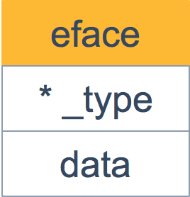
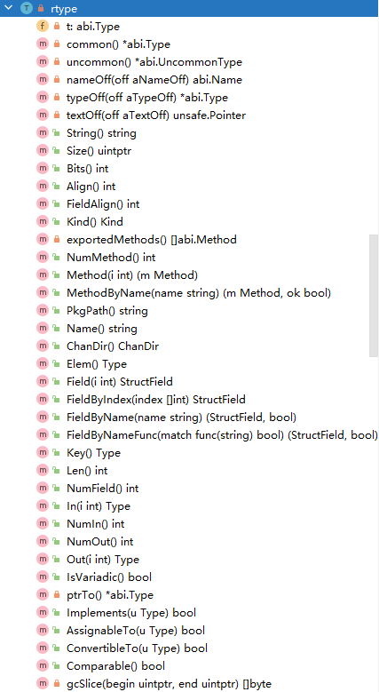
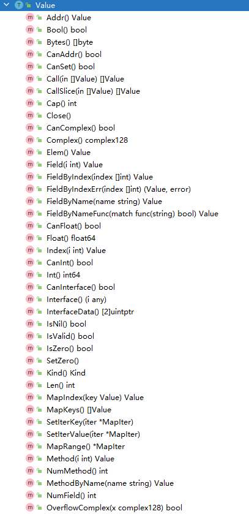

# 简介

**反射是指计算机程序能够在运行时，能够描述其自身状态或行为、调整或修改其状态或行为的能力**

**go提供了在运行时检查变量的值、更新变量的值和调用它们的方法的机制，而在编译时并不知道这些变量的具体类型**


# 接口

反射与Interface息息相关，反射是通过Interface的类型信息实现的，为更方便学习go反射机制，先复习一下Interface相关知识。


在 Go 语言中，`iface` 和 `eface` 是内部数据结构，用于实现接口值。它们之间的主要区别在于它们处理的接口类型：

1. **`iface`**: 这是用于表示具有具体方法集的非空接口(包含方法)的内部结构。`iface` 包含两个字段：

   - `tab`: 指向 `itab` 的指针，`itab` 包含了关于接口类型和实现类型的信息，以及实现类型对接口中方法的指针。
   - `data`: 指向实现接口的具体类型的值的指针。

   ```go
   // 定义一个 iface 结构体，用于表示接口值
   type iface struct {
   	tab  *itab          // 指向 itab 结构体的指针
   	data unsafe.Pointer // 存储具体值的指针,一般而言是一个指向堆内存的指针
   }
   
   // Itab 的布局已知于编译器
   // 在非垃圾回收内存中分配
   // 需要与 ../cmd/compile/internal/reflectdata/reflect.go 文件中的 func.WriteTabs 函数保持同步
   type itab struct {
   	inter *interfacetype // 接口类型描述
   	_type *_type         // 具体类型描述
   	hash  uint32         // _type.hash 的副本，用于类型切换
   	_     [4]byte        // 未使用的字节
   	fun   [1]uintptr     // 变长字段。fun[0]==0 表示 _type 未实现接口
   }
   ```

2. **`eface`**: 这是用于表示空接口 `interface{}` 的内部结构。`eface` 同样包含两个字段：

   - `_type`: 指向 `_type` 的指针，包含了具体类型的类型信息。
   - `data`: 指向具体类型的值的指针。

   ```go
   // eface 是空接口的内部表示
   type eface struct {
   	_type *_type         // 存储类型信息的指针
   	data  unsafe.Pointer // 存储实际数据的指针
   }
   ```

其中 `itab` 由具体类型 `_type` 以及 `interfacetype` 组成。`_type` 表示具体类型，而 `interfacetype` 则表示具体类型实现的接口类型。


实际上，iface 描述的是非空接口，它包含方法；

与之相对的是 `eface`，描述的是空接口，不包含任何方法，Go语言里**所有的类型都实现了**空接口。

```golang
type eface struct {
    _type *_type
    data  unsafe.Pointer
}
```

相比 `iface`，`eface` 就比较简单了。只维护了一个 `_type` 字段，表示空接口所承载的具体的实体类型。`data` 描述了具体的值。




**变量在转换为Interface时，接口值保存了变量的类型及指针两种信息，通过类型信息的对应实现接口与变量之间的互相转换。**


接下来就结合这三个定律来学习reflect的源码

# 反射类型对象

反射类型对象有两种，分别是**Type**和**Value**

- Type 类型对应一个变量的类型信息
- 而Value类型则对应一个变量的值信息

## Type 类型

`src/reflect/type.go`

Type 类型对应一个变量的类型信息, `reflect.Type` 接口提供了许多方法来查询和操作类型信息。

```go
// Type 是 Go 语言中类型的表示。
//
// 并非所有方法都适用于所有类型的种类。限制条件（如果有）会在每个方法的文档中说明。
// 使用 Kind 方法来找出类型的种类，然后再调用特定种类的方法。调用与类型种类不相符的方法会导致运行时 panic。
//
// Type 值是可以比较的，例如使用 == 运算符，因此可以用作 map 的键。
// 两个 Type 值相等当且仅当它们代表相同的类型。
type Type interface {
	// 适用于所有类型的方法。

	// Align 返回分配在内存中的该类型的值的对齐大小（以字节为单位）。
	Align() int

	// FieldAlign 返回作为结构体字段时该类型的值的对齐大小（以字节为单位）。
	FieldAlign() int

	// Method 返回类型方法集中的第 i 个方法。
	// 如果 i 不在 [0, NumMethod()) 范围内，则会 panic。
	//
	// 对于非接口类型 T 或 *T，返回的 Method 的 Type 和 Func 字段描述了一个接收者为第一个参数的函数，
	// 且只有导出的方法是可访问的。
	//
	// 对于接口类型，返回的 Method 的 Type 字段给出了没有接收者的函数签名，Func 字段为 nil。
	//
	// 方法按照字典序排序。
	Method(int) Method

	// MethodByName 返回类型方法集中具有给定名称的方法及其是否存在。
	//
	// 对于非接口类型 T 或 *T，返回的 Method 的 Type 和 Func 字段描述了一个接收者为第一个参数的函数。
	//
	// 对于接口类型，返回的 Method 的 Type 字段给出了没有接收者的函数签名，Func 字段为 nil。
	MethodByName(string) (Method, bool)

	// NumMethod 返回该类型可访问的方法数量。
	//
	// 对于非接口类型，返回导出的方法数量。
	//
	// 对于接口类型，返回导出和未导出的方法数量。
	NumMethod() int

	// Name 返回定义类型在其包内的名称。对于非定义类型（如 *T, struct{}, []int 或 A 其中 A 是非定义类型的别名），返回空字符串。
	Name() string

	// PkgPath 返回定义类型的包路径，即唯一标识该包的导入路径，例如 "encoding/base64"。
	// 如果类型是预声明的（如 string, error）或未定义（*T, struct{}, []int, 或 A 其中 A 是非定义类型的别名），则包路径为空字符串。
	PkgPath() string

	// Size 返回存储该类型的值所需的字节数；类似于 unsafe.Sizeof。
	Size() uintptr

	// String 返回该类型的字符串表示形式。该字符串表示形式可能使用简化的包名（例如 base64 而不是 "encoding/base64"），
	// 并且不保证在所有类型间唯一。为了测试类型是否相同，直接比较 Type。
	String() string

	// Kind 返回该类型的特定种类。
	Kind() Kind

	// Implements 报告该类型是否实现了接口类型 u。
	Implements(u Type) bool

	// AssignableTo 报告该类型的值是否可赋值给类型 u。
	AssignableTo(u Type) bool

	// ConvertibleTo 报告该类型的值是否可转换为类型 u。即使 ConvertibleTo 返回 true，
	// 转换仍然可能 panic。例如，类型 []T 可以转换为 *[N]T，但如果长度小于 N，则会 panic。
	ConvertibleTo(u Type) bool

	// Comparable 报告该类型的值是否可比较。即使 Comparable 返回 true，
	// 比较仍然可能 panic。例如，接口类型的值是可比较的，但如果动态类型不是可比较的，则会 panic。
	Comparable() bool

	// 仅适用于某些类型的特定方法，取决于 Kind。
	// 允许的方法对于每种类型如下：
	//
	// Int*, Uint*, Float*, Complex*: Bits
	// Array: Elem, Len
	// Chan: ChanDir, Elem
	// Func: In, NumIn, Out, NumOut, IsVariadic
	// Map: Key, Elem
	// Pointer: Elem
	// Slice: Elem
	// Struct: Field, FieldByIndex, FieldByName, FieldByNameFunc, NumField

	// Bits 返回类型在位中的大小。如果该类型的 Kind 不是 Int、Uint、Float 或 Complex 中的一种，则会 panic。
	Bits() int

	// ChanDir 返回通道类型的传输方向。如果该类型的 Kind 不是 Chan，则会 panic。
	ChanDir() ChanDir

	// IsVariadic 报告函数类型的最后一个输入参数是否为 "..." 参数。如果为 true，则 t.In(t.NumIn() - 1) 返回参数的实际类型 []T。
	//
	// 例如，如果 t 表示 func(x int, y ...float64)，则：
	//
	//   t.NumIn() == 2
	//   t.In(0) 是 "int" 的 reflect.Type
	//   t.In(1) 是 "[]float64" 的 reflect.Type
	//   t.IsVariadic() == true
	//
	// 如果该类型的 Kind 不是 Func，则会 panic。
	IsVariadic() bool

	// Elem 返回类型元素的类型。如果该类型的 Kind 不是 Array、Chan、Map、Pointer 或 Slice，则会 panic。
	Elem() Type

	// Field 返回结构体类型的第 i 个字段。如果该类型的 Kind 不是 Struct，则会 panic。
	// 如果 i 不在 [0, NumField()) 的范围内，则会 panic。
	Field(i int) StructField

	// FieldByIndex 返回对应于索引序列的嵌套字段。相当于依次调用 Field。
	// 如果该类型的 Kind 不是 Struct，则会 panic。
	FieldByIndex(index []int) StructField

	// FieldByName 返回具有给定名称的结构体字段以及一个布尔值指示该字段是否存在。
	FieldByName(name string) (StructField, bool)

	// FieldByNameFunc 返回满足 match 函数的结构体字段以及一个布尔值指示该字段是否存在。
	//
	// FieldByNameFunc 考虑结构体本身的字段，然后考虑任何嵌入结构体的字段，按照广度优先顺序，
	// 在最浅的嵌套深度停止，该深度包含一个或多个满足 match 函数的字段。如果多个字段在同一深度满足 match 函数，
	// 它们将互相抵消，FieldByNameFunc 返回没有匹配。
	// 这种行为与 Go 中处理具有嵌入字段的结构体中的名称查找相似。
	FieldByNameFunc(match func(string) bool) (StructField, bool)

	// In 返回函数类型的第 i 个输入参数的类型。如果该类型的 Kind 不是 Func，则会 panic。
	// 如果 i 不在 [0, NumIn()) 的范围内，则会 panic。
	In(i int) Type

	// Key 返回映射类型的键类型。如果该类型的 Kind 不是 Map，则会 panic。
	Key() Type

	// Len 返回数组类型的长度。如果该类型的 Kind 不是 Array，则会 panic。
	Len() int

	// NumField 返回结构体类型的字段数量。如果该类型的 Kind 不是 Struct，则会 panic。
	NumField() int

	// NumIn 返回函数类型的输入参数数量。如果该类型的 Kind 不是 Func，则会 panic。
	NumIn() int

	// NumOut 返回函数类型的输出参数数量。如果该类型的 Kind 不是 Func，则会 panic。
	NumOut() int

	// Out 返回函数类型的第 i 个输出参数的类型。如果该类型的 Kind 不是 Func，则会 panic。
	// 如果 i 不在 [0, NumOut()) 的范围内，则会 panic。
	Out(i int) Type

	// common 和 uncommon 是内部方法，用于访问类型内部的实现细节。
	common() *abi.Type
	uncommon() *uncommonType
}
```

反射包通过`reflect.Typeof()`方法返回Type类型

```go
// TypeOf 返回表示 i 的动态类型的反射 Type。
// 如果 i 是一个空接口值，则 TypeOf 返回 nil。
func TypeOf(i any) Type {
	// 将任意类型 i 转换为 emptyInterface 结构体
	eface := *(*emptyInterface)(unsafe.Pointer(&i))
	// 使用 noescape 函数确保不会使 i 逃逸。请参阅 Value.typ 的注释以了解为何这样做是安全的。
	// 将空接口的类型转换为 abi.Type 指针，并使用 toType 函数转换为反射 Type 类型
	return toType((*abi.Type)(noescape(unsafe.Pointer(eface.typ))))
}

// 将 *abi.Type 转换为可以返回给 reflect 包客户端的 Type。
// 在 gc 编译器中，唯一的问题是将 nil 的 *abi.Type 替换为 nil Type，
// 但在 gccgo 中，这个函数还会确保相同类型的多个 *abi.Type 被合并为一个 Type。
func toType(t *abi.Type) Type {
	// 如果 t 为 nil，则返回 nil
	if t == nil {
		return nil
	}
	// 否则调用 toRType 函数将 *abi.Type 转换为 reflect Type 类型
	return toRType(t)
}

// 将 *abi.Type 指针转换为 *rtype 指针并返回
func toRType(t *abi.Type) *rtype {
	return (*rtype)(unsafe.Pointer(t))
}
```

最后返回的`rtype`实现了`reflect.Type`接口了



**示例:**

```go
package main

import (
	"fmt"
	"reflect"
)

// MyInter 定义一个接口
type MyInter interface {
	Greet() string
}

// MyStruct 定义一个结构体类型
type MyStruct struct {
	Name string
	Age  int
}

// Greet 定义一个方法
func (m MyStruct) Greet() string {
	return fmt.Sprintf("你好, 我的名字是 %s", m.Name)
}

func main() {
	// 创建 MyStruct 类型的实例
	s := MyStruct{"Luode", 30}

	// 获取 MyStruct 类型的信息
	t := reflect.TypeOf(s)

	// 展示 Type 接口的所有方法
	displayTypeMethods(t)
}

// displayTypeMethods 函数用于展示 reflect.Type 接口的所有方法
func displayTypeMethods(t reflect.Type) {
	// 展示适用于所有类型的方法
	fmt.Println("概述方法:")
	fmt.Printf("Name() 返回定义类型在其包内的名称: %s\n", t.Name())
	fmt.Printf("PkgPath() 返回定义类型的包路径: %s\n", t.PkgPath())
	fmt.Printf("Size() 返回存储该类型的值所需的字节数: %d\n", t.Size())
	fmt.Printf("String() 返回该类型的字符串表示形式: %s\n", t.String())
	fmt.Printf("Kind() 返回该类型的特定种类: %s\n", t.Kind().String())
	fmt.Printf("Align() 返回分配在内存中的该类型的值的对齐大小: %d\n", t.Align())
	fmt.Printf("FieldAlign() 返回作为结构体字段时该类型的值的对齐大小: %d\n", t.FieldAlign())
	fmt.Printf("NumMethod() 返回该类型可访问的方法数量: %d\n", t.NumMethod())
	fmt.Printf("Comparable() 报告该类型的值是否可比较: %t\n", t.Comparable())
	fmt.Printf("Implements() 报告该类型是否实现了接口类型 u: %t (MyInter)\n", t.Implements(reflect.TypeOf((*MyInter)(nil)).Elem()))
	fmt.Printf("AssignableTo() 报告该类型的值是否可赋值给类型 u: %t (int)\n", t.AssignableTo(reflect.TypeOf(0)))
	fmt.Printf("ConvertibleTo() 报告该类型的值是否可转换为类型 u: %t (int)\n", t.ConvertibleTo(reflect.TypeOf(0)))

	// 展示特定于类型的 Kind 方法
	fmt.Println("\nKind 特定种类的方法:")
	switch t.Kind() {
	case reflect.Struct:
		fmt.Println("这是一个 Struct 结构体:")
		fmt.Println("Field() 返回结构体类型的第 i 个字段:")
		for i := 0; i < t.NumField(); i++ {
			f := t.Field(i)
			fmt.Printf("  Field %d: 字段名称Name=%s, 字段类型Type=%s, 字段标签Tag=%v\n", i, f.Name, f.Type, f.Tag)
		}

		fmt.Println("Method() 返回类型方法集中的第 i 个方法:")
		for i := 0; i < t.NumMethod(); i++ {
			m := t.Method(i)
			fmt.Printf("  Method %d: 方法名称Name=%s, 方法类型Type=%s\n", i, m.Name, m.Type)
		}
	case reflect.Array, reflect.Slice:
		fmt.Println("这是一个 Array 数组或者 Slice 切片:")
		fmt.Printf("Elem() 返回类型元素的类型: %s\n", t.Elem())
		fmt.Printf("Len() 返回数组类型的长度: %d\n", t.Len())
	case reflect.Func:
		fmt.Println("这是一个 Func 方法:")
		fmt.Printf("NumIn() 返回函数类型的输入参数数量: %d\n", t.NumIn())
		for i := 0; i < t.NumIn(); i++ {
			fmt.Printf("  In %d: %s\n", i, t.In(i))
		}
		fmt.Printf("NumOut() 返回函数类型的输出参数数量: %d\n", t.NumOut())
		for i := 0; i < t.NumOut(); i++ {
			fmt.Printf("  Out %d: %s\n", i, t.Out(i))
		}
		fmt.Printf("IsVariadic() 报告函数类型的最后一个输入参数是否为 ... 参数: %t\n", t.IsVariadic())
	case reflect.Map:
		fmt.Println("这是一个 Map 字典:")
		fmt.Printf("Key() 返回映射类型的键类型: %s\n", t.Key())
		fmt.Printf("Elem() 返回类型元素的类型: %s\n", t.Elem())
	case reflect.Ptr:
		fmt.Println("这是一个 Ptr 指针:")
		fmt.Printf("Elem() 返回类型元素的类型: %s\n", t.Elem())
	case reflect.Chan:
		fmt.Println("这是一个 Chan 通道:")
		fmt.Printf("Elem() 返回类型元素的类型: %s\n", t.Elem())
		fmt.Printf("ChanDir() 返回通道类型的传输方向: %s\n", t.ChanDir())
	case reflect.Int, reflect.Uint, reflect.Float32, reflect.Float64, reflect.Complex64, reflect.Complex128:
		fmt.Println("这是一个数字:")
		fmt.Printf("Bits() 返回类型在位中的大小: %d\n", t.Bits())
	}
}
```

运行结果:

```go
概述方法:
Name() 返回定义类型在其包内的名称: MyStruct                  
PkgPath() 返回定义类型的包路径: main                         
Size() 返回存储该类型的值所需的字节数: 24                    
String() 返回该类型的字符串表示形式: main.MyStruct           
Kind() 返回该类型的特定种类: struct                          
Align() 返回分配在内存中的该类型的值的对齐大小: 8            
FieldAlign() 返回作为结构体字段时该类型的值的对齐大小: 8     
NumMethod() 返回该类型可访问的方法数量: 1                    
Comparable() 报告该类型的值是否可比较: true                  
Implements() 报告该类型是否实现了接口类型 u: true (MyInter)  
AssignableTo() 报告该类型的值是否可赋值给类型 u: false (int) 
ConvertibleTo() 报告该类型的值是否可转换为类型 u: false (int)
                                                             
Kind 特定种类的方法:                                         
这是一个 Struct 结构体:                                                
Field() 返回结构体类型的第 i 个字段:                                   
  Field 0: 字段名称Name=Name, 字段类型Type=string, 字段标签Tag=        
  Field 1: 字段名称Name=Age, 字段类型Type=int, 字段标签Tag=            
Method() 返回类型方法集中的第 i 个方法:                                
  Method 0: 方法名称Name=Greet, 方法类型Type=func(main.MyStruct) string
```


## Type 结论

这个反射类型对象**理论上是实现了一个接口**, 可以通过方法获取对象的一些定义的静态属性

包含方法名称、字段名称、包路径、是否实现x接口、返回对象原始类型等。


## Value 类型

`src/reflect/value.go`

Value类型则对应一个变量的值信息, 如果说Type是用来获取一些定义的静态属性的, 那么Value就是获取属性值的。

```go
// Value 是 Go 值的反射接口。
//
// 并非所有方法都适用于所有类型的值。如果有限制，将在每个方法的文档中进行说明。
// 在调用特定于类型的方法之前，请使用 Kind 方法查找值的类型。
// 调用不适合类型的方法将导致运行时恐慌。
//
// 零值 Value 表示没有值。
// 其 IsValid 方法返回 false，其 Kind 方法返回 Invalid，
// 其 String 方法返回 "<invalid Value>"，所有其他方法将导致恐慌。
// 大多数函数和方法从不返回无效值。
// 如果有一个函数返回无效值，其文档将明确说明条件。
//
// 可以通过多个 goroutine 并发使用 Value，前提是底层的 Go 值可以用于等效的直接操作。
//
// 要比较两个 Value，请比较 Interface 方法的结果。
// 在两个 Value 上使用 == 不会比较它们所代表的底层值。
type Value struct {
	// typ_ 持有由 Value 表示的值的类型。
	// 使用 typ 方法访问以避免 v 的逃逸。
	typ_ *abi.Type

	// 指针值数据，或者如果设置了 flagIndir，则为数据的指针。
	// 当 flagIndir 被设置或 typ.pointers() 为 true 时有效。
	ptr unsafe.Pointer

	// flag 包含关于值的元数据。
	//
	// 最低的五位给出值的 Kind，与 typ.Kind() 相对应。
	//
	// 接下来的一组位是 flag 位：
	//	- flagStickyRO：通过非导出的非嵌入字段获得，因此是只读的
	//	- flagEmbedRO：通过非导出的嵌入字段获得，因此是只读的
	//	- flagIndir：val 持有数据的指针
	//	- flagAddr：v.CanAddr 为 true (意味着 flagIndir 为真且 ptr 不为 nil)
	//	- flagMethod：v 是一个方法值。
	// 如果 ifaceIndir(typ)，则代码可以假定 flagIndir 被设置。
	//
	// 剩余的 22+ 位给出方法值的方法编号。
	// 如果 flag.kind() != Func，则代码可以假定 flagMethod 未设置。
	flag

	// 方法值表示某个接收者 r 的柯里化方法调用，例如 r.Read。
	// typ+val+flag 位描述接收者 r，但 flag 的 Kind 位表示 Func（方法是函数），
	// 并且 flag 的顶部比特给出 r 类型的方法表中的方法编号。
}
```

反射包通过`reflect.ValueOf()`方法返回Value类型

```go
// ValueOf 从接口 i 中返回一个新的 Value，其被初始化为接口中存储的具体值。
// ValueOf(nil) 返回一个零值的 Value。
func ValueOf(i any) Value {
	if i == nil {
		return Value{}
	}

	// 如果不是 go1.21 强制 Value 逃逸，则执行逃逸操作
	if !go121noForceValueEscape {
		escapes(i)
	}

	// 返回接口 i 的值
	return unpackEface(i)
}

// 将接口 i 转换为一个 Value。
func unpackEface(i any) Value {
	// 将接口 i 转换为 emptyInterface 结构体指针, 所有的类型都实现了空接口
	e := (*emptyInterface)(unsafe.Pointer(&i))

	// 注意: 在确定它是否真的是指针之前，不要读取 e.word。

	// 获取接口中存储的类型信息
	t := e.typ
	// 如果类型信息为空，返回空的 Value
	if t == nil {
		return Value{}
	}

	// 获取类型的 Kind 值，并转换为 flag 类型
	f := flag(t.Kind())
	// 如果类型需要间接引用，则设置标志 flagIndir
	if t.IfaceIndir() {
		f |= flagIndir
	}

	// 返回包含类型信息、值以及标志的 Value 结构体
	return Value{t, e.word, f}
}
```

Value提供的方法:

```go
//用于获取值方法
func (v Value) Int() int64 // 获取int类型值，如果 v 值不是有符号整型，则 panic。

func (v Value) Uint() uint64 // 获取unit类型的值，如果 v 值不是无符号整型（包括 uintptr），则 panic。

func (v Value) Float() float64 // 获取float类型的值，如果 v 值不是浮点型，则 panic。

func (v Value) Complex() complex128 // 获取复数类型的值，如果 v 值不是复数型，则 panic。

func (v Value) Bool() bool // 获取布尔类型的值，如果 v 值不是布尔型，则 panic。

func (v Value) Len() int // 获取 v 值的长度，v 值必须是字符串、数组、切片、映射、通道。

func (v Value) Cap() int  // 获取 v 值的容量，v 值必须是数值、切片、通道。

func (v Value) Index(i int) reflect.Value // 获取 v 值的第 i 个元素，v 值必须是字符串、数组、切片，i 不能超出范围。

func (v Value) Bytes() []byte // 获取字节类型的值，如果 v 值不是字节切片，则 panic。

func (v Value) Slice(i, j int) reflect.Value // 获取 v 值的切片，切片长度 = j - i，切片容量 = v.Cap() - i。
// v 必须是字符串、数值、切片，如果是数组则必须可寻址。i 不能超出范围。

func (v Value) Slice3(i, j, k int) reflect.Value  // 获取 v 值的切片，切片长度 = j - i，切片容量 = k - i。
// i、j、k 不能超出 v 的容量。i <= j <= k。
// v 必须是字符串、数值、切片，如果是数组则必须可寻址。i 不能超出范围。

func (v Value) MapIndex(key Value) reflect.Value // 根据 key 键获取 v 值的内容，v 值必须是映射。
// 如果指定的元素不存在，或 v 值是未初始化的映射，则返回零值（reflect.ValueOf(nil)）

func (v Value) MapKeys() []reflect.Value // 获取 v 值的所有键的无序列表，v 值必须是映射。
// 如果 v 值是未初始化的映射，则返回空列表。

func (v Value) OverflowInt(x int64) bool // 判断 x 是否超出 v 值的取值范围，v 值必须是有符号整型。

func (v Value) OverflowUint(x uint64) bool  // 判断 x 是否超出 v 值的取值范围，v 值必须是无符号整型。

func (v Value) OverflowFloat(x float64) bool  // 判断 x 是否超出 v 值的取值范围，v 值必须是浮点型。

func (v Value) OverflowComplex(x complex128) bool // 判断 x 是否超出 v 值的取值范围，v 值必须是复数型。

//设置值方法
func (v Value) SetInt(x int64)  //设置int类型的值

func (v Value) SetUint(x uint64)  // 设置无符号整型的值

func (v Value) SetFloat(x float64) // 设置浮点类型的值

func (v Value) SetComplex(x complex128) //设置复数类型的值

func (v Value) SetBool(x bool) //设置布尔类型的值

func (v Value) SetString(x string) //设置字符串类型的值

func (v Value) SetLen(n int)  // 设置切片的长度，n 不能超出范围，不能为负数。

func (v Value) SetCap(n int) //设置切片的容量

func (v Value) SetBytes(x []byte) //设置字节类型的值

func (v Value) SetMapIndex(key, val reflect.Value) //设置map的key和value，前提必须是初始化以后，存在覆盖、不存在添加

//其他方法
//结构体相关：
func (v Value) NumField() int // 获取结构体字段（成员）数量

func (v Value) Field(i int) reflect.Value  //根据索引获取结构体字段

func (v Value) FieldByIndex(index []int) reflect.Value // 根据索引链获取结构体嵌套字段

func (v Value) FieldByName(string) reflect.Value // 根据名称获取结构体的字段，不存在返回reflect.ValueOf(nil)

func (v Value) FieldByNameFunc(match func(string) bool) Value // 根据匹配函数 match 获取字段,如果没有匹配的字段，则返回零值（reflect.ValueOf(nil)）

//chan相关：
func (v Value) Send(x reflect.Value)// 发送数据（会阻塞），v 值必须是可写通道。

func (v Value) Recv() (x reflect.Value, ok bool) // 接收数据（会阻塞），v 值必须是可读通道。

func (v Value) TrySend(x reflect.Value) bool // 尝试发送数据（不会阻塞），v 值必须是可写通道。

func (v Value) TryRecv() (x reflect.Value, ok bool) // 尝试接收数据（不会阻塞），v 值必须是可读通道。

func (v Value) Close() // 关闭通道

//函数相关
func (v Value) Call(in []Value) (r []Value) // 通过参数列表 in 调用 v 值所代表的函数（或方法）。函数的返回值存入 r 中返回。
// 要传入多少参数就在 in 中存入多少元素。
// Call 即可以调用定参函数（参数数量固定），也可以调用变参函数（参数数量可变）。

func (v Value) CallSlice(in []Value) []Value // 调用变参函数
```




**示例**

```go
package main

import (
	"fmt"
	"reflect"
)

// MyStruct 定义一个结构体类型
type MyStruct struct {
	Name string
	Age  int
}

// Greet 定义一个方法
func (m MyStruct) Greet() string {
	return fmt.Sprintf("你好, 我的名字是 %s", m.Name)
}

func main() {
	// 创建 MyStruct 类型的实例
	s := MyStruct{"Luode", 30}

	// 获取 MyStruct 实例的 reflect.Value
	v := reflect.ValueOf(s)

	// 展示 reflect.Value 的所有方法
	displayValueMethods(v)
}

// displayValueMethods 函数用于展示 reflect.Value 接口的所有方法
func displayValueMethods(v reflect.Value) {
	// 展示 Value 的一般方法
	fmt.Println("概述方法:")
	fmt.Printf("IsValid() 报告 v 是否表示一个值: %t\n", v.IsValid())
	fmt.Printf("Kind() 返回 v 的类型: %s\n", v.Kind())
	fmt.Printf("String() 返回字符串 v 的基础值，作为一个字符串: %s\n", v.String())
	fmt.Printf("CanAddr() 报告值的地址是否可以通过 Addr 获取: %t\n", v.CanAddr())
	fmt.Printf("CanInterface() 报告是否可以在不发生恐慌的情况下使用接口: %t\n", v.CanInterface())
	fmt.Printf("CanSet() 报告是否可以更改 v 的值: %t\n", v.CanSet())
	fmt.Printf("Interface()  将 v 的当前值作为 interface{} 返回: %v\n", v.Interface())

	// 展示特定于类型的 Kind 方法
	fmt.Println("\nKind 特定种类的方法:")
	switch v.Kind() {
	case reflect.Struct:
		fmt.Println("这是一个 Struct 结构体:")
		fmt.Println("Field() 返回结构体类型的第 i 个字段的值:")
		for i := 0; i < v.NumField(); i++ {
			fmt.Printf("  Field %d: %s\n", i, v.Field(i).Interface())
		}

		fmt.Println("Method() 返回与结构体 v 的第 i 个方法对应的函数值:")
		for i := 0; i < v.NumMethod(); i++ {
			fmt.Printf("  Method %d: %s\n", i, v.Method(i).Interface())
		}

	case reflect.Array, reflect.Slice:
		fmt.Println("这是一个 Array 数组或者 Slice 切片:")
		fmt.Printf("Len: %d\n", v.Len())
		fmt.Printf("Cap: %d\n", v.Cap())
		for i := 0; i < v.Len(); i++ {
			fmt.Printf("  Element %d: %s\n", i, v.Index(i).Interface())
		}

	case reflect.Func:
		fmt.Println("这是一个 Func 函数:")
		fmt.Printf("NumIn: %d\n", v.Type().NumIn())
		for i := 0; i < v.Type().NumIn(); i++ {
			fmt.Printf("  In %d: %s\n", i, v.Type().In(i))
		}
		fmt.Printf("NumOut: %d\n", v.Type().NumOut())
		for i := 0; i < v.Type().NumOut(); i++ {
			fmt.Printf("  Out %d: %s\n", i, v.Type().Out(i))
		}
		fmt.Printf("IsVariadic: %t\n", v.Type().IsVariadic())

	case reflect.Map:
		fmt.Println("这是一个 Map 字典:")
		fmt.Printf("Len: %d\n", v.Len())
		for _, key := range v.MapKeys() {
			fmt.Printf("  Key: %s, Value: %s\n", key.Interface(), v.MapIndex(key).Interface())
		}

	case reflect.Ptr:
		fmt.Println("这是一个 Ptr 指针:")
		fmt.Printf("Elem: %s\n", v.Elem().Interface())

	case reflect.Chan:
		fmt.Println("这是一个 Chan 通道:")
		fmt.Printf("Len: %d\n", v.Len())
		fmt.Printf("Cap: %d\n", v.Cap())

	case reflect.Int, reflect.Uint, reflect.Float32, reflect.Float64, reflect.Complex64, reflect.Complex128:
		fmt.Println("这是一个数字:")
		fmt.Printf("Int: %d\n", v.Int())
		fmt.Printf("Uint: %d\n", v.Uint())
		fmt.Printf("Float: %f\n", v.Float())
		fmt.Printf("Complex: %c\n", v.Complex())

	default:
		fmt.Println("未知类型")
	}
}
```

运行结果:

```go
概述方法:
IsValid() 报告 v 是否表示一个值: true                                
Kind() 返回 v 的类型: struct                                         
String() 返回字符串 v 的基础值，作为一个字符串: <main.MyStruct Value>
CanAddr() 报告值的地址是否可以通过 Addr 获取: false                  
CanInterface() 报告是否可以在不发生恐慌的情况下使用接口: true        
CanSet() 报告是否可以更改 v 的值: false                              
Interface()  将 v 的当前值作为 interface{} 返回: {Luode 30}          
                                                                     
Kind 特定种类的方法:                                                 
这是一个 Struct 结构体:                                              
Field() 返回结构体类型的第 i 个字段的值:                             
  Field 0: Luode                                                     
  Field 1: %!s(int=30)                                               
Method() 返回与结构体 v 的第 i 个方法对应的函数值:                   
  Method 0: %!s(func() string=0xb2aa0)
```


## Value 结论

如果你需要反射获取值, 就使用Value类型。