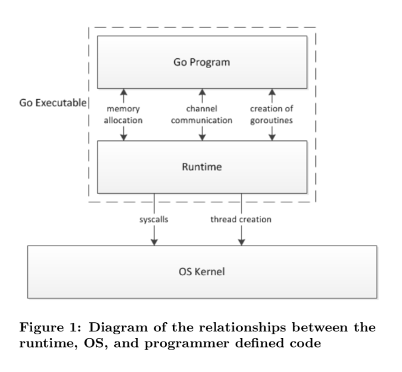
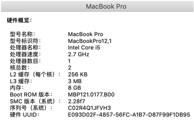
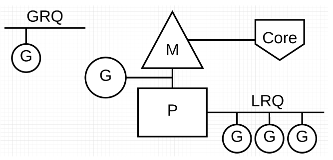
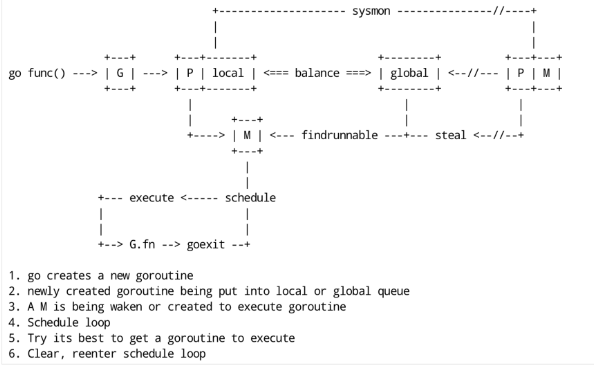

# 简介

Go Scheduler 是 Go 语言运行时的核心组件之一，它负责管理和调度 goroutine 的执行。

在 Go 语言中，goroutine 是一种轻量级的线程，它们的创建和切换成本远低于传统的操作系统线程。

Go Scheduler 的主要职责是决定哪些 goroutine 应该在何时何地执行，以及如何在多个 CPU 核心之间分配工作。


# 主要功能

1. **Goroutine 调度**：Go Scheduler 负责从全局可运行队列中选择 goroutine 来执行。

   并将它们分配给可用的 P（Processor 处理器）结构，P 结构代表了 Go 运行时中的逻辑处理器，每个 P 都绑定到一个 OS 线程上。

2. **工作窃取（Work Stealing）**：为了平衡负载，Go Scheduler 实现了一种工作窃取机制。

   允许空闲的 P 从其他忙碌的 P 的局部可运行队列中窃取 goroutine 来执行。

3. **上下文切换**：当一个 goroutine 需要等待 I/O 操作、系统调用或者主动让出 CPU 时间片时，Go Scheduler 会保存该 goroutine 的状态（即上下文切换），并将 CPU 分配给另一个可运行的 goroutine。

4. **公平调度**：Go Scheduler 力求公平地调度所有 goroutine，以防止某些 goroutine 占用过多的 CPU 时间而导致其他 goroutine 饥饿。

5. **内存管理**：Go Scheduler 还参与了 goroutine 的内存管理，包括 goroutine 栈的分配和调整大小。


# 什么是 scheduler

Go 程序的执行由两层组成：

- `Go Program` : 用户程序
- `Runtime` : 运行时

它们之间通过函数调用来实现**内存管理、channel 通信、goroutines 创建**等功能。

用户程序进行的系统调用都会被 Runtime 拦截，以此来帮助它进行调度以及垃圾回收相关的工作。

一个展现了全景式的关系如下图：




# 为什么要 scheduler

Go scheduler 可以说是 Go 运行时的一个最重要的部分了。

- Runtime 维护所有的 goroutines，并通过 scheduler 来进行调度。
- Goroutines 和 threads 是独立的，但是 goroutines 要依赖 threads 才能执行。

Go 程序执行的高效和 scheduler 的调度是分不开的。


# scheduler 底层原理

实际上在操作系统看来，所有的程序都是在执行多线程。将 goroutines 调度到线程上执行，仅仅是 runtime 层面的一个概念，在操作系统之上的层面。

有三个基础的结构体来实现 goroutines 的调度 , **g，p，m**

- `g` 代表一个 goroutine，表示 goroutine 栈的一些字段，指示当前 goroutine 的状态，指示当前运行到的指令地址，也就是 PC值
- `p` 代表一个虚拟的 Processor，它维护一个处于 Runnable 状态的 g 队列，`m` 需要获得 `p` 才能运行 `g`
- `m` 表示内核线程，包含正在运行的 goroutine 等字段

当然还有一个核心的结构体：`sched`，它总览全局。

Runtime 起始时会启动一些 G：

- 垃圾回收的 G
- 执行调度的 G
- 运行用户代码的 G
- 并且会创建一个 M 用来开始 G 的运行。

随着时间的推移，更多的 G 会被创建出来，更多的 M 也会被创建出来。


在 Go 的早期版本，并没有 p 这个结构体，`m` 必须从一个全局的队列里获取要运行的 `g`，因此需要获取一个全局的锁，当并发量大的时候，锁就成了瓶颈。

- 后来在大神 Dmitry Vyokov 的实现里，加上了 `p` 结构体。
- 每个 `p` 自己维护一个处于 Runnable 状态的 `g` 的队列，解决了原来的全局锁问题。
- 变成了分段锁


Go scheduler 的核心思想是：

1. **重用线程**；

- Go 语言的调度器会尽可能地重用线程，而不是为每个 Goroutine 都创建一个新的线程。

- 这种轻量级线程（Goroutine）和重量级线程（OS 线程）的对应关系由调度器动态管理，可以根据实际情况灵活调整。

2. **限制同时运行的线程数**；

- Go 调度器会将 Goroutine 分配给一组逻辑处理器（P），每个逻辑处理器会关联一个线程（M）。

- 通常，调度器会限制同时运行（不包含阻塞）的线程数为 N，N 等于 CPU 的核心数目，以充分利用多核处理器的并行性能。

3. **runqueues 队列;**

   - 每个逻辑处理器都管理着自己的 runqueue，用于存储待执行的 Goroutine。

   - 当某个线程阻塞（比如发生系统调用或锁竞争）时，它的 P 上的 Goroutine 将会转移到其他可运行的线程，避免线程的浪费。
   - 调度器还实现了 Goroutine 的窃取机制，当某个线程的 runqueue 空了，它可以从其他线程的队列中偷取 Goroutine 来执行，从而实现负载均衡。
   - Go scheduler 会启动一个后台线程 sysmon，用来检测长时间（超过 10 ms）运行的 goroutine，将其调度到 global runqueues。
     - 这是一个全局的 runqueue，优先级比较低，以示惩罚。


## 总览

通常讲到 Go scheduler 都会提到 GPM 模型，我们来一个个地看。

下图是我使用的 mac 的硬件信息，只有 2 个核。



但是配上 CPU 的超线程，1 个核可以变成 2 个，所以当我在 mac 上运行下面的程序时，会打印出 4。

```golang
func main() {
	// NumCPU 返回当前进程可以用到的逻辑核心数
	fmt.Println(runtime.NumCPU())
}
```

因为 NumCPU 返回的是逻辑核心数，而非物理核心数，所以最终结果是 4。

- Go 程序启动后，会给每个逻辑核心分配一个 P（Logical Processor）；

- 同时，会给每个 P 分配一个 M（Machine，表示内核线程），这些内核线程仍然由 OS scheduler 来调度。


总结一下，当我在本地启动一个 Go 程序时，会得到 4 个系统线程去执行任务，每个线程会搭配一个 P。

- 在初始化时，Go 程序会有一个 G（initial Goroutine），执行指令的单位。
- G 会在 M 上得到执行，内核线程是在 CPU 核心上调度，而 G 则是在 M 上进行调度。


G、P、M 都说完了，还有两个比较重要的组件没有提到： 

- 全局可运行队列（GRQ）
  - GRQ 存储全局的可运行 goroutine，这些 goroutine 还没有分配到具体的 P
- 本地可运行队列（LRQ）。 
  - LRQ 存储本地（也就是具体的 P）的可运行 goroutine



Go scheduler 是 Go runtime 的一部分，它内嵌在 Go 程序里，和 Go 程序一起运行, 因此它运行在用户空间。

goroutine 的三种状态（简化版的）：

| 状态      | 解释                                                         |
| --------- | ------------------------------------------------------------ |
| Waiting   | 等待状态，goroutine 在等待某件事的发生。<br />例如等待网络数据、硬盘；调用操作系统 API；等待内存同步访问条件 ready，如 atomic, mutexes |
| Runnable  | 就绪状态，只要给 M 线程我就可以运行                          |
| Executing | 运行状态。goroutine 在 M 上执行指令，这是我们想要的          |

下面这张 GPM 全局的运行示意图见得比较多，可以留着，看完后面的系列文章之后再回头来看，还是很有感触的：


