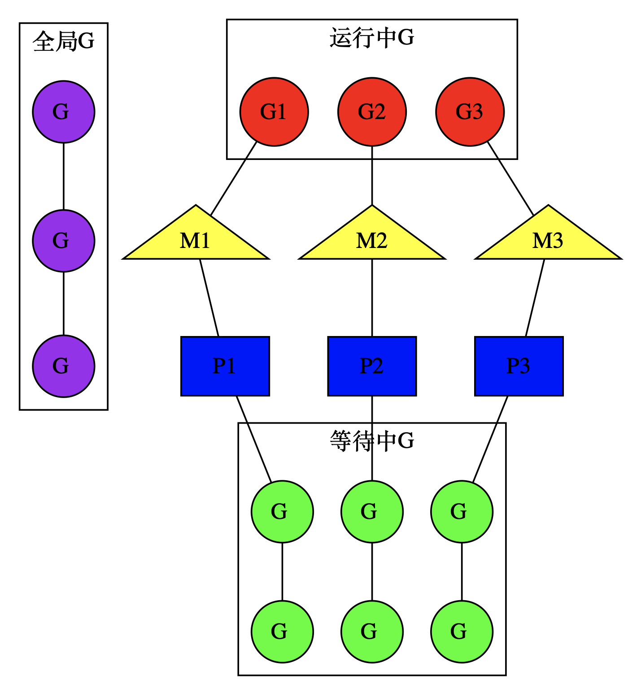
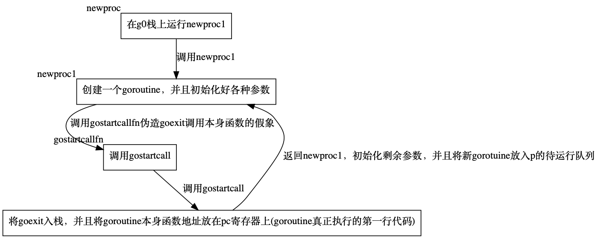
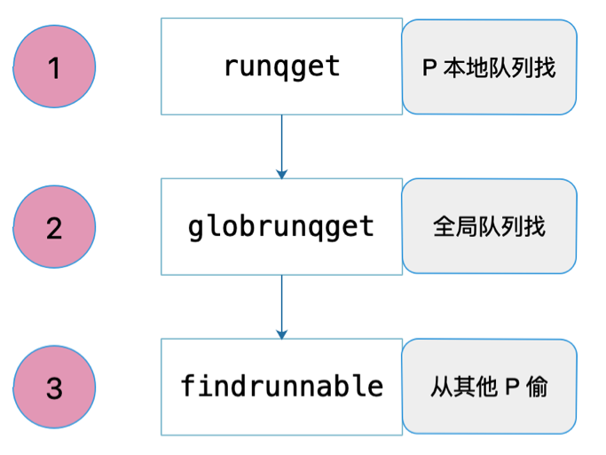

# 简介

在 Go 语言中，`goroutine` 是一种轻量级的线程实现，它允许开发者编写并发程序，而无需直接处理底层的多线程细节。


# 概念理解

调度相关的数据结构有三个:

- `M(线程)`: 线程
- `P(调度器)`: 用来帮助每个线程管理自己的goroutine
- `G(goroutine)`: 协程

我们可以通过`GOMAXPROCS`函数设置P的个数:

```go
runtime.GOMAXPROCS(n int)
```

**注意 **P(调度器) 的个数并不代表 M(线程) 的个数

- 例如程序启动时runtime代码会初始化 n 个 P(调度器)
- 但开始的时候只会启动一个 M(线程) ，就是 M0 和一个栈为 64K (其他goroutine默认初始栈大小2K) 来执行runtime代码。


## 其他线程是什么时候创建的?
- goroutine 被唤醒时，是运行在 M(线程) 上的(恢复goroutine的上下文)

- P(调度器) 是帮助 M(线程) 管理 goroutine 的，恢复上下文的操作也由P来完成。

如果 goroutine 被唤醒时发现还有空闲的 P(调度器)，并且没有其他 M(线程) 在窃取 goroutine 

- M(线程) 发现本地 goroutine 队列和全局 goroutine 队列都没有 goroutine 的时候，会去其他 M(线程) 窃取 goroutine

- 如果其他 M(线程) 都在忙, 没有空闲的线程，就会创建一个 M(线程) 让这个空闲的P帮他来管理 goroutine


总之一句话，开始的时候创建一个 M(线程)，当发现被唤醒的 goroutine 太多, 一个线程调度不过来的时候,

还有空闲 P(调度器) 没有工作就在创建新的 M (线程), 直到创建 procs 个M (通过`GOMAXPROCS`函数设置P的个数)


下面看一个图: 



- 紫色的 G 表示全局的 G: 未被唤醒的 goroutine
- 绿色的 G 表示等待中 G: 可被执行的 goroutine

我们的执行顺序肯定是从 goroutine 开始的, 我们激活一个全局的 goroutine 就会被某个空闲的 P(调度器) 获取加入等待的队列

任何 P(调度器) 会取出 goroutine 去对应的 M (线程) 执行


# 数据结构

`src/runtime/runtime2.go`

## goroutine的数据结构

Go 用结构体 g 表示 goroutine:

```go
// goroutine 的数据结构
type g struct {
	stack       stack   // 堆栈参数.描述实际的栈内存区间：[stack.lo, stack.hi)。
	stackguard0 uintptr // 用于抢占的，一般情况值为stack.lo + StackGuard
	stackguard1 uintptr // 用于C语言的抢占

	_panic    *_panic // 内部最深层的 panic。
	_defer    *_defer // 内部最深层的 defer。
	m         *m      // 当前的 m 结构，表示当前的 OS 线程。
	sched     gobuf   // 调度信息。
	syscallsp uintptr // 如果状态为 Gsyscall，则 syscallsp = sched.sp 用于 GC。
	syscallpc uintptr // 如果状态为 Gsyscall，则 syscallpc = sched.pc 用于 GC。
	stktopsp  uintptr // 期望的栈顶指针，用于在回溯中检查。

	// param 是一个通用的指针参数字段，用于在特定上下文中传递值，
	// 在其他存储参数的地方难以找到的情况下使用。它目前有三种用途：
	// 1. 当一个通道操作唤醒一个阻塞的 goroutine 时，它将 param 设置为已完成阻塞操作的 sudog。
	// 2. 由 gcAssistAlloc1 使用，向调用者信号表明 goroutine 已完成 GC 周期。
	//    以任何其他方式这样做都是不安全的，因为 goroutine 的栈可能在此期间移动。
	// 3. 由 debugCallWrap 使用，向新 goroutine 传递参数，因为在运行时中分配闭包是禁止的。
	param        unsafe.Pointer
	atomicstatus atomic.Uint32 // 用于原子操作的状态字段。
	stackLock    uint32        // sigprof/scang 锁；TODO: 合并进 atomicstatus。
	goid         uint64        // goroutine 的唯一标识符。
	schedlink    guintptr      // 用于链接 goroutine 的调度链。
	waitsince    int64         // goroutine 大约阻塞的时间。
	waitreason   waitReason    // 如果状态为 Gwaiting，阻塞的原因。

	preempt       bool // 抢占标志，如果需要抢占就将preempt设置为true
	preemptStop   bool // 表示在抢占时是否应过渡到 _Gpreempted 状态；否则，仅取消调度。
	preemptShrink bool // 表示是否应在同步安全点缩减栈。

	// 表示 g 是否停止在一个异步安全点。
	// 这意味着栈上有没有精确指针信息的帧。
	asyncSafePoint bool

	paniconfault bool // 表示是否应在遇到意外故障地址时引发 panic（而不是崩溃）。
	gcscandone   bool // 表示 g 已扫描栈；受 _Gscan 状态位保护。
	throwsplit   bool // 表示是否必须不拆分栈。
	// 表示是否有未锁定的通道指向此 goroutine 的栈。
	// 如果为真，则复制栈时需要获取通道锁以保护这些栈区域。
	activeStackChans bool

	// 表示 goroutine 即将停在 chansend 或 chanrecv 上。
	// 用于指示堆栈缩减的不安全点。
	parkingOnChan atomic.Bool

	raceignore    int8  // 表示是否忽略 race 检测事件。
	tracking      bool  // 表示是否正在为此 G 跟踪调度延迟统计信息。
	trackingSeq   uint8 // 用于决定是否跟踪此 G。
	trackingStamp int64 // 记录了 G 开始被跟踪的时间戳。
	runnableTime  int64 // 花费在可运行状态下的时间，当处于运行状态时清除，仅在跟踪时使用。

	lockedm    muintptr        // 表示 goroutine 正在哪个 m 上运行。
	sig        uint32          // 表示 goroutine 正在等待的信号。
	writebuf   []byte          // 是 goroutine 正在写入的缓冲区。
	sigcode0   uintptr         // 是信号的附加信息。
	sigcode1   uintptr         // 是信号的附加信息。
	sigpc      uintptr         // 是触发信号的 PC。
	parentGoid uint64          // 是创建此 goroutine 的 goroutine 的 goid。
	gopc       uintptr         // 是创建此 goroutine 的 go 语句的 PC。
	ancestors  *[]ancestorInfo // 是创建此 goroutine 的 goroutine 的祖先信息。
	startpc    uintptr         // 是 goroutine 函数的 PC。
	racectx    uintptr         // 用于 race 检测的上下文。
	waiting    *sudog          // 是此 g 正在等待的 sudog 结构（具有有效的 elem 指针）；按锁顺序排列。
	cgoCtxt    []uintptr       // 是 Cgo 调用栈回溯上下文。
	labels     unsafe.Pointer  // 是用于配置文件的标签。
	timer      *timer          // 是 time.Sleep 缓存的计时器。
	selectDone atomic.Uint32   // 表示我们是否参与了 select 并且有人赢得了竞争。

	// 表示此 goroutine 的栈在当前正在进行的 goroutine 配置文件中的状态。
	goroutineProfiled goroutineProfileStateHolder

	// 每个 G 的追踪器状态。
	trace gTraceState

	// 每个 G 的 GC 状态

	//  是此 G 的 GC 辅助信用，以分配的字节数表示。
	// 如果为正，则 G 有信用分配 gcAssistBytes 字节而不进行辅助。
	// 如果为负，则 G 必须通过执行扫描工作来纠正这一点。
	// 我们以字节跟踪这个，以便在分配热点路径中快速更新和检查债务。
	// 辅助比率确定这对应于多少扫描工作债务。
	gcAssistBytes int64
}
```

几个重要的属性:

1. **m *m**: 当前的 m 结构，表示当前的 OS 线程。
2. **goid uint64**: goroutine 的唯一标识符。
3. **param unsafe.Pointer** : 通用的指针参数字段，用于在特定上下文中传递值。
4. **stack stack**:  堆栈参数.描述实际的栈内存区间：[stack.lo, stack.hi)。
5. **atomicstatus atomic.Uint32**: 用于原子操作的状态字段。


## gobuf调度信息

gobuf 保存 goroutine 的调度信息，当一个 goroutine 被调度的时，本质上就是把这个 goroutine 放到 cpu ，恢复各个寄存器的值，然后运行

```go
// goroutine 的调度信息
type gobuf struct {
	sp uintptr  // 存储当前的栈指针，用于上下文切换时保存和恢复。
	pc uintptr  // 存储当前的程序计数器，即执行指令的地址。
	g  guintptr // 是指向当前 goroutine 的指针，用于识别和调度 goroutine。

	// 是函数上下文，可能指向一个在堆上分配的函数值。
	// 这是一个保存的、活动的寄存器，它在真实寄存器和 gobuf 之间交换。
	// 在栈扫描中被视为根对象，以避免在汇编代码中设置写屏障。
	ctxt unsafe.Pointer

	ret uintptr // 存储返回地址，用于上下文恢复时跳转到正确的指令。
	lr  uintptr // 在 ARM 架构中，保存了调用者提供的返回地址，用于函数调用的上下文恢复

	// 存储基址寄存器的值，用于启用了帧指针的架构（如 x86_64）中的上下文切换。
	// 用于构建函数调用栈的帧结构。
	bp uintptr
}
```

几个重要的属性

1. **sp uintptr**: 存储当前的栈指针，用于上下文切换时保存和恢复。
2. **pc uintptr**: 存储当前的程序计数器，即执行指令的地址。
3. **g  guintptr**: 是指向当前 goroutine 的指针，用于识别和调度 goroutine。
4. **ctxt unsafe.Pointer**: 函数上下文指针，可能指向堆上分配的函数值。
5. **ret uintptr**: 存储返回地址，用于上下文恢复时跳转到正确的指令。

`gobuf` 结构体的这些字段在 goroutine 的上下文切换过程中起到了至关重要的作用，确保了每个 goroutine 在被重新调度时可以准确地恢复到之前的状态。


## m线程

`m` 结构体是 Go 运行时中代表 OS 线程的重要数据结构

```go
// 代表 OS 线程的重要数据结构
type m struct {
	g0      *g     // 这是 m 关联的调度栈 goroutine，用于管理 m 的调度
	morebuf gobuf  // 当 goroutine 需要更多栈空间时，此 gobuf 结构体用于传递参数给 morestack 函数。
	divmod  uint32 // ARM 架构下除法和模运算的分母，liblink 了解此字段。
	_       uint32 // 用于对齐下一个字段至 8 字节

	procid     uint64            // 调试器使用的进程 ID，但偏移量不是硬编码的，便于跨平台兼容。
	gsignal    *g                // 信号处理 goroutine
	goSigStack gsignalStack      // Go 分配的信号处理栈
	sigmask    sigset            // 存储保存的信号掩码
	tls        [tlsSlots]uintptr // 线程本地存储（用于 x86 外部寄存器）
	mstartfn   func()            // m 启动函数

	curg      *g       // 当前运行的 goroutine
	caughtsig guintptr // 被致命信号捕获时运行的 goroutine。

	p     puintptr // 当前 m 所附着的 p 结构，用于执行 Go 代码。
	nextp puintptr // 下一个执行的 p
	oldp  puintptr // 在执行系统调用前的 p

	id int64 // m 的唯一标识符。

	mallocing  int32     // 分配内存的计数器。
	throwing   throwType // 抛出异常的类型。
	preemptoff string    // 如果 if != "" 非空字符串，保持 curg 在此 m 上运行。
	locks      int32     // 锁计数器。
	dying      int32     // 死亡标志。
	profilehz  int32     // 用于 CPU profiling 的采样频率。

	spinning    bool          // 表示 m 是否在寻找可执行的工作，即是否处于空闲但活跃的搜索状态。
	blocked     bool          // 表示 m 是否被阻塞在等待通知（note）上。
	newSigstack bool          // 如果为真，表示 m 的初始化函数 minit 已经在 C 线程上调用了 sigaltstack，用于设置信号处理栈。
	printlock   int8          // 打印锁。
	incgo       bool          // m 是否正在执行 cgo 调用。
	isextra     bool          // m 是否是额外的 m。
	isExtraInC  bool          // m 是否是额外的 m 且未执行 Go 代码。
	freeWait    atomic.Uint32 // 原子标记，表示是否安全删除 g0 和 m。

	fastrand      uint64        // 快速随机数生成器的内部状态。
	needextram    bool          // 是否需要额外的 m。
	traceback     uint8         // traceback 级别。
	ncgocall      uint64        // 总共的 cgo 调用次数。
	ncgo          int32         // 当前正在进行的 cgo 调用次数。
	cgoCallersUse atomic.Uint32 // 如果非零，cgoCallers 正在临时使用中。
	cgoCallers    *cgoCallers   // cgo 调用的 traceback。
	park          note          // 一个 note 结构，用于 m 的阻塞和唤醒。
	alllink       *m            // 在 allm 列表上的链接。
	schedlink     muintptr      // 在调度器上的链接。
	lockedg       guintptr      // 被锁定的 goroutine。
	createstack   [32]uintptr   // 创建线程的栈。
	lockedExt     uint32        // 外部 LockOSThread 的跟踪。
	lockedInt     uint32        // 内部 lockOSThread 的跟踪。
	nextwaitm     muintptr      // 下一个等待锁的 m。

	// 从 gopark 传入 park_m 的参数。
	waitunlockf          func(*g, unsafe.Pointer) bool
	waitlock             unsafe.Pointer
	waitTraceBlockReason traceBlockReason
	waitTraceSkip        int

	syscalltick uint32      // 用于系统调用的 tick 计数。
	freelink    *m          // 在 sched.freem 列表上的链接。
	trace       mTraceState // m 的追踪状态，用于性能分析。

	// 低级别 NOSPLIT 函数的 libcall 数据。
	libcall   libcall
	libcallpc uintptr // for cpu profiler
	libcallsp uintptr
	libcallg  guintptr
	syscall   libcall // 用于存储 Windows 上系统调用参数的 libcall。

	// 在 VDSO 调用期间用于 traceback 的栈指针和程序计数器。
	vdsoSP uintptr // 在VDSO调用时用于回溯的SP (如果不在通话中，则为0)
	vdsoPC uintptr // 在VDSO调用中用于追溯的PC

	preemptGen    atomic.Uint32 // 预抢占信号完成计数。
	signalPending atomic.Uint32 // 是否有未决的预抢占信号。

	dlogPerM // 日志记录每 m 的数据。

	mOS // OS 特定的 m 数据。

	// m 持有的锁信息，用于锁排名算法，最多可以记录 10 个锁。
	locksHeldLen int
	locksHeld    [10]heldLockInfo
}
```

几个重要的属性

1. **g0      *g** : 这是 m 关联的调度栈 goroutine，用于管理 m 的调度
2. **procid     uint64**: 调试器使用的进程 ID，偏移量不是硬编码的，便于跨平台兼容。
3. **curg      *g**: 当前运行的 goroutine
4. **p     puintptr**: 当前 m 所附着的 p 结构，用于执行 Go 代码。
5. **id int64**: m 的唯一标识符。


## p调度器

P表示一个调度器，为M提供上下文环境，使得M可以执行多个goroutine

```go
// 一个调度 m 线程执行 goroutine 的处理器
type p struct {
	id          int32      // P 的唯一标识符，用于区分不同的 P 实例。
	status      uint32     // P 的当前状态，例如 pidle 表示 P 处于空闲状态，prunning 表示 P 正在运行。
	link        puintptr   // 用于连接 P 到其他 P 的双向链表节点。
	schedtick   uint32     // 每次调度器调用时递增。
	syscalltick uint32     // 每次系统调用时递增。
	sysmontick  sysmontick // 最后由 sysmon 观察到的 tick 值。
	m           muintptr   // 指向与 P 关联的 m 结构体的指针，m 是操作系统线程的抽象。
	mcache      *mcache    // mcache 结构，用于缓存分配器的内存。
	pcache      pageCache  // 页缓存，用于管理内存页的分配和回收。
	raceprocctx uintptr    // race 检测相关的上下文。

	// 可用的 defer 结构池，用于延迟函数调用。
	deferpool    []*_defer
	deferpoolbuf [32]*_defer

	// goroutine ID 缓存，用于加速访问 runtime·sched.goidgen。
	goidcache    uint64
	goidcacheend uint64

	// 定义了可运行 goroutine 的队列，用于存储等待执行的 goroutine。
	runqhead uint32        // p本地goroutine队列的头
	runqtail uint32        // p本地goroutine队列的尾
	runq     [256]guintptr // 队列指针，和sync.pool中数据结构一样也是循环队列
	runnext  guintptr      // 指向下一个应该运行的 goroutine 的指针，用于优化通信和等待模式的调度。

	// G 死亡状态（Gdead）的 goroutine 的缓存列表。
	gFree struct {
		gList
		n int32
	}

	// sudog 缓存，系统调用相关的 goroutine 缓存
	sudogcache []*sudog    // sudog缓存，channel用的
	sudogbuf   [128]*sudog // 也是防止false sharing

	// mspan 对象缓存，用于更高效的内存管理。
	mspancache struct {
		len int
		buf [128]*mspan
	}

	pinnerCache *pinner // pinner 对象缓存，减少重复创建的开销。

	trace pTraceState // 跟踪状态。

	palloc persistentAlloc // 持久化分配器，用于避免互斥锁。

	// 定时器堆的第一个条目的 when 字段值。
	// 如果定时器堆为空，则为 0。
	timer0When atomic.Int64

	// 最早已知的具有 timerModifiedEarlier 状态的定时器的 nextwhen 字段值。
	// 如果没有这样的定时器则为 0。
	timerModifiedEarliest atomic.Int64

	// GC 协助时间和分段标记阶段所花费的时间统计。
	gcAssistTime         int64 // 协助分配器花费的时间
	gcFractionalMarkTime int64 // 分段标记阶段花费的时间

	limiterEvent limiterEvent // GC CPU 限制器事件跟踪。

	gcMarkWorkerMode      gcMarkWorkerMode // GC 标记工作者模式。
	gcMarkWorkerStartTime int64            // 标记工作者开始时间

	// GC 工作缓冲区和写屏障缓冲区，用于优化垃圾回收过程。
	gcw   gcWork // GC 工作缓冲区缓存。
	wbBuf wbBuf  // GC 写屏障缓冲区。

	runSafePointFn uint32 // 如果为 1，在下一个安全点运行 sched.safePointFn。

	statsSeq atomic.Uint32 // 统计序列计数器。

	// 定时器相关的锁、列表、计数器，用于实现 time 包的功能。
	timersLock    mutex         // 定时器锁。
	timers        []*timer      // 一些时间点的动作，用于实现标准库中的 time 包。
	numTimers     atomic.Uint32 // 定时器堆中的定时器数量。
	deletedTimers atomic.Uint32 // 定时器堆中的删除定时器数量。
	timerRaceCtx  uintptr       // 执行定时器函数时使用的 race 上下文。

	maxStackScanDelta int64 // 积累的堆栈扫描增量，表示活动 goroutine 的堆栈空间。

	// 当前 goroutine 在 GC 时间的统计信息。
	scannedStackSize uint64 // 通过此 P 扫描的堆栈大小
	scannedStacks    uint64 // 通过此 P 扫描的堆栈数量

	preempt bool // 如果设置，表示此 P 应尽快进入调度器。

	pageTraceBuf pageTraceBuf // 页面跟踪缓冲区，仅在启用了页面跟踪实验功能时使用。
}
```

几个重要的属性

1. **id          int32**: P 的唯一标识符，用于区分不同的 P 实例。
2. **m           muintptr**: 指向与 P 关联的 m 结构体的指针，m 是操作系统线程的抽象。
3. **runq     [256]guintptr**: 队列指针，存储等待执行的 goroutine。
4. **gFree struct**: G 死亡状态（Gdead）的 goroutine 的缓存列表。
5. **timersLock    mutex**: 定时器锁。


## schedt调度器数据结构

schedt结构体用来保存P的状态信息和goroutine的全局运行队列。

```go
// schedt 时间表是 Go 运行时中负责全局调度策略的关键数据结构。
// 用来保存P的状态信息和goroutine的全局运行队列
type schedt struct {
	goidgen atomic.Uint64 // 生成 goroutine ID 的原子计数器。

	// 用于控制网络 I/O 轮询的定时器。
	lastpoll  atomic.Int64 // 上一次网络轮询的时间戳，如果当前正在进行轮询，则为 0。
	pollUntil atomic.Int64 // 当前轮询应持续到的时间戳。

	lock mutex // 全局调度器锁，用于保护数据结构免受并发修改。

	// 维护空闲的M
	midle        muintptr     // 等待工作的空闲 m 的链表头。
	nmidle       int32        // 等待工作的空闲 m 的数量。
	nmidlelocked int32        // 锁定并等待工作的 m 的数量。
	mnext        int64        // 已创建的 m 的数量，以及下一个 M ID。
	maxmcount    int32        // 最多创建多少个M(10000)
	nmsys        int32        // 系统 m 的数量，不计入死锁检查。
	nmfreed      int64        // 累计已释放的 m 的数量。
	ngsys        atomic.Int32 // 系统级 goroutine 的数量，不受调度器的正常调度规则影响。

	// 维护空闲的P
	pidle        puintptr      // 空闲 p 的链表头。
	npidle       atomic.Int32  // 空闲 p 的数量。
	nmspinning   atomic.Int32  // 正在寻找工作的 m 的数量。
	needspinning atomic.Uint32 // 需要查找工作的标志，布尔值。必须持有 sched.lock 才能设置为 1。

	// 全局可运行队列和其大小，用于存储准备运行的 goroutine。
	// 1.Goroutine 主动让出执行权，例如调用 runtime.Gosched() 方法；
	// 2.Goroutine 执行的时间片用完，会被放入全局队列以便重新调度；
	// 3.某些系统调用（比如阻塞的网络操作）会导致 Goroutine暂时进入全局队列。
	runq     gQueue // 全局可运行队列。
	runqsize int32  // 全局可运行队列的大小。

	// 控制调度器的选择性禁用，允许暂停用户 goroutine 的调度。
	disable struct {
		user     bool   // 用户禁用用户 goroutine 的调度。
		runnable gQueue // 待运行的 Gs 队列。
		n        int32  // runnable 的长度。
	}

	// 全局缓存已经退出的goroutine链表，下次再创建的时候直接用
	// 全局死亡 G 的缓存，用于管理已死的 goroutine 的生命周期。
	gFree struct {
		lock    mutex // 保护锁。
		stack   gList // 有栈的 Gs。
		noStack gList // 无栈的 Gs。
		n       int32 // 缓存中的 G 的数量。
	}

	// 系统调用相关的 sudog 缓存和 defer 结构体池。
	// 中央 sudog 结构体缓存。
	sudoglock  mutex
	sudogcache *sudog
	// 中央可用 defer 结构体池。
	deferlock mutex
	deferpool *_defer

	freem *m // 是等待被释放的 m 的列表，当 m.exited 设置时。通过 m.freelink 链接。

	// GC、停止信号、安全点函数、CPU profiling 等相关状态和控制。
	gcwaiting     atomic.Bool // 标记 gc 是否正在等待运行。
	stopwait      int32       // 控制停止信号的等待计数。
	stopnote      note        // 停止信号的 note。
	sysmonwait    atomic.Bool // 标记 sysmon 是否正在等待。
	sysmonnote    note        // sysmon 的 note。
	safePointFn   func(*p)    // 在每个逻辑处理器（P）上的下一个 GC 安全点调用的函数，如果 p.runSafePointFn 被设置。
	safePointWait int32       // 表示等待安全点的计数器。
	safePointNote note        // 表示关于 GC 安全点的说明。
	profilehz     int32       // CPU profiling 速率。

	// 监控和统计信息，包括系统配置变化、调度延迟、互斥锁等待时间等。
	procresizetime     int64         // 上次更改 gomaxprocs 的时间。
	totaltime          int64         // 截至 procresizetime 的 gomaxprocs 的积分。
	sysmonlock         mutex         // 获取并保持此互斥锁以阻止 sysmon 与运行时的其余部分交互。
	timeToRun          timeHistogram // 是调度延迟的分布，G 在从 _Grunnable 状态转换到 _Grunning 状态前花费的时间
	idleTime           atomic.Int64  // 每个 GC 周期重置。已“花费”的总 CPU 时间，处于空闲状态。
	totalMutexWaitTime atomic.Int64  // 是 goroutines 在 _Gwaiting 状态下等待互斥锁的时间总和。
}
```

几个重要的属性

1. **goidgen atomic.Uint64**: 生成 goroutine ID 的原子计数器。
2. **runq     gQueue**: 全局可运行队列，用于存储准备运行的 goroutine。
3. **gcwaiting     atomic.Bool**: 标记 gc 是否正在等待运行。
4. **freem *m**: 是等待被释放的 m 的列表，当 m.exited 设置时。
5. **stopnote      note**: 停止信号的 note。


## 几个重要的全局变量

```go
var(
	allm       *m           // 所有 m（操作系统线程）的链表头。所有的m构成的一个链表
	gomaxprocs int32        // p的最大值，默认等于ncpu，但可以通过 runtime.GOMAXPROCS 修改
	ncpu       int32        // 系统中cpu核的数量，程序启动时由 runtime.osinit 代码初始化
	sched      schedt       // 调度器数据结构，负责全局调度策略。
	newprocs   int32        // 新建的处理器数量，用于动态调整 gomaxprocs。
)
```


# 剖析调度的初始化

启动序列如下：

1. 调用 runtime.osinit 获取系统参数
2. 调用 runtime.schedinit 初始化 p 调度器
3. 调用 runtime.newproc 创建并排队新的 goroutine
4. 调用 runtime.mstart 调度循环
5. 新的 goroutine 调用 runtime.main


## 1.runtime.osinit()初始化操作系统

`src/runtime/os_windows.go`

在启动过程中有一个非常重要的入口方法`runtime.osinit()`: 

- 初始化系统参数

- cpu 等数据是在这里初始化的

```go
// 初始化过程确保了 Go 程序在 Windows 环境下的兼容性和性能，同时处理了一些操作系统级别的细节
// 如错误处理、时间精度、多核利用和内存管理。
func osinit() {
	// 是一个用于调用 Windows 的 stdcall 调用约定的函数地址。
	// 这里使用 unsafe.Pointer 和 abi 包来获取 asmstdcall 函数的地址。
	asmstdcallAddr = unsafe.Pointer(abi.FuncPCABI0(asmstdcall))

	// 加载可选的系统调用。这些调用可能依赖于特定的 Windows 版本或者配置。
	loadOptionalSyscalls()

	// 阻止错误对话框的显示，这通常用于服务器环境，避免出现用户界面。
	preventErrorDialogs()

	// 初始化异常处理程序，用于捕获和处理未捕获的异常。
	initExceptionHandler()

	// 初始化高分辨率定时器，这是为了提高时间精度和性能。
	initHighResTimer()

	// 存储了设置系统定时器分辨率的返回值。
	// 参数 osRelax(false) 表示是否放松定时器分辨率要求。
	timeBeginPeriodRetValue = osRelax(false)

	// 初始化系统目录路径，这有助于确定系统文件的位置。
	initSysDirectory()

	// 初始化长路径支持，以便在 Windows 上使用超过 260 字符的路径。
	initLongPathSupport()

	// 获取系统当前的处理器核心数量。
	ncpu = getproccount()

	// 获取物理页面大小，这对于内存分配和管理至关重要。
	physPageSize = getPageSize()

	// 禁用 Windows 动态优先级提升功能。
	// Windows 的动态优先级提升假设进程有不同的专用线程类型（GUI、I/O、计算等），
	// 但是 Go 进程使用的是等效线程，它们混合执行 GUI、I/O 和计算任务。
	// 在这种情况下，动态优先级提升不仅无效，反而可能有害，所以我们将其关闭。
	// stdcall2 是用于调用 Windows API 的封装函数，_SetProcessPriorityBoost 是对应的 API 名称。
	// 第二个参数是当前进程句柄，第三个参数为 1 表示关闭动态优先级提升。
	stdcall2(_SetProcessPriorityBoost, currentProcess, 1)
}
```


## 2.runtime.schedinit()创建p调度器

`src/runtime/proc.go`

主要负责设置调度器和初始化各种运行时组件。

```go
// 启动序列如下：
//
// 调用 runtime.osinit
// 调用 runtime.schedinit
// 创建并排队新的 G
// 调用 runtime.mstart
// 新的 G 调用 runtime.main
func schedinit() {
	// 初始化多个锁，用于运行时内部的同步和互斥。
	// 每个锁都分配了特定的等级，以避免死锁。
	// 这些锁包括但不限于调度器锁、系统监控锁、defer 锁等。
	// 初始化锁的等级是运行时调度和并发控制的关键部分。
	lockInit(&sched.lock, lockRankSched)             // 初始化 sched.lock，调度器锁，锁等级为 lockRankSched。
	lockInit(&sched.sysmonlock, lockRankSysmon)      // 初始化 sched.sysmonlock，系统监控锁，锁等级为 lockRankSysmon。
	lockInit(&sched.deferlock, lockRankDefer)        // 初始化 sched.deferlock，defer 锁，锁等级为 lockRankDefer。
	lockInit(&sched.sudoglock, lockRankSudog)        // 初始化 sched.sudoglock，sudog 锁，锁等级为 lockRankSudog。
	lockInit(&deadlock, lockRankDeadlock)            // 初始化 deadlock，死锁锁，锁等级为 lockRankDeadlock。
	lockInit(&paniclk, lockRankPanic)                // 初始化 paniclk，panic 锁，锁等级为 lockRankPanic。
	lockInit(&allglock, lockRankAllg)                // 初始化 allglock，所有 G 的锁，锁等级为 lockRankAllg。
	lockInit(&allpLock, lockRankAllp)                // 初始化 allpLock，所有 P 的锁，锁等级为 lockRankAllp。
	lockInit(&reflectOffs.lock, lockRankReflectOffs) // 初始化 reflectOffs.lock，反射包 Offs 锁，锁等级为 lockRankReflectOffs。
	lockInit(&finlock, lockRankFin)                  // 初始化 finlock，终结锁，锁等级为 lockRankFin。
	lockInit(&cpuprof.lock, lockRankCpuprof)         // 初始化 cpuprof.lock，CPU 分析锁，锁等级为 lockRankCpuprof。
	// 初始化 allocmLock，M 分配锁，锁等级为 lockRankAllocmR、lockRankAllocmRInternal、lockRankAllocmW。
	allocmLock.init(lockRankAllocmR, lockRankAllocmRInternal, lockRankAllocmW)
	// 初始化 execLock，执行锁，锁等级为 lockRankExecR、lockRankExecRInternal、lockRankExecW。
	execLock.init(lockRankExecR, lockRankExecRInternal, lockRankExecW)
	// 初始化 traceLock。
	traceLockInit()
	// 初始化 memstats.heapStats.noPLock，堆统计锁，锁等级为 lockRankLeafRank，确保它始终是叶子锁。
	// 所有此锁的关键部分都应该非常短。
	lockInit(&memstats.heapStats.noPLock, lockRankLeafRank)

	// 返回当前 G 的指针, 取出g0
	gp := getg()

	// 如果启用了 race 检测器，raceinit 必须是第一个调用的函数。
	// raceinit 在调用 mallocinit 之前完成，避免在初始化期间发生竞争条件。
	if raceenabled {
		gp.racectx, raceprocctx0 = raceinit()
	}

	// 设置最大 m（操作系统线程）数量。
	sched.maxmcount = 10000

	// 世界开始时是停止的。
	worldStopped()

	// 验证模块数据，初始化栈，内存分配器，调试设置等。
	// 这些步骤确保了运行时的基本结构和功能就绪。
	moduledataverify()           // 验证模块数据
	stackinit()                  // 初始化栈
	mallocinit()                 // 初始化内存分配器
	godebug := getGodebugEarly() // 获取早期的 Godebug 设置
	initPageTrace(godebug)       // 初始化页跟踪，必须在 mallocinit 之后但在任何分配发生之前运行。
	cpuinit(godebug)             // 初始化 CPU，必须在 alginit 之前运行。
	alginit()                    // 初始化算法，如哈希映射、随机数生成等，必须在使用之前调用。
	fastrandinit()               // 初始化快速随机数生成器，必须在 mcommoninit 之前运行。
	mcommoninit(gp.m, -1)        // 初始化当前 g0 的 m0 结构体
	modulesinit()                // 初始化模块，提供 activeModules。
	typelinksinit()              // 初始化类型链接，使用 maps 和 activeModules。
	itabsinit()                  // 初始化接口表，使用 activeModules。
	stkobjinit()                 // 初始化栈对象，必须在 GC 开始之前运行。

	sigsave(&gp.m.sigmask)     // 保存信号掩码，用于后续恢复。
	initSigmask = gp.m.sigmask // 记录初始信号掩码。

	goargs()         // 解析命令行参数。
	goenvs()         // 解析环境变量。
	secure()         // 设置安全模式，可能会影响某些运行时行为。
	parsedebugvars() // 解析调试变量，可能会影响运行时的调试和性能配置。
	gcinit()         // 初始化 GC（垃圾回收）。

	// 如果禁用了内存剖析，更新 MemProfileRate 为 0 以关闭内存剖析。
	if disableMemoryProfiling {
		MemProfileRate = 0
	}

	// 加锁，更新调度器状态。
	lock(&sched.lock)
	// 设置上次网络轮询的时间戳，这将用于后续的网络 I/O 调度决策。
	sched.lastpoll.Store(nanotime())

	// ncpu 在 runtime.osinit 时已经获取
	procs := ncpu
	// 如果GOMAXPROCS设置并且合法就将procs的设置为GOMAXPROCS
	if n, ok := atoi32(gogetenv("GOMAXPROCS")); ok && n > 0 {
		procs = n
	}

	// 调整处理器数量，返回包含本地工作列表的 P 的列表，需要由调用者调度, 确保有足够的 P 来处理 goroutine。
	// 如果调整失败，会抛出异常。
	if procresize(procs) != nil {
		throw("unknown runnable goroutine during bootstrap")
	}

	// 解锁，允许其他调度器操作。
	unlock(&sched.lock)

	// 世界现在实际上已经启动，P 可以运行了。
	worldStarted()

	// 确保构建版本和模块信息被记录在二进制文件中。
	if buildVersion == "" {
		// 不应触发此条件，但确保 runtime·buildVersion 被保留。
		buildVersion = "unknown"
	}
	if len(modinfo) == 1 {
		// 同样，不应触发此条件，但确保 runtime·modinfo 被保留。
		modinfo = ""
	}
}
```

1. **锁初始化**：通过 `lockInit` 函数初始化一系列锁，确保运行时内部的同步和互斥正确处理。锁的等级是运行时调度和并发控制的重要组成部分，避免死锁和竞争条件。
2. **race 检测器初始化**：如果启用了 race 检测器，`raceinit` 函数必须首先调用，以确保检测器的正确初始化和后续内存分配的安全性。
3. **设置最大 m 数量**：设置调度器允许的最大 m 数量，以限制并发线程的数量。
4. **世界停止和启动**：`worldStopped` 和 `worldStarted` 分别标记世界（运行时）的停止和启动状态，用于控制调度器的行为。
5. **初始化和配置**：通过一系列初始化函数，如 `stackinit`, `mallocinit`, `cpuinit`, `alginit` 等，确保运行时的栈、内存分配、算法、CPU 特性等基本结构和功能就绪。
6. **解析和设置**：解析命令行参数、环境变量、安全模式和调试变量，初始化 GC，并根据需要调整内存剖析设置。
7. **处理器数量调整**：根据 `GOMAXPROCS` 环境变量或默认的处理器数量调整处理器数量，确保有足够的 P 来处理 goroutine。
8. **调度初始化最后一步**: 整处理器数量, 初始化最后一步`procresize()`
9. **构建信息保留**：确保构建版本和模块信息被记录在二进制文件中，即使在某些条件下这些信息可能是默认值。

整个 `schedinit` 函数确保了 Go 运行时的初始化和配置，为后续的 goroutine 调度和运行提供了必要的基础。

这些步骤按照严格的顺序执行，确保了运行时的稳定性和效率。

### runtime.procresize()

`schedinit` 函数调整处理器数量, 初始化最后一步`procresize()`:

- 调整处理器数量，返回包含本地工作列表的 P 的列表，需要由调用者调度, 确保有足够的 P 来处理 goroutine。

```go
// 调整处理器数量。
//
// 必须持有 sched.lock 锁，并且世界必须停止。
//
// gcworkbufs 必须不会被 GC 或写屏障代码修改，
// 因此如果处理器数量实际上发生变化，GC 不应运行。
//
// 返回包含本地工作列表的 P 的列表，需要由调用者调度。
func procresize(nprocs int32) *p {
	assertLockHeld(&sched.lock) // 断言锁被持有
	assertWorldStopped()        // 断言世界已停止

	// 获取旧的处理器数量
	old := gomaxprocs
	// 如果参数无效，抛出错误
	if old < 0 || nprocs <= 0 {
		throw("procresize: invalid arg")
	}
	// 如果跟踪启用，记录新的处理器数量
	if traceEnabled() {
		traceGomaxprocs(nprocs)
	}

	// 更新统计处理器信息

	// 获取当前时间
	now := nanotime()
	// 计算并更新总时间
	if sched.procresizetime != 0 {
		sched.totaltime += int64(old) * (now - sched.procresizetime)
	}
	// 更新上一次调整时间
	sched.procresizetime = now

	// 计算掩码单词数量
	maskWords := (nprocs + 31) / 32

	// 如果需要更多处理器，动态扩展 allp、idlepMask 和 timerpMask 列表。
	if nprocs > int32(len(allp)) {
		// 加锁，防止 retake 并发运行
		lock(&allpLock)

		// 切片至新大小
		if nprocs <= int32(cap(allp)) {
			allp = allp[:nprocs]
		} else {
			// 新建切片
			nallp := make([]*p, nprocs)
			// 复制旧元素
			copy(nallp, allp[:cap(allp)])
			// 替换切片
			allp = nallp
		}

		// 扩容 idlepMask 和 timerpMask
		if maskWords <= int32(cap(idlepMask)) {
			idlepMask = idlepMask[:maskWords]
			timerpMask = timerpMask[:maskWords]
		} else {
			nidlepMask := make([]uint32, maskWords)
			// 不需要复制超出len，老Ps是无关紧要的。
			copy(nidlepMask, idlepMask)
			idlepMask = nidlepMask

			ntimerpMask := make([]uint32, maskWords)
			copy(ntimerpMask, timerpMask)
			timerpMask = ntimerpMask
		}

		// 解锁
		unlock(&allpLock)
	}

	// 初始化新增加的处理器 P，设置其状态并存储。
	for i := old; i < nprocs; i++ {
		pp := allp[i]
		if pp == nil {
			// 创建新的 P 结构体
			pp = new(p)
		}

		// 初始化 P
		pp.init(i)
		// 原子存储 P
		atomicstorep(unsafe.Pointer(&allp[i]), unsafe.Pointer(pp))
	}

	// 根据需要，切换当前处理器至空闲状态或获取新的处理器。

	// 获取当前 goroutine
	gp := getg()
	if gp.m.p != 0 && gp.m.p.ptr().id < nprocs {
		// 继续使用当前的 P
		gp.m.p.ptr().status = _Prunning
		gp.m.p.ptr().mcache.prepareForSweep()
	} else {
		// 释放当前 P 并获取 allp[0]
		if gp.m.p != 0 {
			if traceEnabled() {
				// 跟踪当前 P 的状态改变
				traceGoSched()
				traceProcStop(gp.m.p.ptr())
			}
			gp.m.p.ptr().m = 0 // 清除 M 引用
		}

		gp.m.p = 0         // 清除 P 引用
		pp := allp[0]      // 获取第一个 P
		pp.m = 0           // 清除 M 引用
		pp.status = _Pidle // 设置 P 状态为空闲
		acquirep(pp)       // 把allp[0]和m0关联起来

		// 开始跟踪
		if traceEnabled() {
			traceGoStart()
		}
	}

	// g.m.p 现在设置，所以我们不再需要 mcache0 进行引导。
	mcache0 = nil

	// 销毁不再需要的处理器 P 的资源。
	for i := nprocs; i < old; i++ {
		pp := allp[i]
		pp.destroy() // 销毁 P
	}

	// 根据新的处理器数量，裁剪 allp、idlepMask 和 timerpMask 列表。
	if int32(len(allp)) != nprocs {
		lock(&allpLock)
		allp = allp[:nprocs]
		idlepMask = idlepMask[:maskWords]
		timerpMask = timerpMask[:maskWords]
		unlock(&allpLock)
	}

	// 根据 P 的状态将其放入空闲队列或可运行队列。

	// 初始化可运行 P 的指针
	var runnablePs *p
	for i := nprocs - 1; i >= 0; i-- {
		pp := allp[i]
		// 如果是当前 P，跳过
		if gp.m.p.ptr() == pp {
			continue
		}

		// 设置 P 状态为空闲
		pp.status = _Pidle
		if runqempty(pp) {
			// 将 P 放入空闲队列
			pidleput(pp, now)
		} else {
			// 获取 M
			pp.m.set(mget())
			// 链接可运行 P
			pp.link.set(runnablePs)
			// 更新可运行 P 的指针
			runnablePs = pp
		}
	}

	// 原子更新全局处理器数量，并通知 GC 限速器。

	// 重置窃取顺序
	stealOrder.reset(uint32(nprocs))
	// 指向 gomaxprocs 的指针
	var int32p *int32 = &gomaxprocs
	// 原子更新 gomaxprocs
	atomic.Store((*uint32)(unsafe.Pointer(int32p)), uint32(nprocs))
	// 通知限速器处理器数量的变化
	if old != nprocs {
		gcCPULimiter.resetCapacity(now, nprocs)
	}

	// 返回那些具有本地工作队列的处理器，它们需要被调度。
	return runnablePs
}
```

1. **断言锁和世界状态**：确保 `sched.lock` 被持有，且世界处于停止状态，这确保了调整过程的安全性。
2. **检查参数有效性**：检查新的处理器数量是否合法。
3. **记录调整事件**：如果启用了跟踪，则记录处理器数量的变化。
4. **更新统计信息**：计算并更新总运行时间，基于上一次调整的时间点。
5. **调整 P 列表大小**：如果需要更多处理器，动态扩展 `allp`、`idlepMask` 和 `timerpMask` 列表。
6. **初始化新处理器**：初始化新增加的处理器 P，设置其状态并存储。
7. **切换当前处理器**：根据需要，切换当前处理器至空闲状态或获取新的处理器。
8. **释放旧处理器资源**：销毁不再需要的处理器 P 的资源。
9. **裁剪 P 列表**：根据新的处理器数量，裁剪 `allp`、`idlepMask` 和 `timerpMask` 列表。
10. **管理空闲和可运行状态的 P**：根据 P 的状态将其放入空闲队列或可运行队列。
11. **更新处理器数量**：原子更新全局处理器数量，并通知 GC 限速器。
12. **返回可运行 P 的列表**：返回那些具有本地工作队列的处理器，它们需要被调度。

该函数的核心功能在于根据需要动态调整 Go 运行时中的处理器数量，同时维护系统的稳定性和一致性。

## 3.runtime.newproc()创建goroutine

创建"第一个"goroutine

```go
// 创建一个新的 goroutine 来运行 fn 函数。
// 将这个 goroutine 放入等待运行的 goroutine 队列中。
// 编译器将 go 语句转换为对这个函数的调用。
func newproc(fn *funcval) {
	// 获取当前正在运行的 goroutine。
	gp := getg()
	// 获取调用者（即创建新的 goroutine 的位置）的程序计数器（PC），用于后续的调用者信息记录。
	pc := getcallerpc()

	// 函数在一个更大的系统栈上执行接下来的操作。
	// 这是因为创建 goroutine 可能涉及大量的栈空间消耗，尤其是当递归创建 goroutine 时。
	systemstack(func() {
		// 实际创建新的 goroutine，传入要运行的函数 fn、当前 goroutine gp 和调用者 PC
		newg := newproc1(fn, gp, pc)

		//  获取当前正在运行的 goroutine 所关联的处理器（P），这是为了将新创建的 goroutine 放入正确的运行队列中。
		pp := getg().m.p.ptr()

		// 将新创建的 goroutine 放入 P 的运行队列中，准备运行。
		runqput(pp, newg, true)

		// 如果 main 函数已经开始运行，调用 wakep 函数来唤醒一个等待的处理器（P）
		// 这有助于确保新创建的 goroutine 能够尽快获得执行的机会。
		if mainStarted {
			wakep()
		}
	})
}
```

1. **获取当前 goroutine**：通过 `getg()` 函数获取当前正在运行的 goroutine。
2. **获取调用者 PC**：通过 `getcallerpc()` 函数获取调用者（即创建新的 goroutine 的位置）的程序计数器（PC），用于后续的调用者信息记录。
3. **系统栈执行**：使用 `systemstack` 函数在一个更大的系统栈上执行接下来的操作。这是因为创建 goroutine 可能涉及大量的栈空间消耗，尤其是当递归创建 goroutine 时。
4. **创建新 goroutine**：调用 `newproc1` 函数来实际创建新的 goroutine，传入要运行的函数 `fn`、当前 goroutine `gp` 和调用者 PC。
5. **获取当前处理器（P）**：通过 `getg().m.p.ptr()` 获取当前正在运行的 goroutine 所关联的处理器（P），这是为了将新创建的 goroutine 放入正确的运行队列中。
6. **放入运行队列**：使用 `runqput` 函数将新创建的 goroutine 放入处理器（P）的运行队列中，准备执行。
7. **唤醒处理器（P）**：如果 `main` 函数已经开始运行，调用 `wakep` 函数来唤醒一个等待的处理器（P），这有助于确保新创建的 goroutine 能够尽快获得执行的机会。

通过以上步骤，Go 运行时能够有效地创建和调度新的 goroutine，使其在适当的时机得以运行。

这种机制是 Go 并发模型的基础，允许开发者以轻量级的方式编写并发代码。


### newproc1创建新的G函数

```go
// 创建一个新的 goroutine，状态为 _Grunnable，从 fn 函数开始执行。
// (表示此 goroutine 在运行队列上。它当前没有执行用户代码。栈没有所有权)
//
// callerpc 是创建这个 goroutine 的 go 语句的地址。
// 调用者负责将新创建的 goroutine 添加到调度器中。
func newproc1(fn *funcval, callergp *g, callerpc uintptr) *g {
	// 如果 fn 为 nil，致命错误
	if fn == nil {
		fatal("go of nil func value")
	}

	// 获取一个 M，禁用抢占，因为我们持有 M 和 P 的局部变量
	mp := acquirem()
	// 获取当前 M 所关联的 P
	pp := mp.p.ptr()

	// 尝试从 P 的空闲 goroutine 队列中获取一个 goroutine，如果没有，则分配一个新的 goroutine。

	// 尝试从 P 的空闲 goroutine 队列中获取一个 goroutine
	newg := gfget(pp)
	// 如果没有找到空闲的 goroutine
	if newg == nil {
		// 分配一个新的 goroutine, stackMin=2048, 创建一个goroutine最小为2k
		newg = malg(stackMin)
		// 将状态从 _Gidle=尚未初始化 变更为 _Gdead=目前未使用
		casgstatus(newg, _Gidle, _Gdead)
		// 将 newg 添加到所有 goroutine 的列表中
		allgadd(newg)
	}

	// 如果 newg 没有栈，抛出错误
	if newg.stack.hi == 0 {
		throw("newproc1: newg missing stack")
	}
	// 如果 newg 的状态不是 _Gdead=目前未使用，抛出错误
	if readgstatus(newg) != _Gdead {
		throw("newproc1: new g is not Gdead")
	}

	// 计算额外的空间大小
	totalSize := uintptr(4*goarch.PtrSize + sys.MinFrameSize)
	// 栈对齐
	totalSize = alignUp(totalSize, sys.StackAlign)
	// 计算栈指针位置
	sp := newg.stack.hi - totalSize
	spArg := sp
	if usesLR {
		// 设置 caller's LR
		*(*uintptr)(unsafe.Pointer(sp)) = 0
		prepGoExitFrame(sp) // 准备退出帧
		spArg += sys.MinFrameSize
	}

	// 清零调度信息，设置栈指针、PC 寄存器、指向自身 goroutine 的指针等

	// 清零 newg 的调度信息
	memclrNoHeapPointers(unsafe.Pointer(&newg.sched), unsafe.Sizeof(newg.sched))
	// 设置栈指针
	newg.sched.sp = sp
	// 设置栈顶指针
	newg.stktopsp = sp
	// 设置 PC 寄存器
	newg.sched.pc = abi.FuncPCABI0(goexit) + sys.PCQuantum
	// 设置指向自身 goroutine 的指针
	newg.sched.g = guintptr(unsafe.Pointer(newg))

	// 准备调用 fn 函数, 使其看起来像执行了一次对 fn 的调用，然后在 fn 的第一条指令前停止。
	gostartcallfn(&newg.sched, fn)

	// 设置父 goroutine ID、创建时的 PC、祖先信息、起始 PC 等

	// 设置父 goroutine 的 ID
	newg.parentGoid = callergp.goid
	// 设置创建时的 PC
	newg.gopc = callerpc
	// 保存祖先 goroutine 信息
	newg.ancestors = saveAncestors(callergp)
	// 设置起始 PC
	newg.startpc = fn.fn

	// 根据 goroutine 类型更新计数器，继承 pprof 标签，设置不需要被剖析的状态
	if isSystemGoroutine(newg, false) {
		sched.ngsys.Add(1)
	} else {
		if mp.curg != nil {
			newg.labels = mp.curg.labels // 只有用户goroutines继承ppprof标签。
		}
		if goroutineProfile.active {
			// 设置 goroutine 不需要被剖析
			newg.goroutineProfiled.Store(goroutineProfileSatisfied)
		}
	}

	// 跟踪初始状态？
	newg.trackingSeq = uint8(fastrand())
	if newg.trackingSeq%gTrackingPeriod == 0 {
		newg.tracking = true
	}

	// 使用 CAS 设置 goroutine 的状态为 _Grunnable。
	// 设置newg状态为_Grunnable, 到这里 newg 就可以运行了
	casgstatus(newg, _Gdead, _Grunnable)
	// 更新 GC 控制器的可扫描栈
	gcController.addScannableStack(pp, int64(newg.stack.hi-newg.stack.lo))

	// 从 P 的缓存中分配一个 goroutine ID
	if pp.goidcache == pp.goidcacheend {
		pp.goidcache = sched.goidgen.Add(_GoidCacheBatch)
		pp.goidcache -= _GoidCacheBatch - 1
		pp.goidcacheend = pp.goidcache + _GoidCacheBatch
	}
	newg.goid = pp.goidcache
	pp.goidcache++

	// 如果 race 检测器启用
	if raceenabled {
		newg.racectx = racegostart(callerpc)
		newg.raceignore = 0
		if newg.labels != nil {
			// See note in proflabel.go on labelSync's role in synchronizing
			// with the reads in the signal handler.
			racereleasemergeg(newg, unsafe.Pointer(&labelSync))
		}
	}

	// 如果跟踪启用
	if traceEnabled() {
		traceGoCreate(newg, newg.startpc)
	}
	// 释放 M
	releasem(mp)
	// 返回新创建的 goroutine
	return newg
}
```

1. **参数检查**：检查函数指针 `fn` 是否为 `nil`，如果是，则抛出致命错误。
2. **获取 M 和 P**：通过 `acquirem` 获取一个 M，然后获取该 M 所关联的 P。
3. **获取或分配 goroutine**：尝试从 P 的空闲 goroutine 队列中获取一个 goroutine，如果没有，则分配一个新的 goroutine。
4. **检查栈**：检查新 goroutine 是否有栈，如果没有，则抛出错误。
5. **状态检查**：确认新 goroutine 的状态是 _Gdead，如果不是，则抛出错误。
6. **计算栈指针**：计算新 goroutine 的栈指针和参数栈指针。
7. **初始化调度信息**：清零调度信息，设置栈指针、PC 寄存器、指向自身 goroutine 的指针等。
8. **准备调用函数**：使用 `gostartcallfn` 准备调用 `fn` 函数。
9. **设置元数据**：设置父 goroutine ID、创建时的 PC、祖先信息、起始 PC 等。
10. **更新计数和标签**：根据 goroutine 类型更新计数器，继承 pprof 标签，设置不需要被剖析的状态。
11. **跟踪信息**：设置跟踪序列号和状态。
12. **设置状态为可运行**：使用 CAS 设置 goroutine 的状态为 _Grunnable。
13. **更新 GC 控制器**：通知 GC 控制器新的可扫描栈范围。
14. **分配 goroutine ID**：从 P 的缓存中分配一个 goroutine ID。
15. **设置 race 和 trace 信息**：如果 race 或 trace 启用，设置相应的上下文和信息。
16. **释放 M**：最后释放 M。
17. **返回新 goroutine**：返回新创建的 goroutine。

通过以上步骤，Go 运行时能够有效地创建和初始化一个新的 goroutine，使其准备好进入调度器的可运行队列，等待执行。


这里面有一个比较重要的部分需要详细说一下:

```go
// 准备调用 fn 函数, 使其看起来像执行了一次对 fn 的调用，然后在 fn 的第一条指令前停止。
gostartcallfn(&newg.sched, fn)
```


### gostartcallfn准备调用 fn 函数

```go
// 调整 gobuf（goroutine 的缓冲区），使其看起来像执行了一次对 fn 的调用，
// 然后在 fn 的第一条指令前停止。
func gostartcallfn(gobuf *gobuf, fv *funcval) {
	var fn unsafe.Pointer
	if fv != nil {
		// 如果 funcval 不为 nil，则获取函数的地址。
		fn = unsafe.Pointer(fv.fn)
	} else {
		// 如果 funcval 为 nil，则使用 nilfunc 的地址，这是一个特殊的空函数。
		fn = unsafe.Pointer(abi.FuncPCABIInternal(nilfunc))
	}

	// 使用调整后的函数地址和 funcval 的指针来准备 gobuf。
	// 传入调整后的 fn 地址以及 fv 的指针。
	// gostartcall 会根据提供的信息来准备 goroutine 的调用栈，使其看起来像是刚刚执行了一次函数调用。
	gostartcall(gobuf, fn, unsafe.Pointer(fv))
}
```

1. **检查 funcval**：首先检查 `fv`（funcval 的指针）是否为 `nil`。`funcval` 包含了要调用的函数的信息。
2. **获取函数地址**：如果 `fv` 不为 `nil`，则使用 `fv.fn` 来获取函数的实际地址，并将其转换为 `unsafe.Pointer` 类型。
3. **使用 nilfunc 地址**：如果 `fv` 为 `nil`，则使用 `nilfunc` 的地址。`nilfunc` 是一个特殊的函数，通常用于表示没有具体函数的情况。它的地址通过 `abi.FuncPCABIInternal(nilfunc)` 获得，同样转换为 `unsafe.Pointer` 类型。
4. **准备调用**：调用 `gostartcall` 函数，传入调整后的 `fn` 地址以及 `fv` 的指针。`gostartcall` 会根据提供的信息来准备 goroutine 的调用栈，使其看起来像是刚刚执行了一次函数调用。

通过上述步骤，Go 运行时能够准确地设置 goroutine 的调用栈，使其准备好执行指定的函数或特殊处理（例如，在没有函数的情况下）。

这对于正确地初始化和恢复 goroutine 的执行至关重要。


### gostartcall将fn指向程序计数器位置

```go
// 调整 Gobuf（goroutine 的缓冲区），使其看起来像执行了一次对 fn 的调用，
// 使用 ctxt 作为上下文，并且在 fn 的第一条指令前停止。
func gostartcall(buf *gobuf, fn, ctxt unsafe.Pointer) {
	// 获取当前栈指针（SP）
	sp := buf.sp

	// 预留返回值空间
	sp -= goarch.PtrSize
	// 在栈上存储返回地址，通常是当前的程序计数器（PC）
	// 将当前的程序计数器（PC）存储在新的栈指针位置上
	*(*uintptr)(unsafe.Pointer(sp)) = buf.pc
	// 更新栈指针
	buf.sp = sp
	// 设置新的程序计数器（PC），指向即将调用的函数
	// 这时候的pc才是 goroutine 的函数
	buf.pc = uintptr(fn)
	// 设置上下文（ctxt），这可能包含了函数调用所需的额外信息
	buf.ctxt = ctxt
}
```

1. **获取当前栈指针**：从 `gobuf` 结构体中读取当前的栈指针 `sp`。
2. **减少栈指针**：栈指针 `sp` 减少 `PtrSize` 字节，为保存返回地址留出空间。`PtrSize` 是指针的大小，根据目标架构的不同而不同。
3. **存储返回地址**：使用 `unsafe` 包中的指针运算，将当前的程序计数器（PC）存储在新的栈指针位置上。这模拟了函数调用之后的返回地址。
4. **更新栈指针**：将 `sp` 赋值回 `gobuf` 的 `sp` 成员，反映栈上新的状态。
5. **设置新的程序计数器**：将 `fn` 的地址赋值给 `gobuf` 的 `pc` 成员，指示即将调用的函数。
6. **设置上下文**：将 `ctxt` 赋值给 `gobuf` 的 `ctxt` 成员，这可能包含了函数调用所需的上下文信息。

通过以上步骤，`gobuf` 被调整为看起来像刚刚执行了一次函数调用，但还没有执行被调用函数的第一条指令。

这使得 goroutine 准备好执行新的函数，而无需真正执行一次函数调用指令，从而避免了不必要的开销。

这是 Go 运行时内部实现高效 goroutine 切换和调度的关键技术之一。


### 回到newproc1函数

然后再回到newproc1函数，剩下的就是设置goroutine的状态，然后把goroutine返回到newproc函数:

```go
	// 准备调用 fn 函数, 使其看起来像执行了一次对 fn 的调用，然后在 fn 的第一条指令前停止。
	gostartcallfn(&newg.sched, fn)
	
	// 设置父 goroutine ID、创建时的 PC、祖先信息、起始 PC 等

	// 设置父 goroutine 的 ID
	newg.parentGoid = callergp.goid
	// 设置创建时的 PC
	newg.gopc = callerpc
	// 保存祖先 goroutine 信息
	newg.ancestors = saveAncestors(callergp)
	// 设置起始 PC
	newg.startpc = fn.fn

	...

	// 使用 CAS 设置 goroutine 的状态为 _Grunnable。
	// 设置newg状态为_Grunnable, 到这里 newg 就可以运行了
	casgstatus(newg, _Gdead, _Grunnable)
	...

	// 从 P 的缓存中分配一个 goroutine ID
	if pp.goidcache == pp.goidcacheend {
		pp.goidcache = sched.goidgen.Add(_GoidCacheBatch)
		pp.goidcache -= _GoidCacheBatch - 1
		pp.goidcacheend = pp.goidcache + _GoidCacheBatch
	}
	newg.goid = pp.goidcache
	pp.goidcache++

	...
	// 返回新创建的 goroutine
	return newg
}
```

### 回到newproc函数

把goroutine放入p的待执行队列中

```go
		// 实际创建新的 goroutine，传入要运行的函数 fn、当前 goroutine gp 和调用者 PC
		newg := newproc1(fn, gp, pc)

		//  获取当前正在运行的 goroutine 所关联的处理器（P），这是为了将新创建的 goroutine 放入正确的运行队列中。
		pp := getg().m.p.ptr()

		// 将新创建的 goroutine 放入 P 的运行队列中，准备运行。
		runqput(pp, newg, true)

		// 如果 main 函数已经开始运行，调用 wakep 函数来唤醒一个等待的处理器（P）
		// 这有助于确保新创建的 goroutine 能够尽快获得执行的机会。
		if mainStarted {
			wakep()
		}
	})
}
```

### runqput放入运行队列

```go
// 尝试将 goroutine gp 放入本地可运行队列。
// 如果 next 为 false (不竞争)，则将 gp 添加到可运行队列的尾部。
// 如果 next 为 true (立即竞争)，则将 gp 放入 pp.runnext 槽。
// 如果本地队列满了，runqput 将 gp 放到全局队列上。
// 仅由拥有 P 的线程执行。
func runqput(pp *p, gp *g, next bool) {
	// 如果启用了调度器随机化，且 next 为 true，且随机数生成器生成的数字为 0，
	// 则将 next 设置为 false。这是为了增加调度的随机性。
	if randomizeScheduler && next && fastrandn(2) == 0 {
		next = false
	}

	if next {
	retryNext: // 重试标签
		// 获取当前的 runnext 指针。指向下一个应该运行的 goroutine 的指针，用于优化通信和等待模式的调度
		oldnext := pp.runnext
		// 使用 compare-and-swap (CAS) 操作尝试将 gp 设置为新的 runnext。
		if !pp.runnext.cas(oldnext, guintptr(unsafe.Pointer(gp))) {
			// 如果 CAS 失败，意味着另一个 goroutine 同时也在尝试修改 runnext，
			// 因此需要重新尝试直到成功。
			goto retryNext
		}

		// 检查旧的 runnext 是否为零。
		if oldnext == 0 {
			// 如果旧的 runnext 为零，这意味着我们是第一个设置 runnext 的，
			// 所以我们可以直接返回。
			return
		}

		// 注意，这里我们将 gp 的指针设置为旧的 runnext 的值，以便在下一次循环中将其添加到队列。
		// 将原来的 runnext 踢出到常规可运行队列。
		gp = oldnext.ptr()
	}

retry: // 重试标签
	// 加载头部，使用 load-acquire 原子操作来读取 runqhead，
	// 这样可以保证从其他处理器看到的值是最新的。
	h := atomic.LoadAcq(&pp.runqhead)
	t := pp.runqtail
	// 检查队列是否已满，通过比较尾部与头部之间的距离是否小于队列的长度。
	if t-h < uint32(len(pp.runq)) {
		// 计算队列中下一个可用槽的位置。
		// 将 gp 设置到队列的下一个可用位置。
		pp.runq[t%uint32(len(pp.runq))].set(gp)
		// 更新队列的尾部指针，使用 store-release 原子操作来写入 runqtail，
		// 这样可以保证其他处理器能够看到最新的尾部指针。
		atomic.StoreRel(&pp.runqtail, t+1)
		// 成功添加后，返回。
		return
	}

	// 当队列满了时，调用 runqputslow 来处理，这通常会将 gp 移动到全局可运行队列。
	if runqputslow(pp, gp, h, t) {
		return
	}

	// 如果 runqputslow 没有处理 gp 或者队列实际上并不满，
	// 则继续尝试将 gp 添加到队列中。
	// 使用 goto 语句跳回 retry 标签处，重新加载头部并检查队列的状态。
	goto retry
}
```

1. **随机化调度**：如果启用了调度器随机化，并且 next 为真，且随机数生成器 fastrandn 生成的数字为 0，则将 next 设为 false。这引入了一定的随机性，有助于均衡负载。
2. **尝试将 gp 设置为 runnext**：
   - 如果 next 为真，则尝试将 gp 设置为 pp 的 runnext 字段。
   - 使用 compare-and-swap (CAS) 原子操作来替换 runnext 的值。
   - 如果 CAS 失败，则重新尝试直到成功。
   - 如果之前的 runnext 为非零，将它移到常规可运行队列中。
3. **尝试将 gp 添加到可运行队列**：
   - 加载可运行队列的头部（runqhead）。
   - 获取当前的队列尾部（runqtail）。
   - 如果队列没有满（即尾部与头部的距离小于队列长度），则将 gp 放入队列的下一个位置。
   - 使用原子的 store-release 操作更新 runqtail，使得新插入的 gp 可供其他 P 消费。
4. **队列满时的慢路径处理**：
   - 如果队列满，调用 runqputslow 函数，这通常会将 gp 移动到全局可运行队列。
   - 如果 runqputslow 返回 true，表明处理完成，直接返回。
5. **重试**：
   - 如果 runqputslow 没有成功处理，循环回到 retry 标签处，再次尝试将 gp 放入队列。


### 总结创建

总结一下创建第一个 goroutine 执行 runtime.main 的过程(只是创建啊，整个调度这时候还是没有跑起来)




## 4.runtime.mstart()调度循环

接下来就是调度循环了，调用runtime.mstart，这个函数就是调度循环，除非程序退出否则永远阻塞住。

这个是新创建的 `M`（机器线程）开始执行时的入口点:

```go
// 它是用程序集编写的，使用ABI0，标记为TOPFRAME，并调用mstart0。
// 这个函数就是调度循环，除非程序退出否则永远阻塞住
func mstart()
```


### mstart0线程的入口点

```go
// 是 Go 运行时中新创建的 M（机器线程）的入口点。
// 这个函数不能分割栈，因为我们可能还没有设置好栈边界。
//
// 可能在停止世界(STW, Stop-The-World)期间运行（因为它没有分配给它一个 P），所以不允许使用写屏障。
//
//go:nosplit  // 表示编译器不应在此函数中插入栈检查点
//go:nowritebarrierrec  // 表示在这个函数中不应该记录写入的屏障
func mstart0() {
	// 获取当前正在运行的 g 结构，即 goroutine。
	gp := getg()

	// 判断是否是操作系统分配的栈
	osStack := gp.stack.lo == 0
	if osStack {
		// 从系统栈初始化栈边界。
		// Cgo 可能已经在 stack.hi 中留下了栈大小。
		// minit 可能会更新栈边界。
		//
		// 注意：这些边界可能不是非常准确。
		// 我们把 hi 设置为 &size，但是上面还有其他东西。
		// 1024 是为了补偿这个，但有些随意。
		//
		// 获取栈大小
		size := gp.stack.hi
		if size == 0 {
			// 如果没有栈大小信息，初始化为默认大小
			size = 16384 * sys.StackGuardMultiplier
		}
		// 设置栈的高边界为 size 的地址
		gp.stack.hi = uintptr(noescape(unsafe.Pointer(&size)))
		// 设置栈的低边界为高边界减去栈大小加上一定的偏移量
		gp.stack.lo = gp.stack.hi - size + 1024
	}

	// 初始化栈保护区，这样我们就可以开始调用常规的 Go 代码。
	gp.stackguard0 = gp.stack.lo + stackGuard
	// 这是 g0，所以我们也可以调用 go:systemstack 函数，
	// 这些函数会检查 stackguard1。
	gp.stackguard1 = gp.stackguard0

	// 调用 mstart1 继续 M 的初始化过程。
	// 开始 m0 开始运行
	// 这个函数也就是调度循环，除非线程退出否则永远阻塞住
	mstart1()

	print("释放资源和结束线程 \n")
	// 退出这个线程。
	// 判断栈是否是由系统分配的
	if mStackIsSystemAllocated() {
		// Windows, Solaris, illumos, Darwin, AIX 和 Plan 9 总是系统分配栈，
		// 但是在 mstart 之前就已经放入了 gp.stack，
		// 所以上面的逻辑还没有设置 osStack。
		osStack = true
	}
	// 调用 mexit 来释放资源和结束线程，参数指示栈是否由系统分配。
	mexit(osStack)
}
```

1. 获取当前正在运行的 Goroutine 结构体 `gp`。
2. 判断当前栈是否为操作系统分配的栈。
3. 如果是操作系统分配的栈：
   - 初始化栈的边界，根据是否已经分配栈大小并设置默认栈大小。
   - 设置栈的高边界为 `size` 的地址。
   - 设置栈的低边界为高边界减去栈大小加上偏移量。
4. 初始化栈保护区，设置 `gp.stackguard0` 为 `gp.stack.lo + stackGuard`。
5. 设置 `gp.stackguard1` 为 `gp.stackguard0`。
6. 调用 `mstart1()` 继续 M 的初始化过程，开始运行 M, 这个函数也就是调度循环，除非线程退出否则永远阻塞住 。
7. 判断栈是否由系统分配，如果是，在一些系统中会设置 `osStack` 为 `true`。
8. 调用 `mexit(osStack)` 来释放资源和结束线程，参数指示栈是否由系统分配。


### mstart1启动调度器开始执行goroutine

```go
// go:noinline 修饰符确保了 getcallerpc 和 getcallersp 的调用是安全的，
// 这样我们就可以设置 g0.sched 以返回到 mstart1 在 mstart0 中的调用之上。
//
//go:noinline
func mstart1() {
	// 获取当前正在运行的 g 结构，即 goroutine。
	gp := getg()

	// 如果 gp 不等于 gp.m.g0，抛出错误，这表示 g0 没有正确设置。
	if gp != gp.m.g0 {
		throw("bad runtime·mstart")
	}

	// 设置 m.g0.sched 为一个标记，返回到 mstart0 中 mstart1 调用的紧接后方， 供 goexit0 和 mcall 使用。
	// 我们在调用 schedule 之后永远不会回到 mstart1， 所以其他调用可以重用当前的栈帧。
	// goexit0 使用 gogo 语句需要从 mstart1 返回， 并允许 mstart0 退出线程。
	gp.sched.g = guintptr(unsafe.Pointer(gp)) // 设置 g0 的 g 指向自身。
	gp.sched.pc = getcallerpc()               // 设置 g0 的 pc 为调用者（mstart1 的调用者）的程序计数器。
	gp.sched.sp = getcallersp()               // 设置 g0 的 sp 为调用者（mstart1 的调用者）的栈指针。

	// 装载汇编初始化函数，进行平台特定的初始化。
	asminit()
	// 函数确保了新创建的 M 有正确的线程句柄、进程 ID、高分辨率定时器（如果可用），以及设置了正确的栈边界，这些都是初始化 M 和其 g0 必需的
	minit()

	// 安装信号处理器；在 minit 之后安装，以便 minit 可以准备线程来处理信号。
	if gp.m == &m0 {
		// mstartm0 确保了在 m0 上正确地初始化了与外部线程和信号处理相关的关键组件，为后续的并发和异常处理打下了基础
		mstartm0()
	}

	// 调用 mstartfn，如果定义的话。
	if fn := gp.m.mstartfn; fn != nil {
		fn() // 执行用户定义的 M 开始函数。
	}

	// 一个机器线程（M）通常绑定到一个运行时调度器的处理器（P）
	// 对于非 m0 的 M，从 nextp 列表中获取一个 P(调度器)，准备执行 goroutine
	if gp.m != &m0 {
		acquirep(gp.m.nextp.ptr()) // 获取一个 P，从 gp.m.nextp 指定的 P 列表中。
		gp.m.nextp = 0             // 清除 gp.m.nextp，表示 M 已经获取了一个 P。
	}

	// 调度器的一个循环：找到一个可运行的 goroutine 并执行它
	schedule() // 启动调度器
}
```

1. **检查 g0**：确认当前 goroutine (`gp`) 是否为 `g0`，如果不是，抛出错误。
2. **设置 g0 调度信息**：设置 `g0` 的调度信息，使其在调用 `goexit0` 或 `mcall` 时返回到 `mstart1` 调用的紧接后方。
3. **汇编初始化**：调用 `asminit` 进行平台特定的初始化。
4. **运行时初始化**：调用 `minit` 进行 Go 运行时的初始化。
5. **信号处理器安装**：如果当前 M 是 `m0`，调用 `mstartm0` 进行额外的初始化，包括安装信号处理器。
6. **执行 M 开始函数**：如果定义了 `mstartfn`，调用它。
7. **获取 P**：对于非 `m0` 的 M，从 `nextp` 列表中获取一个 P，准备执行 goroutine。
8. **启动调度器**：调用 `schedule`，调度器的一个循环：找到一个可运行的 goroutine 并执行它。


这个函数最重要的一个就是最后的获取调度器p, 和启动调度器`schedule`了。


### schedule启动调度器

这个函数看起来很多, 实际上都是一些检查, 并发检测

```go
// 调度器的一个循环：找到一个可运行的 goroutine 并执行它，同时也处理了各种边界情况
// 如锁持有、自旋状态、冻结世界、调度禁用等，以维护系统的稳定性和一致性
// 该函数永不返回。
func schedule() {
	mp := getg().m

	// 如果当前 M 持有锁，则抛出错误，因为调度器不应该在持有锁的情况下运行
	if mp.locks != 0 {
		throw("schedule: holding locks")
	}

	// 如果 M 正在锁定一个 goroutine 准备执行，停止执行当前 M 并执行那个锁定的 goroutine
	if mp.lockedg != 0 {
		stoplockedm()
		// 执行锁定的 goroutine，永不返回。
		execute(mp.lockedg.ptr(), false)
	}

	// 如果正在执行 cgo 调用，抛出错误，因为 cgo 调用使用的是 M 的 g0 栈，此时不应该切换 goroutine
	if mp.incgo {
		throw("schedule: in cgo")
	}

top: // 循环调度
	// 获取当前 M 的 P，并清除抢占标志
	pp := mp.p.ptr()
	pp.preempt = false

	// 安全检查：如果 M 正在自旋，可运行队列应该是空的。可运行队列不为空不可能自旋, 因为至少会有一个任务执行
	// 在调用 checkTimers 之前检查，因为 checkTimers 可能会调用 goready 把就绪的 goroutine 放入本地可运行队列。
	if mp.spinning && (pp.runnext != 0 || pp.runqhead != pp.runqtail) {
		throw("schedule: spinning with local work")
	}

	// 调用 findRunnable 函数寻找可运行的 goroutine，如果找不到则阻塞等待
    // 它尝试从其他 P（处理器）偷取 goroutine，从本地或全局队列中获取 goroutine，或者轮询网络。
	gp, inheritTime, tryWakeP := findRunnable()

	// 如果禁止冻结世界并且正在冻结，造成死锁以阻止新的 goroutine 运行
	// 目的是不让新的 goroutine 运行，避免干扰冻结世界的行为。
	if debug.dontfreezetheworld > 0 && freezing.Load() {
		lock(&deadlock)
		lock(&deadlock)
	}

	// 如果 M 正在自旋，重置自旋状态，并可能启动新的自旋 M
	// 所以如果它被标记为自旋状态，现在需要重置，并可能启动一个新的自旋 M。
	if mp.spinning {
		resetspinning()
	}

	// 如果调度被禁用，将 goroutine 放入待运行列表,等到重新启用用户调度时再查看。
	if sched.disable.user && !schedEnabled(gp) {
		lock(&sched.lock)
		if schedEnabled(gp) {
			unlock(&sched.lock)
		} else {
			sched.disable.runnable.pushBack(gp)
			sched.disable.n++
			unlock(&sched.lock)
			goto top // 循环调度
		}
	}

	// 如果需要，唤醒一个 P，用于非普通 goroutine （比如 GC worker 或 tracereader）的调度
	if tryWakeP {
		wakep()
	}

	// 如果 gp 锁定了另一个 M，将自己的 P 交给那个 M，然后等待一个新的 P。
	if gp.lockedm != 0 {
		startlockedm(gp)
		goto top // 循环调度
	}

	// execute 函数是永远不会返回的，因为它通过 gogo(&gp.sched) 直接跳转到了 goroutine 的执行代码中。
	// 但是，当 goroutine 结束后，控制权回到了调度器，这通常发生在 goroutine 的执行代码中调用了 goexit 或者当 goroutine 的主函数执行完毕时。
	// 因此，尽管 execute 不会返回到 schedule，但 schedule 会不断地被调用来寻找下一个可运行的 goroutine。
	// 这就是为什么 schedule 函数看起来像是在循环，因为它会一直运行，直到程序结束或所有 goroutine 都已完成。
	// 原理是执行完成一个goroutine之后并不是直接调用销毁,而是底层继续调用goexit0退出方法, 这个退出方法会重新调用到这个 schedule 函数
	execute(gp, inheritTime) // 执行找到的 goroutine。
}
```

1. **检查锁状态**：如果当前 M 持有锁，则抛出错误，因为调度器不应该在持有锁的情况下运行。
2. **处理锁定的 goroutine**：如果 M 正在锁定一个 goroutine，停止当前 M 并执行那个 goroutine。
3. **检查 cgo 调用**：如果正在执行 cgo 调用，抛出错误，因为 cgo 调用使用的是 M 的 g0 栈，此时不应该切换 goroutine。
4. **获取当前 P**：获取当前 M 的 P，并清除抢占标志。
5. **安全检查**：如果 M 正在自旋，检查本地队列是否为空，否则抛出错误。
6. **寻找可运行的 goroutine**：调用 `findRunnable` 函数寻找可运行的 goroutine，如果找不到则阻塞等待。
7. **处理冻结世界**：如果禁止冻结世界并且正在冻结，造成死锁以阻止新的 goroutine 运行。
8. **重置自旋状态**：如果 M 正在自旋，重置自旋状态，并可能启动新的自旋 M。
9. **检查调度禁用**：如果调度被禁用，将 goroutine 放入待运行列表。
10. **唤醒 P**：如果需要，唤醒一个 P，用于非普通 goroutine 的调度。
11. **处理锁定 M**：如果 gp 锁定了另一个 M，交出自己的 P 并等待新的 P。


真正有用的方法就两个:

```go
	// 调用 findRunnable 函数寻找可运行的 goroutine，如果找不到则阻塞等待
	// 它尝试从其他 P（处理器）偷取 goroutine，从本地或全局队列中获取 goroutine，或者轮询网络。
	gp, inheritTime, tryWakeP := findRunnable()
	...
	// 执行找到的 goroutine。
	execute(gp, inheritTime)
```

#### findRunnable寻找可运行的goroutine



这个查找的方法有点过于长了, 我先贴一个完整版, 后面再贴一个简化版

**完整版:**

```go
// 查找一个可运行的 goroutine 来执行。
// 它尝试从其他 P（处理器）偷取 goroutine，从本地或全局队列中获取 goroutine，或者轮询网络。
// tryWakeP 表示返回的 goroutine 不是普通的（例如 GC worker 或 trace reader），因此调用者应该尝试唤醒一个 P。
func findRunnable() (gp *g, inheritTime, tryWakeP bool) {
	// 从当前运行的 goroutine (getg()) 中获取其关联的 M（机器线程）
	mp := getg().m

	// 这里的条件和 handoffp 中的条件必须一致：如果 findRunnable 会返回一个 goroutine 来运行，
	// handoffp 必须启动一个 M。

top: // 标记位置，用于循环重试。
	pp := mp.p.ptr() // 获取当前 M 关联的 P。

	// 如果垃圾回收（GC）等待队列中有 goroutine，暂停当前 M。
	if sched.gcwaiting.Load() {
		gcstopm()
		goto top // 循环重试。
	}

	// 如果有安全点函数需要运行，执行它。
	if pp.runSafePointFn != 0 {
		runSafePointFn()
	}

	// 检查定时器，获取当前时间和下一个定时器到期时间。
	// 这些值用于稍后的任务窃取，确保数据的相关性。
	now, pollUntil, _ := checkTimers(pp, 0)

	// 尝试调度 trace reader 跟踪阅读器。
	if traceEnabled() || traceShuttingDown() {
		// 返回应唤醒的跟踪读取器 (如果有)
		gp := traceReader()
		if gp != nil {
			// 将 trace reader 状态改为可运行。
			casgstatus(gp, _Gwaiting, _Grunnable)
			traceGoUnpark(gp, 0)
			// 返回找到的 goroutine 和标志。
			return gp, false, true
		}
	}

	// 尝试调度 GC worker。
	if gcBlackenEnabled != 0 {
		gp, tnow := gcController.findRunnableGCWorker(pp, now)
		if gp != nil {
			// 返回找到的 GC worker。
			return gp, false, true
		}
		// 更新当前时间。
		now = tnow
	}

	// 检查全局可运行队列，确保公平性。当一个 Goroutine在某个 P 上执行时，如果因为某些原因需要放弃执行权或者被抢占
	// 那么这个 Goroutine会被放入全局可运行队列中等待被再次调度执行
	// 1.Goroutine 主动让出执行权，例如调用 runtime.Gosched() 方法；
	// 2.Goroutine 执行的时间片用完，会被放入全局队列以便重新调度；
	// 3.某些系统调用（比如阻塞的网络操作）会导致 Goroutine暂时进入全局队列。
	//
	// schedtick 刚好等于61的倍数 ,每次调度器调用时递增;
	// runqsize > 0 全局可运行队列的大小;
	if pp.schedtick%61 == 0 && sched.runqsize > 0 {
		lock(&sched.lock)
		// 尝试从全局可运行队列中获取一批G
		gp := globrunqget(pp, 1)
		unlock(&sched.lock)
		if gp != nil {
			// 返回从全局队列找到的 goroutine。
			return gp, false, false
		}
	}

	// 唤醒终结器 goroutine。
	if fingStatus.Load()&(fingWait|fingWake) == fingWait|fingWake {
		if gp := wakefing(); gp != nil {
			ready(gp, 0, true)
		}
	}

	// 如果定义了 cgo_yield 函数，调用它。
	if *cgo_yield != nil {
		asmcgocall(*cgo_yield, nil)
	}

	// 尝试从本地队列获取 goroutine。
	if gp, inheritTime := runqget(pp); gp != nil {
		// 返回从本地队列找到的 goroutine。
		return gp, inheritTime, false
	}

	// 如果全局队列不为空，尝试从中获取 goroutine。
	// 1.Goroutine 主动让出执行权，例如调用 runtime.Gosched() 方法；
	// 2.Goroutine 执行的时间片用完，会被放入全局队列以便重新调度；
	// 3.某些系统调用（比如阻塞的网络操作）会导致 Goroutine暂时进入全局队列。
	//
	// runqsize > 0 全局可运行队列的大小;
	if sched.runqsize != 0 {
		lock(&sched.lock)
		// 尝试从全局可运行队列中获取一批G
		gp := globrunqget(pp, 0)
		unlock(&sched.lock)
		if gp != nil {
			return gp, false, false
		}
	}

	// 检测网络轮询器是否已经初始化，并且当前有等待的网络轮询事件，并且上一次轮询时间不为零。
	// 这是一个优化操作，避免直接进行任务窃取。
	// 当某个 Goroutine 因为在网络操作中被阻塞而无法继续执行时，它会被放入等待网络事件的队列中，等待网络事件就绪后再次被调度执行。
	if netpollinited() && netpollWaiters.Load() > 0 && sched.lastpoll.Load() != 0 {
        // 函数用于检查就绪的网络连接。运行时网络 I/O 的关键部分，
        // 它利用平台的 IO 完成端口机制来高效地检测就绪的网络连接，并准备好相应的 goroutine 进行后续的网络操作
        // 返回一个 goroutine 列表，表示这些 goroutine 的网络阻塞已经停止, 可以开始调度运行。
		if list := netpoll(0); !list.empty() {
			// 从事件列表中取出一个 Goroutine 并标记为可运行状态。
			gp := list.pop()
			// 将剩余事件重新注入网络事件队列中。
			injectglist(&list)
			// 原子更新 Goroutine 的状态为可运行状态。
			casgstatus(gp, _Gwaiting, _Grunnable)
			// 如果追踪功能开启，则记录 Goroutine 的解除阻塞事件。
			if traceEnabled() {
				traceGoUnpark(gp, 0)
			}
			// 返回从网络轮询中找到的 Goroutine。
			return gp, false, false
		}
	}

	// 从其他 P 中窃取工作。
	// 限制自旋 M 的数量，以防止在高 GOMAXPROCS 下程序并行度低时过度消耗 CPU。
	// 如果当前 M 正在自旋或者当前可自旋 M 数量的两倍小于 GOMAXPROCS 减去空闲的 P 数量，
	// 则进入窃取工作的逻辑。
	if mp.spinning || 2*sched.nmspinning.Load() < gomaxprocs-sched.npidle.Load() {
		if !mp.spinning {
			// 如果当前 M 不处于自旋状态，则将其转换为自旋状态。
			mp.becomeSpinning()
		}

		// 从其他 P 中尝试窃取工作。
		// gp 为窃取到的 Goroutine，inheritTime 表示是否继承 Goroutine 的执行时间片，
		// tnow 为当前时间，w 表示新的待处理工作的绝对时间，newWork 表示是否有新的工作生成。
		gp, inheritTime, tnow, w, newWork := stealWork(now)
		if gp != nil {
			// 如果成功窃取到工作，返回 Goroutine gp、是否继承执行时间片 inheritTime 以及不需抢占标记 false。
			return gp, inheritTime, false
		}
		if newWork {
			// 如果可能存在新的定时器或 GC 工作，则重新开始窃取以查找新的工作。
			goto top
		}

		// 更新当前时间。
		now = tnow
		if w != 0 && (pollUntil == 0 || w < pollUntil) {
			// 如果发现更早的定时器到期时间，则更新 pollUntil。
			pollUntil = w
		}
	}

	// 我们当前没有任何工作可做。
	//
	// 如果 GC 标记阶段正在进行，并且有标记工作可用，尝试运行空闲时间标记，以利用当前的 P 而不是放弃它
	if gcBlackenEnabled != 0 && gcMarkWorkAvailable(pp) && gcController.addIdleMarkWorker() {
		// 从 GC 背景标记工作者池中获取一个节点。
		node := (*gcBgMarkWorkerNode)(gcBgMarkWorkerPool.pop())
		if node != nil {
			// 设置当前 P 的 GC 标记工作者模式为闲置模式。
			pp.gcMarkWorkerMode = gcMarkWorkerIdleMode

			// 从节点中获取 goroutine。
			gp := node.gp.ptr()

			// 将 goroutine 的状态从等待状态 (_Gwaiting) 改为可运行状态 (_Grunnable)。
			casgstatus(gp, _Gwaiting, _Grunnable)

			// 如果 trace 功能已启用，记录 goroutine 的唤醒。
			if traceEnabled() {
				traceGoUnpark(gp, 0)
			}
			// 返回找到的 goroutine 和相应的标志。
			return gp, false, false
		}
		// 如果没有找到节点，从 GC 控制器中移除闲置的标记工作者。
		gcController.removeIdleMarkWorker()
	}

	// WebAssembly 特殊处理：
	// 如果回调返回并且没有其他 goroutine 处于活跃状态，
	// 则唤醒事件处理器 goroutine，该 goroutine 会暂停执行直到触发回调。
	// 这个 beforeIdle 方法目前永远返回 nil,false
	gp, otherReady := beforeIdle(now, pollUntil)
	if gp != nil {
		// 将 goroutine 的状态从等待状态 (_Gwaiting) 改为可运行状态 (_Grunnable)。
		casgstatus(gp, _Gwaiting, _Grunnable)

		// 如果 trace 功能已启用，记录 goroutine 的唤醒。
		if traceEnabled() {
			traceGoUnpark(gp, 0)
		}

		// 返回找到的 goroutine 和相应的标志。
		return gp, false, false
	}

	// 如果有其他 goroutine 准备好，重新开始寻找工作。
	if otherReady {
		goto top
	}

	// 在我们放弃当前 P 之前，对 allp 切片做一个快照。
	// allp: 所有 p（逻辑处理器）的数组，长度等于 gomaxprocs
	//
	// allp 切片可能会在我们不再阻塞安全点（safe-point）时改变，
	// 因此我们需要快照来保持一致。我们不需要快照切片的内容，
	// 因为 allp 切片的前 cap(allp) 元素是不可变的。
	allpSnapshot := allp
	// 同样，对掩码（mask）也进行快照。值的变化是可以接受的，
	// 但是我们不能允许长度在我们使用过程中发生变化。
	idlepMaskSnapshot := idlepMask
	timerpMaskSnapshot := timerpMask

	// 返回 P 并进入阻塞状态。
	lock(&sched.lock)

	// 检查是否需要等待 GC 或执行安全点函数。
	if sched.gcwaiting.Load() || pp.runSafePointFn != 0 {
		// 如果有 GC 等待或有安全点函数要执行，则解锁并重新开始循环。
		unlock(&sched.lock)
		goto top
	}

	// 检查全局运行队列。
	if sched.runqsize != 0 {
		// 如果全局运行队列不为空，尝试从中获取一个 goroutine。
		gp := globrunqget(pp, 0)
		unlock(&sched.lock)
		// 返回找到的 goroutine。
		return gp, false, false
	}

	// 检查是否需要切换到自旋状态。
	if !mp.spinning && sched.needspinning.Load() == 1 {
		// See "Delicate dance" comment below.
		mp.becomeSpinning()
		unlock(&sched.lock)
		goto top
	}

	// 确认释放的 P 是否正确。
	if releasep() != pp {
		throw("findrunnable: wrong p")
	}

	// 将当前 P 设置为闲置状态。
	now = pidleput(pp, now)
	unlock(&sched.lock)

	// 线程从自旋状态转换到非自旋状态，
	// 这可能与新工作提交并发发生。我们必须首先减少自旋线程计数，
	// 然后重新检查所有工作来源（在 StoreLoad 内存屏障之间）。
	// 如果我们反向操作，另一个线程可能在我们检查完所有来源之后
	// 但还没减少 nmspinning 之前提交工作；结果将不会有任何线程被唤醒去执行工作。
	//
	// 这适用于以下工作来源：
	// * 添加到每个 P 运行队列的 goroutine。
	// * 每个 P 定时器堆上的新或早先修改的定时器。
	// * 闲置优先级的 GC 工作（除非有 golang.org/issue/19112）。
	//
	// 如果我们发现新工作，我们需要恢复 m.spinning 状态作为信号，
	// 以便 resetspinning 可以唤醒一个新的工作线程（因为可能有多个饥饿的 goroutine）。
	//
	// 但是，如果我们发现新工作后也观察到没有闲置的 P，
	// 我们就遇到了问题。我们可能正在与非自旋状态的 M 竞争，
	// 它已经找不到工作正准备释放它的 P 并停车。让那个 P 变成闲置状态会导致
	// 工作保护的损失（有可运行工作时闲置的 P）。这在不太可能发生的情况下
	// （即我们正与所有其他 P 停车竞争时恰好发现来自 netpoll 的新工作）
	// 可能导致完全死锁。
	//
	// 我们使用 sched.needspinning 来与即将闲置的非自旋状态 Ms 同步。
	// 如果它们即将放弃 P 时 needspinning 被设置，它们将取消放弃并代替
	// 成为我们服务的新自旋 M。如果我们没有竞争并且系统确实满负荷，
	// 那么不需要自旋线程，下一个自然变成自旋状态的线程将清除标志。
	//
	// 参见文件顶部的“工作线程停车/唤醒”注释。
	wasSpinning := mp.spinning

	// 记录当前 M 是否处于自旋状态。
	if mp.spinning {
		mp.spinning = false
		// 将当前 M 状态从自旋改为非自旋，并更新自旋 M 数量。
		if sched.nmspinning.Add(-1) < 0 {
			throw("findrunnable: negative nmspinning")
		}

		// 请注意：为了正确性，只有从自旋状态切换到非自旋状态的最后一个 M 必须执行以下重新检查，
		// 以确保没有遗漏的工作。然而，运行时在一些情况下会有瞬时增加 nmspinning 而不经过此路径减少，
		// 因此我们必须保守地在所有自旋的 M 上执行检查。
		//
		// 参考：https://go.dev/issue/43997。

		// 再次检查所有运行队列。
		// 在所有 P 上检查运行队列，获取工作。
		pp := checkRunqsNoP(allpSnapshot, idlepMaskSnapshot)
		if pp != nil {
			// 如果获取到了新的工作 P，则将 M 关联到该 P 上。
			acquirep(pp)
			mp.becomeSpinning()
			goto top
		}

		// 再次检查是否存在空闲的 GC 工作。
		// 在所有 P 上检查是否存在空闲的 GC 工作。
		pp, gp := checkIdleGCNoP()
		if pp != nil {
			// 如果存在空闲的 GC 工作，则将 M 关联到该 P 上，并执行 GC 相关操作。
			acquirep(pp)
			mp.becomeSpinning()

			// 运行闲置 worker。
			pp.gcMarkWorkerMode = gcMarkWorkerIdleMode
			casgstatus(gp, _Gwaiting, _Grunnable)
			if traceEnabled() {
				traceGoUnpark(gp, 0)
			}
			// 返回执行的 Goroutine 及相关信息。
			return gp, false, false
		}

		// 最后，检查定时器是否存在新的定时器或定时器到期事件。
		// 在所有 P 上检查定时器，更新 pollUntil 变量。
		pollUntil = checkTimersNoP(allpSnapshot, timerpMaskSnapshot, pollUntil)
	}

	// 轮询网络直到下一个定时器。
	// 如果网络轮询已初始化，并且存在网络轮询等待者或存在下一个定时器时间，且上次轮询成功标记不为0，则进行网络轮询。
	if netpollinited() && (netpollWaiters.Load() > 0 || pollUntil != 0) && sched.lastpoll.Swap(0) != 0 {
		// 更新调度器的轮询时间。
		sched.pollUntil.Store(pollUntil)

		// 如果当前 M 已绑定 P，则抛出错误。
		if mp.p != 0 {
			throw("findrunnable: netpoll with p")
		}

		// 如果当前 M 处于自旋状态，则抛出错误。
		if mp.spinning {
			throw("findrunnable: netpoll with spinning")
		}

		delay := int64(-1)
		if pollUntil != 0 {
			if now == 0 {
				now = nanotime()
			}
			// 计算需要延迟的时间。
			delay = pollUntil - now
			if delay < 0 {
				delay = 0
			}
		}

		// 如果使用假时间，则只进行轮询而不等待。
		if faketime != 0 {
			// 使用假时间时，只进行轮询。
			delay = 0
		}

		// 阻塞直到有新工作可用。
		// 进行网络轮询操作，延迟指定时间后返回就绪 Goroutine 列表。
		list := netpoll(delay)
		// 完成阻塞后刷新当前时间。
		now = nanotime()
		sched.pollUntil.Store(0)
		sched.lastpoll.Store(now)
		if faketime != 0 && list.empty() {
			// 如果使用假时间且没有准备好任何工作，则停止当前 M。
			// 当所有 M 停止时，checkdead 将调用 timejump 来调整时钟。
			stopm()
			goto top
		}
		lock(&sched.lock)
		pp, _ := pidleget(now)
		unlock(&sched.lock)

		// 如果没有空闲 P，则将就绪列表注入调度器中。
		if pp == nil {
			injectglist(&list)
		} else {
			// 如果有空闲 P，则将 M 绑定到该 P 上。
			acquirep(pp)
			if !list.empty() {
				// 如果就绪列表不为空，则将就绪 Goroutine 取出并运行。
				gp := list.pop()
				injectglist(&list)
				casgstatus(gp, _Gwaiting, _Grunnable)
				if traceEnabled() {
					traceGoUnpark(gp, 0)
				}
				// 返回执行的 Goroutine 及相关信息。
				return gp, false, false
			}

			// 如果之前该 M 处于自旋状态，则恢复自旋状态。
			if wasSpinning {
				mp.becomeSpinning()
			}
			goto top
		}
	} else if pollUntil != 0 && netpollinited() {
		// 如果存在下一个定时器且网络轮询已初始化，则继续判断是否需要调用 netpollBreak。
		pollerPollUntil := sched.pollUntil.Load()
		if pollerPollUntil == 0 || pollerPollUntil > pollUntil {
			// 如果当前定时器需要更新或者定时器时间变更，则调用 netpollBreak。
			netpollBreak()
		}
	}
	
	// 停止当前m的执行，直到新的工作可用
	stopm()
	goto top
}
```

**简化版:**

```go
// 查找一个可运行的 goroutine 来执行。
// 它尝试从其他 P（处理器）偷取 goroutine，从本地或全局队列中获取 goroutine，或者轮询网络。
// tryWakeP 表示返回的 goroutine 不是普通的（例如 GC worker 或 trace reader），因此调用者应该尝试唤醒一个 P。
func findRunnable() (gp *g, inheritTime, tryWakeP bool) {
	// 从当前运行的 goroutine (getg()) 中获取其关联的 M（机器线程）
	mp := getg().m

	// 这里的条件和 handoffp 中的条件必须一致：如果 findRunnable 会返回一个 goroutine 来运行，
	// handoffp 必须启动一个 M。

top: // 标记位置，用于循环重试。
	pp := mp.p.ptr() // 获取当前 M 关联的 P。
	...
	// 尝试从本地队列获取 goroutine。
	if gp, inheritTime := runqget(pp); gp != nil {
		// 返回从本地队列找到的 goroutine。
		return gp, inheritTime, false
	}

	// 如果全局队列不为空，尝试从中获取 goroutine。
	// 1.Goroutine 主动让出执行权，例如调用 runtime.Gosched() 方法；
	// 2.Goroutine 执行的时间片用完，会被放入全局队列以便重新调度；
	// 3.某些系统调用（比如阻塞的网络操作）会导致 Goroutine暂时进入全局队列。
	//
	// runqsize > 0 全局可运行队列的大小;
	if sched.runqsize != 0 {
		lock(&sched.lock)
		// 尝试从全局可运行队列中获取一批G
		gp := globrunqget(pp, 0)
		unlock(&sched.lock)
		if gp != nil {
			return gp, false, false
		}
	}

	// 检测网络轮询器是否已经初始化，并且当前有等待的网络轮询事件，并且上一次轮询时间不为零。
	// 这是一个优化操作，避免直接进行任务窃取。
	// 当某个 Goroutine 因为在网络操作中被阻塞而无法继续执行时，它会被放入等待网络事件的队列中，等待网络事件就绪后再次被调度执行。
	if netpollinited() && netpollWaiters.Load() > 0 && sched.lastpoll.Load() != 0 {
		// 进行非阻塞的网络轮询，获取就绪的网络事件列表。
		if list := netpoll(0); !list.empty() {
			// 从事件列表中取出一个 Goroutine 并标记为可运行状态。
			gp := list.pop()
			// 将剩余事件重新注入网络事件队列中。
			injectglist(&list)
			// 原子更新 Goroutine 的状态为可运行状态。
			casgstatus(gp, _Gwaiting, _Grunnable)
			// 如果追踪功能开启，则记录 Goroutine 的解除阻塞事件。
			if traceEnabled() {
				traceGoUnpark(gp, 0)
			}
			// 返回从网络轮询中找到的 Goroutine。
			return gp, false, false
		}
	}

	// 尝试从任何 P 上窃取可运行的 goroutine。
	// 限制自旋 M 的数量，以防止在高 GOMAXPROCS 下程序并行度低时过度消耗 CPU。
	// 如果当前 M 正在自旋或者当前可自旋 M 数量的两倍小于 GOMAXPROCS 减去空闲的 P 数量，
	// 则进入窃取工作的逻辑。
	if mp.spinning || 2*sched.nmspinning.Load() < gomaxprocs-sched.npidle.Load() {
		if !mp.spinning {
			// 如果当前 M 不处于自旋状态，则将其转换为自旋状态。
			mp.becomeSpinning()
		}

		// 尝试从任何 P 上窃取可运行的 goroutine。
		// gp 为窃取到的 Goroutine，inheritTime 表示是否继承 Goroutine 的执行时间片，
		// tnow 为当前时间，w 表示新的待处理工作的绝对时间，newWork 表示是否有新的工作生成。
		gp, inheritTime, tnow, w, newWork := stealWork(now)
		if gp != nil {
			// 如果成功窃取到工作，返回 Goroutine gp、是否继承执行时间片 inheritTime 以及不需抢占标记 false。
			return gp, inheritTime, false
		}
		if newWork {
			// 如果可能存在新的定时器或 GC 工作，则重新开始窃取以查找新的工作。
			goto top
		}

		// 更新当前时间。
		now = tnow
		if w != 0 && (pollUntil == 0 || w < pollUntil) {
			// 如果发现更早的定时器到期时间，则更新 pollUntil。
			pollUntil = w
		}
	}

	// 我们当前没有任何工作可做。
	//
	// 如果 GC 标记阶段正在进行，并且有标记工作可用，尝试运行空闲时间标记，以利用当前的 P 而不是放弃它
	if gcBlackenEnabled != 0 && gcMarkWorkAvailable(pp) && gcController.addIdleMarkWorker() {
		// 从 GC 背景标记工作者池中获取一个节点。
		node := (*gcBgMarkWorkerNode)(gcBgMarkWorkerPool.pop())
		if node != nil {
			// 设置当前 P 的 GC 标记工作者模式为闲置模式。
			pp.gcMarkWorkerMode = gcMarkWorkerIdleMode

			// 从节点中获取 goroutine。
			gp := node.gp.ptr()

			// 将 goroutine 的状态从等待状态 (_Gwaiting) 改为可运行状态 (_Grunnable)。
			casgstatus(gp, _Gwaiting, _Grunnable)

			// 如果 trace 功能已启用，记录 goroutine 的唤醒。
			if traceEnabled() {
				traceGoUnpark(gp, 0)
			}
			// 返回找到的 goroutine 和相应的标志。
			return gp, false, false
		}
		// 如果没有找到节点，从 GC 控制器中移除闲置的标记工作者。
		gcController.removeIdleMarkWorker()
	}
}
```

简化版重要的步骤如下: 

1. **从本地队列获取**: 返回从调度器 p 本地队列找到的 goroutine
2. **从全局队列获取**:返回从全局对队列找到的  goroutine
3. **从等待网络事件的队列获取**: 返回从网络发送阻塞的队列找到的   goroutine
4. **从其他调度器 p 窃取**: 尝试从任何 P 上窃取可运行的 goroutine
5. **没有任何任务可做**: 支援 GC 垃圾回收


这里面除了**从其他调度器 p 窃取**都好理解, 都是从队列找goroutine

下面我们详细看看, go语言的协程是怎么在这个线程没有任务的时候去别的线程窃取任务执行的

##### stealWork从其他调度器窃取任务

```go
// 尝试从任何 P 上窃取可运行的 goroutine 或定时器。
// 从所有 p 调度器中取出一个可执行的任务, 一共取4次, 最多有 4*len(p) 个任务
//
// 如果 newWork 为真，可能有新工作已被准备就绪。
//
// 如果 now 不为 0，则它是当前时间。stealWork 函数返回传递的时间或
// 如果 now 为 0 时的当前时间。
func stealWork(now int64) (gp *g, inheritTime bool, rnow, pollUntil int64, newWork bool) {
	// 获取当前协程关联的 P。
	pp := getg().m.p.ptr()

	// 标记是否已运行定时器。
	ranTimer := false

	const stealTries = 4
	// 从所有 p 调度器中取出一个可执行的任务, 一共取4次, 最多有 4*len(p) 个任务
	for i := 0; i < stealTries; i++ {
		stealTimersOrRunNextG := i == stealTries-1
	
		// 遍历所有 P 的顺序, 以一个随机数开始。
		for enum := stealOrder.start(fastrand()); !enum.done(); enum.next() {
			// GC 工作可能可用。
			if sched.gcwaiting.Load() {
				return nil, false, now, pollUntil, true
			}

			// allp 所有 p（逻辑处理器）切片获取索引位置的 p
			p2 := allp[enum.position()]
			if pp == p2 {
				// 如果是当前 P 则跳过。
				continue
			}

			// 从 p2 窃取定时器。
			// 在最后一轮之前唯一可能持有不同 P 的定时器锁的地方。
			if stealTimersOrRunNextG && timerpMask.read(enum.position()) {
				tnow, w, ran := checkTimers(p2, now)
				now = tnow
				if w != 0 && (pollUntil == 0 || w < pollUntil) {
					pollUntil = w
				}
				if ran {
					// 运行定时器可能已经使任意数量的 G 变为可运行状态。
					if gp, inheritTime := runqget(pp); gp != nil {
						// 尝试从当前 P 的本地运行队列获取 Goroutine，并返回。
						return gp, inheritTime, now, pollUntil, ranTimer
					}
					ranTimer = true
				}
			}

			// 如果 p2 是闲置的，则不要费力尝试窃取。
			if !idlepMask.read(enum.position()) {
				if gp := runqsteal(pp, p2, stealTimersOrRunNextG); gp != nil {
					// 尝试从其他 P 窃取可运行的 Goroutine 并返回。
					return gp, false, now, pollUntil, ranTimer
				}
			}
		}
	}

	// 没有找到可以窃取的 goroutine。不过，运行定时器可能已经
	// 使我们错过的某些 goroutine 变为可运行状态。指示等待的下一个定时器。
	return nil, false, now, pollUntil, ranTimer
}
```

1. **初始化变量**：获取当前线程的 P。
2. **循环尝试窃取**：进行固定次数的尝试，每次尝试从不同的 P 上窃取工作。
3. **检查 GC 状态**：如果 GC 等待标志被设置，可能有 GC 工作可用，结束窃取并指示新工作可能已经准备就绪。
4. **枚举所有 P**：使用 `stealOrder` 枚举所有 P，跳过当前线程的 P。
5. **窃取定时器**：在最后一次尝试中检查目标 P 的定时器，更新当前时间和下一个轮询时间。
6. **运行定时器的影响**：如果运行了定时器，检查当前 P 的本地运行队列是否已有可运行的 goroutine。
7. **从非闲置 P 窃取**：如果目标 P 不是闲置状态，尝试从其运行队列窃取 goroutine。
8. **返回结果**：如果没有找到可窃取的 goroutine，返回当前时间和可能的定时器更新信息，指示是否运行了定时器。


到此为止, 我们已经找到了可运行的 goroutine, 根据**gostartcall将fn指向程序计数器位置**可知

此 goroutine 已经准备好了可执行的`fn()`, 并将fn指向程序计数器位置

只要我们执行这个 goroutine, 就可以执行到协程的应用逻辑方法


#### execute执行找到的goroutine

```go
// 将 gp 调度到当前 M 上运行。
// 如果 inheritTime 为真，gp 继承当前时间片剩余的时间。
// 否则，gp 开始一个新的时间片。
// 该函数永远不会返回。
//
// 允许写屏障，因为这是在多个地方获取 P 后立即调用的。
//
//go:yeswritebarrierrec
func execute(gp *g, inheritTime bool) {
	// 获取当前线程的机器线程（M）
	mp := getg().m

	// 如果 goroutine 配置文件功能已激活，确保 gp 的栈信息被记录到配置文件中
	if goroutineProfile.active {
		tryRecordGoroutineProfile(gp, osyield)
	}

	// 将当前 M 分配给 gp，并更新 gp 的状态为 _Grunning，表示它即将运行
	mp.curg = gp
	gp.m = mp

	// 重置 gp 的等待时间、抢占标志和栈保护指针
	casgstatus(gp, _Grunnable, _Grunning)
	gp.waitsince = 0
	gp.preempt = false
	gp.stackguard0 = gp.stack.lo + stackGuard

	// 如果不继承时间片，增加当前 P 的调度计数，用于时间片轮换
	if !inheritTime {
		mp.p.ptr().schedtick++
	}

	// 检查是否需要开启或关闭 CPU 分析器，并进行相应的设置
	hz := sched.profilehz
	if mp.profilehz != hz {
		setThreadCPUProfiler(hz)
	}

	// 如果跟踪功能已启用，记录 goroutine 的退出和启动事件
	if traceEnabled() {
		if gp.syscallsp != 0 {
			traceGoSysExit()
		}
		traceGoStart()
	}

	// 将控制权交给 gp 的调度状态，开始执行 gp, 实际运行 goroutine。
	gogo(&gp.sched)
}
```

1. **获取当前 M**：获取当前线程的机器线程（M）。
2. **记录 goroutine 配置文件**：如果 goroutine 配置文件功能已激活，确保 gp 的栈信息被记录到配置文件中。
3. **分配 M 给 gp**：将当前 M 分配给 gp，并更新 gp 的状态为 _Grunning，表示它即将运行。
4. **重置 gp 的状态**：重置 gp 的等待时间、抢占标志和栈保护指针。
5. **更新时间片计数**：如果不继承时间片，增加当前 P 的调度计数，用于时间片轮换。
6. **调整 CPU 分析器**：检查是否需要开启或关闭 CPU 分析器，并进行相应的设置。
7. **跟踪事件**：如果跟踪功能已启用，记录 goroutine 的退出和启动事件。
8. **实际运行 goroutine**：调用 `gogo` 函数，将控制权交给 gp 的调度状态，开始执行 gp。


前面都没什么好看的, 主要是这个是怎么运行的

```go
	// 将控制权交给 gp 的调度状态，开始执行 gp, 实际运行 goroutine。
	gogo(&gp.sched)
```


#### gogo实际运行goroutine

但是很遗憾, 这个是一个汇编的方法, 所以就不用太多纠结了

```go
func gogo(buf *gobuf)
```

`runtime/asm_amd64.s`

```c
// func gogo(buf *gobuf)
// 恢复 Goroutine 状态后进行长跳转，实现 Goroutine 切换和执行
TEXT runtime·gogo(SB), NOSPLIT, $0-8
	// 从栈帧中获取 gobuf 指针
	MOVQ	buf+0(FP), BX		// 将 gobuf 从栈帧中加载到 BX 寄存器中
	// 从 gobuf 中获取 g 指针
	MOVQ	gobuf_g(BX), DX
	// 确保 g 不为 nil
	MOVQ	0(DX), CX	// 检查 g 是否为 nil
	// 跳转到 gogo<> 函数
	JMP	gogo<>(SB)
```

恢复 Goroutine 状态后进行长跳转，实现 Goroutine 切换和执行


```c
// TEXT gogo<>(SB), NOSPLIT, $0
// 恢复 Goroutine 的状态，包括栈指针、返回地址、上下文指针和基址指针等，并执行长跳转到返回地址所指的代码位置
TEXT gogo<>(SB), NOSPLIT, $0
	// 获取 TLS，即当前 Goroutine 的线程本地存储空间
	get_tls(CX)
	// 将 DX 寄存器的值设置为当前 Goroutine 指针
	MOVQ	DX, g(CX)
	// 将 DX 寄存器的值设置为 R14 寄存器，设置 g 寄存器
	MOVQ	DX, R14
	// 恢复 SP（栈指针）
	MOVQ	gobuf_sp(BX), SP
	// 获取返回地址，设置 AX 寄存器
	MOVQ	gobuf_ret(BX), AX
	// 获取上下文指针，设置 DX 寄存器
	MOVQ	gobuf_ctxt(BX), DX
	// 获取 BP（基址指针），设置 BP 寄存器
	MOVQ	gobuf_bp(BX), BP
	// 将 gobuf 结构中的相关字段清零，以帮助垃圾回收器
	MOVQ	$0, gobuf_sp(BX)
	MOVQ	$0, gobuf_ret(BX)
	MOVQ	$0, gobuf_ctxt(BX)
	MOVQ	$0, gobuf_bp(BX)
	// 获取返回地址，并将其存入 BX 寄存器
	MOVQ	gobuf_pc(BX),
	// BX跳转到 BX 寄存器所指的代码位置执行接下来的逻辑。
	JMP	BX
```

恢复 Goroutine 的状态，包括栈指针、返回地址、上下文指针和基址指针等，并执行长跳转到返回地址所指的代码位置


# 总结回顾

1. 在`osinit`初始化的时候获取了系统的线程等信息
2. 在`schedinit`初始化的时候设置的调度器 p 和 线程的数量关系, 并创建了多个调度器 p
3. 在`newproc`处是创建goroutine的方法, 我们自己创建的goroutine都是从这里开始
   - 在这里我们创建了新的goroutine, 并将我们要执行的fn指向了新goroutine栈的程序计数器位置
   - 将这个goroutine放入可运行队列, 等待执行
4. 在`mstart`位置go底层由主线程 m0 开启了一个循环调度`schedule`, 开始调度所有的调度器 p 和线程
5. 在循环调度`schedule`的`findRunnable`方法查找可用的goroutine协程
6. 再通过`gogo`调用汇编执行逻辑


**示例:** 

这里有一个我们看不到的地方, 就是循环调度`schedule`方法。

每个线程都会执行循环调度`schedule`, 但是这个方法里面循环调度并不明显, 因为真正的循环是在`gogo`调用汇编执行的

所以我们可用用一个示例日志来查看:

```go
	print("循环调度", gp.goid, "\n")
	// execute 函数是永远不会返回的，因为它通过 gogo(&gp.sched) 直接跳转到了 goroutine 的执行代码中。
	// 但是，当 goroutine 结束后，控制权回到了调度器，这通常发生在 goroutine 的执行代码中调用了 goexit 或者当 goroutine 的主函数执行完毕时。
	// 因此，尽管 execute 不会返回到 schedule，但 schedule 会不断地被调用来寻找下一个可运行的 goroutine。
	// 这就是为什么 schedule 函数看起来像是在循环，因为它会一直运行，直到程序结束或所有 goroutine 都已完成。
	execute(gp, inheritTime) // 执行找到的 goroutine。
```


```go
package main

import "time"

func main() {
	go func() {
		print("第1个 \n")
	}()
	go func() {
		print("第2个 \n")
	}()
	go func() {
		print("第3个 \n")
	}()
	go func() {
		print("第4个 \n")
	}()

	time.Sleep(2)
}
```

```go
循环调度1 
循环调度4 
循环调度2 
循环调度3 
循环调度18
第1个     
循环调度21
第4个     
循环调度20
第3个     
循环调度19
第2个     
循环调度1
```

