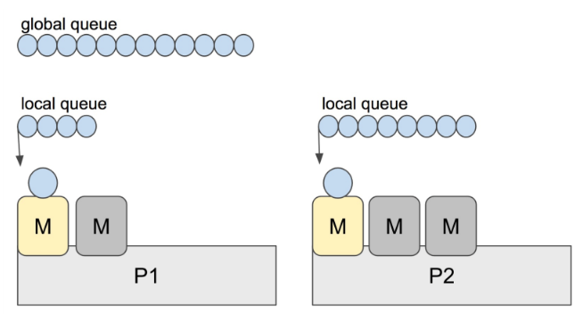
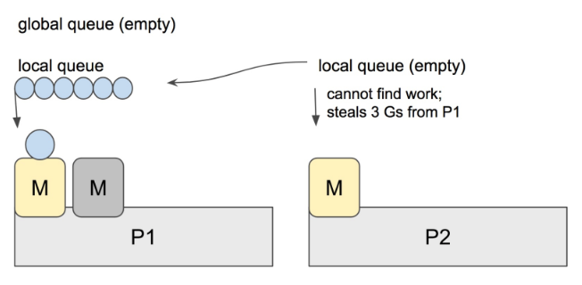

# 简介

在 Go 语言中，“工作窃取”（Work Stealing）是一种调度策略，用于提高多核处理器环境下的并行性和负载均衡。

- 如果它自己的队列空了或者不足以充分利用它的计算能力, 
- 允许一个处理器（P）从另一个处理器的就绪队列中“窃取”goroutine来执行
- 这种策略有助于确保所有可用的处理器都能尽可能地忙碌，从而提高整体程序的执行效率。


# 工作窃取如何工作？

1. **每个处理器有自己的本地队列**：在 Go 的调度器中，每个处理器（P）都有一个本地的就绪队列，其中包含了等待执行的 goroutine。
2. **空闲处理器寻找工作**：当一个处理器（P）完成了自己队列中的所有 goroutine 或者队列为空时，它会进入工作窃取模式。
3. **窃取工作**：该处理器会随机挑选另一个处理器的就绪队列，并尝试从中窃取一个或多个 goroutine 来执行。这个过程通常从队列的一端开始，以避免与其他正在窃取工作的处理器冲突。
4. **负载均衡**：通过这种方式，即使某些处理器的队列可能暂时空闲，整个系统仍然可以保持高负载，因为其他处理器可以填补这些空缺。




1. 当 P2 上的一个 G 执行结束，它就会去 LRQ 获取下一个 G 来执行。

2. 如果 LRQ 已经空了，就是说本地可运行队列已经没有 G 需要执行，并且这时 GRQ (全局队列)也没有 G 了。
3. 这时，P2 会随机选择 P（称为 P1），P2 会从 P1 的 LRQ 偷一部分的 G。

****


通过这个机制，Go 调度器能够更好地利用多核处理器的能力，即使某些处理器的本地队列暂时空闲，也可以通过从其他处理器窃取工作来维持高并行性。

这种策略在 Go 的 M:N 调度模型中尤其有效，因为它允许 goroutine 在多个机器线程（M）上灵活地迁移和执行，从而提高了并发程序的整体性能。


# 源码

`runtime/proc.go`

```go
// 尝试从任何 P 上窃取可运行的 goroutine 或定时器。
// 从所有 p 调度器中取出一个可执行的任务, 一共取4次, 最多有 4*len(p) 个任务
//
// 如果 newWork 为真，可能有新工作已被准备就绪。
//
// 如果 now 不为 0，则它是当前时间。stealWork 函数返回传递的时间或
// 如果 now 为 0 时的当前时间。
func stealWork(now int64) (gp *g, inheritTime bool, rnow, pollUntil int64, newWork bool) {
	// 获取当前协程关联的 P。
	pp := getg().m.p.ptr()

	// 标记是否已运行定时器。
	ranTimer := false

	const stealTries = 4
	// 从所有 p 调度器中取出一个可执行的任务, 一共取4次, 最多有 4*len(p) 个任务
	for i := 0; i < stealTries; i++ {
		stealTimersOrRunNextG := i == stealTries-1

		// 遍历所有 P 的顺序, 以一个随机数开始。
		for enum := stealOrder.start(fastrand()); !enum.done(); enum.next() {
			// GC 工作可能可用。
			if sched.gcwaiting.Load() {
				return nil, false, now, pollUntil, true
			}

			// allp 所有 p（逻辑处理器）切片获取索引位置的 p
			p2 := allp[enum.position()]
			if pp == p2 {
				// 如果是当前 P 则跳过。
				continue
			}

			// 从 p2 窃取定时器。
			// 在最后一轮之前唯一可能持有不同 P 的定时器锁的地方。
			if stealTimersOrRunNextG && timerpMask.read(enum.position()) {
				tnow, w, ran := checkTimers(p2, now)
				now = tnow
				if w != 0 && (pollUntil == 0 || w < pollUntil) {
					pollUntil = w
				}
				if ran {
					// 运行定时器可能已经使任意数量的 G 变为可运行状态。
					if gp, inheritTime := runqget(pp); gp != nil {
						// 尝试从当前 P 的本地运行队列获取 Goroutine，并返回。
						return gp, inheritTime, now, pollUntil, ranTimer
					}
					ranTimer = true
				}
			}

			// 如果 p2 是闲置的，则不要费力尝试窃取。
			if !idlepMask.read(enum.position()) {
				if gp := runqsteal(pp, p2, stealTimersOrRunNextG); gp != nil {
					// 尝试从其他 P 窃取可运行的 Goroutine 并返回。
					return gp, false, now, pollUntil, ranTimer
				}
			}
		}
	}

	// 没有找到可以窃取的 goroutine。不过，运行定时器可能已经
	// 使我们错过的某些 goroutine 变为可运行状态。指示等待的下一个定时器。
	return nil, false, now, pollUntil, ranTimer
}
```

1. **初始化变量**：获取当前线程的 P。
2. **循环尝试窃取**：进行固定次数的尝试，每次尝试从不同的 P 上窃取工作。
3. **检查 GC 状态**：如果 GC 等待标志被设置，可能有 GC 工作可用，结束窃取并指示新工作可能已经准备就绪。
4. **枚举所有 P**：使用 `stealOrder` 枚举所有 P，跳过当前线程的 P。
5. **窃取定时器**：在最后一次尝试中检查目标 P 的定时器，更新当前时间和下一个轮询时间。
6. **运行定时器的影响**：如果运行了定时器，检查当前 P 的本地运行队列是否已有可运行的 goroutine。
7. **从非闲置 P 窃取**：如果目标 P 不是闲置状态，尝试从其运行队列窃取 goroutine。
8. **返回结果**：如果没有找到可窃取的 goroutine，返回当前时间和可能的定时器更新信息，指示是否运行了定时器。

