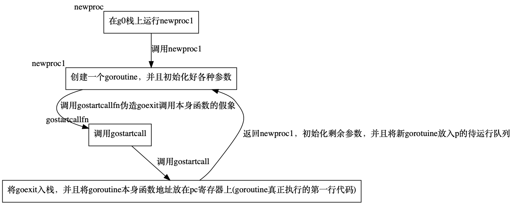

# 简介

在 Go 语言中，主 goroutine，也就是程序入口点的 goroutine，是在程序启动时由 Go 运行时自动创建的。

这个主 goroutine 的主要任务是执行程序的 `main` 函数。


# 启动主 goroutine 的过程

1. **程序启动**：当你的 Go 程序启动时，Go 运行时会初始化必要的数据结构和调度器状态。
2. **创建 main goroutine**：运行时会创建一个 goroutine，这个 goroutine 被称为主 goroutine，它的运行函数就是 `main.main` 函数。这个函数由 `main` 包中的 `main` 函数引用，是程序的入口点。
3. **调度 main goroutine**：创建完 main goroutine 后，运行时会将它加入就绪队列，并由调度器调度执行。这意味着 main goroutine 将被分配到一个可用的机器线程（M）上执行。
4. **执行 main 函数**：一旦 main goroutine 被调度，它就会开始执行 `main` 函数中的代码。
5. **结束 main goroutine**：当 `main` 函数执行完毕，或者在 `main` 函数中调用了 `os.Exit` 函数，主 goroutine 就会结束，进而导致整个程序的终止。


# 源码分析

## runtime.newproc()创建goroutine

创建"第一个"goroutine

```go
// 创建一个新的 goroutine 来运行 fn 函数。
// 将这个 goroutine 放入等待运行的 goroutine 队列中。
// 编译器将 go 语句转换为对这个函数的调用。
func newproc(fn *funcval) {
	// 获取当前正在运行的 goroutine。
	gp := getg()
	// 获取调用者（即创建新的 goroutine 的位置）的程序计数器（PC），用于后续的调用者信息记录。
	pc := getcallerpc()

	// 函数在一个更大的系统栈上执行接下来的操作。
	// 这是因为创建 goroutine 可能涉及大量的栈空间消耗，尤其是当递归创建 goroutine 时。
	systemstack(func() {
		// 实际创建新的 goroutine，传入要运行的函数 fn、当前 goroutine gp 和调用者 PC
		newg := newproc1(fn, gp, pc)

		//  获取当前正在运行的 goroutine 所关联的处理器（P），这是为了将新创建的 goroutine 放入正确的运行队列中。
		pp := getg().m.p.ptr()

		// 将新创建的 goroutine 放入 P 的运行队列中，准备运行。
		runqput(pp, newg, true)

		// 如果 main 函数已经开始运行，调用 wakep 函数来唤醒一个等待的处理器（P）
		// 这有助于确保新创建的 goroutine 能够尽快获得执行的机会。
		if mainStarted {
			wakep()
		}
	})
}
```

1. **获取当前 goroutine**：通过 `getg()` 函数获取当前正在运行的 goroutine。
2. **获取调用者 PC**：通过 `getcallerpc()` 函数获取调用者（即创建新的 goroutine 的位置）的程序计数器（PC），用于后续的调用者信息记录。
3. **系统栈执行**：使用 `systemstack` 函数在一个更大的系统栈上执行接下来的操作。这是因为创建 goroutine 可能涉及大量的栈空间消耗，尤其是当递归创建 goroutine 时。
4. **创建新 goroutine**：调用 `newproc1` 函数来实际创建新的 goroutine，传入要运行的函数 `fn`、当前 goroutine `gp` 和调用者 PC。
5. **获取当前处理器（P）**：通过 `getg().m.p.ptr()` 获取当前正在运行的 goroutine 所关联的处理器（P），这是为了将新创建的 goroutine 放入正确的运行队列中。
6. **放入运行队列**：使用 `runqput` 函数将新创建的 goroutine 放入处理器（P）的运行队列中，准备执行。
7. **唤醒处理器（P）**：如果 `main` 函数已经开始运行，调用 `wakep` 函数来唤醒一个等待的处理器（P），这有助于确保新创建的 goroutine 能够尽快获得执行的机会。

通过以上步骤，Go 运行时能够有效地创建和调度新的 goroutine，使其在适当的时机得以运行。

这种机制是 Go 并发模型的基础，允许开发者以轻量级的方式编写并发代码。


### newproc1创建新的G函数

```go
// 创建一个新的 goroutine，状态为 _Grunnable，从 fn 函数开始执行。
// (表示此 goroutine 在运行队列上。它当前没有执行用户代码。栈没有所有权)
//
// callerpc 是创建这个 goroutine 的 go 语句的地址。
// 调用者负责将新创建的 goroutine 添加到调度器中。
func newproc1(fn *funcval, callergp *g, callerpc uintptr) *g {
	// 如果 fn 为 nil，致命错误
	if fn == nil {
		fatal("go of nil func value")
	}

	// 获取一个 M，禁用抢占，因为我们持有 M 和 P 的局部变量
	mp := acquirem()
	// 获取当前 M 所关联的 P
	pp := mp.p.ptr()

	// 尝试从 P 的空闲 goroutine 队列中获取一个 goroutine，如果没有，则分配一个新的 goroutine。

	// 尝试从 P 的空闲 goroutine 队列中获取一个 goroutine
	newg := gfget(pp)
	// 如果没有找到空闲的 goroutine
	if newg == nil {
		// 分配一个新的 goroutine, stackMin=2048, 创建一个goroutine最小为2k
		newg = malg(stackMin)
		// 将状态从 _Gidle=尚未初始化 变更为 _Gdead=目前未使用
		casgstatus(newg, _Gidle, _Gdead)
		// 将 newg 添加到所有 goroutine 的列表中
		allgadd(newg)
	}

	// 如果 newg 没有栈，抛出错误
	if newg.stack.hi == 0 {
		throw("newproc1: newg missing stack")
	}
	// 如果 newg 的状态不是 _Gdead=目前未使用，抛出错误
	if readgstatus(newg) != _Gdead {
		throw("newproc1: new g is not Gdead")
	}

	// 计算额外的空间大小
	totalSize := uintptr(4*goarch.PtrSize + sys.MinFrameSize)
	// 栈对齐
	totalSize = alignUp(totalSize, sys.StackAlign)
	// 计算栈指针位置
	sp := newg.stack.hi - totalSize
	spArg := sp
	if usesLR {
		// 设置 caller's LR
		*(*uintptr)(unsafe.Pointer(sp)) = 0
		prepGoExitFrame(sp) // 准备退出帧
		spArg += sys.MinFrameSize
	}

	// 清零调度信息，设置栈指针、PC 寄存器、指向自身 goroutine 的指针等

	// 清零 newg 的调度信息
	memclrNoHeapPointers(unsafe.Pointer(&newg.sched), unsafe.Sizeof(newg.sched))
	// 设置栈指针
	newg.sched.sp = sp
	// 设置栈顶指针
	newg.stktopsp = sp
	// 设置 PC 寄存器
	newg.sched.pc = abi.FuncPCABI0(goexit) + sys.PCQuantum
	// 设置指向自身 goroutine 的指针
	newg.sched.g = guintptr(unsafe.Pointer(newg))

	// 准备调用 fn 函数, 使其看起来像执行了一次对 fn 的调用，然后在 fn 的第一条指令前停止。
	gostartcallfn(&newg.sched, fn)

	// 设置父 goroutine ID、创建时的 PC、祖先信息、起始 PC 等

	// 设置父 goroutine 的 ID
	newg.parentGoid = callergp.goid
	// 设置创建时的 PC
	newg.gopc = callerpc
	// 保存祖先 goroutine 信息
	newg.ancestors = saveAncestors(callergp)
	// 设置起始 PC
	newg.startpc = fn.fn

	// 根据 goroutine 类型更新计数器，继承 pprof 标签，设置不需要被剖析的状态
	if isSystemGoroutine(newg, false) {
		sched.ngsys.Add(1)
	} else {
		if mp.curg != nil {
			newg.labels = mp.curg.labels // 只有用户goroutines继承ppprof标签。
		}
		if goroutineProfile.active {
			// 设置 goroutine 不需要被剖析
			newg.goroutineProfiled.Store(goroutineProfileSatisfied)
		}
	}

	// 跟踪初始状态？
	newg.trackingSeq = uint8(fastrand())
	if newg.trackingSeq%gTrackingPeriod == 0 {
		newg.tracking = true
	}

	// 使用 CAS 设置 goroutine 的状态为 _Grunnable。
	// 设置newg状态为_Grunnable, 到这里 newg 就可以运行了
	casgstatus(newg, _Gdead, _Grunnable)
	// 更新 GC 控制器的可扫描栈
	gcController.addScannableStack(pp, int64(newg.stack.hi-newg.stack.lo))

	// 从 P 的缓存中分配一个 goroutine ID
	if pp.goidcache == pp.goidcacheend {
		pp.goidcache = sched.goidgen.Add(_GoidCacheBatch)
		pp.goidcache -= _GoidCacheBatch - 1
		pp.goidcacheend = pp.goidcache + _GoidCacheBatch
	}
	newg.goid = pp.goidcache
	pp.goidcache++

	// 如果 race 检测器启用
	if raceenabled {
		newg.racectx = racegostart(callerpc)
		newg.raceignore = 0
		if newg.labels != nil {
			// See note in proflabel.go on labelSync's role in synchronizing
			// with the reads in the signal handler.
			racereleasemergeg(newg, unsafe.Pointer(&labelSync))
		}
	}

	// 如果跟踪启用
	if traceEnabled() {
		traceGoCreate(newg, newg.startpc)
	}
	// 释放 M
	releasem(mp)
	// 返回新创建的 goroutine
	return newg
}
```

1. **参数检查**：检查函数指针 `fn` 是否为 `nil`，如果是，则抛出致命错误。
2. **获取 M 和 P**：通过 `acquirem` 获取一个 M，然后获取该 M 所关联的 P。
3. **获取或分配 goroutine**：尝试从 P 的空闲 goroutine 队列中获取一个 goroutine，如果没有，则分配一个新的 goroutine。
4. **检查栈**：检查新 goroutine 是否有栈，如果没有，则抛出错误。
5. **状态检查**：确认新 goroutine 的状态是 _Gdead，如果不是，则抛出错误。
6. **计算栈指针**：计算新 goroutine 的栈指针和参数栈指针。
7. **初始化调度信息**：清零调度信息，设置栈指针、PC 寄存器、指向自身 goroutine 的指针等。
8. **准备调用函数**：使用 `gostartcallfn` 准备调用 `fn` 函数。
9. **设置元数据**：设置父 goroutine ID、创建时的 PC、祖先信息、起始 PC 等。
10. **更新计数和标签**：根据 goroutine 类型更新计数器，继承 pprof 标签，设置不需要被剖析的状态。
11. **跟踪信息**：设置跟踪序列号和状态。
12. **设置状态为可运行**：使用 CAS 设置 goroutine 的状态为 _Grunnable。
13. **更新 GC 控制器**：通知 GC 控制器新的可扫描栈范围。
14. **分配 goroutine ID**：从 P 的缓存中分配一个 goroutine ID。
15. **设置 race 和 trace 信息**：如果 race 或 trace 启用，设置相应的上下文和信息。
16. **释放 M**：最后释放 M。
17. **返回新 goroutine**：返回新创建的 goroutine。

通过以上步骤，Go 运行时能够有效地创建和初始化一个新的 goroutine，使其准备好进入调度器的可运行队列，等待执行。


这里面有一个比较重要的部分需要详细说一下:

```go
// 准备调用 fn 函数, 使其看起来像执行了一次对 fn 的调用，然后在 fn 的第一条指令前停止。
gostartcallfn(&newg.sched, fn)
```


### gostartcallfn准备调用 fn 函数

```go
// 调整 gobuf（goroutine 的缓冲区），使其看起来像执行了一次对 fn 的调用，
// 然后在 fn 的第一条指令前停止。
func gostartcallfn(gobuf *gobuf, fv *funcval) {
	var fn unsafe.Pointer
	if fv != nil {
		// 如果 funcval 不为 nil，则获取函数的地址。
		fn = unsafe.Pointer(fv.fn)
	} else {
		// 如果 funcval 为 nil，则使用 nilfunc 的地址，这是一个特殊的空函数。
		fn = unsafe.Pointer(abi.FuncPCABIInternal(nilfunc))
	}

	// 使用调整后的函数地址和 funcval 的指针来准备 gobuf。
	// 传入调整后的 fn 地址以及 fv 的指针。
	// gostartcall 会根据提供的信息来准备 goroutine 的调用栈，使其看起来像是刚刚执行了一次函数调用。
	gostartcall(gobuf, fn, unsafe.Pointer(fv))
}
```

1. **检查 funcval**：首先检查 `fv`（funcval 的指针）是否为 `nil`。`funcval` 包含了要调用的函数的信息。
2. **获取函数地址**：如果 `fv` 不为 `nil`，则使用 `fv.fn` 来获取函数的实际地址，并将其转换为 `unsafe.Pointer` 类型。
3. **使用 nilfunc 地址**：如果 `fv` 为 `nil`，则使用 `nilfunc` 的地址。`nilfunc` 是一个特殊的函数，通常用于表示没有具体函数的情况。它的地址通过 `abi.FuncPCABIInternal(nilfunc)` 获得，同样转换为 `unsafe.Pointer` 类型。
4. **准备调用**：调用 `gostartcall` 函数，传入调整后的 `fn` 地址以及 `fv` 的指针。`gostartcall` 会根据提供的信息来准备 goroutine 的调用栈，使其看起来像是刚刚执行了一次函数调用。

通过上述步骤，Go 运行时能够准确地设置 goroutine 的调用栈，使其准备好执行指定的函数或特殊处理（例如，在没有函数的情况下）。

这对于正确地初始化和恢复 goroutine 的执行至关重要。


### gostartcall将fn指向程序计数器位置

```go
// 调整 Gobuf（goroutine 的缓冲区），使其看起来像执行了一次对 fn 的调用，
// 使用 ctxt 作为上下文，并且在 fn 的第一条指令前停止。
func gostartcall(buf *gobuf, fn, ctxt unsafe.Pointer) {
	// 获取当前栈指针（SP）
	sp := buf.sp

	// 预留返回值空间
	sp -= goarch.PtrSize
	// 在栈上存储返回地址，通常是当前的程序计数器（PC）
	// 将当前的程序计数器（PC）存储在新的栈指针位置上
	*(*uintptr)(unsafe.Pointer(sp)) = buf.pc
	// 更新栈指针
	buf.sp = sp
	// 设置新的程序计数器（PC），指向即将调用的函数
	// 这时候的pc才是 goroutine 的函数
	buf.pc = uintptr(fn)
	// 设置上下文（ctxt），这可能包含了函数调用所需的额外信息
	buf.ctxt = ctxt
}
```

1. **获取当前栈指针**：从 `gobuf` 结构体中读取当前的栈指针 `sp`。
2. **减少栈指针**：栈指针 `sp` 减少 `PtrSize` 字节，为保存返回地址留出空间。`PtrSize` 是指针的大小，根据目标架构的不同而不同。
3. **存储返回地址**：使用 `unsafe` 包中的指针运算，将当前的程序计数器（PC）存储在新的栈指针位置上。这模拟了函数调用之后的返回地址。
4. **更新栈指针**：将 `sp` 赋值回 `gobuf` 的 `sp` 成员，反映栈上新的状态。
5. **设置新的程序计数器**：将 `fn` 的地址赋值给 `gobuf` 的 `pc` 成员，指示即将调用的函数。
6. **设置上下文**：将 `ctxt` 赋值给 `gobuf` 的 `ctxt` 成员，这可能包含了函数调用所需的上下文信息。

通过以上步骤，`gobuf` 被调整为看起来像刚刚执行了一次函数调用，但还没有执行被调用函数的第一条指令。

这使得 goroutine 准备好执行新的函数，而无需真正执行一次函数调用指令，从而避免了不必要的开销。

这是 Go 运行时内部实现高效 goroutine 切换和调度的关键技术之一。


### 回到newproc1函数

然后再回到newproc1函数，剩下的就是设置goroutine的状态，然后把goroutine返回到newproc函数:

```go
	// 准备调用 fn 函数, 使其看起来像执行了一次对 fn 的调用，然后在 fn 的第一条指令前停止。
	gostartcallfn(&newg.sched, fn)
	
	// 设置父 goroutine ID、创建时的 PC、祖先信息、起始 PC 等

	// 设置父 goroutine 的 ID
	newg.parentGoid = callergp.goid
	// 设置创建时的 PC
	newg.gopc = callerpc
	// 保存祖先 goroutine 信息
	newg.ancestors = saveAncestors(callergp)
	// 设置起始 PC
	newg.startpc = fn.fn

	...

	// 使用 CAS 设置 goroutine 的状态为 _Grunnable。
	// 设置newg状态为_Grunnable, 到这里 newg 就可以运行了
	casgstatus(newg, _Gdead, _Grunnable)
	...

	// 从 P 的缓存中分配一个 goroutine ID
	if pp.goidcache == pp.goidcacheend {
		pp.goidcache = sched.goidgen.Add(_GoidCacheBatch)
		pp.goidcache -= _GoidCacheBatch - 1
		pp.goidcacheend = pp.goidcache + _GoidCacheBatch
	}
	newg.goid = pp.goidcache
	pp.goidcache++

	...
	// 返回新创建的 goroutine
	return newg
}
```

### 回到newproc函数

把goroutine放入p的待执行队列中

```go
		// 实际创建新的 goroutine，传入要运行的函数 fn、当前 goroutine gp 和调用者 PC
		newg := newproc1(fn, gp, pc)

		//  获取当前正在运行的 goroutine 所关联的处理器（P），这是为了将新创建的 goroutine 放入正确的运行队列中。
		pp := getg().m.p.ptr()

		// 将新创建的 goroutine 放入 P 的运行队列中，准备运行。
		runqput(pp, newg, true)

		// 如果 main 函数已经开始运行，调用 wakep 函数来唤醒一个等待的处理器（P）
		// 这有助于确保新创建的 goroutine 能够尽快获得执行的机会。
		if mainStarted {
			wakep()
		}
	})
}
```

### runqput放入运行队列

```go
// 尝试将 goroutine gp 放入本地可运行队列。
// 如果 next 为 false (不竞争)，则将 gp 添加到可运行队列的尾部。
// 如果 next 为 true (立即竞争)，则将 gp 放入 pp.runnext 槽。
// 如果本地队列满了，runqput 将 gp 放到全局队列上。
// 仅由拥有 P 的线程执行。
func runqput(pp *p, gp *g, next bool) {
	// 如果启用了调度器随机化，且 next 为 true，且随机数生成器生成的数字为 0，
	// 则将 next 设置为 false。这是为了增加调度的随机性。
	if randomizeScheduler && next && fastrandn(2) == 0 {
		next = false
	}

	if next {
	retryNext: // 重试标签
		// 获取当前的 runnext 指针。指向下一个应该运行的 goroutine 的指针，用于优化通信和等待模式的调度
		oldnext := pp.runnext
		// 使用 compare-and-swap (CAS) 操作尝试将 gp 设置为新的 runnext。
		if !pp.runnext.cas(oldnext, guintptr(unsafe.Pointer(gp))) {
			// 如果 CAS 失败，意味着另一个 goroutine 同时也在尝试修改 runnext，
			// 因此需要重新尝试直到成功。
			goto retryNext
		}

		// 检查旧的 runnext 是否为零。
		if oldnext == 0 {
			// 如果旧的 runnext 为零，这意味着我们是第一个设置 runnext 的，
			// 所以我们可以直接返回。
			return
		}

		// 注意，这里我们将 gp 的指针设置为旧的 runnext 的值，以便在下一次循环中将其添加到队列。
		// 将原来的 runnext 踢出到常规可运行队列。
		gp = oldnext.ptr()
	}

retry: // 重试标签
	// 加载头部，使用 load-acquire 原子操作来读取 runqhead，
	// 这样可以保证从其他处理器看到的值是最新的。
	h := atomic.LoadAcq(&pp.runqhead)
	t := pp.runqtail
	// 检查队列是否已满，通过比较尾部与头部之间的距离是否小于队列的长度。
	if t-h < uint32(len(pp.runq)) {
		// 计算队列中下一个可用槽的位置。
		// 将 gp 设置到队列的下一个可用位置。
		pp.runq[t%uint32(len(pp.runq))].set(gp)
		// 更新队列的尾部指针，使用 store-release 原子操作来写入 runqtail，
		// 这样可以保证其他处理器能够看到最新的尾部指针。
		atomic.StoreRel(&pp.runqtail, t+1)
		// 成功添加后，返回。
		return
	}

	// 当队列满了时，调用 runqputslow 来处理，这通常会将 gp 移动到全局可运行队列。
	if runqputslow(pp, gp, h, t) {
		return
	}

	// 如果 runqputslow 没有处理 gp 或者队列实际上并不满，
	// 则继续尝试将 gp 添加到队列中。
	// 使用 goto 语句跳回 retry 标签处，重新加载头部并检查队列的状态。
	goto retry
}
```

1. **随机化调度**：如果启用了调度器随机化，并且 next 为真，且随机数生成器 fastrandn 生成的数字为 0，则将 next 设为 false。这引入了一定的随机性，有助于均衡负载。
2. **尝试将 gp 设置为 runnext**：
   - 如果 next 为真，则尝试将 gp 设置为 pp 的 runnext 字段。
   - 使用 compare-and-swap (CAS) 原子操作来替换 runnext 的值。
   - 如果 CAS 失败，则重新尝试直到成功。
   - 如果之前的 runnext 为非零，将它移到常规可运行队列中。
3. **尝试将 gp 添加到可运行队列**：
   - 加载可运行队列的头部（runqhead）。
   - 获取当前的队列尾部（runqtail）。
   - 如果队列没有满（即尾部与头部的距离小于队列长度），则将 gp 放入队列的下一个位置。
   - 使用原子的 store-release 操作更新 runqtail，使得新插入的 gp 可供其他 P 消费。
4. **队列满时的慢路径处理**：
   - 如果队列满，调用 runqputslow 函数，这通常会将 gp 移动到全局可运行队列。
   - 如果 runqputslow 返回 true，表明处理完成，直接返回。
5. **重试**：
   - 如果 runqputslow 没有成功处理，循环回到 retry 标签处，再次尝试将 gp 放入队列。


### 总结

总结一下创建第一个 goroutine 执行 runtime.main 的过程




