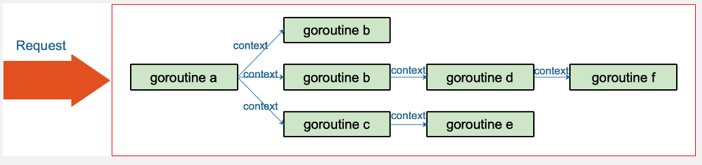

# 简介

在 Go 语言中，`context` 是一个用于携带**截止时间、取消信号、携带任意类型的数据**的包。

它主要用于组织和控制在 goroutine 之间的函数调用，特别是在处理长时间运行的请求或异步操作时，它可以帮助你优雅地取消这些操作，避免资源泄漏。

# 业务举例

Go 常用来写后台服务，通常只需要几行代码，就可以搭建一个 http server。

在 Go 的 server 里，通常每来一个请求都会启动若干个 goroutine 同时工作：

**有些去数据库拿数据，有些调用下游接口获取相关数据……**


这些 goroutine 需要共享这个请求的基本数据

- 例如登陆的token
- 处理请求的最大超时时间（如果超过此值再返回数据，请求方因为超时接收不到）等等
- 当请求被取消或是处理时间太长，这有可能是使用者关闭了浏览器或是已经超过了请求方规定的超时时间，请求方直接放弃了这次请求结果。
- 这时，所有正在为这个请求工作的 goroutine 需要快速退出，因为它们的“工作成果”不再被需要了。
- 在相关联的 goroutine 都退出后，系统就可以回收相关的资源。

context 包就是为了解决上面所说的这些问题而开发的：

在 一组 goroutine 之间传递**共享的值、取消信号**……



用简练一些的话来说，在Go 里，我们不能直接杀死协程，协程的关闭一般会用 `channel+select` 通道加选择器方式来控制。

但是在某些场景下，一个请求衍生了很多 goroutine 协程，这些协程之间是相互关联的：

- 需要共享一些全局变量、有共同的超时时间等，而且需要同时被关闭。
- 再用 `channel+select` 通道加选择器就会比较麻烦
- 这时就可以通过 context 来实现。

一句话：context 用来解决 goroutine 之间`退出通知`、`元数据传递`的功能。

# 作用

在 Go 语言中，`context` 主要有以下几方面的作用：

1. **取消操作**：`context` 提供了一种优雅的方式来取消长时间运行的函数调用。这在处理网络请求、数据库操作或其他 I/O
   操作时特别有用，可以防止资源泄漏。
2. **超时控制**：你可以为 `context` 设置一个超时时间，如果在指定时间内操作未完成，`context` 将会自动取消，从而终止相关操作。
3. **传递请求范围的值**：`context` 可以携带任意类型的数据，这在处理 HTTP 请求时非常有用，可以在请求的生命周期内传递用户身份、跟踪
   ID 或其他元数据。
4. **资源清理**：当 `context` 被取消时，可以触发一系列的清理操作，比如关闭数据库连接、释放锁等。
5. **并发控制**：`context` 可以帮助你控制和协调多个 goroutine，确保在取消请求时，所有相关的 goroutine 都能及时停止。

# 如何使用

context 使用起来非常方便。源码里对外提供了一个创建根节点 context 的函数：

```golang
func Background() Context
```

background 是一个空的 context， 它不能被取消，没有值，也没有超时时间。

有了根节点 context，又提供了四个函数创建子节点 context：

```golang
// 用途: 创建一个带有取消功能的 Context。
// 参数: 接收一个父 Context，通常是 Background() 或 TODO()。
// 返回值:
// ctx: 子 Context，继承自父 Context，但添加了取消功能。
// cancel: 一个函数，调用它可以取消 ctx。一旦取消，ctx.Done() 通道将被关闭。
// 示例: 你可以使用这个函数来创建一个可以被外部信号取消的 Context，这对于控制长时间运行的函数很有用。
func WithCancel(parent Context) (ctx Context, cancel CancelFunc)
```

```go
// 参数: 创建一个指定时间取消的ctx
// 返回值:
// Context: 一个子 Context，它将在 deadline 到达时自动取消。
// CancelFunc: 一个取消函数，可以在 deadline 到达前手动取消 Context。
// 示例: 当你希望一个操作在特定时间点之前完成时，可以使用这个函数来创建 Context。
func WithDeadline(parent Context, deadline time.Time) (Context, CancelFunc)
```

```go
// 用途: 创建一个带有超时限制的 Context。
// 参数: 接收一个父 Context 和一个 time.Duration 类型的 timeout。
// 返回值:
// Context: 一个子 Context，它将在 timeout 时间后自动取消。
// CancelFunc: 一个取消函数，可以在 timeout 到达前手动取消 Context。
// 示例: 当你需要对操作设置一个最大等待时间时，可以使用这个函数。
func WithTimeout(parent Context, timeout time.Duration) (Context, CancelFunc)
```

```go
// 用途: 创建一个带有附加值的 Context。
// 参数: 接收一个父 Context，一个键 key 和一个值 val。key 必须是 interface{} 类型，但在实践中通常是一个 type 或 struct 类型的指针
// 返回值: 一个子 Context，它带有附加的键/值对。可以通过 ctx.Value(key) 访问这个值。
// 示例: 当你需要在请求的生命周期内传递额外信息（如认证令牌、跟踪 ID 等）时，可以使用这个函数。
func WithValue(parent Context, key, val interface{}) Context
```

1. 不要将 Context 塞到结构体里。直接将 Context 类型作为函数的第一参数，而且一般都命名为 ctx。
2. 不要向函数传入一个 nil 的 context，如果你实在不知道传什么，标准库给你准备好了一个 context：todo。
3. 不要把本应该作为函数参数的类型塞到 context 中，context 存储的应该是一些**共同的数据**。例如：登陆的 session、cookie 等。
4. 同一个 context 可能会被传递到多个 goroutine，别担心，**context 是并发安全的**。

## 传递共享的数据

对于 Web 服务端开发，往往希望将一个请求处理的整个过程串起来，这就非常依赖于 Thread Local（对于 Go 可理解为单个协程所独有）的变量

而在 Go 语言中并没有这个概念，因此需要在函数调用的时候传递 context。

```golang
package main

import (
	"context"
	"fmt"
)

func main() {
	// 创建一个空的上下文
	ctx := context.Background()
	process(ctx)

	// 创建一个带k-v的上下文
	ctx = context.WithValue(ctx, "id", "哈哈")
	process(ctx)
}

func process(ctx context.Context) {
	traceId, ok := ctx.Value("id").(string)
	if ok {
		fmt.Printf("进程结束. id=%s\n", traceId)
	} else {
		fmt.Printf("进程结束. 没有找到 id\n")
	}
}
```

运行结果：

```shell
进程结束. 没有找到 id
进程结束. id=哈哈
```

- 第一次调用 process 函数时，ctx 是一个空的 context，自然取不出来 traceId。
- 第二次，通过 `WithValue` 函数创建了一个context，并赋上了 `traceId` 这个 key，自然就能取出来传入的 value 值。

## 取消goroutine

```go
package main

import (
	"context"
	"fmt"
	"time"
)

// 模拟一个长时间运行的操作
func simulateLongRunningOperation(ctx context.Context) {
	// 创建一个定时任务 200ms 一次
	ticker := time.NewTicker(200 * time.Millisecond)
	defer ticker.Stop()

	for {
		select {
		case <-ticker.C:
			fmt.Println("仍在工作...")
		case <-ctx.Done():
			fmt.Println("操作已取消.")
			return
		}
	}
}

func main() {
	// 创建一个带 1s 超时的 context
	ctx, cancel := context.WithTimeout(context.Background(), 1*time.Second)
	// 方法执行完成之后, 取消 goroutine 执行
	defer func() {
		println("主要功能已完成.")
		cancel()
	}()

	// 启动一个 goroutine 来执行长时间运行的操作
	go simulateLongRunningOperation(ctx)

	// 主 goroutine 可以继续做其他事情，超时后会自动取消操作
	fmt.Println("等待操作超时...")
	time.Sleep(2 * time.Second)
	fmt.Println("操作已经超时...")
}
```

运行结果:

```go
等待操作超时...
仍在工作...
仍在工作...
仍在工作...
仍在工作...
操作已取消.
操作已经超时...
主要功能已完成.
```

这个运行结果可知:

- 我们创建了一个 1s 后会超时的 ctx, 我们的主函数睡眠了 2s, 以保证一定会超时
- 所以结果是, 先触发超时, return 停止了 goroutine, 然后再走完 main 方法


