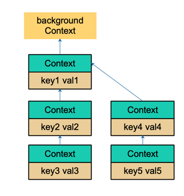

# 简介

在 Go 语言的 `context` 包中，`Value` 方法用于从 `Context` 中检索一个与特定键关联的值。

`Value` 方法的查找过程遵循一个特定的规则，它会沿着 Context 的父链向上查找，直到找到匹配的键或到达根 Context。

**这个东西是不建议使用的!**

# 查找过程

1. **调用 `Value` 方法**: 当你在任何一个 Context 上调用 `Value` 方法并传入一个键时，查找过程就开始了。

2. **检查当前 Context**: `Value` 方法首先检查调用它的当前 Context 是否是在使用 `WithValue` 函数创建时设置了该键的值。如果是，那么它直接返回该值。

3. **递归查找父 Context**: 如果当前 Context 没有设置该键的值，`Value` 方法会递归地在父 Context 上调用 `Value` 方法。这是因为
   Context 实现了一个层次结构，子 Context 继承自父 Context。

4. **重复查找过程**: 查找过程会沿着 Context 的父链继续，直到找到匹配的键或到达根 Context。根 Context
   通常是由 `context.Background()` 或 `context.TODO()` 创建的，它们不会有任何值。

5. **返回结果**:

    - 如果在某个 Context 中找到了与键匹配的值，那么 `Value` 方法会立即返回该值。
    - 如果到达根 Context 仍然没有找到匹配的键，那么 `Value` 方法将返回 `nil`。

# 数据结构

```golang
// 携带一个键值对的上下文。
// 他是一个链式的上下文结构, Context 是标识当前ctx的父级上下文, 构成一个链表一样的结构
type valueCtx struct {
	Context      // 父级上下文接口
	key, val any // 键值对
}
```

# WithValue创建上下文

```golang
// WithValue 创建一个子上下文, 包括k-v的键值对。
// 最终的上下文是一个链的形式, 每个子上下文都有一个父级上下文
// 根节点就是 backgroundCtx / todoCtx
func WithValue(parent Context, key, val any) Context {
	// 无法从 nil 父上下文创建上下文
	if parent == nil {
		panic("cannot create context from nil parent")
	}

	// nil 键
	if key == nil {
		panic("nil key")
	}

	// 因为对 key 的要求是可比较，因为之后需要通过 key 取出 context 中的值，可比较是必须的。
	if !reflectlite.TypeOf(key).Comparable() {
		panic("key is not comparable")
	}

	// 传入父上下文,和当前的k-v
	// 最终的value上下文是一个链的形式, 每个子上下文都有一个父级上下文
	// 根节点就是 backgroundCtx / todoCtx
	return &valueCtx{parent, key, val}
}
```

通过层层传递 context, 每个 context 保存父级的 ctx，最终形成这样一棵树：



`WithValue` 创建 context 节点的过程实际上就是创建链表节点的过程。

- 两个节点的 key 值是可以相等的，但它们是两个不同的 context 节点。
- 查找的时候，会向上查找到最后一个挂载的 context 节点，也就是离得比较近的一个父节点 context。
- 所以，整体上而言，用 `WithValue` 构造的其实是一个低效率的链表。

**如果你接手过这样的项目，肯定经历过这样的窘境：**

在一个处理过程中，有若干子函数、子协程。各种不同的地方会向 context 里塞入各种不同的 k-v 对，最后在某个地方使用。

你根本就不知道什么时候什么地方传了什么值？

这些值会不会被“覆盖”（底层是两个不同的 context 节点，查找的时候，只会返回一个结果）？

你肯定会崩溃的。

而这也是 `context.Value` 最受争议的地方。很多人建议尽量不要通过 context 传值。

# 主要实现方法

获取一个k的value值

```golang
// Value 返回与此上下文关联的键的值，如果没有与键关联的值，则返回 nil。
func (c *valueCtx) Value(key any) any {
	// 如果传入的 key 与当前 valueCtx 结构体中的 key 相等，则返回对应的值。
	if c.key == key {
		return c.val
	}

	// 一直顺着 context 往前，最终找到根节点（一般是 emptyCtx），直接返回一个 nil。
	return value(c.Context, key)
}
```

- 如果在当前的上下文就可以找到, 那就直接返回
- 否则, 它会顺着链路一直往上找，比较当前节点的 key 是否是要找的 key
- 如果是，则直接返回 value。
- 否则，一直顺着 context 往前，最终找到根节点（一般是 emptyCtx），直接返回一个 nil。

## value链式查找

```go
// 一直顺着 context 往前，最终找到根节点（一般是 emptyCtx），直接返回一个 nil。
// c: 父级上下文
// key: 要查询的键
func value(c Context, key any) any {
	// 循环查询
	for {
		switch ctx := c.(type) {
		case *valueCtx:
			// 如果传入的 key 与 valueCtx 结构体中的 key 相等，则返回对应的值。
			if key == ctx.key {
				return ctx.val
			}
			// 否则, 获取上一级上下文继续查询
			c = ctx.Context
		case *cancelCtx:
			// 如果传入的 key 是 &cancelCtxKey，则返回当前的 cancelCtx。
			if key == &cancelCtxKey {
				return c
			}
			// 否则, 获取上一级上下文继续查询
			c = ctx.Context
		case withoutCancelCtx:
			// 如果传入的 key 是 &cancelCtxKey，当 ctx 是使用 WithoutCancel 创建时，表示 Cause(ctx) == nil。
			if key == &cancelCtxKey {
				return nil
			}
			// 否则, 获取上一级上下文继续查询
			c = ctx.c
		case *timerCtx:
			// 如果传入的 key 是 &cancelCtxKey，则返回 timerCtx 内的 cancelCtx。
			if key == &cancelCtxKey {
				return &ctx.cancelCtx
			}
			// 否则, 获取上一级上下文继续查询
			c = ctx.Context
		case backgroundCtx, todoCtx:
			// backgroundCtx 和 todoCtx 不携带任何值，直接返回 nil。
			return nil
		default:
			// 其他类型的 Context，继续调用其 Value 方法查找传入 key 对应的值。
			return c.Value(key)
		}
	}
}
```

