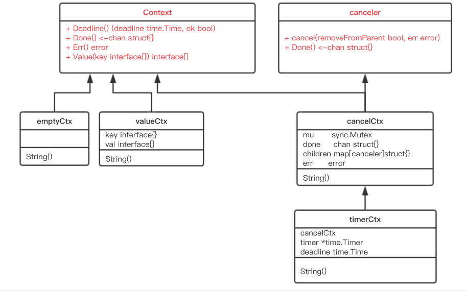
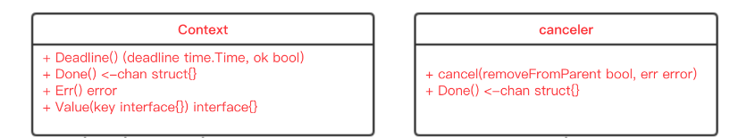
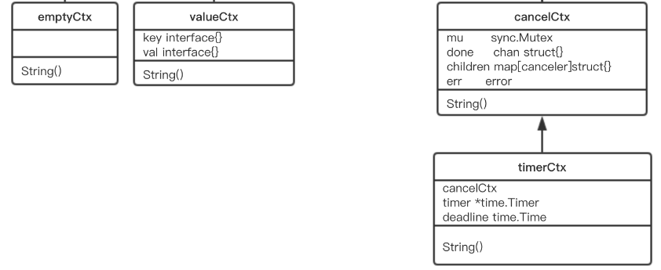

# 简介

context 包的代码并不长，`context.go` 文件总共不到 500 行，其中还有很多大段的注释，代码可能也就 200 行左右的样子，是一个非常值得研究的代码库。

整体类图如下：




# 接口



## Context通用接口

现在可以直接看源码：

```golang
// Context 接口定义了一个上下文，用于在 API 之间传递截止时间、取消信号和其他值。
//
// Context 的方法可以被多个 goroutines 同时调用。
type Context interface {
	// Deadline 返回一个截止时间，如果没有设置会返回false
	// - 通过设置之这个截止时间, 定时任务控制这个上下文通道在哪个时间点定时关闭通道
	Deadline() (deadline time.Time, ok bool)

	// Done 返回一个 channel 通道，可以表示 context 被取消的信号
	// - 当这个 channel 被关闭时，说明 context 被取消了。注意，这是一个只读的channel。
	// - 我们又知道，读一个未关闭的通道会阻塞(配合select可用快速失败非阻塞), 读一个关闭的 channel 会读出相应类型的零值。
	// - 因此在子协程里读这个 channel，除非被关闭，否则会直接快速失败, 读不到任何东西。
	// - 也正是利用了这一点，子协程从 channel 里读出了值（零值）后，就可以做一些收尾工作，尽快退出。
	Done() <-chan struct{}

	// Err 快速检测是否已经关闭通道
	// - 如果通道成功取消, 会返回一个真正的error错误
	Err() error

	// Value 获取之前设置的 key 对应的 value。
	Value(key any) any
}
```

`Context` 是一个接口，定义了 4 个方法:

1. `Deadline()` 返回一个截止时间，如果没有设置会返回false
   - 通过设置之这个截止时间, 定时任务控制这个上下文通道在哪个时间点定时关闭通道

2. `Done()` 返回一个 channel 通道，可以表示 context 被取消的信号：
   - 当这个 channel 被关闭时，说明 context 被取消了。注意，这是一个只读的channel。
   - 我们又知道，读一个未关闭的通道会阻塞(配合select可用快速失败非阻塞), 读一个关闭的 channel 会读出相应类型的零值。
   - 因此在子协程里读这个 channel，除非被关闭，否则会直接快速失败, 读不到任何东西。
   - 也正是利用了这一点，子协程从 channel 里读出了值（零值）后，就可以做一些收尾工作，尽快退出。

3. `Err()` 快速检测是否已经关闭通道
   - 如果通道成功取消, 会返回一个真正的error错误

4. `Value()` 获取之前设置的 key 对应的 value。


## canceler带取消的接口

再来看另外一个接口：

```golang
// canceler 是一个可以直接取消的上下文类型。其实现包括 *cancelCtx 和 *timerCtx。
type canceler interface {
	// 可以用于直接取消上下文。如果 removeFromParent 为 true，会从父上下文中移除当前上下文。
	// err 表示取消的原因，cause 表示导致取消的根本原因。
	cancel(removeFromParent bool, err, cause error)
	// Done 返回一个 channel 通道，可以表示 context 被取消的信号
	Done() <-chan struct{}
}
```

这里出现了真正关闭通道的 `cancel`  取消方法, 也就是说, 只有实现了这两个方法的结构, 才可以真正关闭通道。


## 接口总结

使用 `context` 接口和 `canceler` 接口分离的设计是为了更好地区分不同类型的上下文对象，并使接口更加清晰和精确。

这种设计思想主要有以下几个原因：

1. **最小接口原则**: 设计接口时，应该尽可能地精简接口的方法集。

   - 这样做可以减少接口使用者的认知负担，同时也减少了因接口改变而带来的影响范围。
   - 如果将取消操作合并到 `context.Context` 接口中，那么所有实现 `Context` 接口的类型都必须暴露取消操作
   - 即使某些 Context 类型并不支持取消（比如 `Background` 和 `TODO` Context）。
   - 这违反了最小接口原则，因为不需要取消能力的 Context 实现也不得不包含取消方法的签名。

2. **单一职责原则**: 单一职责原则是面向对象设计的一个基本原则，它提倡每个类（或在 Go 中的每个结构体）都应该只负责一个功能。

   - 在 `context` 包中，`Context` 接口负责处理 Context 的核心功能，如传递值、检测取消和截止时间等。
   - 而 `Canceler` 接口则专注于取消操作。
   - 通过将这些功能分离到不同的接口中，设计者可以确保每个接口保持简单和专注，易于理解和维护

   

在实际使用中，如果需要创建一个可取消的 Context，可以使用 `WithCancel`、`WithDeadline` 或 `WithTimeout` 函数

这些函数返回的 Context 类型会同时实现 `Context` 和 `Canceler` 接口，这样既满足了功能需求，又保持了接口设计的简洁性。

所以我们不必太过于纠结, 为什么要搞2个接口来搞这个功能。


# 结构体



## emptyCtx空的上下文实现

源码中定义了 `Context` 接口后，并且给出了一个实现：

```golang
// emptyCtx 实现了 Context 接口, 但是实现的方法都返回默认值
// 永远不会被 cancel 取消，没有存储值 k-v，也没有 deadline 截止时间
// 它是 backgroundCtx 和 todoCtx 的基础结构。
type emptyCtx struct{}

func (emptyCtx) Deadline() (deadline time.Time, ok bool) {
	return
}

func (emptyCtx) Done() <-chan struct{} {
	return nil
}

func (emptyCtx) Err() error {
	return nil
}

func (emptyCtx) Value(key any) any {
	return nil
}
```

看这段源码，非常 happy。因为每个函数都实现的异常简单，要么是直接返回，要么是返回 nil。

所以，这实际上是一个空的 context，永远不会被 cancel 取消，没有存储值 k-v，也没有 deadline 截止时间。

它被包装成：

```golang
// 一个空的context
type backgroundCtx struct{ emptyCtx }
// 一个空的context
type todoCtx struct{ emptyCtx }
```

通过下面两个导出的函数（首字母大写）对外公开：

```golang
// Background 返回一个非 nil 的空 Context。
// 实现了 Context 接口, 但是实现的方法都返回默认值, 没有超时、没有通道、没有错误、没有kv
func Background() Context {
	return backgroundCtx{}
}

// TODO 返回一个非 nil 的空 Context。
// 实现了 Context 接口, 但是实现的方法都返回默认值, 没有超时、没有通道、没有错误、没有kv
// 当不清楚要使用哪个 Context 或者尚未可用时，代码应该使用 context.TODO。
func TODO() Context {
	return todoCtx{}
}
```

在我们开发过程一帮都用 `Background()`, 而 `TODO()` 一帮是在调试和测试的时候用。


## cancelCtx可关闭通道的上下文实现

再来看一个重要的 context：

```golang
// 可以被取消。当取消时，它也会取消任何实现了 canceler 接口的子上下文。
type cancelCtx struct {
	Context                        // 继承通用上下文接口, cancelCtx 需要实现通用上下文的接口方法
	mu       sync.Mutex            // 同步锁, 用于保护以下字段
	done     atomic.Value          // 原子操作保存通道, Done()创建 chan struct{} 空通道保存在这里, 用于取消
	children map[canceler]struct{} // 在第一次取消调用时设为 nil
	err      error                 // 在第一次取消调用时设置为非 nil
	cause    error                 // 在第一次取消调用时设置为非 nil
}
```

这是一个可以取消的 Context，实现了 canceler 接口。它直接将接口 Context 作为它的一个匿名字段，这样，它就可以被看成一个 Context。


### Done()获取通道

先来看 `Done()` 方法的实现：

```golang
// Done 返回一个 channel 通道，可以表示 context 被取消的信号
func (c *cancelCtx) Done() <-chan struct{} {
	// 尝试加载已存在的 done 通道
	d := c.done.Load()
	if d != nil {
		return d.(chan struct{})
	}

	// 以下为处理当 done 通道尚未创建时的逻辑
	c.mu.Lock()
	defer c.mu.Unlock()

	// 再次加载 done 通道，避免竞态条件
	d = c.done.Load()
	if d == nil {
		// 创建一个新的无缓冲的空通道
		d = make(chan struct{})
		// 将新的通道存储到 done 字段中
		c.done.Store(d)
	}

	// 返回 done 通道
	return d.(chan struct{})
}
```

`Done()` 是“懒汉式”创建

- 只有调用了 Done() 方法的时候 channel 通道才会被创建。

- 再次说明，函数返回的是一个只读的 channel，而且没有地方向这个 channel 里面写数据。

所以，直接调用读这个 channel，协程会被 block 住

- 一般搭配 select 来使用, 可以快速返回失败, 不会阻塞

一旦关闭这个 channel 通道，就会立即成功读出零值, 就可以关闭一些资源了。


### cancel()关闭通道

接下来，我们重点关注 `cancel()` 方法的实现：

```golang
// 关闭 channel 通道
// removeFromParent: 表示是否需要从父级取消器的子级列表中移除自己。
// err: 取消错误，通常是一个 context.Canceled 或 context.DeadlineExceeded 错误。
// cause: 取消的直接原因，可以是 nil。
func (c *cancelCtx) cancel(removeFromParent bool, err, cause error) {
	// 必须要传 err,说明关闭通道的原因
	if err == nil {
		panic("context: internal error: missing cancel error")
	}

	// 关闭通道的原因
	if cause == nil {
		cause = err
	}

	c.mu.Lock()

	// 通道已经被关闭, 上下文取消了
	if c.err != nil {
		c.mu.Unlock()
		return
	}

	// 赋值关闭通道的原因, 以便通过 Err() 方法获取
	c.err = err
	c.cause = cause

	// 获取通道
	d, _ := c.done.Load().(chan struct{})
	if d == nil {
		c.done.Store(closedchan) // 一个可重复使用的已经关闭的通道。
	} else {
		// 如果有直接触发关闭通道
		close(d)
	}

	for child := range c.children {
		child.cancel(false, err, cause) // 递归关闭当前上下文的所有子上下文
	}
	// 清空子上下文
	c.children = nil

	c.mu.Unlock()

	if removeFromParent {
		// 从父节点中移除自己
		removeChild(c.Context, c) // 从父级上下文移除当前上下文
	}
}
```

总体来看，`cancel()` 方法的功能就是关闭 channel 通道：

- 递归地取消它的所有子节点, 并从父节点从删除自己


## timerCtx可通过定时关闭通道的上下文实现

`timerCtx` 基于 `cancelCtx`，只是多了一个 `time.Timer`定时器 和一个 `deadline`时间属性。

`timer`定时器 会在 `deadline`时间到时，自动关闭 channel 通道, 取消 context 上下文

```golang
// 携带一个计时器和一个截止时间。它通过停止其计时器来实现通道关闭, 上下文取消
type timerCtx struct {
	cancelCtx             // 继承可关闭通道的上下文
	timer     *time.Timer // 这是一个定时器, 通道会通过这个定时器执行定时关闭
	deadline  time.Time   // 这是一个真正要执行关闭通道的时间点
}
```


### cancel()关闭通道

主要方法 `cancel()`：

```golang
// 方法用于取消 timerCtx 上下文，它接受三个参数：
// removeFromParent: 表示是否需要从父级取消器的子级列表中移除自己。
// err: 取消错误，通常是一个 context.Canceled 或 context.DeadlineExceeded 错误。
// cause: 取消的直接原因，可以是 nil。
func (c *timerCtx) cancel(removeFromParent bool, err, cause error) {
	// 调用底层的 cancelCtx 的 cancel 方法来真正执行取消操作。
	// 这里的 false 参数表示不从父级中移除，因为我们将在后面的 if 专门处理。
	c.cancelCtx.cancel(false, err, cause)

	// 如果需要从父级取消器中移除自己
	if removeFromParent {
		removeChild(c.cancelCtx.Context, c) // 从父级上下文移除当前上下文
	}

	c.mu.Lock()

	// 停止定时器, 定时取消关闭通道
	if c.timer != nil {
		c.timer.Stop()
		c.timer = nil
	}
	
	c.mu.Unlock()
}
```

总体来看，`cancel()` 方法的功能也是关闭 channel 通道, 并从父节点从删除自己

不过 `timerCtx ` 类型的上下文式通过 `cancelCtx` 都用关闭的, 因为他们属于继承关系


## valueCtx携带一个键值对的上下文

```go
// 携带一个键值对的上下文。
type valueCtx struct {
	Context      // 继承通用上下文接口
	key, val any // 键值对
}
```

与 `cancelCtx`和`timeCtx`上下文不同, `calueCtx` 上下文不实现 `canceler` 取消上下文接口

也就说明这个上下文是很特殊的, 它仅仅是用于存取一个键值对k-v的功能


### Value()返回键值对

```go
// Value 返回与此上下文关联的键的值，如果没有与键关联的值，则返回 nil。
func (c *valueCtx) Value(key any) any {
	// 如果传入的 key 与当前 valueCtx 结构体中的 key 相等，则返回对应的值。
	if c.key == key {
		return c.val
	}

	// 一直顺着 context 往前，最终找到根节点（一般是 emptyCtx），直接返回一个 nil。
	return value(c.Context, key)
}
```

如果用当前上下文实例找到了 key,就直接返回, 否则需要一直顺着 context 往前查找 key

```go
// 一直顺着 context 往前，最终找到根节点（一般是 emptyCtx），直接返回一个 nil。
// c: 父级上下文
// key: 要查询的键
func value(c Context, key any) any {
	// 循环查询
	for {
		switch ctx := c.(type) {
		case *valueCtx:
			// 如果传入的 key 与 valueCtx 结构体中的 key 相等，则返回对应的值。
			if key == ctx.key {
				return ctx.val
			}
			// 否则, 获取上一级上下文继续查询
			c = ctx.Context
		case *cancelCtx:
			// 如果传入的 key 是 &cancelCtxKey，则返回当前的 cancelCtx。
			if key == &cancelCtxKey {
				return c
			}
			// 否则, 获取上一级上下文继续查询
			c = ctx.Context
		case withoutCancelCtx:
			// 如果传入的 key 是 &cancelCtxKey，当 ctx 是使用 WithoutCancel 创建时，表示 Cause(ctx) == nil。
			if key == &cancelCtxKey {
				return nil
			}
			// 否则, 获取上一级上下文继续查询
			c = ctx.c
		case *timerCtx:
			// 如果传入的 key 是 &cancelCtxKey，则返回 timerCtx 内的 cancelCtx。
			if key == &cancelCtxKey {
				return &ctx.cancelCtx
			}
			// 否则, 获取上一级上下文继续查询
			c = ctx.Context
		case backgroundCtx, todoCtx:
			// backgroundCtx 和 todoCtx 不携带任何值，直接返回 nil。
			return nil
		default:
			// 其他类型的 Context，继续调用其 Value 方法查找传入 key 对应的值。
			return c.Value(key)
		}
	}
}
```

**如果你接手过这样的项目，肯定经历过这样的窘境：**

在一个处理过程中，有若干子函数、子协程。各种不同的地方会向 context 里塞入各种不同的 k-v 对，最后在某个地方使用。

你根本就不知道什么时候什么地方传了什么值？

这些值会不会被“覆盖”（底层是两个不同的 context 节点，查找的时候，只会返回一个结果）？

你肯定会崩溃的。

而这也是 `context.Value` 最受争议的地方。很多人建议尽量不要通过 context 传值。


**所以这个东西是不建议使用的, 我们之后也不再讨论这个上下文, 我们只分析带取消功能的上下文!**


## 结构体总结

我们一共分析了 4 个结构体

- `emptyCtx`: 空的上下文实现; 没什么意义, 主要是作为链式上下文的头部
- `cancelCtx`: 可关闭通道的上下文实现; 核心的上下文功能, 我们可以手动调用关闭回调来关闭通道取消上下文
- `timerCtx`: 可通过定时关闭通道的上下文实现; 与`cancelCtx`相比, 这个上下文属于利用定时器取消, 而不是手动执行取消
- `valueCtx`: 携带一个键值对的上下文; 垃圾玩意


# 怎么使用上下文

在我们前面分析的结构体中, 其实只有 2 个结构体是这个 context 上下文的核心实现

- **`cancelCtx`: 可关闭通道的上下文实现;** 
- **`timerCtx`: 可通过定时关闭通道的上下文实现;**


## 1.创建可关闭通道的上下文cancelCtx

```golang
// WithCancel 返回具有新 Done 完成通道的 parent 的副本。
// 当调用返回的 cancel 回调函数或父上下文的 Done 完成通道被关闭时，返回上下文的 Done 完成通道会被关闭。
func WithCancel(parent Context) (ctx Context, cancel CancelFunc) {
    // 创建一个可关闭通道的上下文 cancelCtx
	c := withCancel(parent)
	// 返回一个ctx上下文, 和一个关闭通道的回调
	return c, func() { c.cancel(true, Canceled, nil) }
}
```

这个方法很简单

1. 创建一个可关闭通道的上下文 cancelCtx 的对象
2. 返回这个上下文对象, 并返回一个可以关闭这个上下文的回调

我们在看看`withCancel`方法

```go
// 创建一个可关闭通道的上下文 cancelCtx
func withCancel(parent Context) *cancelCtx {
	// 父级上下文不能为 nil
	if parent == nil {
		panic("cannot create context from nil parent")
	}

	// 创建一个新的 cancelCtx 可关闭通道的上下文
	c := &cancelCtx{}
	// 将这个关闭通道的上下文 c , 挂在父级上下文的上下文链上
	c.propagateCancel(parent, c)
	return c
}
```

1. 判断父级上下文是否为空
2. 创建一个默认的新的 cancelCtx 可关闭通道的上下文
3. 将这个关闭通道的上下文 c , 挂在父级上下文的上下文链上

重点看 `propagateCancel()`：

```golang
// 将这个带关闭通道功能的上下文 child, 挂在父级上下文 parent 的上下文链上
// 如果父级上下文此时如果取消了, 子上下文也同时取消
func (c *cancelCtx) propagateCancel(parent Context, child canceler) {
	// 将当前关闭通道的上下文实例的 Context, 赋值为父级引用
	c.Context = parent

	// 获取父级上下文的通道
	// 如果父级通道为 nil, 则不需要
	done := parent.Done()
	if done == nil {
		return
	}

	select {
	case <-done:
		// 父级上下文此时如果取消了, 子上下文也取消
		// removeFromParent == false: 但是不从父节点中移除自己, 因为只要这条链上的前面的断开就可以了
		// 所以, 如果父级取消了, 从链式移除, 剩下的父级的子级都会从整条上下文链上移除
		child.cancel(false, parent.Err(), Cause(parent))
		return
	default:
	}

	// 函数断言 parent 上下文是一个 cancelCtx 带取消的上下文类型
	// cancelCtx和继承了cancelCtx的timerCtx都属于一个 cancelCtx 带取消的上下文类型
	if p, ok := parentCancelCtx(parent); ok { // 断言
		p.mu.Lock()

		// err!=nil: 说明上下文成功取消,关闭通道了
		if p.err != nil {
			// 父级上下文此时如果取消了, 子上下文也取消
			// removeFromParent == false: 但是不从父节点中移除自己, 因为只要这条链上的前面的断开就可以了
			// 所以, 如果父级取消了, 从链式移除, 剩下的父级的子级都会从整条上下文链上移除
			child.cancel(false, p.err, p.cause)
		} else {
			// 上下文没有被取消
			if p.children == nil {
				p.children = make(map[canceler]struct{})
			}
			//  将当前上下文挂在父级上下文的 children 子级集合中
			p.children[child] = struct{}{}
		}

		p.mu.Unlock()
		return
	}

	// 父上下文实现了 AfterFunc 方法。
	// 只有 afterFuncCtx 类型的上下文才实现了这个方法 afterFuncer
	if a, ok := parent.(afterFuncer); ok {
		c.mu.Lock()

		// 在初始化给的一个回调函数执行之后再关闭通道, 取消上下文
		stop := a.AfterFunc(func() {
			child.cancel(false, parent.Err(), Cause(parent))
		})
		c.Context = stopCtx{
			Context: parent,
			stop:    stop,
		}

		c.mu.Unlock()
		return
	}

	// 计算曾经创建的过goroutine的数量; 用于测试, 没用。
	goroutines.Add(1)

	// 开一个协程, 专门检测父上下文是否取消, 如果取消, 它的子上下文也取消
	go func() {
		select {
		case <-parent.Done():
			// 父上下文已经被取消,子上下文也取消
			child.cancel(false, parent.Err(), Cause(parent))
		case <-child.Done():
		}
	}()
}
```

这个方法看似很长, 实际上就一个作用:

- 将这个上下文挂在一个父级上下文的链上, 并开启检测
- 如果父上下文通道关闭被取消, 那么他的子上下文也同时需要关闭和取消


### 示例

```go
package main

import (
	"context"
	"fmt"
	"time"
)

// 模拟一个长时间运行的操作
func simulateLongRunningOperation(ctx context.Context) {
	// 创建一个定时任务 200ms 一次
	ticker := time.NewTicker(200 * time.Millisecond)
	defer ticker.Stop()

	for {
		select {
		case <-ticker.C:
			fmt.Println("仍在工作...")
		case <-ctx.Done():
			fmt.Println("操作已取消.")
			return
		}
	}
}

func main() {
	// 创建一个带 1s 超时的 context
	ctx, cancel := context.WithCancel(context.Background())
	// 方法执行完成之后, 取消 goroutine 执行
	defer func() {
		println("主要功能已完成.")
	}()

	// 启动一个 goroutine 来执行长时间运行的操作
	go simulateLongRunningOperation(ctx)

	// 等待 goroutine 执行一段时间
	time.Sleep(1 * time.Second)

	// 取消关闭
	cancel()
}
```

运行结果:

```go
仍在工作...
仍在工作...
仍在工作...
仍在工作...
仍在工作...
操作已取消.    
主要功能已完成.
```


## 2.创建可通过定时关闭通道的上下文timerCtx

```golang
// WithTimeout 创建一个带有超时限制的 Context 上下文,和一个可以手动取消上下文的函数
// 实际上就是调用 WithDeadline 指定时间取消的ctx, 将指定的时间控制为我们要设置的超时的那个时间点
func WithTimeout(parent Context, timeout time.Duration) (Context, CancelFunc) {
	// parent: 父级上下文
	// time: 当前时间 + 指定的一个时间值 = 未来的一个新时间点
	return WithDeadline(parent, time.Now().Add(timeout))
}
```

- `WithTimeout` 函数直接调用了 `WithDeadline`，传入的 deadline 是当前时间加上 timeout 的时间
- 也就是从现在开始再经过 timeout 时间就算超时。
- 也就是说，`WithDeadline` 需要用的是绝对时间

```go
// WithDeadline 返回指定时间自动取消的上下文,和一个可以手动取消上下文的函数
func WithDeadline(parent Context, d time.Time) (Context, CancelFunc) {
	// parent: 父级上下文
	// time: 未来的一个新时间点
	return WithDeadlineCause(parent, d, nil)
}
```

- `WithDeadlineCause`方法的封装

```go
// WithDeadlineCause 类似于 WithDeadline，但还在截止时间超过时设置返回的 Context 的原因。
// 参数:
// parent: 父级上下文
// d: 未来的一个新时间点
// cause: 取消上下文的原因日志
func WithDeadlineCause(parent Context, d time.Time, cause error) (Context, CancelFunc) {
	// 初始化的 ctx 不能为 nil
	if parent == nil {
		panic("cannot create context from nil parent")
	}

	// 如果父级上下文有截止时间, 并且父级的截止时间要早于此刻想设置的时间
	// 则可以创建一个不带取消的上下文, 因为如果父级超时了, 会同步将当前这个子上下文也取消的
	if cur, ok := parent.Deadline(); ok && cur.Before(d) {
		return WithCancel(parent) // 返回一个正常的ctx
	}

	// 创建一个带截止时间的上下文, 继承带取消通道的上下文
	c := &timerCtx{
		deadline: d,
	}

	// 将这个带截止时间的上下文 c, 挂在父级上下文 parent 的上下文链上
	// 如果父级上下文此时如果取消了, 子上下文也同时取消
	c.cancelCtx.propagateCancel(parent, c)

	// 计算当前和设置的时间的差距
	dur := time.Until(d)
	// 截止时间已经过期
	if dur <= 0 {
		// 关闭ctx
		c.cancel(true, DeadlineExceeded, cause)
		return c, func() { c.cancel(false, Canceled, nil) }
	}

	c.mu.Lock()
	defer c.mu.Unlock()

	// 如果通道还未关闭
	if c.err == nil {
		// 开启一个定时任务, 并设置 dur 后开始执行关闭通道的任务
		c.timer = time.AfterFunc(dur, func() {
			c.cancel(true, DeadlineExceeded, cause)
		})
	}

	return c, func() { c.cancel(true, Canceled, nil) }
}
```

**实现逻辑**：

- 首先对父级上下文进行检查，确保父级上下文不为空，若为空则触发 panic。
- 如果父级上下文的截止时间早于当前设置的时间，则返回一个不带取消功能的普通上下文，因为父级上下文超时会同步取消子上下文。
- 若父级上下文没有过期，则创建一个带有截止时间的上下文，并继承带有取消功能的父级上下文。
- 计算当前时间与设置时间的时间差，判断是否已经过了截止时间。
- 若截止时间已过，则立即关闭上下文并返回。
- 如果截止时间未到，则设置定时器，在截止时间到达后取消上下文并执行相应的操作。


**这个函数的最核心的一句就是：**

```golang
	// 如果通道还未关闭
	if c.err == nil {
		// 开启一个定时任务, 并设置 dur 后开始执行关闭通道的任务
		c.timer = time.AfterFunc(dur, func() {
			c.cancel(true, DeadlineExceeded, cause)
		})
	}
```


### 示例

```go
package main

import (
	"context"
	"fmt"
	"time"
)

// 模拟一个长时间运行的操作
func simulateLongRunningOperation(ctx context.Context) {
	// 创建一个定时任务 200ms 一次
	ticker := time.NewTicker(200 * time.Millisecond)
	defer ticker.Stop()

	for {
		select {
		case <-ticker.C:
			fmt.Println("仍在工作...")
		case <-ctx.Done():
			fmt.Println("操作已取消.")
			return
		}
	}
}

func main() {
	// 创建一个带 1s 超时的 context
	ctx, _ := context.WithTimeout(context.Background(), 1*time.Second)
	// 方法执行完成之后, 取消 goroutine 执行
	defer func() {
		println("主要功能已完成.")
	}()

	// 启动一个 goroutine 来执行长时间运行的操作
	go simulateLongRunningOperation(ctx)

	// 主 goroutine 可以继续做其他事情，超时后会自动取消操作
	fmt.Println("等待操作超时...")
	time.Sleep(2 * time.Second)
	fmt.Println("操作已经超时...")
}
```

运行结果:

```go
等待操作超时...
仍在工作...
仍在工作...
仍在工作...
仍在工作...
仍在工作...
操作已取消.
操作已经超时...
主要功能已完成.
```

