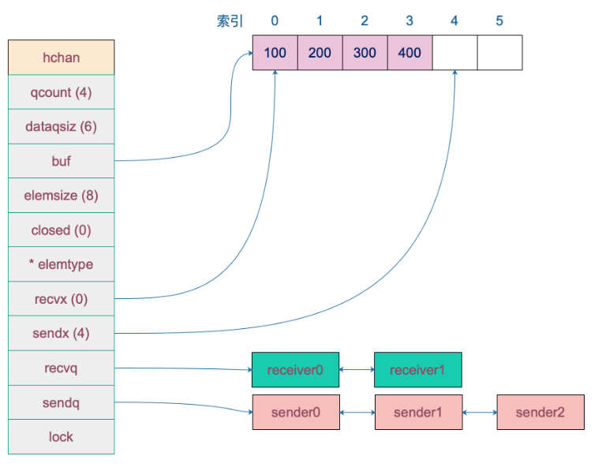
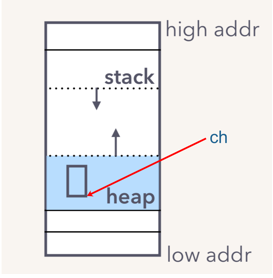

# 简介

在 Go 语言中，`channel` 的底层数据结构是一个名为 `hchan` 的结构体，这个结构体定义在运行时包 `runtime/chan.go` 中。

`hchan` 包含了管理通道所需的所有信息，包括用于发送和接收数据的队列、缓冲区以及与之相关的 goroutine 的等待队列。

# 数据结构

`runtime/chan.go`

```go
// 表示通道的内部数据结构。结构体中包含了用于管理通道的各种字段
// 如队列中的数据量、队列大小、缓冲区、元素大小、关闭标志、元素类型等。
// 同时还包含了用于管理 发送 和 接收 等待者的等待队列，以及一个互斥锁来保护通道的所有字段。
type hchan struct {
	qcount   uint           // 队列中的总数据量
	dataqsiz uint           // 循环队列的大小
	buf      unsafe.Pointer // 指向包含 dataqsiz 个元素的数组
	elemsize uint16         // 元素大小
	closed   uint32         // 关闭标志
	elemtype *_type         // 元素类型
	sendx    uint           // 发送索引
	recvx    uint           // 接收索引
	recvq    waitq          // 接收等待队列, 被阻塞的 goroutine
	sendq    waitq          // 发送等待队列, 被阻塞的 goroutine

	// lock 用于保护 hchan 中的所有字段，
	// 以及阻塞在此通道上的若干 sudogs 中的几个字段。
	//
	// 在持有此锁时，请勿更改另一个 G 的状态
	// （特别是不要让一个 G 可运行），因为这可能会导致堆栈收缩死锁。
	lock mutex
}
```

- `qcount`：表示当前缓冲区中剩余的元素数量。

- `dataqsiz`：表示环形队列（缓冲区）的长度，也就是可以存放的元素数量。

- `buf` : 指向底层循环数组，只有缓冲型的 channel 才有。

- `sendx`，`recvx` 均指向底层循环数组，表示当前可以发送和接收的元素位置索引值（相对于底层数组）。

- `sendq`，`recvq` 分别表示被阻塞的 goroutine，这些 goroutine 由于尝试读取 channel 或向 channel 发送数据而被阻塞。

- `waitq` 是 `sudog` 的一个双向链表，而 `sudog` 实际上是对 goroutine 的一个封装：

```go
// 表示等待队列的结构。该结构体包含了两个字段，分别指向队列中第一个 sudog 和最后一个 sudog。
// sudog 是表示与 goroutine 相关的结构体，在这里用来管理等待通道操作的 goroutine。
type waitq struct {
	first *sudog // 队列的第一个 sudog, sudog 实际上是对 goroutine 的一个封装
	last  *sudog // 队列的最后一个 sudog, sudog 实际上是对 goroutine 的一个封装
}
```

- `lock` 用来保证每个读 channel 或写 channel 的操作都是原子的。

# 图形化示例

例如，创建一个容量为 6 的，元素为 int 型的 channel 数据结构如下 ：



# channel创建

我们知道，通道有两个方向，发送和接收。

- 理论上来说，我们可以创建一个只发送或只接收的通道，但是这种通道创建出来后，怎么使用呢？
- 一个只能发的通道，怎么接收呢？同样，一个只能收的通道，如何向其发送数据呢？

一般而言，使用 `make` 创建一个能收能发的通道：

```golang
// 定义一个只发送的通道类型
type Sender chan<- int
// 定义一个只接收的通道类型
type Receiver <-chan int

// 无缓冲通道
ch1 := make(chan int)
// 有缓冲通道
ch2 := make(chan int, 10)


// 将普通通道转换为只发送的通道, 但是原来的ch依旧可以接受
sender := Sender(ch)
// 将普通通道转换为只接收的通道, 但是原来的ch依旧可以发送
receiver := Receiver(ch)
```

# makechan源码

最终创建 chan 的函数是 `makechan`：

```go
// 用于创建一个通道并返回指向该通道的指针。
// 在函数中进行了元素大小、内存分配、对齐等方面的检查。
// 根据元素是否包含指针，选择不同的分配方式，并且初始化相应的字段，最后返回创建好的通道指针。
func makechan(t *chantype, size int) *hchan {
	// 获取通道元素类型
	elem := t.Elem

	// 编译器会检查这一点，但还是保险起见。
	if elem.Size_ >= 1<<16 {
		throw("makechan: 无效的通道元素类型")
	}
	if hchanSize%maxAlign != 0 || elem.Align_ > maxAlign {
		throw("makechan: 错误对齐")
	}

	// 检查通道元素总大小是否超出范围，防止溢出或负数大小。
	mem, overflow := math.MulUintptr(elem.Size_, uintptr(size))
	if overflow || mem > maxAlloc-hchanSize || size < 0 {
		panic(plainError("makechan: 大小超出范围"))
	}

	// 初始化 hchan 结构体，根据不同的情况分配内存。
	// Hchan 不包含 GC 需要跟踪的指针，除非存储在 buf 中的元素包含指针。
	// buf 指向同一分配区域，elemtype 是持久的。
	// SudoG 被其拥有线程引用，所以不会被收集。
	// TODO(dvyukov,rlh): 当收集器可以移动已分配的对象时重新考虑。
	var c *hchan
	switch {
	case mem == 0:
		// 队列或元素大小为零。分配 hchan 的内存
		c = (*hchan)(mallocgc(hchanSize, nil, true))
		// Race detector 使用该位置进行同步。
		// 设置 buf 指向 hchan 的 raceaddr 字段
		c.buf = c.raceaddr()
	case elem.PtrBytes == 0:
		// 元素不包含指针。
		// 在一次调用中分配 hchan 和 buf。
		// 分配 hchan 和 buf 的连续内存
		c = (*hchan)(mallocgc(hchanSize+mem, nil, true))
		// 设置 buf 指向 hchan 后面的内存区域
		c.buf = add(unsafe.Pointer(c), hchanSize)
	default:
		// 元素包含指针。
		// 动态创建 hchan 结构体
		c = new(hchan)
		// 单独分配 buf 的内存
		c.buf = mallocgc(mem, elem, true)
	}

	// 初始化 hchan 的其他字段。
	c.elemsize = uint16(elem.Size_)  // 设置每个元素的大小
	c.elemtype = elem                // 设置元素类型
	c.dataqsiz = uint(size)          // 设置循环队列的大小大小
	lockInit(&c.lock, lockRankHchan) // 初始化锁

	// 如果启用了 debug 通道，打印调试信息。
	if debugChan {
		print("makechan: chan=", c, "; elemsize=", elem.Size_, "; dataqsiz=", size, "\n")
	}
	// 返回初始化后的通道
	return c
}
```

1. **获取通道元素类型**：`t.Elem` 获取通道元素类型的信息。
2. **安全检查**：
    - 检查元素大小是否超过限制。
    - 检查 `hchan` 的大小是否对齐正确。
3. **计算元素总大小**：
    - 使用 `math.MulUintptr` 计算通道元素的总大小。
    - 检查乘法是否溢出或请求的大小是否不合理。
4. **分配内存**：
    - 根据元素是否包含指针，以及通道的大小，决定如何分配内存。
        - 如果 `mem` 为零，只分配 `hchan` 的内存。
        - 如果元素不包含指针，分配连续的内存空间，包括 `hchan` 和 `buf`。
        - 如果元素包含指针，单独分配 `buf` 的内存。
5. **初始化 `hchan` 结构体**：
    - 设置 `elemsize`、`elemtype`、`dataqsiz` 等字段。
    - 初始化 `hchan` 的锁。
6. **返回通道**：最后返回初始化后的 `hchan` 结构体，即通道。

新建一个 chan 后，内存在堆上分配，大概长这样：



