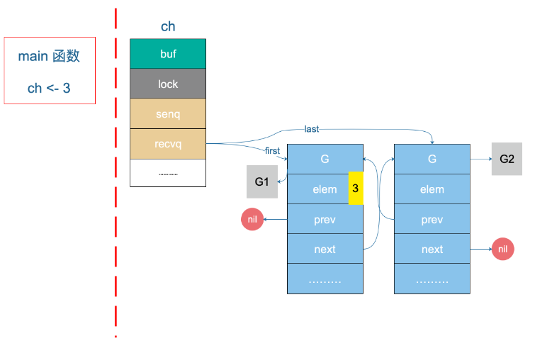

# 简介

在 Go 语言中，向 channel 发送数据的过程主要涉及以下几个步骤：

1. **选择 channel**：首先确定要向哪个 channel 发送数据。channel 必须已经创建，可以通过 `make` 函数来创建

   例如 `ch := make(chan int)` 创建一个无缓冲的整型 channel，或者 `ch := make(chan int, 10)` 创建一个缓冲大小为 10 的整型
   channel。

2. **发送操作**：使用 channel 的发送语法 `<-` 来发送数据。语法形式为 `ch <-value`，其中 `ch` 是 channel 的变量名，`value`
   是要发送的值。

   如果 channel 是无缓冲的，发送操作会阻塞，直到有另一个 goroutine 准备好从该 channel 接收数据。

   如果 channel 是有缓冲的，发送操作会将数据放入缓冲区，如果缓冲区满，则发送也会阻塞，直到有接收操作腾出空间。

3. **阻塞与唤醒**：如果发送操作遇到阻塞，Go 的运行时会挂起当前的 goroutine，直到有相应的接收操作发生。

   一旦数据被接收，发送 goroutine 将被唤醒并继续执行。

4. **关闭 channel**：在所有数据发送完毕后，可以使用 `close(ch)` 函数来关闭 channel，这会通知所有接收方不再有更多数据。

   关闭 channel 后，再向 channel 发送数据会导致 panic。

# chansend源码

`runtime/chan.go`

```go
// c <- x从编译代码的入口点。
//
//go:nosplit
func chansend1(c *hchan, elem unsafe.Pointer) {
    // 泛型单通道发送/接收, 默认是阻塞操作
	chansend(c, elem, true, getcallerpc())
}
// 如果是 select, 默认是非阻塞操作
func selectnbsend(c *hchan, elem unsafe.Pointer) (selected bool) {
	return chansend(c, elem, false, getcallerpc())
}

/*
 * 泛型单通道发送/接收
 *
 * @param c 通道指针
 * @param ep 要发送/接收的元素指针
 * @param block 是否阻塞发送/接收操作
 * @param callerpc 调用者的程序计数器
 *
 * @return 是否成功发送/接收
 */
func chansend(c *hchan, ep unsafe.Pointer, block bool, callerpc uintptr) bool {
	// 如果 channel 是 nil
	if c == nil {
		// 不能阻塞，直接返回 false，表示未发送成功
		if !block {
			return false
		}
		// 当前 goroutine 被挂起
		gopark(nil, nil, waitReasonChanSendNilChan, traceBlockForever, 2)
		throw("unreachable")
	}

	if debugChan {
		print("chansend: chan=", c, "\n")
	}

	if raceenabled {
		racereadpc(c.raceaddr(), callerpc, abi.FuncPCABIInternal(chansend))
	}

	// 对于不阻塞的 send，快速检测失败场景
	// full 判断在通道 c 上发送是否会阻塞（即通道已满）。
	//
	// 如果 channel 未关闭且 channel 没有多余的缓冲空间。这可能是：
	// 1. channel 是非缓冲型的，且等待接收队列里没有 goroutine, 快速检测失败
	// 2. channel 是缓冲型的，但循环数组已经装满了元素. 快速检测失败
	if !block && c.closed == 0 && full(c) {
		return false
	}

	var t0 int64
	if blockprofilerate > 0 {
		t0 = cputicks()
	}

	// 锁住 channel，并发安全
	lock(&c.lock)

	// 如果 channel 关闭了
	if c.closed != 0 {
		// 解锁
		unlock(&c.lock)
		// 直接 panic
		panic(plainError("在 closed 关闭的 channel 通道上发送"))
	}

	// 如果接收队列里有 goroutine，直接将要发送的数据拷贝到接收 goroutine
	if sg := c.recvq.dequeue(); sg != nil {
		// 发现了等待的接收者。我们直接将要发送的值传递给接收者，绕过通道的缓冲区（如果有）。
		send(c, sg, ep, func() { unlock(&c.lock) }, 3)
		return true
	}

	// 对于缓冲型的 channel，如果还有缓冲空间
	if c.qcount < c.dataqsiz {
		// 通道缓冲区中有可用的空间。将要发送的元素入队。
		// qp 指向 buf 的 sendx 发送索引位置
		qp := chanbuf(c, c.sendx)
		if raceenabled {
			racenotify(c, c.sendx, nil)
		}

		// 将数据从 ep 要发送/接收的元素指针处拷贝到 qp
		// 完成发送数据入队
		typedmemmove(c.elemtype, qp, ep)
		// 发送游标值加 1
		c.sendx++
		// 如果发送游标值等于容量值，游标值归 0
		if c.sendx == c.dataqsiz {
			c.sendx = 0
		}
		// 缓冲区的元素数量加一
		c.qcount++
		// 解锁
		unlock(&c.lock)
		return true
	}

	// 如果不需要阻塞，则直接返回错误
	if !block {
		unlock(&c.lock)
		return false
	}

	// channel 满了，发送方会被阻塞。接下来会构造一个 sudog

	// 获取当前 goroutine 的指针
	gp := getg()
	// 申请一个 sudog，用于跟踪当前 goroutine 的等待状态
	mysg := acquireSudog()
	mysg.releasetime = 0
	if t0 != 0 {
		// 如果启用了阻塞时间记录，设置 releasetime 为 -1，表示开始计时
		mysg.releasetime = -1
	}

	mysg.elem = ep        // 将发送数据赋值给 sudog 的 elem 字段，以便后续处理
	mysg.waitlink = nil   // 初始化 sudog 的 waitlink 字段
	mysg.g = gp           // 将 sudog 与当前 goroutine 绑定
	mysg.isSelect = false // 标记这不是由 select 语句引起的阻塞
	mysg.c = c            // 绑定 sudog 到通道 c
	gp.waiting = mysg     // 将 sudog 添加到当前 goroutine 的 waiting 列表
	gp.param = nil        // 清除参数，用于后续可能的唤醒

	// 当前 goroutine 进入发送等待队列，等待接收方来唤醒
	c.sendq.enqueue(mysg)

	// 当前 goroutine 被挂起，等待通道 c 的锁被释放
	gp.parkingOnChan.Store(true) // 标记当前 goroutine 正在等待通道
	gopark(chanparkcommit, unsafe.Pointer(&c.lock), waitReasonChanSend, traceBlockChanSend, 2)

	// 确保发送的值一直保持活动，直到接收者复制出来。
	KeepAlive(ep)

	// 有人唤醒了我们, 说明有一个接收着从队列里面读取了我们发送者阻塞的 goroutine
	// 并将发送的数据从 我们此发送者的 goroutine 写入到了 它接收者的 goroutine。

	// 验证 sudog 是否仍然在当前 goroutine 的 waiting 列表中
	if mysg != gp.waiting {
		throw("G waiting list is corrupted") // 如果 sudog 不在列表中，说明列表被意外修改
	}

	gp.waiting = nil            // 清除 sudog 从当前 goroutine 的 waiting 列表
	gp.activeStackChans = false // 标记当前 goroutine 不再等待通道
	closed := !mysg.success     // 检查 sudog 的 success 字段，确定通道是否已关闭
	gp.param = nil              // 清除参数，以防万一

	// 如果有记录阻塞时间，计算并记录阻塞持续时间
	if mysg.releasetime > 0 {
		blockevent(mysg.releasetime-t0, 2)
	}

	mysg.c = nil       // 去掉 mysg 上绑定的 channel
	releaseSudog(mysg) // 释放 sudog，因为它不再需要

	// 如果通道在发送方等待期间被关闭，引发 panic
	if closed {
		if c.closed == 0 {
			throw("chansend: spurious wakeup") // 如果通道没有真正关闭，这是一次虚假唤醒
		}
		// 被唤醒后发现通道关闭了，引发 panic
		panic(plainError("send on closed channel"))
	}
	return true
}
```

1. **检查通道**：首先检查通道 `c` 是否为 `nil`，如果是，并且是非阻塞模式，那么直接返回 `false`。如果是阻塞模式，调用 `gopark`
   进行阻塞。

3. **快速路径检查**：如果非阻塞并且通道已关闭或满，立即返回 `false`。

4. **加锁**：获取通道的锁。

5. **检查关闭状态**：如果通道已关闭，释放锁并抛出异常。

6. **寻找接收者**：尝试从接收队列 `recvq` 中取出等待的接收者，如果找到，直接将数据发送给接收者，释放锁并返回。

7. **检查缓冲区**：如果缓冲区有空位，将数据放入缓冲区，更新计数器和索引，释放锁并返回。

8. **阻塞**：如果没有接收者且缓冲区满，如果非阻塞模式则释放锁并返回。

9. **如果是阻塞模式**: 正常发送数据到通道, 默认就是阻塞的

10. **获取 goroutine**：首先，获取当前执行的 goroutine 的指针，用于后续绑定 sudog。

11. **申请 sudog**：创建一个 sudog 实例，用于跟踪当前 goroutine 在通道上的等待状态。

12. **设置 sudog 属性**：设置 sudog 的各种属性，包括绑定的 goroutine、通道、等待数据等。

13. **入队列**：将 sudog 加入通道的发送等待队列, 等待接收方唤醒，表明当前 goroutine 正在等待发送数据。

14. **挂起 goroutine**：调用 `gopark` 函数，挂起当前 goroutine，等待通道锁被释放。

16. **唤醒处理**：有一个接收着从队列里面读取了我们发送者阻塞的 goroutine,goroutine 被唤醒后

    并将发送的数据从 我们此发送者的 goroutine 写入到了 它接收者的 goroutine

17. **释放 sudog**：释放 sudog，因为它不再需要，同时检查通道是否已关闭。

下面将详细解析下部分过程中的代码:

- `send`: 发送
- `sendDirect`: 发送的goroutine数据写入接受的goroutine

## send发送源码

在上面的源码中, 有一部分是直接发送到接收者的代码, 并不需要加入缓冲区, 或者阻塞 goroutine。

```go
// 如果接收队列里有 goroutine，直接将要发送的数据拷贝到接收 goroutine
if sg := c.recvq.dequeue(); sg != nil {
    // 发现了等待的接收者。我们直接将要发送的值传递给接收者，绕过通道的缓冲区（如果有）。
    send(c, sg, ep, func() { unlock(&c.lock) }, 3)
    return true
}
```

- 如果能从等待接收队列 recvq 里出队一个 sudog（代表一个 goroutine）。

```go
// send 函数处理向一个空的 channel 发送操作
// ep 指向被发送的元素，会被直接拷贝到接收的 goroutine
// 之后，接收的 goroutine 会被唤醒
//
// c 必须是空的（因为等待队列里有 goroutine，肯定是空的, 否则不可能出现等待）
// c 必须被上锁，发送操作执行完后，会使用 unlockf 函数解锁
// sg 必须已经从等待队列里取出来了
// ep 必须是非空，并且它指向堆或调用者的栈
func send(c *hchan, sg *sudog, ep unsafe.Pointer, unlockf func(), skip int) {
	// 如果启用了竞争检测
	if raceenabled {
		if c.dataqsiz == 0 {
			racesync(c, sg) // 无缓冲通道的竞争检测同步
		} else {
			// 假设我们通过缓冲区进行，即使我们直接复制。需要注意只有在 raceenabled 时我们才需要增加头尾位置。
			racenotify(c, c.recvx, nil) // 通知竞争检测关于接收位置的变更
			racenotify(c, c.recvx, sg)  // 通知竞争检测关于 sg 的变更
			c.recvx++                   // 更新接收位置

			// 如果到达末尾，重置位置
			if c.recvx == c.dataqsiz {
				c.recvx = 0
			}

			// 将发送位置同步到接收位置
			c.sendx = c.recvx // c.sendx = (c.sendx+1) % c.dataqsiz
		}
	}

	// 如果 sg 中的 elem 不为 nil，这表示 sg 已经准备发送数据
	if sg.elem != nil {
		// 直接将 sg 中的值发送到通道 c 中
		sendDirect(c.elemtype, sg, ep)
		// 清理 sg 中的数据，避免重复发送
		sg.elem = nil
	}

	// 获取接收者 goroutine
	gp := sg.g
	// 使用 unlockf 解锁通道 c
	unlockf()
	// 将 gp 的参数设置为 sg，这样 gp 在恢复执行时可以访问到 sg
	gp.param = unsafe.Pointer(sg)
	// 标记 sg 成功接收了数据
	sg.success = true

	// 如果 sg 的释放时间不为 0，则更新为当前时间
	if sg.releasetime != 0 {
		// 更新 sg 的释放时间戳
		sg.releasetime = cputicks()
	}

	// 将 gp 标记为可运行状态，使其可以被调度器选择执行
	// 唤醒接收的 goroutine
	// skip和打印栈相关，暂时不理会
	goready(gp, skip+1)
}
```

2. **复制数据**：如果接收方 sudog 的 `elem` 字段不为 `nil`，表明接收方已准备好接收数据，调用 `sendDirect` 函数将发送方的数据复制到接收方。
3. **清理 sudog**：将 sudog 的 `elem` 字段设为 `nil`，避免重复发送或数据残留。
4. **解锁通道**：调用 `unlockf` 函数解锁通道，因为发送操作已完成。
6. **标记成功**：设置 sudog 的 `success` 字段为 `true`，表明发送成功。
8. **唤醒接收者**: 唤醒的goroutine, 处理接收的数据

## sendDirect两个goroutine传递数据

继续看 `sendDirect` 函数：

```go
// 在无缓冲或空缓冲通道上发送和接收是唯一的操作，其中一个运行的 goroutine 写入另一个运行 goroutine 的堆栈。
// 垃圾回收器假定堆栈写入仅发生在 goroutine 运行时，并且仅由该 goroutine 执行。
// 使用写屏障足以弥补这一假设的违反，但写屏障必须有效。
// typedmemmove 将调用 bulkBarrierPreWrite，但目标字节不在堆中，因此这种方式不起作用。我们安排调用 memmove 和 typeBitsBulkBarrier。
func sendDirect(t *_type, sg *sudog, src unsafe.Pointer) {
	// src 位于我们的堆栈上，dst 是另一个堆栈上的一个插槽。

	// 一旦我们从 sg 中读取 sg.elem，如果目的地的堆栈被复制（缩小），则不会再更新它。
	// 因此，在读取和使用之间确保不会发生抢占点。
	dst := sg.elem

	// 使用类型相关的写屏障处理内存复制
	// 这个函数将确保在内存复制之前，任何可能的引用都被正确地更新
	typeBitsBulkBarrier(t, uintptr(dst), uintptr(src), t.Size_)

	// 由于 dst 始终是 Go 内存，因此不需要进行 cgo 写屏障检查。
	// 对内存执行内存复制操作，大小为 t 的大小
	// 这里 memmove 实际上是一个 Go 的内存复制函数，不同于 C 的 memmove
	memmove(dst, src, t.Size_)
}
```

这里涉及到一个 goroutine 直接写另一个 goroutine 栈的操作

- 一般而言，不同 goroutine 的栈是各自独有的。

- 而这也违反了 GC 的一些假设。
- 为了不出问题，写的过程中增加了写屏障，保证正确地完成写操作。
- 这样做的好处是减少了一次内存 copy：不用先拷贝到 channel 的 buf，直接由发送者到接收者，没有中间商赚差价，效率得以提高，完美。

# 案例分析

好了，看完源码。我们接着来分析例子，代码如下：

```go
package main

import (
	"fmt"
	"time"
)

// goroutineA 是一个goroutine函数，从通道 a 中接收数据并打印出来
func goroutineA(a <-chan int) {
	val := <-a
	fmt.Println("goroutine A 已收到 data: ", val)
	return
}

// goroutineB 是另一个goroutine函数，从通道 b 中接收数据并打印出来
func goroutineB(b <-chan int) {
	val := <-b
	fmt.Println("goroutine B 已收到 data: ", val)
	return
}

func main() {
	// 创建一个整型通道 ch
	ch := make(chan int)
	
	// 启动 goroutineA 和 goroutineB，它们分别从通道 ch 中接收数据
	go goroutineA(ch)
	go goroutineB(ch)
	
	// 将数据 3 和 4 发送到通道 ch
	ch <- 3
	ch <- 4

	// 让主goroutine休眠1秒，以确保其他goroutine有足够的时间执行
	time.Sleep(time.Second)
}
```

根据前面源码分析的结果，我们知道，sender 发现 ch 的 recvq 里有 receiver 在等待着接收，就会出队一个 sudog (假设出队的是 G1)

```go
	// 如果接收队列里有 goroutine，直接将要发送的数据拷贝到接收 goroutine
	if sg := c.recvq.dequeue(); sg != nil {
		// 发现了等待的接收者。我们直接将要发送的值传递给接收者，绕过通道的缓冲区（如果有）。
		send(c, sg, ep, func() { unlock(&c.lock) }, 3)
		return true
	}
```

然后，sender 把发送元素拷贝到 sudog 的 elem 地址处，最后会调用 goready 将 G1 唤醒，状态变为 runnable。

```go
func send(c *hchan, sg *sudog, ep unsafe.Pointer, unlockf func(), skip int) {
	...
	// 如果 sg 中的 elem 不为 nil，这表示 sg 已经准备好接收数据
	if sg.elem != nil {
		// 直接将 sg 中的值发送到通道 c 中
		sendDirect(c.elemtype, sg, ep)
		// 清理 sg 中的数据，避免重复发送
		sg.elem = nil
	}
	...
	// 将 gp 标记为可运行状态，使其可以被调度器选择执行
	// 唤醒接收的 goroutine
	// skip和打印栈相关，暂时不理会
	goready(gp, skip+1)
}
```

当调度器光顾 G1 时，将 G1 变成 running 状态，执行 goroutineA 接下来的代码。G 表示其他可能有的 goroutine。

- 这里其实涉及到一个协程写另一个协程栈的操作。
- 有两个 receiver (G1 和 G2)在 channel 的一边虎视眈眈地等着
- 这时 channel 另一边来了一个 sender 准备向 channel 发送数据，为了高效，用不着通过 channel 的 buf “中转”一次，直接从源地址把数据
  copy 到目的地址



上图是一个示意图，`3` 会被拷贝到 G1 栈上的某个位置，也就是 val 的地址处，保存在 elem 字段。


