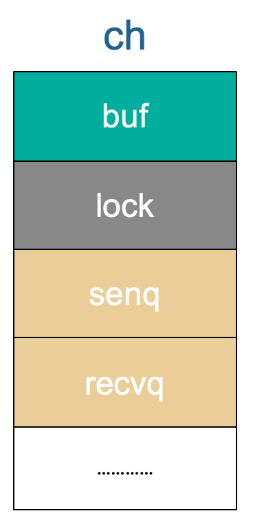
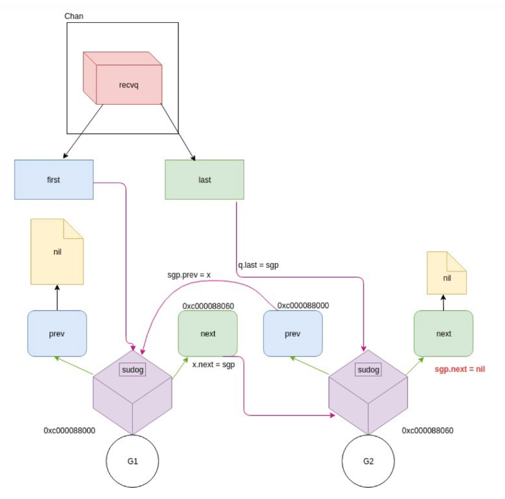
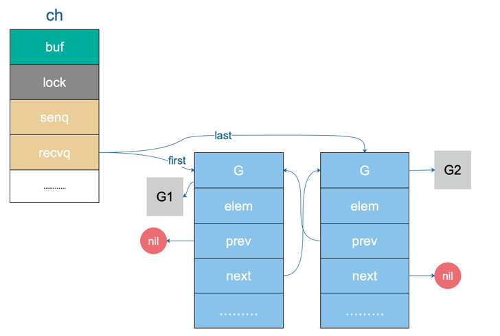

# 简介

在 Go 语言中，从 channel 接收数据的过程主要包括以下几个步骤：

1. **选择 channel**：首先确定要从哪个 channel 接收数据。这个 channel 必须已经创建并且至少包含了一些数据，或者有另一个
   goroutine 正在向 channel 发送数据。

2. **接收操作**：使用 channel 的接收语法 `<-` 来接收数据。语法形式为 `value := <-ch`，其中 `ch` 是 channel 的变量名，`value`
   是接收的数据。

   如果 channel 是无缓冲的，接收操作会阻塞，直到有另一个 goroutine 向该 channel 发送数据。

   如果 channel 是有缓冲的，接收操作会从缓冲区中移除并返回一个数据，如果缓冲区为空，则接收也会阻塞，直到有发送操作。

3. **阻塞与唤醒**：如果接收操作遇到阻塞，Go 的运行时会挂起当前的 goroutine，直到有相应的发送操作发生。一旦数据被接收，接收
   goroutine 将被唤醒并继续执行。

4. **检查 channel 是否关闭**：如果 channel 已经关闭并且缓冲区中没有剩余的数据，接收操作将返回 channel 类型的零值，而不是阻塞。

   对于基本类型，零值通常是 `0`（对于整数）或 `false`（对于布尔值）。如果 channel 是切片、map 或者 channel
   类型自身，那么零值就是 `nil`。

5. **使用 `range` 循环接收**：你也可以使用 `for-range` 循环从 channel 接收数据，直到 channel 关闭并且没有更多的数据。

   如果 channel 被关闭，`range` 循环会终止。

# chanrecv接收源码

`runtime/chan.go`

接收操作有两种写法

- 一种带 "ok"，反应 channel 是否关闭
- 一种不带  "ok"，这种写法

当接收到相应类型的零值时无法知道是真实的发送者发送过来的值，还是 channel 被关闭后，返回给接收者的默认类型的零值。

```go
// 处理不带 "ok" 的情形
func chanrecv1(c *hchan, elem unsafe.Pointer) {
	chanrecv(c, elem, true)
}
// 返回 "received" 这个字段来反应 channel 是否被关闭
func chanrecv2(c *hchan, elem unsafe.Pointer) (received bool) {
	_, received = chanrecv(c, elem, true)
	return
}
// 如果使用的是 select, 则使用非阻塞的模式
func selectnbrecv(elem unsafe.Pointer, c *hchan) (selected, received bool) {
	return chanrecv(c, elem, false)
}
```

无论如何，最终转向了 `chanrecv` 函数：

```go
// 在通道 c 上接收数据，并将接收到的数据写入 ep。
// ep 可以为 nil，在这种情况下，接收到的数据会被忽略。
// 如果 block 为 false 且没有元素可用，则返回 (false, false)。
// 否则，如果 c 已关闭，则将 *ep 置零并返回 (true, false)。
// 否则，填充 *ep 并返回 (true, true)。
// 非 nil 的 ep 必须指向堆或调用者的堆栈。
func chanrecv(c *hchan, ep unsafe.Pointer, block bool) (selected, received bool) {
	// raceenabled: 不需要检查 ep，因为它总是位于堆栈上
	// 或是由 reflect 分配的新内存。

	if debugChan {
		print("chanrecv: chan=", c, "\n")
	}

	if c == nil {
		if !block {
			return
		}
		gopark(nil, nil, waitReasonChanReceiveNilChan, traceBlockForever, 2)
		throw("unreachable")
	}

	// 快速路径：在不获取锁的情况下，检查失败的非阻塞操作。
	if !block && empty(c) {
		// 观察到通道不适合接收后，检查通道是否关闭。
		// 重新排序这些检查可能导致与关闭竞赛时的不正确行为。
		if atomic.Load(&c.closed) == 0 {
			// 因为通道不能重新打开，所以后来观察到通道没有关闭意味着它在第一次观察时也没有关闭。
			// 我们的行为就像我们在那一刻观察到的通道，并报告接收无法进行。
			return
		}
		// 通道不可逆地关闭。重新检查通道是否接收任何待接收数据，
		// 这些数据可能出现在空和关闭检查之间的时刻。
		if empty(c) {
			// 通道不可逆地关闭且为空。
			if raceenabled {
				raceacquire(c.raceaddr())
			}
			if ep != nil {
				typedmemclr(c.elemtype, ep)
			}
			return true, false
		}
	}

	var t0 int64
	if blockprofilerate > 0 {
		t0 = cputicks()
	}

	lock(&c.lock)

	if c.closed != 0 {
		if c.qcount == 0 {
			if raceenabled {
				raceacquire(c.raceaddr())
			}
			unlock(&c.lock)
			if ep != nil {
				typedmemclr(c.elemtype, ep)
			}
			return true, false
		}
		// 通道已关闭，但通道的缓冲中有数据, 不必理会, 就算关闭了, 也可以继续读取。
	} else {
		// 找到未关闭的等待发送者。
		if sg := c.sendq.dequeue(); sg != nil {
			// 找到等待的发送者。如果缓冲区大小为 0，直接从发送者接收值。
			// 否则，从队列头部接收并添加发送者的值到队列尾部。
			recv(c, sg, ep, func() { unlock(&c.lock) }, 3)
			return true, true
		}
	}

	if c.qcount > 0 {
		// 直接从队列接收。
		// 计算队列中数据的位置
		qp := chanbuf(c, c.recvx)

		// 如果启用了竞争检测
		if raceenabled {
			// 通知竞争检测器当前正在访问的缓冲区位置
			racenotify(c, c.recvx, nil)
		}

		// 如果 ep 不为 nil，意味着接收端希望接收数据
		if ep != nil {
			// 将通道队列中的数据复制到接收端提供的位置
			typedmemmove(c.elemtype, ep, qp)
		}

		// 清除队列中的数据，以便下次发送或接收可以使用这个位置
		typedmemclr(c.elemtype, qp)

		c.recvx++ // 更新接收位置，准备下一次接收

		// 如果接收位置到达缓冲区的末尾，重置为缓冲区的起始位置
		if c.recvx == c.dataqsiz {
			c.recvx = 0
		}

		c.qcount--        // 减少队列中的数据计数，表示已取出一个数据
		unlock(&c.lock)   // 释放通道的锁，因为接收操作已完成
		return true, true // 返回 true 表示已成功从通道接收数据，且通道有数据
	}

	if !block {
		// 如果是非阻塞模式，没有数据立即可用，则立即返回，表示没有接收成功
		unlock(&c.lock)
		return false, false
	}

	// 没有可用的发送者：在通道上阻塞。

	gp := getg()           // 获取当前 goroutine 的信息
	mysg := acquireSudog() // 申请一个 sudog，用于跟踪 goroutine 的等待状态
	mysg.releasetime = 0

	// 如果正在收集阻塞时间信息，设置 releasetime 为 -1
	if t0 != 0 {
		mysg.releasetime = -1
	}

	// 不允许在分配 elem 和将 mysg 添加到 gp.waiting 之间分割堆栈，
	// 因为 copystack 可以找到它，这确保了在等待过程中堆栈状态的连续性
	mysg.elem = ep
	mysg.waitlink = nil
	gp.waiting = mysg
	mysg.g = gp
	mysg.isSelect = false
	mysg.c = c
	gp.param = nil

	// 将 sudog 添加到通道的接收等待队列
	c.recvq.enqueue(mysg)
	
	// 发出信号，通知任何试图缩小我们堆栈的人，我们即将在通道上挂起。
	// 在这个 G 的状态改变和我们设置 gp.activeStackChans 之间的窗口期
	// 不适合进行堆栈缩小，因为我们正准备挂起等待通道。
	gp.parkingOnChan.Store(true)

	// 挂起当前 goroutine，等待通道上的数据
	gopark(chanparkcommit, unsafe.Pointer(&c.lock), waitReasonChanReceive, traceBlockChanRecv, 2)

	// 有人唤醒了我们, 说明有一个发送着从队列里面读取了我们接收者阻塞的 goroutine
	// 并将发送的数据从 发送者的 goroutine 写入到了 我们此接收者的 goroutine。

	// 检查 sudog 是否仍然在等待列表中，以验证等待列表的完整性
	if mysg != gp.waiting {
		throw("G waiting list is corrupted")
	}
	gp.waiting = nil
	gp.activeStackChans = false

	// 如果设置了 releasetime，记录阻塞事件的持续时间
	if mysg.releasetime > 0 {
		blockevent(mysg.releasetime-t0, 2)
	}

	// 检查 sudog 的 success 字段，以确定是否成功接收数据
	success := mysg.success
	gp.param = nil
	mysg.c = nil

	// 释放 sudog，因为等待已经结束
	releaseSudog(mysg)
	// 返回 true 表示已经选择了通道，success 表示是否成功接收数据
	return true, success
}
```

1. **初始化检查**：首先检查通道是否为 `nil`，如果是并且 `block` 为 `false`，则直接返回。如果通道为 `nil` 并且 `block`
   为 `true`，则挂起当前 goroutine。

2. **快速路径检查**：如果 `block` 为 `false` 且通道为空，则返回 `(false, false)`。如果通道关闭但队列中还有数据，则准备接收数据。

3. **锁定通道**：获取通道锁，开始临界区操作。

4. **检查通道状态**：如果通道已关闭且队列中无数据，则将 `ep` 置零并返回 `(true, false)`。如果通道已关闭但队列中有数据，则准备接收数据。

5. **接收数据**：如果队列中有数据，从队列中接收数据并返回 `(true, true)`。

6. **检查缓冲区**：如果缓冲区有空位，读取缓冲区数据，更新计数器和索引，释放锁并返回。

7. **阻塞接收**：如果没有数据并且 `block` 为 `true`，创建一个 `sudog` 实例并将当前 goroutine 挂起，等待数据到来。

8. **获取 goroutine 信息**：调用 `getg()` 函数获取当前 goroutine 的信息。

9. **申请 sudog**：使用 `acquireSudog()` 函数申请一个 sudog，用于跟踪 goroutine 的等待状态。

10. **设置 sudog 属性**：设置 sudog 的属性，包括 `elem`、`waitlink`、`g`、`isSelect`、`c` 等字段。

11. **入队列**：将 sudog 添加到通道的接收等待队列中。

12. **挂起 goroutine**：使用 `gopark` 函数挂起当前 goroutine，等待通道上的数据。

13. **唤醒处理**：有一个发送者从队列里面读取了我们接收者阻塞的 goroutine,goroutine 被唤醒后

    并将发送的数据从 发送者的 goroutine 写入到了 我们接收者的 goroutine

14. **记录阻塞时间**：如果设置了 `releasetime`，记录阻塞事件的持续时间。

15. **释放 sudog**：使用 `releaseSudog()` 函数释放 sudog，因为等待已经结束。

下面将详细解析下部分过程中的代码:

- `recv`: 接收
- `recvDirect`: 发送的goroutine数据写入接受的goroutine

## recv接收源码

在上面源码部分, 如果通道没关闭, 并且有正在阻塞的发送者, 会直接调用:

```go
// 找到未关闭的等待发送者。
if sg := c.sendq.dequeue(); sg != nil {
    // 找到等待的发送者。如果缓冲区大小为 0，直接从发送者接收值。
    // 否则，从队列头部接收并添加发送者的值到队列尾部。
    recv(c, sg, ep, func() { unlock(&c.lock) }, 3)
    return true, true
}
```

```go
// 处理在满通道 c 上的接收操作。
// 包含两个部分：
//  1. 发送者 sg 发送的值被放入通道中，
//     并唤醒发送者继续执行。
//  2. 接收者（当前的 G）接收到的值被写入 ep。
//
// 对于同步通道，两个值相同。
// 对于异步通道，接收者从通道缓冲区获取数据，
// 而发送者的数据被放入通道缓冲区。
// 通道 c 必须是满的且已锁定。recv 使用 unlockf 解锁 c。
// sg 必须已经被从 c 中出队。
// 非 nil 的 ep 必须指向堆或调用者的堆栈。
func recv(c *hchan, sg *sudog, ep unsafe.Pointer, unlockf func(), skip int) {
	// 如果是非缓冲型的 channel
	if c.dataqsiz == 0 {
		// 无缓冲通道的处理
		if raceenabled {
			racesync(c, sg) // 竞争检测同步
		}
		if ep != nil {
			// 从发送者复制数据
			recvDirect(c.elemtype, sg, ep)
		}
	} else {
		// 缓冲型的 channel，但 buf 已满。
		// 将循环数组 buf 队首的元素拷贝到接收数据的地址, 将发送者的数据入队。
		// 实际就是如果缓冲区满, 接收者取出数据, 并把新的发送者的数据填充进去

		// 找到接收者的游标位置
		qp := chanbuf(c, c.recvx)
		if raceenabled {
			racenotify(c, c.recvx, nil) // 竞争检测通知
			racenotify(c, c.recvx, sg)
		}

		// 将接收游标处的数据拷贝给接收者
		if ep != nil {
			typedmemmove(c.elemtype, ep, qp)
		}
		// 将发送者数据拷贝到 buf
		typedmemmove(c.elemtype, qp, sg.elem)
		c.recvx++
		if c.recvx == c.dataqsiz {
			c.recvx = 0 // 循环缓冲区
		}
		// 更新发送位置
		c.sendx = c.recvx // c.sendx = (c.sendx+1) % c.dataqsiz
	}
	sg.elem = nil                 // 清除发送者数据
	gp := sg.g                    // 获取发送者 goroutine
	unlockf()                     // 解锁通道
	gp.param = unsafe.Pointer(sg) // 设置 goroutine 参数
	sg.success = true             // 标记为成功

	// 更新释放时间
	if sg.releasetime != 0 {
		sg.releasetime = cputicks()
	}
	// 将发送者 goroutine 设置为可运行状态
	goready(gp, skip+1)
}
```

1. **无缓冲通道处理**：如果通道无缓冲，直接从发送者复制数据到接收者提供的地址。

2. **有缓冲通道处理**：

    - 从缓冲区取数据到接收者, 并将发送者的数据交换到这个被取出的缓存位置保存
    - 从队列复制数据到接收者。
    - 从发送者复制数据到队列。
    - 更新接收和发送位置，以维护循环缓冲区的行为。

3. **清理发送者数据**：清除发送者 sudog 的 `elem` 字段，避免数据残留。

4. **唤醒发送者 goroutine**：

    - 解锁通道。
    - 设置发送者 goroutine 的参数。
    - 标记发送成功。
    - 更新发送者 sudog 的释放时间。
    - 将发送者 goroutine 设置为可运行状态。

如果是非缓冲型的，就直接从发送者的栈拷贝到接收者的栈。

```golang
// 接收发送者的数据到接收者
func recvDirect(t *_type, sg *sudog, dst unsafe.Pointer) {
	// src 位于发送者, dst 位于接收者
	src := sg.elem

	// 使用类型相关的写屏障处理内存复制
	// 这个函数将确保在内存复制之前，任何可能的引用都被正确地更新
	typeBitsBulkBarrier(t, uintptr(dst), uintptr(src), t.Size_)
	// 由于 src 始终是 Go 内存，因此不需要进行 cgo 写屏障检查。
	// 对内存执行内存复制操作，大小为 t 的大小
	// 这里 memmove 实际上是一个 Go 的内存复制函数，不同于 C 的 memmove
	memmove(dst, src, t.Size_)
}
```

否则就从缓冲区将数据拷贝到接收者。

# 案例分析

从 channel 接收和向 channel 发送数据的过程我们均会使用下面这个例子来进行说明：

```golang
package main

import (
	"fmt"
	"time"
)

func goroutineA(a <-chan int) {
	val := <-a
	fmt.Println("goroutine A 已收到 data: ", val)
	return
}

func goroutineB(b <-chan int) {
	val := <-b
	fmt.Println("goroutine B 已收到 data: ", val)
	return
}

func main() {
	ch := make(chan int)
	go goroutineA(ch)
	go goroutineB(ch)
	ch <- 3
	ch <- 4
	time.Sleep(time.Second)
}
```

运行结果:

```go
goroutine B 已收到 data:  3
goroutine A 已收到 data:  4
```

- 首先创建了一个无缓冲的 channel，接着启动两个 goroutine，并将前面创建的 channel 传递进去。

- 然后，向这个 channel 中发送数据 3 , 4，最后 sleep 1 秒后程序退出。

来从整体层面看一下 chan 的状态，一开始什么都没有：



接着，第 15、16 行分别创建了一个 goroutine，各自执行了一个接收操作。

- 通过前面的源码分析，我们知道，这两个 goroutine （后面称为 G1 和 G2 好了）都会被阻塞在接收操作。

- G1 和 G2 会挂在 channel 的 recq 接收队列中，形成一个双向循环链表。

`recvq` 的数据结构如下：



再从整体上来看一下 chan 此时的状态：



G1 和 G2 被挂起了，状态是 `WAITING`。

现在 G1 和 G2 都被挂起了，等待着一个 sender 往 channel 里发送数据，才能得到解救。


