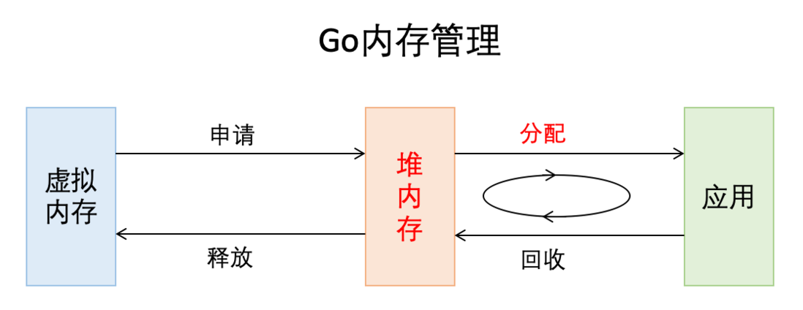
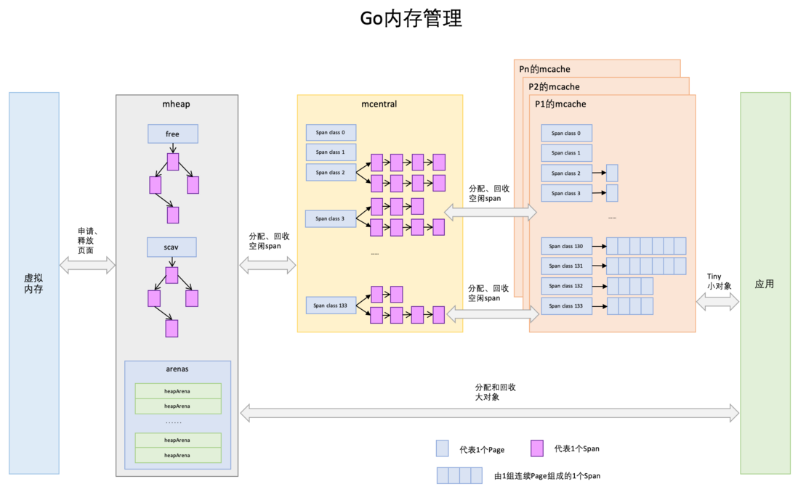
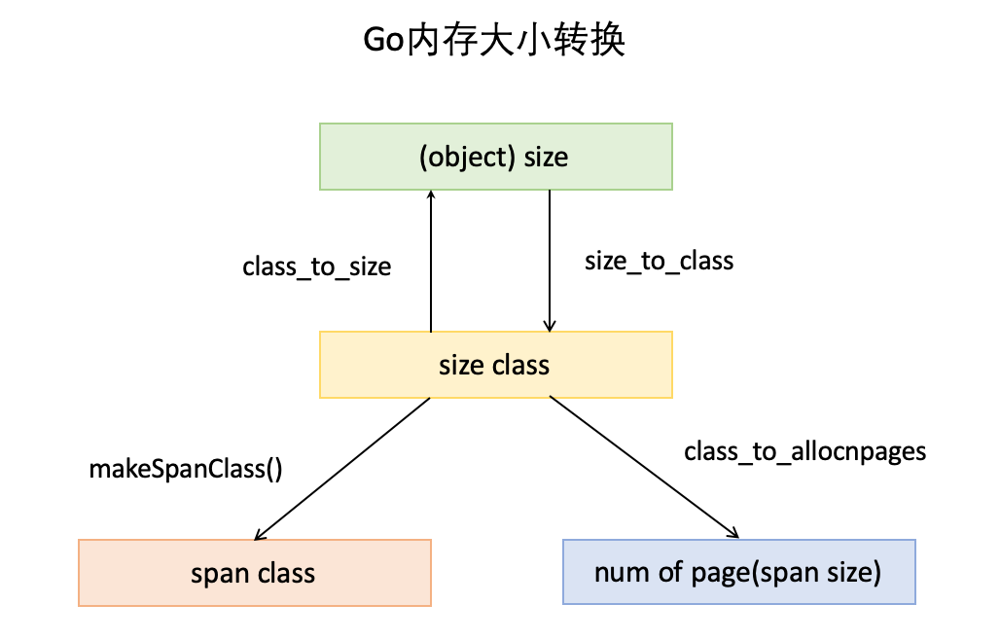
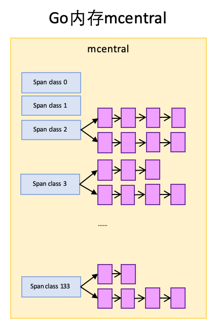
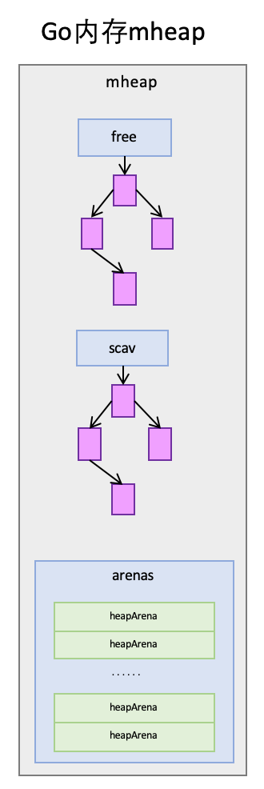
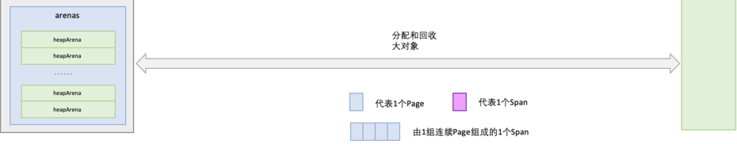

# 简介

Go 语言的内存分配器是一个非常复杂的系统，它负责管理 Go 程序运行时的内存分配和回收。


> 内存空间包含两个重要区域：栈区（Stack）和堆区（Heap）

- 函数调用的**参数**、**返回值**以及**局部变量**大都会被分配到栈上, 函数执行完成系统栈释放内存

- 堆中的对象由内存分配器分配, 由垃圾收集器回收内存。



# 内存分配器的基本原理

1. 最小的内存单位是 span, 最小为 8 KB(64位机器), 这个 span 中又可以根据大小划分多个不同的小块(size class)存放对象
2. 每个goroutine都有span用于存放对象, 叫做 mcache
3. 如果goroutine中的span不够了, 就要去控制器申请新的span, 也就是mcentral
4. 如果mcentral的span也不够了, 就去堆中申请, 也就是mheap
5. 超过32KB的大对象直接从堆中申请内存, 也就是heapArena


# 关键组件

1. page 页分配器 Page Allocator
    - 负责从操作系统请求物理页。
    - 页大小通常为 4KB。

2. span 块分配器 Span Allocator
    - Span 是一组连续的页，具有相同的大小。
    - Span 的大小范围从 8KB 到但不会超过 32KB。
    - Span 由 span 分配器管理，用于分配给用户程序。

3. object 对象分配器 Object Allocator
    - 对象分配器负责在 span 上分配对象。
    - 使用首次适应算法或其他简单算法来分配对象。

4. GC 垃圾回收器 Garbage Collector
    - 使用三色标记-清扫算法来回收不再使用的内存。
    - 周期性地运行以回收内存。

**先给大家上一幅宏观的图，借助图一起来介绍:**



## page: 蓝色小方块代表一个 Page 页

- x64下1个Page的大小是8KB。

## span: 紫色小方块代表一个 Span 块

- **Span是内存管理的基本单位**，源代码中是`mspan`, **一组连续的Page组成1个Span**

## mcache: 橙色大方块表示一个 goroutine 的内存缓存

- 一个 goroutine 组成的多个 Span 块的集合

- mcache保存的是各种大小的Span，并按Span class分类，小对象直接从mcache分配内存，它起到了缓存的作用，并且可以无锁访问

## mcentral: 黄色大方块表示所有 goroutine 内存缓存的中央控制中心

- 多个 goroiutine 组成的多个mcache 缓存的中央控制中心, 所有线程共享的缓存，需要加锁访问

- 它按Span class对Span分类，串联成链表, 当某个级别Span的内存被分配光时，它会向mcentral申请1个Span

## mheap: 淡紫色大方块表示堆

- **它是堆内存的抽象，把从OS申请出的内存页 page 组织成 span 块，并保存起来**。
- 当 mcentral 的 Span 块不够用时会向 mheap 申请，mheap的 span不够用时会向OS申请
- 向 OS 的内存申请是按 page 页来的，然后把申请来的内存页 page 生成 span 组织起来，同样也是需要加锁访问的。
    - mheap把Span组织成了树结构，而不是链表，并且还是2棵树，然后把Span分配到 heapArena 进行管理

# 大小转换

除了以上内存块组织概念，还有几个重要的大小概念，一定要拿出来讲一下，不要忽视他们的重要性，他们是内存分配、组织和地址转换的基础。

它会解释怎么将 page 页组合为 span, 程序又该通过什么来定位这些页的位置。



请注意, 这里是流程, 并不是一个4个元素组成的某个数据结构, 每一个元素都是一个相互隔离的有其意义的数据结构

## object size

- 指申请内存的对象大小。
- 例如，如果你需要分配一个 32 字节的数组，那么 `size` 就是 32 字节。

## size class

- 它是 `size` 的种类，用于分组相似大小的对象。**只是逻辑概念。**
- 例如，8 字节的对象可能属于 size class 1，16 字节的对象可能属于 size class 2，以此类推。
- Go 语言使用多个 size class 来管理不同大小的对象，以优化内存分配和回收。
- Size class 的数量通常是固定的，例如 Go 语言中通常定义了 128 个 size class。

## span class

- Span class 是 span 的种类，但 span class 的大小与 span 的大小并不是直接正比关系。**真正存对象的地方**
- 每个 size class 通常对应两个 span class，一个用于存放包含指针的对象，另一个用于存放不包含指针的对象。
- 包含指针的对象需要进行 GC 扫描，而不包含指针的对象则不需要。
- Span class 主要用来和 size class 做对应，1 个 size class 对应 2 个 span class。
- 2 个 span class 的 span 大小相同，但功能不同。

## num of page

- 代表 Page 的数量。**因为size class是逻辑的概念, 所以需要用num of page代表真正的span大小**
- 当找到了 size class，也就找到了 npage。
- npage 表示 span 包含的页数。
- 例如，size class 2（32 字节的对象）可能需要 4 个 page 页。

**这里看似有4个定义, 实际上我们只需要懂申请内存的时候, 是想通过计算此次需要的内存大小 size, 从而获取一个适合内存大小的span
**

- 首先, 我们需要简单判断这个对象是多大, 比如 60 字节 = 60 byte
- 然后我们就会像控制器获取 size class 4 = 64 字节的 span 链
- 我们就可以加对象保存到span了

# 寻找 span 的流程

1. **计算对象所需内存大小 (size)**:

    - 计算对象所需的内存大小，即对象的实际大小加上一些额外的空间（例如，对齐和头部信息）。

2. **根据 size 得到 size class 映射位置**:

    - 使用预先定义的大小类表来查找对象大小所属的 size class。
    - 例如，对于 32 字节的对象，它可能属于 size class 2。

3. **根据 size class 和对象是否包含指针计算出 span class**:

- 每个 size class 通常对应两个 span class，一个用于存放包含指针的对象，另一个用于存放不包含指针的对象。
    - 例如，对于 size class 2，如果对象包含指针，则使用 span class 4；如果不包含指针，则使用 span class 5。

4. **获取该 span class 指向的 span**:

    - 从 span pool 中获取一个可用的 span。
    - span pool 是一个缓存池，其中包含预先分配好的 span。

5. **找到一个空的页存放此对象**:

    - 在 span 中找到一个空闲的页来存放对象。
    - 页是 span 中的最小分配单位。

## 从span分配对象空间

Span可以按对象大小切成很多份最小为 32bit 的块(每一小块就是4个 8bit 的page页)


随着内存的分配，span中的对象内存块，有些被占用，有些未被占用

比如上图:

- 整体代表1个span
- **蓝色块**代表已被占用内存
- **绿色块**代表未被占用内存。

当分配内存时，只要快速找到第一个可用的绿色块，并计算出所处的内存地址即可。

## span没有空间怎么分配对象

- span内的所有内存块都被占用时，没有剩余空间继续分配对象

- mcache 内存缓存会向 mcentral 中央控制中心申请1个 span，mcache 拿到 span 后继续分配对象。

## mcentral向mcache提供span

mcentral由一个数组 spanSet 控制sapn

```go
partial   [2]spanSet // 包含两个 spanSet，分别用于存放清扫过的和未清扫过的在用 span
```

- 当需要从 `partial` 中取出一个 span 进行分配时，**优先从清扫过的 span 集合中取出**，因为这些 span 已经经过了清扫，可以直接用于分配新的对象。
- 如果清扫过的 span 集合中没有可用的 span，那么就会**从未清扫过的 span 集合中取出 span**，并进行清扫，然后用于分配。



## mheap的span管理

mheap 里保存了2棵**二叉排序树**，按span的page数量进行排序：

- `free`：free 中保存的 span 是空闲并且非垃圾回收的 span。

- `scav`：scav 中保存的是空闲并且已经垃圾回收的 span。

如果是**小对象的垃圾回收**导致的span释放，span会被加入到`scav`，否则加入到`free`。



刚刚特别提到了`scav`是小对象垃圾回收的区域, 那么就有大对象垃圾回收的区域。

mheap中还有 arenas，有一组heapArena组成，这个主要是**大对象垃圾回收服务**。



## mcentral向mheap要span

- 如果`emtpy`里也没有符合条件的span，mcentral 会向 mheap 申请 span。
- mcentral 需要向 mheap **提供需要的内存页数和span class级别**，然后它优先从`free`中搜索可用的span
- 如果没有找到，会从`scav`中搜索可用的span
- 如果还没有找到，它会向OS申请内存，再重新搜索2棵树，必然能找到span。
    - 如果找到的span比需求的span大，则把span进行分割成2个span
    - 其中1个刚好是需求大小，把剩下的span再加入到`free`中去
    - 然后设置需求span的基本信息，然后交给mcentral

## mheap向OS申请内存

- 当 mheap 没有足够的内存时

- mheap 会向OS申请内存，把申请的内存页保存到span，然后把span插入到`free`树 。

- 在32位系统上，mheap 还会预留一部分空间，当 mheap 没有空间时，先从预留空间申请，如果预留空间内存也没有了，才向OS申请。

# 分配内存流程总结

1. size > 32K，则使用 mheap 分配

2. size < 16 byte，使用 mcache 的小对象分配器 tiny 直接分配（tiny 就是一个指针）

3. size > 16 byte && size <=32K byte 时，先使用 mcache 中对应的 size class 分配。

4. 如果 mcache 对应的 size class 的 span 已经没有可用的块，则向 mcentral 请求

5. 如果 mcentral 也没有可用的块，则向 mheap 申请，并切分

6. 如果 mheap 也没有合适的 span，则向操作系统申请

# 源码(未完成)

## 数据结构

### mheap堆

`src/runtime/mheap.go`

```go
// 主内存分配堆。为下层MCentral和MCache提供内存服务。他管理的基本单位是MSpan
// 堆本身是 "free" 和 "scav" 数据结构，
// 但是其他全局数据也在这里。
//
// mheap 必须不是堆分配的，因为它包含 mSpanLists，
// 这些列表必须不是堆分配的。
type mheap struct {
	_ sys.NotInHeap

	lock     mutex     // 必须只在系统栈上获取，否则可能会自我死锁，如果持有锁时栈增长。
	pages    pageAlloc // 页面分配数据结构
	sweepgen uint32    // 扫描代，见 mspan 注释；在 STW 期间写入
	allspans []*mspan  // 所有已存在的 span

	pagesInUse         atomic.Uintptr // 已使用 span 的页面数
	pagesSwept         atomic.Uint64  // 本次扫描周期已扫描的页面数
	pagesSweptBasis    atomic.Uint64  // 作为比例扫描比率原点的 pagesSwept
	sweepHeapLiveBasis uint64         // 作为比例扫描比率原点的 gcController.heapLive
	sweepPagesPerByte  float64        // 比例扫描比率；在持有锁时写入，在不持有锁时读取

	// 页面回收器状态

	reclaimIndex  atomic.Uint64  // allArenas 中下一个要回收的页面的索引
	reclaimCredit atomic.Uintptr // 由于页面回收器以大块工作，可能会回收超过请求的页面数。多余释放页面都会进入这个信用池。

	arenas          [1 << arenaL1Bits]*[1 << arenaL2Bits]*heapArena // 是堆区域映射。它指向整个可用虚拟地址空间中
	arenasHugePages bool                                            // 表示 arenas 的 L2 条目是否有资格被巨大页面支持。

	heapArenaAlloc linearAlloc // 是预保留的空间，用于分配 heapArena 对象。
	arenaHints     *arenaHint  //  是一个列表，包含尝试添加更多堆区域的地址。
	arena          linearAlloc // 是预保留的空间，用于分配 heap 区域（实际的区域）。这仅在 32 位上使用。
	allArenas      []arenaIdx  // 是每个已映射区域的 arenaIndex。这可以用来遍历地址空间。
	sweepArenas    []arenaIdx  // 是在扫描周期开始时对 allArenas 的快照。
	markArenas     []arenaIdx  // 是在标记周期开始时对 allArenas 的快照。

	// 是堆当前正在增长的区域。
	// 这应该是 physPageSize 对齐的。
	curArena struct {
		base, end uintptr
	}

	// 中央自由列表用于小型 size 类。
	// 填充确保 mcentrals 间隔 CacheLinePadSize 字节，
	// 这样每个 mcentral.lock 都有自己的缓存行。
	// central 由 spanClass 索引。
	central [numSpanClasses]struct {
		mcentral mcentral
		pad      [(cpu.CacheLinePadSize - unsafe.Sizeof(mcentral{})%cpu.CacheLinePadSize) % cpu.CacheLinePadSize]byte
	}

	spanalloc              fixalloc // span* 的固定分配器
	cachealloc             fixalloc // mcache* 的固定分配器
	specialfinalizeralloc  fixalloc // specialfinalizer* 的固定分配器
	specialprofilealloc    fixalloc // specialprofile* 的固定分配器
	specialReachableAlloc  fixalloc // specialReachable 的固定分配器
	specialPinCounterAlloc fixalloc // specialPinCounter 的固定分配器
	speciallock            mutex    // special 记录分配器的锁
	arenaHintAlloc         fixalloc // arenaHint 的固定分配器

	// 用户区域状态。
	//
	// 受 mheap_.lock 保护。
	userArena struct {
		// 是一个列表，包含尝试添加更多堆区域
		// 用于用户区域块的地址。这最初用一组通用提示地址填充，
		// 并随着实际堆区域范围的增长而扩展。
		arenaHints *arenaHint

		// 是一个列表，包含已被设置为故障但
		// 正在等待所有指向它们的指针消失的用户区域 span。
		// 扫描处理识别何时为真，并将 span 移动到就绪列表。
		quarantineList mSpanList

		// 是一个列表，包含为空的用户区域 span，已准备好重用。
		readyList mSpanList
	}

	unused *specialfinalizer // 未使用，只是为了将 specialfinalizer 类型引入 DWARF。
}
```

### mspan内存中的一个连续的内存段

`src/runtime/mheap.go`

```go
// 结构体表示内存中的一个连续的内存段。
// 每个 span 都包含一定数量的连续页面。
type mspan struct {
	_ sys.NotInHeap

	// 链表相关字段
	next *mspan     // 下一个 span 在列表中的指针，或 nil 如果没有下一个
	prev *mspan     // 上一个 span 在列表中的指针，或 nil 如果没有上一个
	list *mSpanList // 用于调试。TODO: 删除

	// span 的起始地址和页面数量
	startAddr uintptr // span 中第一个字节的地址
	npages    uintptr // span 中的页面数量

	// 用于 mSpanManual spans 的空闲对象列表
	manualFreeList gclinkptr // mSpanManual spans 中空闲对象的列表

	// freeindex 和 allocBits 相关字段
	// freeindex 是在 0 和 nelems 之间的槽索引，用于开始扫描
	// span 中的下一个空闲对象。
	// 每次分配都会从 freeindex 开始扫描 allocBits 直到遇到 0，
	// 表示找到一个空闲对象。freeindex 随后会被调整，以便后续扫描从
	// 新发现的空闲对象之后开始。
	//
	// 如果 freeindex == nelem，表示 span 中没有空闲对象。
	//
	// allocBits 是 span 中对象的位图。
	// 如果 n >= freeindex 且 allocBits[n/8] & (1<<(n%8)) 为 0，
	// 则表示对象 n 是空闲的；
	// 否则，对象 n 已分配。从 nelem 开始的位是未定义的，不应引用。
	freeindex uintptr
	// TODO: 从 sizeclass 查找 nelems 并移除此字段如果这样做有助于性能。
	nelems uintptr // span 中的对象数量

	// allocCache 是 allocBits 在 freeindex 的缓存。
	// allocCache 通过移位使得最低位对应于 freeindex。
	// allocCache 存储 allocBits 的补码，允许 ctz (计数尾部零) 直接使用它。
	// allocCache 可能包含 s.nelems 之外的位；调用者必须忽略这些位。
	allocCache uint64

	// allocBits 和 gcmarkBits 指向 span 的标记位和分配位。
	// 指针为 8 字节对齐。
	// 有三个区域用于保存这些数据：
	// free: 脏区域，不再被访问，可以重用。
	// next: 用于下一次 GC 周期的数据。
	// current: 当前 GC 周期中正在使用的数据。
	// previous: 上一次 GC 周期中使用的数据。
	// 新的 GC 周期从 finishsweep_m 调用开始。
	// finishsweep_m 将 previous 区域移动到 free 区域，
	// 将 current 区域移动到 previous 区域，
	// 并将 next 区域移动到 current 区域。
	// next 区域在 span 请求用于下一次 GC 周期的 gcmarkBits
	// 以及新分配 span 的 allocBits 时被填充。
	//
	// 指针运算通过手工完成而不是使用数组，
	// 以避免关键性能路径上的边界检查。
	// 清扫会释放旧的 allocBits 并将 allocBits 设置为 gcmarkBits。
	// gcmarkBits 会被替换为新鲜的清零内存。
	allocBits  *gcBits
	gcmarkBits *gcBits
	pinnerBits *gcBits // 用于固定对象的位图；原子访问

	// 扫描代：
	// 如果 sweepgen == h->sweepgen - 2，span 需要清扫
	// 如果 sweepgen == h->sweepgen - 1，span 正在清扫
	// 如果 sweepgen == h->sweepgen，span 已清扫并准备好使用
	// 如果 sweepgen == h->sweepgen + 1，span 在清扫开始前被缓存并且仍然被缓存，需要清扫
	// 如果 sweepgen == h->sweepgen + 3，span 已清扫然后被缓存并且仍然被缓存
	// h->sweepgen 在每次 GC 后增加 2

	sweepgen              uint32
	divMul                uint32        // 除以 elemsize 的乘法因子
	allocCount            uint16        // 已分配的对象数量
	spanclass             spanClass     // 大小类别和 noscan 标志（uint8）
	state                 mSpanStateBox // mSpanInUse 等；原子访问（get/set 方法）
	needzero              uint8         // 在分配前需要清零
	isUserArenaChunk      bool          // span 是否代表用户区域
	allocCountBeforeCache uint16        // span 缓存之前 allocCount 的副本
	elemsize              uintptr       // 从 sizeclass 或 npages 计算得出
	limit                 uintptr       // span 中数据的结束位置
	speciallock           mutex         // 保护 specials 列表和 pinnerBits 的更改
	specials              *special      // 按偏移排序的特殊记录的链表
	userArenaChunkFree    addrRange     // 用于管理块分配的区间

	// freeIndexForScan 类似于 freeindex，但 freeindex 由分配器使用，
	// 而 freeIndexForScan 由 GC 扫描器使用。
	// 它们是两个字段，以便 GC 在对象和堆位初始化时看到对象已分配
	// （参见 mallocgc 中 freeIndexForScan 的赋值，以及 issue 54596）。
	freeIndexForScan uintptr
}
```

### mcentral中央列表

`src/runtime/mcentral.go`

```go
// 中央列表，包含特定大小的空闲对象。
type mcentral struct {
	_         sys.NotInHeap
	spanclass spanClass  // span 的大小类别
	partial   [2]spanSet // 包含两个 spanSet，分别用于存放清扫过的和未清扫过的在用 span
	full      [2]spanSet // 包含两个 spanSet，分别用于存放清扫过的和未清扫过的完全使用的 span
}
```

**`partial` 字段**

- `partial` 字段包含两个 `spanSet`，分别用于存放清扫过的和未清扫过的在用 span。
- 这里的“在用”指的是 span 中还有空闲对象，也就是说，这个 span 中还有一些未被分配的内存空间。
- `partial` 的两个 `spanSet` 通过 `sweepgen` 的值来确定哪个是清扫过的 span 集合，哪个是未清扫过的 span 集合。
- `sweepgen` 在每个垃圾回收周期结束后会增加 2。这意味着在一个周期中，清扫过的 span 集合是 `partial[sweepgen/2%2]`，而未清扫过的
  span 集合则是 `partial[1-sweepgen/2%2]`。
- 当需要从 `partial` 中取出一个 span 进行分配时，优先从清扫过的 span 集合中取出，因为这些 span 已经经过了清扫，可以直接用于分配新的对象。
- 如果清扫过的 span 集合中没有可用的 span，那么就会从未清扫过的 span 集合中取出 span，并进行清扫，然后用于分配。

**`full` 字段**

- `full` 字段同样包含两个 `spanSet`，分别用于存放清扫过的和未清扫过的完全使用的 span。
- “完全使用”意味着 span 中没有空闲对象，也就是说，这个 span 中的所有内存空间都已经分配给了对象。
- `full` 的两个 `spanSet` 也是通过 `sweepgen` 的值来区分清扫过的和未清扫过的完全使用的 span。
- 在清扫过程中，如果发现一个 span 中所有的对象都还活着，那么这个 span 会被移动到清扫过的完全使用的 span 集合中。
- 当一个 span 从 `partial` 的清扫过的 span 集合中被取出并分配完所有空闲对象后，它会被移动到清扫过的完全使用的 span 集合中。

### mcache小对象缓存

`src/runtime/mcache.go`

```go
// 每线程（在 Go 中，每 P）的小对象缓存。
// 这包括一个小对象缓存和本地分配统计信息。
// 无需锁定，因为它是一个线程局部的缓存。
//
// mcaches 从非 GC 内存分配，因此任何堆指针都需要特别处理。
type mcache struct {
	_ sys.NotInHeap

	// 以下成员在每次分配时都会被访问，
	// 因此它们被放在一起以提高缓存性能。

	nextSample uintptr // 分配这么多字节后触发堆采样,下一次触发堆采样的阈值
	scanAlloc  uintptr // 分配的可扫描堆字节数

	// 用于无指针的小对象的分配器缓存。
	// 请参阅 malloc.go 中的“Tiny 分配器”注释。

	tiny       uintptr // 指向当前 tiny 块的开头，如果没有当前 tiny 块则为 nil。
	tinyoffset uintptr //  当前 tiny 块中已分配的偏移量。
	tinyAllocs uintptr // 是拥有这个 mcache 的 P 执行的 tiny 分配次数。

	// 以下成员不在每次分配时访问。

	alloc      [numSpanClasses]*mspan         // 用于存储不同大小类别的 span，方便快速分配
	stackcache [_NumStackOrders]stackfreelist // 栈缓存，用于管理栈分配的空闲列表

	// 表示此 mcache 最后一次刷新时的 sweepgen。
	// 如果 flushGen != mheap_.sweepgen，则表示此 mcache 中的 span 已过时，
	// 需要刷新以便清扫。这在 acquirep 中完成。
	flushGen atomic.Uint32
}
```

