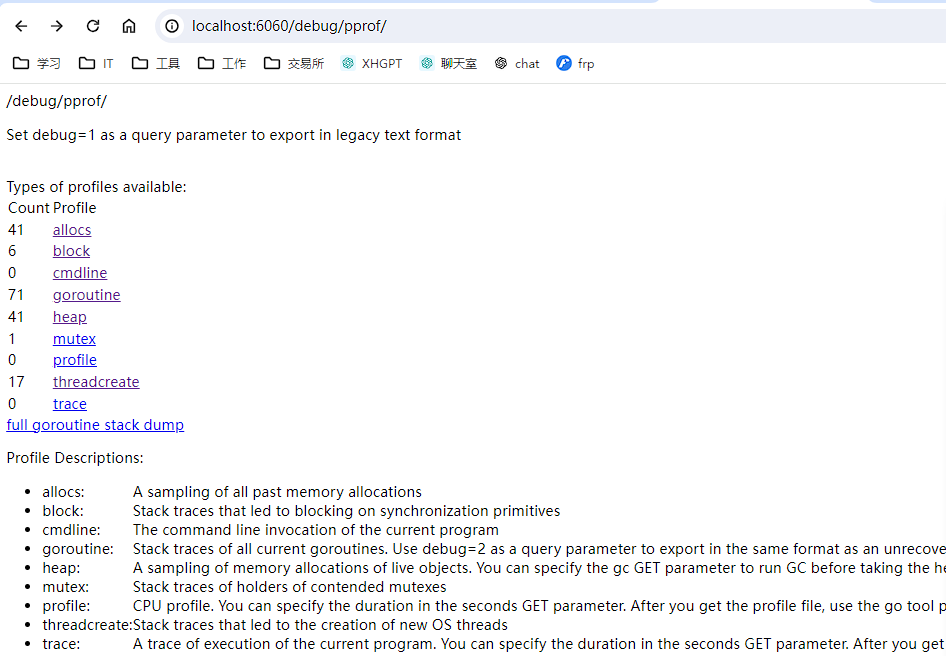
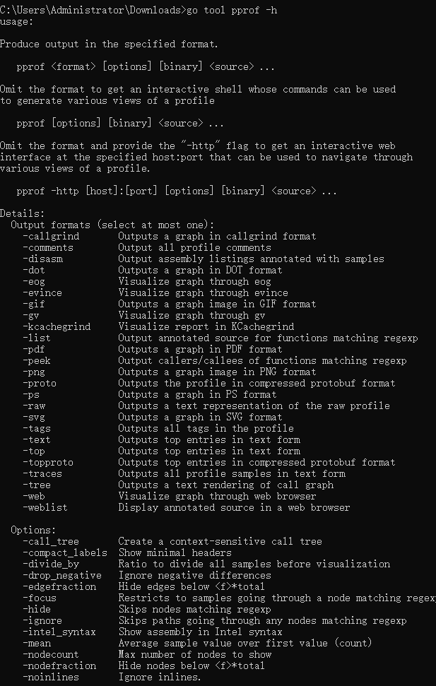
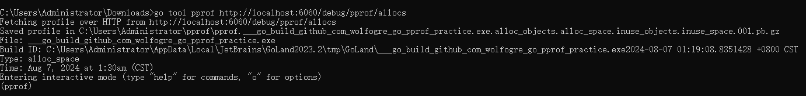
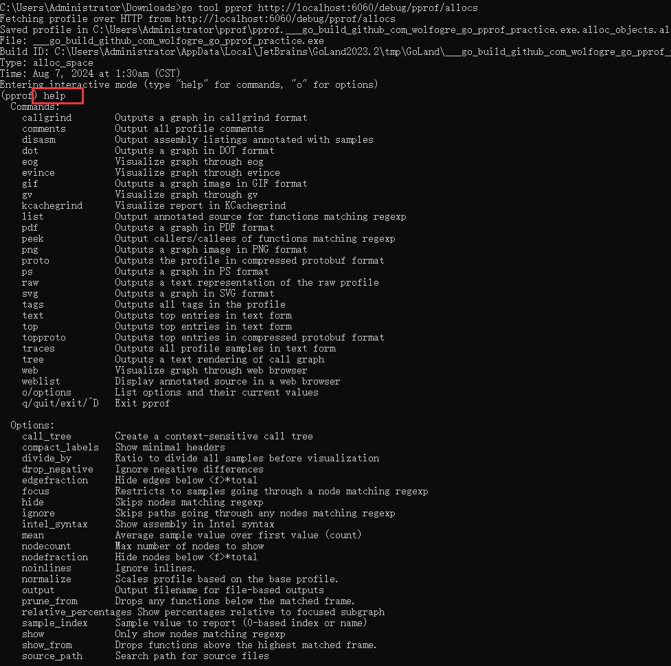
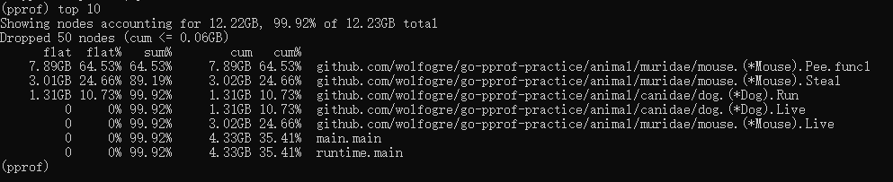
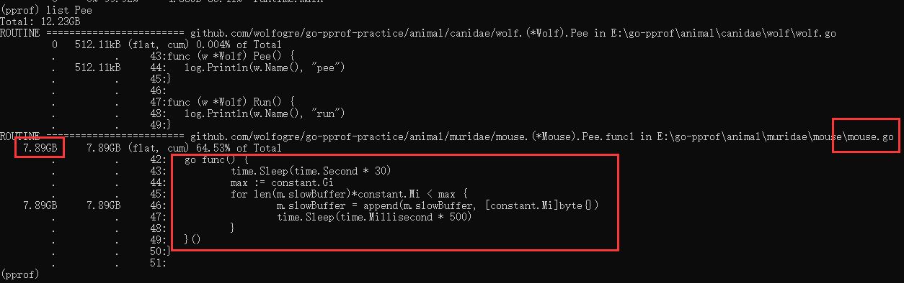
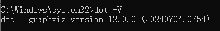
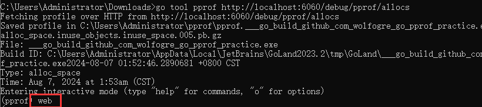
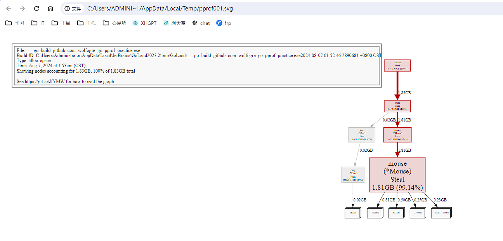

# 关注的性能指标

- CPU 使用情况
- 内存 使用情况
- I/O 使用情况
- goroutine 使用情况: 阻塞
- 锁 使用情况: 死锁

# 工具

## `pprof`性能分析工具包

示例: `https://github.com/luode0320/go-pprof.git`

```go
package main

import (
	"log"
	"net/http"
	_ "net/http/pprof"
	"os"
	"runtime"
	"time"

	"github.com/wolfogre/go-pprof-practice/animal"
)

func main() {
	log.SetFlags(log.Lshortfile | log.LstdFlags)
	log.SetOutput(os.Stdout)

	runtime.SetMutexProfileFraction(1) // 开启锁跟踪
	runtime.SetBlockProfileRate(1)     // 开启阻塞跟踪

	// 通过web采集: http://localhost:6060/debug/pprof/
	go func() {
		if err := http.ListenAndServe(":6060", nil); err != nil {
			log.Fatal(err)
		}
		os.Exit(0)
	}()

	for {
		for _, v := range animal.AllAnimals {
			v.Live()
		}
		time.Sleep(time.Second)
	}
}
```



## go自带性能分析工具

cmd命令行执行

```cmd
go tool pprof -h
```



# 使用

## 进入命令行交互

```cmd
go tool pprof http://localhost:6060/debug/pprof/allocs // 所有情况
go tool pprof http://localhost:6060/debug/pprof/block // 阻塞情况
go tool pprof http://localhost:6060/debug/pprof/goroutine // goroutine情况
go tool pprof http://localhost:6060/debug/pprof/heap // 堆情况
go tool pprof http://localhost:6060/debug/pprof/mutex // 锁情况
go tool pprof http://localhost:6060/debug/pprof/profile // cpu情况
go tool pprof http://localhost:6060/debug/pprof/threadcreate // 线程创建情况
go tool pprof http://localhost:6060/debug/pprof/trace // 线程创建情况
```



## `help`: 帮助指令

```sh
callgrind:	输出调用图（call graph）到 Callgrind 格式。
comments:	输出所有的性能分析注释。
disasm:		输出带有样本注解的汇编代码清单。
dot:		输出调用图到 DOT 图形格式。
eog:		使用 eog 查看器可视化图形。
evince:		使用 evince 查看器可视化图形。
gif:		输出调用图到 GIF 图像格式。
gv:			使用 gv 查看器可视化图形。
kcachegrind:使用 KCachegrind 可视化报告。
list:		输出与正则表达式匹配的函数的带注解的源代码。
pdf:		输出调用图到 PDF 格式。
peek:		输出与正则表达式匹配的函数的调用者和被调用者。
png:		输出调用图到 PNG 图像格式。
proto:		输出性能分析数据到压缩的 Protocol Buffers 格式。
ps:			输出调用图到 PostScript (PS) 格式。
raw:		输出原始性能分析数据的文本表示。
svg:		输出调用图到 SVG 格式。
tags:		输出性能分析中的所有标签。
text:		输出排名靠前的条目到文本格式。
top:		输出排名靠前的条目到文本格式（与 text 命令相同）。
topproto:	输出排名靠前的条目到压缩的 Protocol Buffers 格式。
traces:		输出所有性能分析样本到文本格式。
tree:		输出调用图的文本渲染。
web:		通过 Web 浏览器可视化图形。
weblist:	在 Web 浏览器中显示带注解的源代码。
o/options:	列出选项及其当前值。
q/quit/exit/^D:退出 pprof。
```

## `top`: 查看前10条, 内存倒序

- **flat**: 函数自身允许资源消耗
- **flat%**: 消耗百分比
- **Sum%**: 资源消耗总和
- **Cum**: 当前函数加上它所有调用栈允许总消耗
- **Cum%**: 消耗百分比
- **堆栈**

### `gc`: 分析gc暂停时间

## `list`: 看指定源代码内存占用



## `web`: 下载svg

`Graphviz` 是一个用于绘制图形和网络图的工具，`pprof` 使用 `Graphviz` 的 `dot` 工具来生成可视化的火焰图和其他类型的图表。

#### 1. 安装 `Graphviz`

确保您已经安装了 `Graphviz`。以下是在不同操作系统上安装 `Graphviz` 的方法：

- **Ubuntu/Debian**

```bash
sudo apt-get update
sudo apt-get install graphviz
```

- **CentOS/RHEL**

```bash
sudo yum install graphviz
```

- **macOS** (使用 Homebrew)

```bash
brew install graphviz
```

- **Windows**
    - 访问 [Graphviz 官方网站](https://graphviz.org/download/) 下载 Windows 安装包。
    - 安装后，确保将 `Graphviz` 的安装目录添加到系统的 `PATH` 环境变量中。

#### 2. 添加 `Graphviz` 到 `PATH`

确保 `Graphviz` 的 `dot` 可执行文件位于系统路径中。通常，安装完成后 `dot` 会在某个目录下，例如 `/usr/bin`
或 `/usr/local/bin`。

**Linux/macOS**: 如果 `dot` 不在默认路径中，您可以通过以下命令找到它：

```bash
which dot
```

如果找不到，您需要手动将 `dot` 的路径添加到 `PATH` 中。例如，如果 `dot` 的路径是 `/usr/local/bin/dot`
，您可以编辑 `~/.bashrc` 或 `~/.zshrc` 文件（取决于您使用的 shell），并添加以下行：

```bash
export PATH=/usr/local/bin:$PATH
```

然后运行 `source ~/.bashrc` 或 `source ~/.zshrc` 使更改生效。

**Windows**: 如果您在 Windows 上安装了 `Graphviz`，请确保将 `Graphviz` 的安装目录添加到 `PATH`
环境变量中。通常安装过程中会有提示是否添加到 `PATH`，如果没有，您需要手动添加。

#### 测试 `Graphviz` 是否正确安装

```bash
dot -V
```



#### 下载svg



- 浏览器自动打开



- 框框越大, 线越粗, 问题越大

# 总结

操作方式很简单。

1. 选择一个分析的情况命令行进入

```sh
go tool pprof http://localhost:6060/debug/pprof/allocs // 所有情况
go tool pprof http://localhost:6060/debug/pprof/block // 阻塞情况
go tool pprof http://localhost:6060/debug/pprof/goroutine // goroutine情况
go tool pprof http://localhost:6060/debug/pprof/heap // 堆情况
go tool pprof http://localhost:6060/debug/pprof/mutex // 锁情况
go tool pprof http://localhost:6060/debug/pprof/profile // cpu情况
go tool pprof http://localhost:6060/debug/pprof/threadcreate // 线程创建情况
go tool pprof http://localhost:6060/debug/pprof/trace // 线程创建情况
```

2. `top`命令查看情况最差的前10个
3. `list`命令查看指定源码的方法位置
4. `web`命令直接查看svg图

