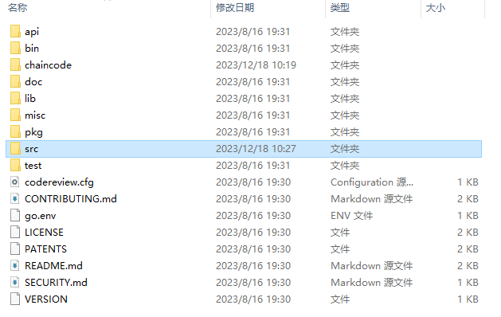

# 简介

在 Go 语言中，`GOROOT` 和 `GOPATH` 是两个非常重要的环境变量，它们分别指定了 Go 语言的安装路径和工作区的路径。

# GOROOT

`GOROOT` 是 Go 语言的安装目录。当你安装 Go 语言时，它的标准库、编译器和工具链都会被安装在这个目录下。`GOROOT` 主要有以下几个用途：

1. **指定 Go 语言的安装位置**:
   - 它告诉系统 Go 语言的标准库和其他工具所在的位置。
   - 编译器和其他工具（如 `go build`, `go run` 等）需要知道这些工具的位置。
2. **标准库的位置**:
   - `GOROOT` 下的 `src` 目录包含了 Go 标准库的源代码。
3. **编译器和工具的位置**:
   - `GOROOT` 下的 `bin` 目录包含了 Go 语言的编译器和工具链。
4. **环境变量路径**:
   - 通常你需要将 `GOROOT/bin` 添加到系统的 `PATH` 环境变量中，这样你就可以在命令行中直接使用 Go 的命令了。

# GOPATH

`GOPATH` 是 Go 语言的工作区路径。`GOPATH` 有以下特点：

1. **工作区结构**:
   - GOPATH通常包含三个主要的子目录：
     - `src`: 存放源代码。
     - `pkg`: 存放编译后的包文件（`.a` 文件）。
     - `bin`: 存放编译后的可执行文件。

2. **依赖管理**:
   - 第三方包和依赖通常被放置在 `GOPATH/src` 下面，遵循特定的目录结构，比如 `GOPATH/src/github.com/username/projectname`

3. **构建和编译**:
   - 使用 `go build` 或 `go install` 构建的应用程序会被放置在 `GOPATH/bin` 目录下

4. **环境变量路径**:
   - 通常也需要将 `GOPATH/bin` 添加到系统的 `PATH` 环境变量中，这样你可以运行构建好的可执行文件。

# GOROOT 与 GOPATH 的区别

1. **目的不同**:
   - `GOROOT` 是 Go 语言本身的标准库和工具链的安装目录。
   - `GOPATH` 是用户的工作区目录，用于存放自己的项目、第三方库和构建的二进制文件。
2. **使用场景**:
   - `GOROOT` 用于编译器和标准库。
   - `GOPATH` 用于用户的项目和第三方库。
3. **结构不同**:
   - `GOROOT` 结构固定，包含了标准库的源代码、编译器和工具。
   - `GOPATH` 结构更灵活，可以有多个 `GOPATH`，并且可以定制 `src`, `pkg`, `bin` 的位置。
4. **环境变量**:
   - `GOROOT` 是固定的，通常只有一个。
   - `GOPATH` 可以设置多个，从 Go 1.8 开始，可以通过设置多个路径来指定多个工作区。

# Go Modules

随着 Go 1.11 引入的 Go Modules，`GOPATH` 的使用已经不再是必需的。

Go Modules 提供了一种新的依赖管理方式，允许每个项目都有自己的依赖关系，不再需要全局的 `GOPATH`。

`GOPATH` 的使用正在逐渐减少，特别是在采用了 Go Modules 的项目中。

### Go Modules 的主要用途

1. **依赖隔离**:
   - Go Modules 允许每个项目独立管理其依赖关系。
   - 项目可以在其目录中包含所有必需的依赖包，而不需要依赖全局的 `GOPATH`。
2. **版本控制**:
   - Go Modules 支持依赖包的版本控制。
   - 通过 `go.mod` 文件指定依赖的具体版本，确保每次构建使用相同的版本，从而提高构建的可重复性和稳定性。
3. **透明性**:
   - 依赖包的版本被明确记录在 `go.mod` 文件中，使得依赖关系清晰可见。
   - 这有助于团队成员了解项目的依赖，并且方便在不同环境中复现构建过程。
4. **易于使用**:
   - Go Modules 提供了简单易用的命令来管理依赖，例如 `go get`, `go mod init`, `go mod tidy`, `go mod vendor` 等。
   - 这些命令可以帮助自动化依赖的下载、更新和清理过程。
5. **构建速度**:
   - 通过缓存依赖和优化构建过程，Go Modules 可以加快构建速度。
   - 依赖包一旦下载到本地缓存，就不需要每次都重新下载。
6. **跨项目共享**:
   - Go Modules 支持跨项目共享依赖，这意味着多个项目可以共享同一个依赖树，减少磁盘空间占用。

### 使用 Go Modules 的步骤

1. **初始化模块**:
   - 使用 `go mod init <module-name>` 初始化一个新的模块。这会在项目根目录下创建一个 `go.mod` 文件。
2. **添加依赖**:
   - 当你第一次使用 `go get` 下载一个依赖包时，它会被自动添加到 `go.mod` 文件中，并记录版本信息。
3. **更新依赖**:
   - 使用 `go get -u` 更新依赖到最新版本。
   - 使用 `go get <module-name>@version` 可以手动指定依赖版本。
4. **清理无用依赖**:
   - 使用 `go mod tidy` 清理不再使用的依赖，并更新 `go.mod` 文件。
   - 使用 `go mod clean` 清除下载的模块缓存。
5. **验证依赖**:
   - 使用 `go mod verify` 检查模块依赖的有效性。
6. **生成 vendored 依赖**:
   - 使用 `go mod vendor` 可以将依赖复制到项目的 `vendor` 目录中，便于离线构建或版本控制。