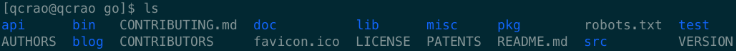
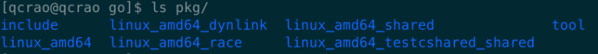
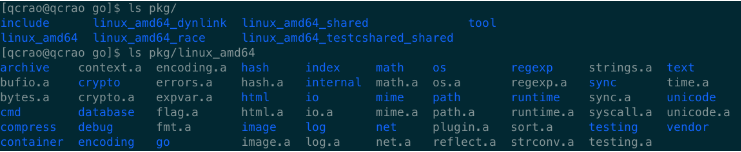
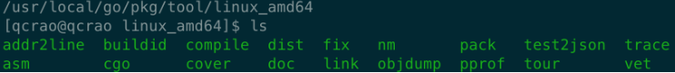

GoRoot 是 Go 的安装路径。mac 或 unix 是在 `/usr/local/go` 路径上，来看下这里都装了些什么：



bin 目录下面：



pkg 目录下面：



Go 工具目录如下，其中比较重要的有编译器 `compile`，链接器 `link`：



GoPath 的作用在于提供一个可以寻找 `.go` 源码的路径，它是一个工作空间的概念，可以设置多个目录。Go 官方要求，GoPath
下面需要包含三个文件夹：

```shell
src
pkg
bin
```

src 存放源文件，pkg 存放源文件编译后的库文件，后缀为 `.a`；bin 则存放可执行文件。