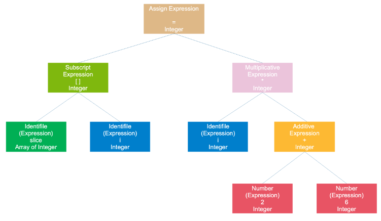

# 简介

Go 语言的编译和链接过程是一个多阶段的过程，涉及到多个工具和步骤。


Go 源码里的编译器源码位于 `src/cmd/compile` 路径下，链接器源码位于 `src/cmd/link` 路径下。


# 概述

### 编译阶段

1. **预处理**:
   - 在编译之前，Go 语言源代码文件会被预处理器处理，这包括处理 `import` 语句、去除注释等。
2. **词法分析和语法分析**:
   - Go 编译器会对源代码进行词法分析，将其分解成一系列的标记（tokens）。
   - 然后，编译器会进行语法分析，将标记转换成抽象语法树（AST）。
3. **类型检查**:
   - 编译器会对 AST 进行类型检查，确保所有的类型使用都是合法的。
   - 这一步还包括常量计算、逃逸分析等。
4. **代码生成**:
    - 编译器将 AST 转换成中间代码或机器代码`.o` 文件。
    - 对于标准库中的包，Go 编译器可能会直接使用预先编译好的标准库 `.a` 文件。
5. **优化**:
   - 编译器会对生成的代码进行优化，以提高执行效率。


### 链接阶段

1. **符号解析**:

    - 链接器负责解析各个编译单元间的符号引用，确保所有引用都能正确解析到定义。
2. **重定位**:
   - 链接器将各个编译单元合并成一个可执行文件或库文件。
   - 它还会处理地址重定位，确保所有符号引用的地址正确。
3. **最终优化**:

    - 在链接阶段，可能还会进行一些额外的优化，例如死代码消除（Dead Code Elimination, DCE）。
4. **生成可执行文件**:

    - 链接完成后，生成最终的可执行文件或库文件。

**链接阶段是将各个编译单元（即编译后的 `.o` 文件）组合成一个完整的可执行文件或库文件的过程**

### 具体步骤

1. **编译单个文件**:

   - 使用 `go tool compile` 或 `go build` 命令，将每个 Go 源文件编译成 `.o` 文件（目标文件）。

2. **编译标准库**:

   - 如果使用了标准库中的包，Go 编译器会从标准库中加载预先编译好的 `.a` 文件（静态库文件）。

3. **编译用户定义的包**:

   - 用户定义的包也会被编译成 `.o` 文件。

4. **链接**:

   - 使用 `go tool link` 或 `go build` 命令，将所有 `.o` 文件链接成最终的可执行文件。
   - 这一步还可能包括将标准库的 `.a` 文件链接进来。

   

### 使用 `go build` 或 `go install` 的过程

当你使用 `go build` 或 `go install` 命令时，Go 工具链会自动执行上述的所有步骤。具体来说：

1. **编译源代码**:
   - `go build` 或 `go install` 会调用编译器将源代码编译成 `.o` 文件。
2. **链接**:
   - 然后调用链接器将 `.o` 文件以及标准库的 `.a` 文件链接成可执行文件。
3. **可执行文件的生成**:
   - 最终生成可执行文件，通常位于 `GOPATH/bin` 目录下，或者根据当前目录结构放置。


# 编译过程

**编译器是将高级语言翻译成机器语言的一个工具，编译过程一般分为 4 步：**

词法分析、语法分析、语义分析、代码生成。


# 1.词法分析

词法分析是编译过程的第一步，它负责将源代码文本转换为一系列的词法单元（tokens）。

这些词法单元随后会被语法分析器用来构建抽象语法树 (Abstract Syntax Tree, AST)，这是后续编译阶段的基础。

### 词法分析的主要任务

1. **标识符识别**：
   - 识别变量名、函数名等标识符。
2. **关键字识别**：
   - 识别如 `func`, `var`, `if`, `else`, `for` 等关键字。
3. **字面量识别**：
   - 识别整数、浮点数、字符串和布尔值等字面量。
4. **运算符和分隔符识别**：
   - 识别加号 `+`、减号 `-`、乘号 `*` 等运算符。
   - 识别括号 `()`, 大括号 `{}`, 分号 `;`, 逗号 `,` 等分隔符。
5. **注释去除**：
   - 移除单行注释 (`//`) 和多行注释 (`/* */`)。
6. **错误检测**：
   - 报告词法错误，如非法字符。

### 词法分析器的工作流程

1. **读取源文件**：
   - 词法分析器从源文件中逐字符读取。
2. **构建词法单元**：
   - 当它识别出一个完整的词法单元时，会创建相应的词法单元对象。
3. **输出词法单元流**：
   - 词法单元按顺序输出给语法分析器。


### 例如

```golang
slice[i] = i * (2 + 6)
```

总共包含 16 个非空字符，经过扫描后

| 记号    | 类型   |
|-------|------|
| slice | 标识符  |
| [     | 左方括号 |
| i     | 标识符  |
| ]     | 右方括号 |
| =     | 赋值   |
| i     | 标识符  |
| *     | 乘号   |
| (     | 左圆括号 |
| 2     | 数字   |
| +     | 加号   |
| 6     | 数字   |
| )     | 右圆括号 |

Go 语言 Token 在源码中的路径：`src/cmd/compile/internal/syntax/tokens.go`

感受一下：

```golang
const (
	_    token = iota
	_EOF       // EOF

	// names and literals
	_Name    // name
	_Literal // literal

	// operators and operations
	// _Operator is excluding '*' (_Star)
	_Operator // op
	_AssignOp // op=
	_IncOp    // opop
	_Assign   // =
	_Define   // :=
	_Arrow    // <-
	_Star     // *

	// delimiters
	_Lparen    // (
	_Lbrack    // [
	_Lbrace    // {
	_Rparen    // )
	_Rbrack    // ]
	_Rbrace    // }
	_Comma     // ,
	_Semi      // ;
	_Colon     // :
	_Dot       // .
	_DotDotDot // ...

	// keywords
	_Break       // break
	_Case        // case
	_Chan        // chan
	_Const       // const
	_Continue    // continue
	_Default     // default
	_Defer       // defer
	_Else        // else
	_Fallthrough // fallthrough
	_For         // for
	_Func        // func
	_Go          // go
	_Goto        // goto
	_If          // if
	_Import      // import
	_Interface   // interface
	_Map         // map
	_Package     // package
	_Range       // range
	_Return      // return
	_Select      // select
	_Struct      // struct
	_Switch      // switch
	_Type        // type
	_Var         // var

	// empty line comment to exclude it from .String
	tokenCount //
)

const (
	// for BranchStmt
	Break       = _Break
	Continue    = _Continue
	Fallthrough = _Fallthrough
	Goto        = _Goto

	// for CallStmt
	Go    = _Go
	Defer = _Defer
)

const (
	_ Operator = iota

	// Def is the : in :=
	Def   // :
	Not   // !
	Recv  // <-
	Tilde // ~

	// precOrOr
	OrOr // ||

	// precAndAnd
	AndAnd // &&

	// precCmp
	Eql // ==
	Neq // !=
	Lss // <
	Leq // <=
	Gtr // >
	Geq // >=

	// precAdd
	Add // +
	Sub // -
	Or  // |
	Xor // ^

	// precMul
	Mul    // *
	Div    // /
	Rem    // %
	And    // &
	AndNot // &^
	Shl    // <<
	Shr    // >>
)
```

还是比较熟悉的，包括名称和字面量、操作符、分隔符和关键字。

而扫描器的路径是：`src/cmd/compile/internal/syntax/scanner.go`

不断地读取下一个字符直到这些字符可以构成一个 Token:

```golang
func (s *scanner) next() {
// ……

redo:
	// skip white space
	c := s.getr()
	for c == ' ' || c == '\t' || c == '\n' && !nlsemi || c == '\r' {
		c = s.getr()
	}

	// token start
	s.line, s.col = s.source.line0, s.source.col0

	if isLetter(c) || c >= utf8.RuneSelf && s.isIdentRune(c, true) {
		s.ident()
		return
	}

	switch c {
    // ……

	case '\n':
		s.lit = "newline"
		s.tok = _Semi

	case '0', '1', '2', '3', '4', '5', '6', '7', '8', '9':
		s.number(c)
		
	// ……
	
   default:
		s.tok = 0
		s.error(fmt.Sprintf("invalid character %#U", c))
		goto redo
	return

assignop:
	if c == '=' {
		s.tok = _AssignOp
		return
	}
	s.ungetr()
	s.tok = _Operator
}
```

代码的主要逻辑就是通过 `c := s.getr()`  获取下一个未被解析的字符，并且会跳过之后的空格、回车、换行、tab 字符

然后进入一个大的 `switch-case` 语句，匹配各种不同的情形，最终可以解析出一个 Token，并且把相关的行、列数字记录下来，这样就完成一次解析过程。


# 2.语法分析

语法分析的任务是将词法分析产生的词法单元（tokens）转换成一个抽象语法树（Abstract Syntax Tree, AST），这个树形结构表示了程序的语法结构。

### 语法分析的主要任务

1. **构建抽象语法树 (AST)**:
   - 语法分析器将词法单元序列转换成一个树形结构，即抽象语法树 (AST)。
   - AST 描述了源代码的语法结构，包括表达式、声明、语句等。
2. **错误检测**:
   - 语法分析器会检测源代码中的语法错误，并报告这些错误。
   - 例如，缺少分号、括号不匹配等问题。
3. **符号表构建**:
   - 语法分析器通常会构建一个符号表，记录源代码中的标识符及其相关的类型信息。
   - 符号表对于后续的语义分析和类型检查非常重要。

### 语法分析器的工作流程

1. **读取词法单元**:
   - 语法分析器从词法分析器处接收词法单元序列。
2. **构建节点**:
   - 语法分析器根据词法单元构建 AST 的节点。
   - 每个节点代表源代码中的一个语法元素。
3. **递归构建子树**:
   - 对于复合结构（如函数定义、循环语句等），语法分析器会递归地构建子树。
4. **错误处理**:
   - 当遇到语法错误时，语法分析器会尝试恢复并继续分析，或者停止并报告错误。
5. **返回 AST**:
   - 最终，语法分析器会返回整个源代码的 AST。


比如最开始的那个例子，`slice[i] = i * (2 + 6)`，得到的一棵语法树如下：


整个语句被看作是一个赋值表达式，**根据等号分隔, 左子树是一个数组表达式，右子树是一个乘法表达式**；

- 数组表达式由 2 个符号表达式组成；
- 乘号表达式则是由一个符号表达式和一个加号表达式组成；加号表达式则是由两个数字组成。
- 符号和数字是最小的表达式，它们不能再被分解，通常作为树的叶子节点。


# 3.语义分析

语法分析阶段生成了一个抽象语法树 (AST)，而语义分析阶段则负责对这个 AST 进行更深层次的检查和分析，以确保程序的逻辑正确性。

这一阶段的目标主要是检查程序是否符合语言规范，并且收集足够的信息以便后续的代码生成和优化。

### 语义分析的主要任务

1. **类型检查**:
   - 确保所有操作符和表达式的类型兼容。
   - 检查变量、常量、函数等的使用是否与它们的类型一致。
2. **作用域分析**:
   - 确定每个标识符的作用域。
   - 处理变量遮蔽问题（即局部变量覆盖同名的外部变量）。
3. **符号表构建**:
   - 构建符号表，记录程序中的所有标识符及其相关信息（如类型、作用域等）。
4. **控制流分析**:
   - 分析程序的控制流图 (CFG)，确定可达性和循环结构。
5. **数据流分析**:
   - 分析数据流信息，用于优化和错误检测。
6. **接口实现验证**:
   - 确认接口的实现是否满足接口的要求。
7. **错误检测与报告**:
   - 发现并报告不符合语言规则的错误。

### 语义分析的具体步骤

1. **类型推导**:

   - 对于每个表达式和声明，确定其类型。
   - 如果类型不明确，则进行类型推导。

2. **符号表更新**:

   - 在符号表中注册新的标识符。
   - 更新标识符的类型和其他相关信息。

3. **类型兼容性检查**:

   - 确保表达式、赋值和函数调用的类型兼容。
   - 检查类型转换是否有效。

4. **接口一致性检查**:

   - 确保实现了接口的所有方法。
   - 验证方法签名与接口方法签名的一致性。

5. **控制流分析**:

   - 确保所有的 `if` 和 `for` 语句都有有效的条件表达式。
   - 检查 `return` 语句是否存在于正确的上下文中。

6. **数据流分析**:

   - 检测未初始化的变量。
   - 分析变量的生命期和作用域。

7. **错误处理**:

   - 报告任何检测到的语义错误。
   - 可能需要跳过错误或终止分析。

   

语义分析阶段完成之后，会在每个节点上标注上类型：




# 4.代码生成

语义分析阶段之后的下一步通常是 **代码生成** 阶段。在这一步骤中，编译器将经过语义分析和类型检查的抽象语法树 (AST) 转换为机器代码或中间代码。

### 代码生成阶段

1. **中间代码生成**:
   - 将 AST 转换为一种更接近机器代码的形式，称为中间代码。
   - 中间代码通常是一种更简单的形式，更适合进一步的优化和最终的机器代码生成。
2. **寄存器分配**:
   - 确定如何将变量映射到 CPU 寄存器中，以减少内存访问并提高性能。
   - 寄存器分配通常是在寄存器数量有限的情况下进行的。
3. **指令选择**:
   - 选择最适合目标架构的机器指令来实现中间代码。
   - 这一步骤考虑了目标架构的特性，如寄存器数量、寻址模式等。
4. **优化**:
   - 在代码生成过程中，可能会应用一些优化技术来改进代码质量。
   - 例如，常量折叠、公共子表达式消除 (CSE)、循环展开、尾调用优化等。
5. **最终代码生成**:
   - 将中间代码转换为目标平台的机器代码。
   - 生成的机器代码可以直接运行在目标硬件上。

### 代码生成的具体步骤

1. **中间代码生成**:
   - 根据 AST 生成中间表示 (IR)。
   - IR 是一种高级表示形式，通常比机器代码更易于理解和优化。
2. **优化**:
   - 应用各种优化策略来改进 IR。
   - 优化可能包括消除冗余代码、合并常量、改善数据流等。
3. **寄存器分配**:
   - 为 IR 中的变量分配寄存器。
   - 这有助于减少内存访问次数，提高程序性能。
4. **指令选择**:
   - 选择最合适的机器指令来实现 IR。
   - 这一步需要考虑到目标架构的特性。
5. **最终代码生成**:
   - 将优化后的 IR 转换为目标平台的机器代码。
   - 生成的机器代码可以直接在目标硬件上运行。


# 链接过程

代码生成阶段之后的下一步骤通常是 **链接**（Linking）阶段。

在链接阶段，编译器将各个编译单元产生的目标文件组合成一个可执行程序或者动态链接库（DLL 或 .so 文件）

第三方库的目标文件与你的程序的目标文件被链接在一起，从而创建一个完整的程序。


### 链接阶段

1. **符号解析**：
   - 解析在编译期间引用但未定义的符号。
   - 这些符号可能来自其他编译单元或者外部库。
2. **重定位**：
   - 调整代码和数据段的位置，以便它们能够在正确的内存位置被加载。
   - 处理相对地址和绝对地址之间的差异。
3. **库链接**：
   - 链接到必要的库文件，以解决未解析的外部符号。
   - 如果使用静态库，则将相关代码直接嵌入到最终的可执行文件中。
   - 如果使用动态库，则记录需要加载的动态库名称。
4. **创建可执行文件**：
   - 最终生成一个完整的可执行文件或动态链接库。
   - 可执行文件包含了所有必需的数据和代码段以及必要的元数据。

### 具体步骤

1. **符号表合并**：
   - 将每个目标文件中的符号表合并成一个全局的符号表。
   - 解决不同文件间的符号冲突。
2. **重定位处理**：
   - 更新代码和数据段中的地址，使其在运行时能够正确加载到内存中。
   - 对于位置无关代码（Position-Independent Code, PIC），需要调整指针和其他地址信息。
3. **依赖库处理**：
   - 如果使用的是动态链接，则记录需要的动态库，并确保这些库在运行时可以被找到。
   - 如果使用静态链接，则将库代码直接包含到最终的可执行文件中。
4. **生成可执行文件**：
   - 创建最终的可执行文件或共享库文件。
   - 包含必要的头文件和元数据，比如入口点、资源文件等。