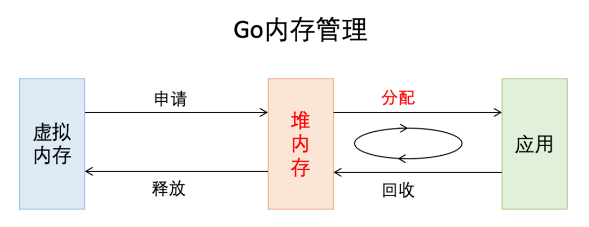
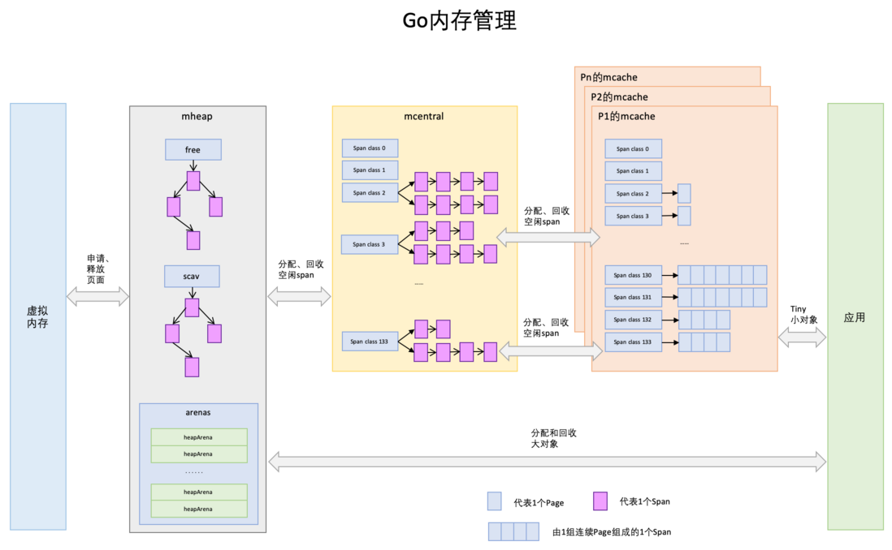
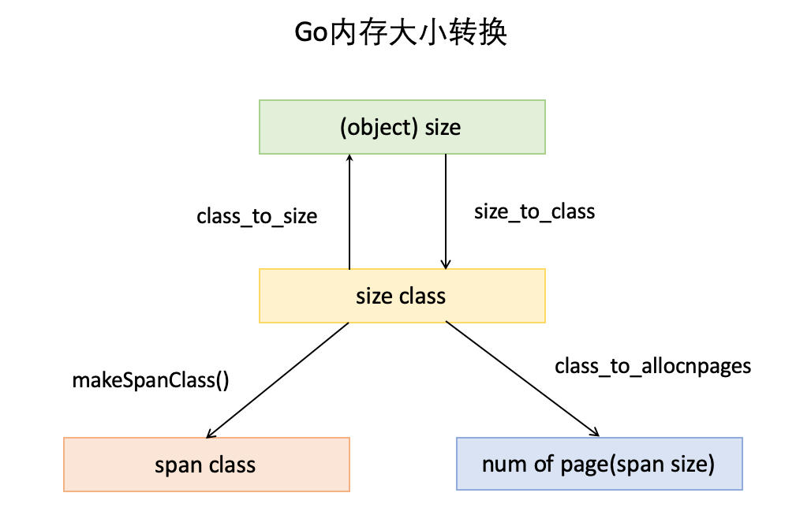
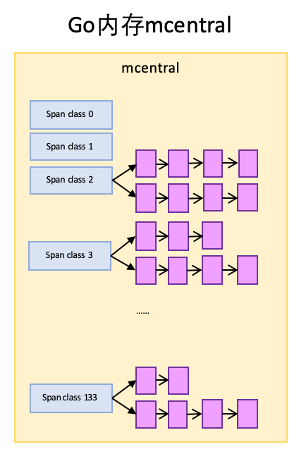
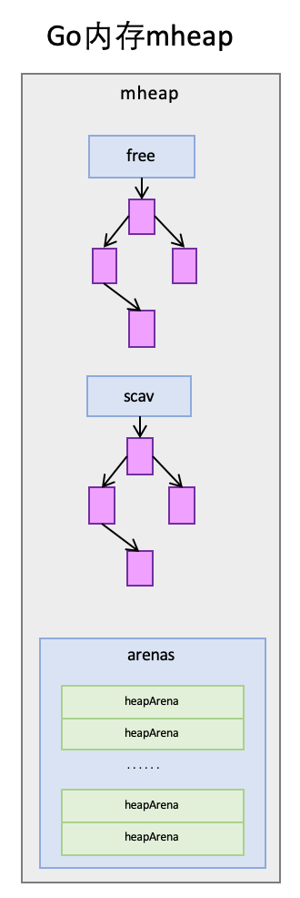

# 内存分配器

> 程序中的数据和变量都会被分配到程序所在的虚拟内存中，内存空间包含两个重要区域：栈区（Stack）和堆区（Heap）

函数调用的参数、返回值以及局部变量大都会被分配到栈上, 这部分内存会由编译器进行管理

堆中的对象由内存分配器分配并由垃圾收集器回收。

# 设计原理

内存管理一般包含三个不同的组件，分别是:

- 用户程序（Mutator）

- 分配器（Allocator）

- 收集器（Collector）

当**用户程序**申请内存时，它会通过内存**分配器**申请新内存，而分配器会负责从堆中初始化相应的内存区域

# Go内存管理的基本概念

Go的内存管理是参考**TCMalloc**实现的, 下面介绍一下**TCMalloc**的几个重要概念：

- **Page**：操作系统对内存管理以页为单位，只不过TCMalloc里的Page大小与操作系统里的大小并不一定相等，而是倍数关系。x64下Page大小是8KB。
- **Span**：一组连续的Page被称为Span，比如可以有2个Page页大小的Span，也可以有16Page页大小的Span，Span是TCMalloc中内存管理的基本单位。
- **ThreadCache**
  ：每个线程各自的Cache缓存，一个Cache缓存包含多个空闲内存块链表，每个链表连接的都是内存块，同一个链表上内存块的大小是相同的，也可以说按内存块大小，给内存块分了个类，这样可以根据申请的内存大小，快速从合适的链表选择空闲内存块。由于每个线程有自己的ThreadCache，所以ThreadCache访问是无锁的。
- **CentralCache**
  ：是所有线程共享的缓存，也是保存的空闲内存块链表，链表的数量与ThreadCache中链表数量相同，当ThreadCache内存块不足时，可以从CentralCache取，当ThreadCache内存块多时，可以放回CentralCache。由于CentralCache是共享的，所以它的访问是要加锁的。
- **PageHeap**
  ：PageHeap是堆内存的抽象，PageHeap存的也是若干链表，链表保存的是Span，当CentralCache没有内存的时，会从PageHeap取，把1个Span拆成若干内存块，添加到对应大小的链表中，当CentralCache内存多的时候，会放回PageHeap。毫无疑问，PageHeap也是要加锁的。

Go内存管理的许多概念在TCMalloc中已经有了，含义是相同的，只是名字有一些变化。

**先给大家上一幅宏观的图，借助图一起来介绍:**

**Page**: 页

- 与TCMalloc中的Page相同，x64下1个Page的大小是8KB。
- 上图的最下方，1个浅蓝色的长方形代表1个Page。

**Span**: 多个页的块

- 与TCMalloc中的Span相同，**Span是内存管理的基本单位**，源代码中是`mspan`, **一组连续的Page组成1个Span**
- 所以上图一组连续的浅蓝色长方形代表的是一组Page组成的1个Span，另外，1个淡紫色长方形为1个Span。

**mcache**: 一个虚拟线程组成的多个Span的集合

- mcache与TCMalloc中的ThreadCache类似
- mcache保存的是各种大小的Span，并按Span class分类，小对象直接从mcache分配内存，它起到了缓存的作用，并且可以无锁访问

- 但mcache与ThreadCache也有不同点

    - TCMalloc中是每个线程1个ThreadCache
    - Go中是**每个P拥有1个mcache**, 因为在Go程序中，使用的是虚拟线程, 理论上可以开无限个线程

**mcentral**: 多个虚拟线程组成的多个mcache的集合

- mcentral与TCMalloc中的CentralCache类似，**是所有线程共享的缓存，需要加锁访问**
- 它按Span class对Span分类，串联成链表
- 当mcache的某个级别Span的内存被分配光时，它会向mcentral申请1个当前级别的Span

- 但mcentral与CentralCache也有不同点

    - CentralCache是每个级别的Span有1个链表，mcache是每个级别的Span有2个链表
- `nonempty`：这个链表里的span，所有span都至少有1个空闲的对象空间。这些span是mcache释放span时加入到该链表的。
    - `empty`：这个链表里的span，所有的span都不确定里面是否有空闲的对象空间。当一个span交给mcache的时候，就会加入到empty链表。
    - 类似于有一个已经存了对象(可能有空位置), 有一个不存用来分配新的对象
    - 先从空的nonempty找, 实在没有了, 再去empty找位置

**mheap**: mcentral的上层

- mheap与TCMalloc中的PageHeap类似，**它是堆内存的抽象，把从OS申请出的内存页组织成Span，并保存起来**。
- 当mcentral的Span不够用时会向mheap申请，mheap的Span不够用时会向OS申请，向OS的内存申请是按页来的，然后把申请来的内存页生成Span组织起来，同样也是需要加锁访问的。

- 但mheap与PageHeap也有不同点：

    - mheap把Span组织成了树结构，而不是链表，并且还是2棵树，然后把Span分配到heapArena进行管理
    - 它包含地址映射和span是否包含指针等位图，这样做的主要原因是为了更高效的利用内存：分配、回收和再利用。

**大小转换**

除了以上内存块组织概念，还有几个重要的大小概念，一定要拿出来讲一下，不要忽视他们的重要性，他们是内存分配、组织和地址转换的基础。

它会解释怎么将page页组合为span, 程序又该通过什么来定位这些页的位置。

请注意, 这里是流程, 并不是一个4个元素组成的某个数据结构, 每一个元素都是一个相互隔离的有其意义的数据结构

- **object size**：代码里简称`size`，指申请内存的对象大小。
- **size class**：代码里简称`class`，它是size的级别
    - 例如: 8bit的对象放在size class1, 16bit的对象放在size class2...
    - 这里会有很多个class, 会根据不同大小的size对象, 定位得到不同位置的class
- **span class**：指span的级别，但span class的大小与span的大小并没有正比关系。
    - 当找到了size class, 也就找到了span class
    - span class主要用来和size class做对应，1个size class对应2个span class
    - 2个span class的span大小相同，只是功能不同，1个用来存放包含指针的对象，一个用来存放不包含指针的对象
    - 不包含指针对象的Span就无需GC扫描了

- **num of page**：代码里简称`npage`，代表Page的数量

    - 当找到了size class, 也就找到了npage
    - 就是Span包含的页数, 例如: size class2=32bit的对象, 需要4个page页

# 寻找合适的span位置存储对象

**寻找span的流程如下：**

1. 计算对象所需内存大小size
2. 根据size得到size class映射位置，计算出所需的size class位置
3. 根据size class和对象是否包含指针计算出span class
4. 获取该span class指向的span
5. 找到一个空的页存放此对象

**以分配一个不包含指针的，大小为24Byte的对象为例:**

- size class 3，它的对象大小范围是(16,32]Byte，就算一个对象不满32bit页按照32bit计算, 24Byte刚好在此区间，所以此对象的size
  class为3
- Size class3到span class的计算后得到该对象需要的是span class 7指向的span

**从span分配对象空间**

Span可以按对象大小切成很多份最小为32bit的块(每一小块就是4个8bit的page页), 以size class 3对应的span class 7为例

随着内存的分配，span中的对象内存块，有些被占用，有些未被占用，比如上图，整体代表1个span，蓝色块代表已被占用内存，绿色块代表未被占用内存。

当分配内存时，只要快速找到第一个可用的绿色块，并计算出内存地址即可，如果需要还可以对内存块数据清零。

**span没有空间怎么分配对象**

span内的所有内存块都被占用时，没有剩余空间继续分配对象，mcache会向mcentral申请1个span，mcache拿到span后继续分配对象。

**mcentral向mcache提供span**

mcentral和mcache一样，但每个级别都保存了2个span list，即2个span链表：

- `nonempty`：这个链表里的span，所有span都至少有1个空闲的对象空间。这些span是mcache释放span时加入到该链表的。

- `empty`：这个链表里的span，所有的span都不确定里面是否有空闲的对象空间。当一个span交给mcache的时候，就会加入到empty链表。

- 类似于有一个已经存了对象(可能有空位置), 有一个不存用来分配新的对象

- 先从空的nonempty找, 实在没有了, 再去empty找位置

实际代码中每1个span class对应1个mcentral，图里把所有mcentral抽象成1个整体了。

mcache向mcentral要span时，mcentral会先从`nonempty`搜索满足条件的span，如果每找到再从`emtpy`搜索满足条件的span，然后把找到的span交给mcache。

**mheap的span管理**

mheap里保存了2棵**二叉排序树**，按span的page数量进行排序：

- `free`：free中保存的span是空闲并且非垃圾回收的span。

- `scav`：scav中保存的是空闲并且已经垃圾回收的span。

如果是垃圾回收导致的span释放，span会被加入到`scav`，否则加入到`free`，比如刚从OS申请的的内存也组成的Span。

mheap中还有arenas，有一组heapArena组成，每一个heapArena都包含了连续的`pagesPerArena`个span，这个主要是为mheap管理span和垃圾回收服务。

mheap本身是一个全局变量，它其中的数据，也都是从OS直接申请来的内存，并不在mheap所管理的那部分内存内。

**mcentral向mheap要span**

mcentral向mcache提供span时

- 如果`emtpy`里也没有符合条件的span，mcentral会向mheap申请span。

- mcentral需要向mheap提供需要的内存页数和span class级别，然后它优先从`free`中搜索可用的span

- 如果没有找到，会从`scav`中搜索可用的span

- 如果还没有找到，它会向OS申请内存，再重新搜索2棵树，必然能找到span。

如果找到的span比需求的span大，则把span进行分割成2个span

其中1个刚好是需求大小，把剩下的span再加入到`free`中去

然后设置需求span的基本信息，然后交给mcentral

**mheap向OS申请内存**

当mheap没有足够的内存时

- mheap会向OS申请内存，把申请的内存页保存到span，然后把span插入到`free`树 。

- 在32位系统上，mheap还会预留一部分空间，当mheap没有空间时，先从预留空间申请，如果预留空间内存也没有了，才向OS申请。