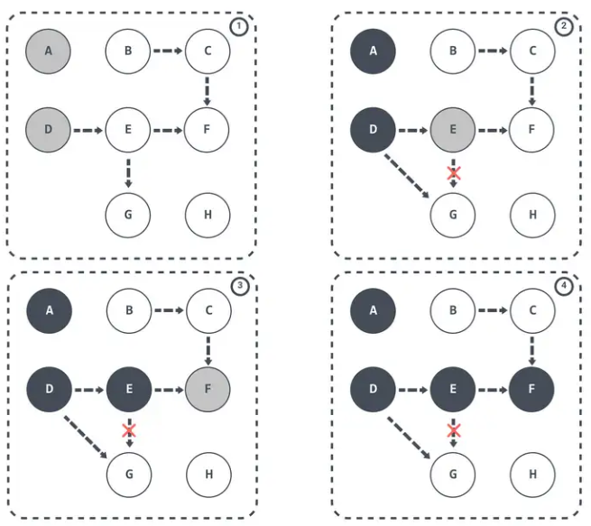

# 简介

在垃圾回收算法中，有两类算法:

- 标记为垃圾的算法
- 回收垃圾的算法

三色标记法就是标记垃圾阶段使用的算法。


# 三种颜色的含义

1. **白色** (White): 该对象没有被标记过（对象垃圾）
   - 表示尚未被访问的对象。
   - 白色对象可能是垃圾，也可能是活动对象。
2. **灰色** (Gray): 该对象已经被标记过了，但该对象下的属性没有全被标记完（GC需要从此对象中去寻找垃圾）
   - 表示已访问但其引用还未被完全检查的对象。
   - 灰色对象是正在进行中的标记过程的一部分，其引用需要被检查以确定是否需要标记更多的对象。
3. **黑色** (Black): 该对象已经被标记过了，且该对象下的属性也全部都被标记过了（程序所需要的对象）
   - 表示已完全访问的对象。
   - 黑色对象是活动对象，已被标记为不可被回收。


# 基本工作流程

## 1.初始标记

- 初始标记阶段会将**根集合中的所有对象标记为灰色**。
  - 根集合: 包括全局变量、栈中的局部变量等。
  - 会STW


## 2.并发标记

- 在并发标记阶段，标记过程和应用程序的运行是交织进行的。
- 垃圾回收器会**尝试将灰色对象标记为黑色**，并递归标记它们所引用的子对象。


## 3.写屏障

- 为了保证标记过程的正确性，Go 的垃圾回收器使用了写屏障。
- 写屏障确保了在应用程序修改对象引用时，垃圾回收器能够及时地将新引用的对象标记为灰色。
- 下面一节我们单独说为什么要这个步骤!


## 4.最终标记

- 当所有灰色对象都被标记为黑色后，最终标记阶段会**将剩余的白色对象标记为垃圾**。
- 这个阶段仍然需要暂停应用程序的运行，但它通常非常短暂。
- 会STW


## 5.垃圾清除

- 在标记完成后，垃圾回收器会清除所有未被标记的对象（即白色对象）。


## 为什么需要步骤3写屏障

3. **写屏障** (Write Barrier):
   - 为了保证标记过程的正确性，Go 的垃圾回收器使用了写屏障。
   - 写屏障确保了在应用程序修改对象引用时，垃圾回收器能够及时地将新引用的对象标记为灰色。
   - 写屏障的原理就是一个纯粹的缓存机制, 如果你要更新写入一个数据, 你就更新缓存

### 遗留两个问题

1. 标记多了
2. 标记少了


### 多标-浮动垃圾问题

1. 假设 `E` 已经被标记过了（变成灰色了），此时因为程序还在运行 `D` 和 `E` 断开了引用, `D` 不在引用 `E` 对象
2. 按理来说此时的对象 ` E/F/G ` 应该被回收的，因为此刻他们应该是垃圾, 但是因为 E 已经变为灰色了，其仍会被当作存活对象继续遍历。

最终的结果是：这部分对象 ` E/F/G ` 仍会被标记为存活，即本轮 GC 不会回收这部分内存。

这部分本应该回收 但是没有回收到的内存，被称之为**浮动垃圾**。

过程如下图所示：


### 漏标-悬挂指针问题

1. 当 GC 线程已经遍历到 `E` 变成灰色，`D` 变成黑色时，灰色 E 断开引用白色 G ，黑色 D 引用了白色 G。
2. 此时切回 GC 线程继续跑，因为 `E` 已经没有对 `G` 的引用了，所以不会将 `G` 放到灰色集合。
3. 尽管因为 `D` 重新引用了 `G`，但因为 `D` 已经是黑色了，不会再重新做遍历处理。

最终导致的结果是：`G` 会一直停留在白色集合中，最后被当作垃圾进行清除。

这直接影响到了应用程序的正确性，是不可接受的，这也是 Go 需要在 GC 时解决的问题。




### 解决方案-写屏障

> 在 Go 中都是使用 Write barrier（写屏障）

为了**解决**上面的三色标记法遗漏的问题，我们需要引入屏障技术来保障数据的一致性。

- 标记过程中: **黑色对象不会指向白色对象，只会指向灰色对象或者黑色对象**

  - 也就是说, 黑色的子引用对象一定是灰色或者黑色, 标识不是垃圾

- 标记过程中: **即便黑色对象指向白色对象，那么从灰色对象出发，一定存在一条可以找到该白色对象的路径**

  - 也就是说: 黑色的子引用对象出现了白色, 那么除了或者这个黑色对象外, 一定有另一个扫描路径可以扫描到这个白色对象

  

****

根对象指向的 `D` 对象标记成黑色并将 `D` 对象指向的对象 `E` 标记成灰色

- 如果 `D` 断开对 `E` 的引用，改成引用白色 `B` 对象，那么这时触发写屏障将 `B` 对象标记成灰色。
- 这里将在下面源码中解释是怎么将一个对象标记为灰色的


# 源码

**概括步骤:**

1. 所有全局变量、静态变量默认就是根对象, goroutine 需要扫描堆栈确定扫描对象
2. 任何还在被 Goroutine 使用的对象，都有可能被标记为灰色, 一个goroutine 堆栈内的所有对象都会被标记, 加入扫描队列
3. 只要是扫描队列的对象, 都是可达不可回收的
4. 并发的遍历扫描队列, 取出对象标记很黑色, 并将对象引用的下一级对象加入扫描队列
5. 直到并发扫描完成, 进入最终标记, 在这过程中有任何行对象或者更新的对象都会通过写屏障自动加入到扫描队列等待扫描。

`src/runtime/mgcmark.go`

入口`gcBgMarkWorker()`方法

## 1.初始标记

### markroot: 扫描第 i 个根对象, 将根对象引用的对象标记为灰色

```go
// 扫描第 i 个根对象, 将根对象引用的对象标记为灰色
//
// 必须禁用抢占（因为这使用了 gcWork）。
//
// 返回操作产生的 GC 工作量。
// 如果 flushBgCredit 为 true，则还会将该工作量刷新到后台信用池。
//
// 在此处 nowritebarrier 仅是一个建议性的声明。
//
// - `gcw` 是一个指向 `gcWork` 结构的指针，用于管理垃圾回收工作的队列。
// - `i` 是一个 `uint32` 类型的整数，表示当前扫描的根对象的索引。
// - `flushBgCredit` 是一个布尔值，指示是否应该将产生的 GC 工作量刷新到后台信用池。
//
//go:nowritebarrier
func markroot(gcw *gcWork, i uint32, flushBgCredit bool) int64 {
	// 注意：如果在此处添加一个 case，请同时更新 heapdump.go:dumproots。
	var workDone int64
	var workCounter *atomic.Int64
	switch {
	// 处理基础数据段（.data 到 .edata 之间的数据）: 已初始化的全局变量和静态变量
	case work.baseData <= i && i < work.baseBSS:
		workCounter = &gcController.globalsScanWork
		for _, datap := range activeModules() {
			workDone += markrootBlock(datap.data, datap.edata-datap.data, datap.gcdatamask.bytedata, gcw, int(i-work.baseData))
		}

	// 处理基础 BSS 段（.bss 到 .ebss 之间的数据）: 未初始化的全局变量和静态变量
	case work.baseBSS <= i && i < work.baseSpans:
		workCounter = &gcController.globalsScanWork
		for _, datap := range activeModules() {
			workDone += markrootBlock(datap.bss, datap.ebss-datap.bss, datap.gcbssmask.bytedata, gcw, int(i-work.baseBSS))
		}

	// 处理固定根 finalizer
	// 在 Go 语言中，finalizer 是一个指定的函数，当一个对象即将被垃圾回收器回收时，会调用该函数来执行一些清理操作，比如关闭文件、释放资源等。
	// 这些对象的 finalizer 需要在垃圾回收过程中被特殊处理，确保在清理操作时正常工作
	case i == fixedRootFinalizers:
		for fb := allfin; fb != nil; fb = fb.alllink {
			cnt := uintptr(atomic.Load(&fb.cnt))
			scanblock(uintptr(unsafe.Pointer(&fb.fin[0])), cnt*unsafe.Sizeof(fb.fin[0]), &finptrmask[0], gcw, nil)
		}

	// 处理固定根 free G stacks
	// 在 Go 中，每个 Goroutine 都有一个对应的栈空间，用于执行函数。当 Goroutine 不再活跃时，其栈空间可能需要被释放以节省资源。
	// 在垃圾回收过程中，需要特殊处理这些对象，确保正确释放不再使用的 Goroutine 栈。
	case i == fixedRootFreeGStacks:
		// 切换到系统栈以便调用 stackfree。
		systemstack(markrootFreeGStacks)

	// 处理基础 Span 段（.span 到 .espan 之间的数据）: 分配 Span 的数据结构
	// 在 Go 内存管理中，Span 是用于分配和管理内存的数据结构，通常代表一段连续的内存区域。
	// .span 到 .espan 之间的数据表示的是用于表示内存分配 Span 的相关数据。
	// 在垃圾回收过程中，这些数据结构需要被标记，以确保垃圾回收器正确地跟踪内存的使用情况，对未使用的内存进行回收。
	case work.baseSpans <= i && i < work.baseStacks:
		// mark mspan.specials
		markrootSpans(gcw, int(i-work.baseSpans))

	// 其余情况为扫描 goroutine 堆栈
	default:
		workCounter = &gcController.stackScanWork
		if i < work.baseStacks || work.baseEnd <= i {
			printlock()
			print("runtime: markroot index ", i, " not in stack roots range [", work.baseStacks, ", ", work.baseEnd, ")\n")
			throw("markroot: bad index")
		}

		// 获取要扫描的 goroutine
		gp := work.stackRoots[i-work.baseStacks]

		// 如果 goroutine 处于等待或系统调用状态，记录等待时间。
		status := readgstatus(gp) // 我们不在扫描状态
		if (status == _Gwaiting || status == _Gsyscall) && gp.waitsince == 0 {
			gp.waitsince = work.tstart
		}

		systemstack(func() {
			userG := getg().m.curg
			selfScan := gp == userG && readgstatus(userG) == _Grunning

			// 若为自身扫描，则将用户 G 置于 _Gwaiting 以防止自身死锁。
			// 若这是一个标记工作者或者我们处于标记终止，则可能已经处于 _Gwaiting 状态。
			if selfScan {
				casGToWaiting(userG, _Grunning, waitReasonGarbageCollectionScan)
			}

			// TODO: suspendG 阻塞（并自旋）直到 gp 停止，
			// 这可能需要一段时间，尤其是对于运行中的 goroutine。
			// 第一阶段是非阻塞的：我们扫描可以扫描的堆栈，并要求运行中的 goroutine 自行扫描；
			// 第二阶段则是阻塞的。

			// 使用 `suspendG` 函数暂停 goroutine，以便扫描其堆栈
			stopped := suspendG(gp)
			// 如果 goroutine 已经死亡，则标记为扫描完成并返回
			if stopped.dead {
				gp.gcscandone = true
				return
			}
			// 如果 goroutine 已经被扫描过，则抛出异常
			if gp.gcscandone {
				throw("g already scanned")
			}

			// 使用 scanstack 函数来扫描 goroutine 的堆栈
			workDone += scanstack(gp, gcw)
			gp.gcscandone = true

			// 完成扫描后，使用 resumeG 函数恢复 goroutine 的执行
			resumeG(stopped)

			// 如果是自我扫描，恢复到 _Grunning 状态
			if selfScan {
				casgstatus(userG, _Gwaiting, _Grunning)
			}
		})
	}

	// 如果 workCounter 不为 nil 并且 workDone 不为零，则添加工作量到 workCounter 中。
	// 如果 flushBgCredit 为 true，则将工作量刷新到后台信用池。
	// 根据扫描的根对象类型，函数可能会更新不同的工作量计数器
	if workCounter != nil && workDone != 0 {
		workCounter.Add(workDone)
		if flushBgCredit {
			gcFlushBgCredit(workDone)
		}
	}
	return workDone
}
```

3. **处理不同的根对象类型**:

    - 函数通过一个 `switch` 语句来区分不同的根对象类型，并针对每种类型执行不同的标记操作。
     - 全局变量和静态变量
     - 处理 goroutine 堆栈。
2. **扫描 goroutine 堆栈**:

   - 当 `i`  的值落在 goroutine 堆栈的范围内时，函数会扫描相应的 goroutine 堆栈。
     - 获取当前要扫描的 goroutine (`gp`)。
     - 使用 `suspendG` 函数暂停 goroutine，以便扫描其堆栈。
       - 使用 `scanstack` 函数来扫描 goroutine 的堆栈。

### scanstack: 扫描 goroutine 的堆栈，将堆栈上的所有指针标记为灰色

真正的扫描方法是: `scanstack`

```go
// scanstack 扫描 goroutine 的堆栈，将堆栈上的所有指针标记为灰色。
//
// 返回扫描操作产生的工作量，但不会更新 gcController.stackScanWork 或刷新任何信用。
// 任何由该函数产生的后台信用应由调用者刷新。scanstack 本身无法安全地刷新信用，
// 因为这可能会导致尝试唤醒刚刚扫描过的 goroutine，从而导致自我死锁。
//
// scanstack 也会安全地缩小堆栈。如果无法安全缩小，则会在下一个同步安全点安排堆栈缩小。
//
// scanstack 被标记为 go:systemstack，因为它在使用 workbuf 时不能被抢占。
//
// - gp 是一个指向 g 结构的指针，代表当前要扫描的 goroutine。
// - gcw 是一个指向 gcWork 结构的指针，用于管理垃圾回收工作的队列。
//
//go:nowritebarrier
//go:systemstack
func scanstack(gp *g, gcw *gcWork) int64 {
	// 函数首先检查 goroutine 的状态是否适合扫描

	if readgstatus(gp)&_Gscan == 0 {
		print("runtime:scanstack: gp=", gp, ", goid=", gp.goid, ", gp->atomicstatus=", hex(readgstatus(gp)), "\n")
		throw("scanstack - bad status")
	}

	switch readgstatus(gp) &^ _Gscan {
	default:
		print("runtime: gp=", gp, ", goid=", gp.goid, ", gp->atomicstatus=", readgstatus(gp), "\n")
		throw("mark - bad status")
	case _Gdead:
		return 0
	case _Grunning:
		print("runtime: gp=", gp, ", goid=", gp.goid, ", gp->atomicstatus=", readgstatus(gp), "\n")
		throw("scanstack: goroutine not stopped")
	case _Grunnable, _Gsyscall, _Gwaiting:
		// ok
	}

	if gp == getg() {
		throw("can't scan our own stack")
	}

	// scannedSize 是我们将会报告的工作量。
	//
	// 它小于分配的大小（即 hi-lo）。
	var sp uintptr
	if gp.syscallsp != 0 {
		sp = gp.syscallsp // 如果正在系统调用中，这是堆栈指针（gp.sched.sp 在这种情况下可能为 0，例如在 Windows 上）。
	} else {
		sp = gp.sched.sp
	}
	scannedSize := gp.stack.hi - sp

	// 获取当前 goroutine 的堆栈指针。保留统计信息以计算初始堆栈大小。
	// 注意，这累积的是扫描的大小，而非分配的大小。
	p := getg().m.p.ptr()
	p.scannedStackSize += uint64(scannedSize)
	p.scannedStacks++

	if isShrinkStackSafe(gp) {
		// 如果堆栈未被大量使用，则缩小堆栈。
		shrinkstack(gp)
	} else {
		// 否则，在下一个同步安全点时缩小堆栈。
		gp.preemptShrink = true
	}

	var state stackScanState
	state.stack = gp.stack

	if stackTraceDebug {
		println("stack trace goroutine", gp.goid)
	}

	if debugScanConservative && gp.asyncSafePoint {
		print("scanning async preempted goroutine ", gp.goid, " stack [", hex(gp.stack.lo), ",", hex(gp.stack.hi), ")\n")
	}

	// 扫描保存的上下文寄存器。这实质上是一个活动寄存器，它会在寄存器和 sched.ctxt 之间来回移动，无需写屏障。
	if gp.sched.ctxt != nil {
		scanblock(uintptr(unsafe.Pointer(&gp.sched.ctxt)), goarch.PtrSize, &oneptrmask[0], gcw, &state)
	}

	// 扫描堆栈。积累堆栈对象列表。
	var u unwinder
	for u.init(gp, 0); u.valid(); u.next() {
		scanframeworker(&u.frame, &state, gcw)
	}

	// 寻找从堆指向堆栈的其他指针。目前这包括 defer 和 panic。

	// 扫描 defer 记录中的其他指针。
	for d := gp._defer; d != nil; d = d.link {
		if d.fn != nil {
			// 扫描函数值，它可能是堆栈分配的闭包。
			// 参见 issue 30453。
			scanblock(uintptr(unsafe.Pointer(&d.fn)), goarch.PtrSize, &oneptrmask[0], gcw, &state)
		}
		if d.link != nil {
			// defer 记录的 link 字段可能指向堆分配的 defer 记录。保留堆记录的活性。
			scanblock(uintptr(unsafe.Pointer(&d.link)), goarch.PtrSize, &oneptrmask[0], gcw, &state)
		}
		// 保留 defer 记录本身。
		// defer 记录可能无法通过常规的堆追踪从 G 达到，因为 defer 链表可能在堆栈和堆之间交织。
		if d.heap {
			scanblock(uintptr(unsafe.Pointer(&d)), goarch.PtrSize, &oneptrmask[0], gcw, &state)
		}
	}
	if gp._panic != nil {
		// panic 总是堆栈分配的。
		state.putPtr(uintptr(unsafe.Pointer(gp._panic)), false)
	}

	// 寻找并扫描所有可达的堆栈对象。构建索引，用于精确扫描堆栈对象

	// state 的指针队列优先考虑精确指针而非保守指针，这样我们会倾向于精确扫描堆栈对象。
	state.buildIndex()
	// 通过一个循环来遍历 state 中的指针队列，每次取出一个指针 p 及其是否为保守指针的标志 conservative。
	for {
		// 如果 p 为 0，说明队列已空，结束循环。
		p, conservative := state.getPtr()
		if p == 0 {
			break
		}

		// 查找指针 p 所指向的堆栈对象 obj
		obj := state.findObject(p)
		if obj == nil {
			continue
		}
		r := obj.r

		// 我们已经扫描了这个对象。
		if r == nil {
			continue
		}
		obj.setRecord(nil) // 不再扫描它。

		// 打印有关扫描对象的信息
		if stackTraceDebug {
			printlock()
			print("  live stkobj at", hex(state.stack.lo+uintptr(obj.off)), "of size", obj.size)
			if conservative {
				print(" (conservative)")
			}
			println()
			printunlock()
		}

		// 获取对象的 GC 数据 gcdata，如果对象使用了 GC 程序，则需要进一步处理
		gcdata := r.gcdata()
		var s *mspan
		if r.useGCProg() {
			// 这条路径不太可能发生，即足够大的需要 GC 程序的堆栈分配对象。
			// 我们需要一些空间将程序解压缩为直的位掩码，我们在这里分配/释放空间。
			// TODO: 如果有一种方法可以在不存储所有位的情况下运行 GC 程序，那就太好了。
			// 我们需要从 Lempel-Ziv 风格的程序转换为其他东西。
			// 或者我们可以禁止将需要 GC 程序的对象放在堆栈上（参见 issue 27447）。
			s = materializeGCProg(r.ptrdata(), gcdata)
			gcdata = (*byte)(unsafe.Pointer(s.startAddr))
		}

		b := state.stack.lo + uintptr(obj.off)

		// scanblock 和 scanConservative 函数都会扫描对象中的指针，并递归地扫描指向的对象

		// 根据 conservative 的值决定使用哪种扫描方式：
		// 它负责保守地扫描给定的内存区间，并将区间内的潜在指针标记为灰色
		if conservative {
			//如果 conservative 为 true，则调用 scanConservative。
			scanConservative(b, r.ptrdata(), gcdata, gcw, &state)
		} else {
			//如果 conservative 为 false，则调用 scanblock。
			scanblock(b, r.ptrdata(), gcdata, gcw, &state)
		}

		// 如果使用了额外的空间来解压 GC 程序，则调用 dematerializeGCProg 清理这些临时数据
		if s != nil {
			dematerializeGCProg(s)
		}
	}

	// 释放不再需要的对象缓冲区

	// （指针缓冲区已在上述循环中全部释放。）
	for state.head != nil {
		x := state.head
		state.head = x.next
		if stackTraceDebug {
			for i := 0; i < x.nobj; i++ {
				obj := &x.obj[i]
				if obj.r == nil { // reachable
					continue
				}
				println("  dead stkobj at", hex(gp.stack.lo+uintptr(obj.off)), "of size", obj.r.size)
				// 注意：不一定真正死亡 - 只是不可从指针到达。
			}
		}
		x.nobj = 0
		putempty((*workbuf)(unsafe.Pointer(x)))
	}
	if state.buf != nil || state.cbuf != nil || state.freeBuf != nil {
		throw("remaining pointer buffers")
	}
	return int64(scannedSize)
}
```

3. **获取堆栈指针**:

    - 获取当前 goroutine 的堆栈指针。
   - 计算扫描的堆栈大小。
9. **寻找并扫描堆栈对象**:
   - 构建索引，用于精确扫描堆栈对象。
   - `scanConservative`对每个堆栈对象执行扫描操作。

### scanConservative: 将区间内的潜在指针标记为灰色

```go
// scanConservative 它负责保守地扫描给定的内存区间，并将区间内的潜在指针标记为灰色
//
// 如果 ptrmask != nil，则只有在 ptrmask 中被标记的字才被视为潜在的指针。
//
// 如果 state != nil，则假设 [b, b+n) 是堆栈中的一个块，并且可能包含指向堆栈对象的指针。
// - b 是一个 uintptr 类型的指针，表示要扫描的块的起始地址。
// - n 是一个 uintptr 类型的整数，表示要扫描的块的长度。
// - ptrmask 是一个指向 uint8 的指针，表示指针掩码，用于指示哪些字可能包含指针。
// - gcw 是一个指向 gcWork 结构的指针，用于管理垃圾回收工作的队列。
// - state 是一个指向 stackScanState 结构的指针，表示堆栈扫描的状态信息。
func scanConservative(b, n uintptr, ptrmask *uint8, gcw *gcWork, state *stackScanState) {
	// 如果启用了 debugScanConservative，则打印保守扫描的区间，并使用 hexdumpWords 打印区间的内容
	if debugScanConservative {
		printlock()
		print("conservatively scanning [", hex(b), ",", hex(b+n), ")\n")
		hexdumpWords(b, b+n, func(p uintptr) byte {
			if ptrmask != nil {
				word := (p - b) / goarch.PtrSize
				bits := *addb(ptrmask, word/8)
				if (bits>>(word%8))&1 == 0 {
					return '$'
				}
			}

			val := *(*uintptr)(unsafe.Pointer(p))
			if state != nil && state.stack.lo <= val && val < state.stack.hi {
				return '@'
			}

			span := spanOfHeap(val)
			if span == nil {
				return ' '
			}
			idx := span.objIndex(val)
			if span.isFree(idx) {
				return ' '
			}
			return '*'
		})
		printunlock()
	}

	// 使用一个循环来遍历区间 [b, b+n)，每次增加 goarch.PtrSize 字节
	for i := uintptr(0); i < n; i += goarch.PtrSize {
		if ptrmask != nil {
			// 如果提供了 ptrmask，则检查当前字是否被标记
			word := i / goarch.PtrSize
			bits := *addb(ptrmask, word/8)
			if bits == 0 {
				// 跳过 8 个字（循环增量会处理第 8 个字）
				//
				// 这应该是第一次看到这个字的 ptrmask，所以 i
				// 必须是 8 字对齐的，但这里还是检查一下。
				if i%(goarch.PtrSize*8) != 0 {
					throw("misaligned mask")
				}
				i += goarch.PtrSize*8 - goarch.PtrSize
				continue
			}
			if (bits>>(word%8))&1 == 0 {
				continue
			}
		}

		val := *(*uintptr)(unsafe.Pointer(b + i))

		// 检查 val 是否指向堆栈内。
		if state != nil && state.stack.lo <= val && val < state.stack.hi {
			// val 可能指向一个堆栈对象。这个
			// 对象可能在上一个周期中就已经死亡，
			// 因此可能包含指向未分配对象的指针，
			// 但与堆对象不同，我们无法判断它是否已经死亡。
			// 因此，如果所有指向这个对象的指针都是通过
			// 保守扫描找到的，我们必须对其进行防御性扫描。
			state.putPtr(val, true)
			continue
		}

		// 检查 val 是否指向一个堆 span。
		span := spanOfHeap(val)
		if span == nil {
			continue
		}

		// 检查 val 是否指向一个已分配的对象。
		idx := span.objIndex(val)
		if span.isFree(idx) {
			continue
		}

		// val 指向一个已分配的对象。标记它。
		obj := span.base() + idx*span.elemsize
		greyobject(obj, b, i, span, gcw, idx) // 函数来标记对象为灰色，表示该对象正在处理中
	}
}
```

3. **遍历区间**:
   - 使用一个循环来遍历区间 `[b, b+n)`，每次增加 `goarch.PtrSize` 字节。
4. **检查 ptrmask**:
   - 如果提供了`ptrmask`，则检查当前字是否被标记。
     - 如果未被标记，则跳过当前字。
     - 如果被标记，则继续处理。
6. **标记对象**:
   - 使用 `greyobject` 函数来标记对象为灰色，表示该对象正在处理中。

### greyobject: 将对象标记为灰色，并将其加入 gcw 的工作队列中

```go
// 将对象标记为灰色，并将其加入 gcw 的工作队列中。
// - obj 是一个 uintptr 类型的指针，表示要标记的对象的起始地址。
// - base 是一个 uintptr 类型的指针，表示对象所在内存块的基地址，仅用于调试。
// - off 是一个 uintptr 类型的整数，表示对象相对于 base 的偏移量，仅用于调试。
// - span 是一个指向 mspan 结构的指针，表示对象所在的 span。
// - gcw 是一个指向 gcWork 结构的指针，用于管理垃圾回收工作的队列。
// - objIndex 是一个 uintptr 类型的整数，表示对象在 span 中的索引。
//
// 请参考 wbBufFlush1，它部分复制了此函数的逻辑。
//
//go:nowritebarrierrec
func greyobject(obj, base, off uintptr, span *mspan, gcw *gcWork, objIndex uintptr) {
	// obj 应该是分配的起始位置，因此必须至少是指针对齐的。
	if obj&(goarch.PtrSize-1) != 0 {
		throw("greyobject: obj not pointer-aligned")
	}
	mbits := span.markBitsForIndex(objIndex)

	if useCheckmark {
		if setCheckmark(obj, base, off, mbits) {
			// 已经标记过。
			return
		}
	} else {
		if debug.gccheckmark > 0 && span.isFree(objIndex) {
			print("runtime: marking free object ", hex(obj), " found at *(", hex(base), "+", hex(off), ")\n")
			gcDumpObject("base", base, off)
			gcDumpObject("obj", obj, ^uintptr(0))
			getg().m.traceback = 2
			throw("marking free object")
		}

		// 如果已经标记，就没有事情要做。
		if mbits.isMarked() {
			return
		}
		mbits.setMarked()

		// 标记 span。
		arena, pageIdx, pageMask := pageIndexOf(span.base())
		if arena.pageMarks[pageIdx]&pageMask == 0 {
			atomic.Or8(&arena.pageMarks[pageIdx], pageMask)
		}

		// 如果这是一个不需要扫描的对象，快速将其标记为黑色，
		// 而不是将其标记为灰色。
		if span.spanclass.noscan() {
			gcw.bytesMarked += uint64(span.elemsize)
			return
		}
	}

	// 我们正在将 obj 添加到 P 的本地工作队列中，因此很可能
	// 这个对象很快就会被同一个 P 处理。
	// 即使工作队列被刷新，对于具有包容共享缓存的平台而言，
	// 仍然可能会有一些好处。
	sys.Prefetch(obj)
	// 将 obj 排队以供扫描。
	if !gcw.putFast(obj) {
		gcw.put(obj)
	}
}
```

1. **标记灰色**:
    - `setMarked`标记灰色
2. **排队扫描**:
   - 使用 `gcw.putFast` 尝试快速将对象放入工作队列。
   - 如果 `putFast` 失败，则使用 `gcw.put` 将对象放入工作队列。


## 2.并发标记

```go
// gcDrain 函数是在并发标记阶段执行的, 主要目的是执行扫描工作，即黑化灰色对象。
// 直到无法获得更多的工作。它可能在 GC 完成之前就返回；
// 调用者需要平衡来自其他处理器（P）的工作。
//
// 如果 flags & gcDrainUntilPreempt != 0，则 gcDrain 在 g.preempt 被设置时返回。
//
// 如果 flags & gcDrainIdle != 0，则 gcDrain 在有其他工作要做时返回。
//
// 如果 flags & gcDrainFractional != 0，则 gcDrain 在 pollFractionalWorkerExit() 返回 true 时自我抢占。
// 这意味着 gcDrainNoBlock。
//
// 如果 flags & gcDrainFlushBgCredit != 0，则 gcDrain 每隔 gcCreditSlack 单位的扫描工作就将扫描工作信用
// 冲刷到 gcController.bgScanCredit。
//
// gcDrain 总是在有待定的停止世界（STW）操作时返回。
//
//go:nowritebarrier
func gcDrain(gcw *gcWork, flags gcDrainFlags) {
	// 如果写屏障不需要，则抛出错误，因为这表明垃圾回收阶段不正确
	if !writeBarrier.needed {
		throw("gcDrain phase incorrect")
	}

	gp := getg().m.curg                              // 获取当前正在运行的 goroutine。
	preemptible := flags&gcDrainUntilPreempt != 0    // 如果设置了 gcDrainUntilPreempt 标志，则在当前 goroutine 被抢占时返回。
	flushBgCredit := flags&gcDrainFlushBgCredit != 0 // 如果设置了 gcDrainFlushBgCredit 标志，则定期将扫描工作信用冲刷到全局账户。
	idle := flags&gcDrainIdle != 0                   // 如果设置了 gcDrainIdle 标志，则在有其他工作可以做时返回。

	initScanWork := gcw.heapScanWork // 记录初始扫描工作量。

	// checkWork 表示在执行下一次自我抢占检查之前的扫描工作量。
	// 初始值设为一个大数，表示首次检查将在执行大量工作之后。
	checkWork := int64(1<<63 - 1) // 初始值为最大整数值减一。
	var check func() bool         // 声明检查函数。

	// 如果设置了 gcDrainIdle 或 gcDrainFractional 标志，则设置检查工作量和检查函数。
	if flags&(gcDrainIdle|gcDrainFractional) != 0 {
		// 将初始扫描工作量加上阈值作为新的检查工作量。
		checkWork = initScanWork + drainCheckThreshold
		// 根据标志设置检查函数。
		if idle {
			// 如果设置了 gcDrainIdle 标志，则使用 pollWork 函数检查是否有其他工作可以做。
			check = pollWork
		} else if flags&gcDrainFractional != 0 {
			// 如果设置了 gcDrainFractional 标志，则使用 pollFractionalWorkerExit 函数检查是否应自我抢占。
			check = pollFractionalWorkerExit
		}
	}

	// 如果仍有未完成的根对象标记任务。
	if work.markrootNext < work.markrootJobs {
		// 如果可抢占或者有人想要执行 stw（停止世界）操作，则停止。
		for !(gp.preempt && (preemptible || sched.gcwaiting.Load())) {
			// 原子增加 work.markrootNext 并获取下一个任务的索引。
			job := atomic.Xadd(&work.markrootNext, +1) - 1
			// 如果所有根集标记任务已完成，则跳出循环。
			if job >= work.markrootJobs {
				break
			}

			markroot(gcw, job, flushBgCredit) // 扫描第 job 个根对象, 将根对象标记会灰色。

			// 如果设置了检查函数并且检查函数返回 true，则提前结束循环。
			if check != nil && check() {
				goto done
			}
		}
	}

	// 循环处理堆中的对象，直到无法获取更多工作为止。
	for !(gp.preempt && (preemptible || sched.gcwaiting.Load())) {
		// 如果 work.full == 0，则调用 gcw.balance() 来平衡工作负载
		if work.full == 0 {
			gcw.balance()
		}

		b := gcw.tryGetFast() // 尝试快速获取一个对象 b。
		if b == 0 {
			b = gcw.tryGet() // 如果快速获取失败，则尝试正常获取。
			if b == 0 {
				// 将当前 P 的写屏障缓冲区刷新到垃圾回收的工作缓冲区
				wbBufFlush() // 如果获取失败，刷新写屏障缓冲区并再次尝试获取。
				b = gcw.tryGet()
			}
		}
		if b == 0 {
			break
		}

		scanobject(b, gcw) // 扫描对象, 即黑化灰色对象

		// 如果本地积累的扫描工作信用足够多，则将其冲刷到全局账户，
		// 以便协程协助可以使用它。
		if gcw.heapScanWork >= gcCreditSlack {
			gcController.heapScanWork.Add(gcw.heapScanWork) // 将本地扫描工作信用添加到全局账户。
			if flushBgCredit {
				gcFlushBgCredit(gcw.heapScanWork - initScanWork) // 冲刷扫描工作信用到全局账户。
				initScanWork = 0
			}
			checkWork -= gcw.heapScanWork
			gcw.heapScanWork = 0

			if checkWork <= 0 {
				checkWork += drainCheckThreshold // 重置检查工作量。
				// 如果检查函数返回 true，则跳出循环。
				if check != nil && check() {
					break
				}
			}
		}
	}

done:
	// 冲刷剩余的扫描工作信用。
	if gcw.heapScanWork > 0 {
		gcController.heapScanWork.Add(gcw.heapScanWork)
		if flushBgCredit {
			gcFlushBgCredit(gcw.heapScanWork - initScanWork)
		}
		gcw.heapScanWork = 0
	}
}
```

2. **初始化**：
   - 获取当前正在运行的 Goroutine（`gp := getg().m.curg`）。
3. **根对象标记任务处理**：
    - `markroot`: 处理未完成的根对象标记任务，即扫描根对象并将其标记为灰色。
4. **堆对象处理**：

    - `scanobject`: 循环处理堆中的对象，不断尝试获取对象并扫描（黑化灰色对象）。

### scanobject: 遍历将下一个子对象标记为灰色,完成之后将本对象标记为黑色

```go
// 扫描从 b 开始的对象，遍历将下一个子对象标记为灰色, 完成之后将本对象标记为黑色, 并将指针添加到 gcw 中。
// b 必须指向堆对象或 oblet 的开始位置。
// scanobject 会查询 GC 位图以获取指针掩码，并查询 span 以获取对象的大小。
//
// - b 是一个 uintptr 类型的指针，表示要扫描的对象的起始地址。
// - gcw 是一个指向 gcWork 结构的指针，用于管理垃圾回收工作的队列。
//
//go:nowritebarrier
func scanobject(b uintptr, gcw *gcWork) {
	// 预取对象，以便在扫描之前进行预加载。
	//
	// 这将重叠获取对象的开头与扫描对象之前的初始设置。
	sys.Prefetch(b)

	// 查找 b 的位图信息和 b 处对象的大小。
	//
	// b 要么是对象的开头，这时就是要扫描的对象的大小；
	// 要么是指向 oblet 的位置，这时我们将在下面计算要扫描的大小。
	s := spanOfUnchecked(b)
	n := s.elemsize
	if n == 0 {
		throw("scanobject n == 0")
	}
	if s.spanclass.noscan() {
		// 从技术上讲这是可以接受的，但如果 noscan 对象到达这里，效率较低。
		throw("scanobject of a noscan object")
	}

	// 如果对象大小超过 maxObletBytes，则将其拆分成 oblets。
	// 如果 b 是对象的起始位置，则将其他 oblets 加入队列以稍后扫描。
	// 计算 oblet 的大小，确保不超过 maxObletBytes。
	if n > maxObletBytes {
		// 大对象。为了更好的并行性和更低的延迟，将其拆分成 oblets。
		if b == s.base() {
			// 将其他 oblets 加入队列以稍后扫描。
			// 有些 oblets 可能在 b 的标量尾部，但这些 oblets 将被标记为 "不再有指针"，
			// 因此当我们去扫描它们时会立即退出。
			for oblet := b + maxObletBytes; oblet < s.base()+s.elemsize; oblet += maxObletBytes {
				if !gcw.putFast(oblet) {
					gcw.put(oblet)
				}
			}
		}

		// 计算 oblet 的大小。因为这个对象一定是大对象，所以 s.base() 是对象的开始位置。
		n = s.base() + s.elemsize - b
		if n > maxObletBytes {
			n = maxObletBytes
		}
	}

	hbits := heapBitsForAddr(b, n)

	// 循环遍历对象中的指针。调用 greyobject 将其标记为灰色
	var scanSize uintptr
	for {
		var addr uintptr
		// 使用 hbits.nextFast 和 hbits.next 获取下一个可能的指针地址 addr。
		if hbits, addr = hbits.nextFast(); addr == 0 {
			if hbits, addr = hbits.next(); addr == 0 {
				break
			}
		}

		// 更新 scanSize 以跟踪最远的指针位置。
		// 记录找到的最远指针的位置，以便更新 heapScanWork。
		// TODO: 是否有更好的指标，现在我们能非常有效地跳过标量部分？
		scanSize = addr - b + goarch.PtrSize

		// 提取指针 obj。
		// 下面的工作在 scanblock 和上面的部分都有重复。
		// 如果你在这里做出更改，请也在那里做出相应的更改。
		obj := *(*uintptr)(unsafe.Pointer(addr))

		// 如果 obj 不是零且不在当前对象内，则测试 obj 是否指向 Go 堆中的对象。
		if obj != 0 && obj-b >= n {
			if obj, span, objIndex := findObject(obj, b, addr-b); obj != 0 {
				greyobject(obj, b, addr-b, span, gcw, objIndex) // 如果 obj 指向堆中的对象，则调用 greyobject 将其标记为灰色
			}
		}
	}

	// 标记为黑色
	gcw.bytesMarked += uint64(n)
	gcw.heapScanWork += int64(scanSize)
}
```

3. **查找对象信息**:
   - 获取对象的 span `s`。
   - 获取对象的大小 `n`。
   - 检查对象是否不需要扫描，如果是，则抛出错误。
6. **扫描对象**:
   - 循环遍历对象中的指针。
     - 使用 `hbits.nextFast` 和 `hbits.next` 获取下一个可能的指针地址 `addr`。
       - 如果 `obj` 指向堆中的对象，则调用 `greyobject` 将其标记为灰色。
7. **将本对象标记为黑色**:
   - 本对象遍历完成所有子对象为灰色之后, 将本对象置为黑色


## 3.写屏障

在并发标记过程中, 获取对象的地址实际是**从缓冲区获取**的, 也就是所谓的开启的写屏障。

- 其实就是一个标识是否从缓存位置取对象, 如果更新对象的引用, 也要更新缓存区

```go
// gcDrain 函数是在并发标记阶段执行的, 主要目的是执行扫描工作，即黑化灰色对象。
// 直到无法获得更多的工作。它可能在 GC 完成之前就返回；
// 调用者需要平衡来自其他处理器（P）的工作。
//
// 如果 flags & gcDrainUntilPreempt != 0，则 gcDrain 在 g.preempt 被设置时返回。
//
// 如果 flags & gcDrainIdle != 0，则 gcDrain 在有其他工作要做时返回。
//
// 如果 flags & gcDrainFractional != 0，则 gcDrain 在 pollFractionalWorkerExit() 返回 true 时自我抢占。
// 这意味着 gcDrainNoBlock。
//
// 如果 flags & gcDrainFlushBgCredit != 0，则 gcDrain 每隔 gcCreditSlack 单位的扫描工作就将扫描工作信用
// 冲刷到 gcController.bgScanCredit。
//
// gcDrain 总是在有待定的停止世界（STW）操作时返回。
//
//go:nowritebarrier
func gcDrain(gcw *gcWork, scanWork int64) int64 {
	...
    // 获取待扫描对象:
    // 尝试快速获取一个对象 b。
    // 如果快速获取失败，则尝试正常获取。
    // 如果获取失败，刷新写屏障缓冲区并再次尝试获取。
    b := gcw.tryGetFast()
    if b == 0 {
        b = gcw.tryGet()
        if b == 0 {
            // 将当前 P 的写屏障缓冲区刷新到垃圾回收的工作缓冲区
            wbBufFlush() // 刷新写屏障缓冲区；这可能会创建更多工作。
            b = gcw.tryGet()
        }
    }
	...
}
```

1. **检查是否开启写屏障**
2. **从当前线程快速获取缓冲区的一个对象**
3. **如果快速获取失败，则尝试正常获取**
4. **刷新写屏障缓冲区, 再次获取对象**

### tryGetFast: 当前线程快速获取缓冲区的一个对象

```go
// tryGetFast 尝试快速地从垃圾回收器的工作队列中获取一个指针以供追踪。
// 如果有立即可用的指针，则返回该指针；否则返回 0，并期望调用者随后调用 tryGet()。
//
//go:nowritebarrierrec
func (w *gcWork) tryGetFast() uintptr {
	// 获取 gcWork 结构中的工作缓冲区 wbuf
	wbuf := w.wbuf1
	// 如果 wbuf 为空 (nil) 或者 nobj（表示缓冲区中的对象数量）为 0，则表示缓冲区为空，没有对象可供追踪
	if wbuf == nil || wbuf.nobj == 0 {
		return 0
	}

	// 如果缓冲区中有对象，则从缓冲区的末尾获取一个对象，并将 nobj 减少 1，表示该对象已被取出
	wbuf.nobj--
	return wbuf.obj[wbuf.nobj]
}
```

### tryGet: 如果快速获取失败，则尝试正常获取

```go
// tryGet 从垃圾回收器的工作队列中获取一个指针以供追踪。
//
// 如果当前的 gcWork 或全局队列中没有剩余的指针，则 tryGet 返回 0。
// 注意，即使返回 0，也可能存在其他 gcWork 实例或其他缓存中仍有待处理的指针。
//
//go:nowritebarrierrec
func (w *gcWork) tryGet() uintptr {
	// 获取 gcWork 结构中的工作缓冲区 wbuf
	wbuf := w.wbuf1
	// 如果 wbuf 为空 (nil)，则调用 init 方法初始化 gcWork，然后再次获取 wbuf
	if wbuf == nil {
		w.init()
		wbuf = w.wbuf1
		// 此时 wbuf 是空的。
	}

	// 如果当前 wbuf 中没有对象，则尝试通过交换 wbuf1 和 wbuf2 来获取另一个缓冲区中的对象
	if wbuf.nobj == 0 {
		w.wbuf1, w.wbuf2 = w.wbuf2, w.wbuf1
		wbuf = w.wbuf1

		// 如果交换后的 wbuf 依然为空，则尝试从全局队列中获取一个缓冲区
		if wbuf.nobj == 0 {
			owbuf := wbuf
			wbuf = trygetfull() // 尝试从全局队列中获取一个缓冲区
			if wbuf == nil {
				return 0
			}
			// 如果成功获取到非空的缓冲区，则将原来的空缓冲区 owbuf 放回空缓冲区队列中
			putempty(owbuf)
			// 并将新的非空缓冲区设置为 wbuf1
			w.wbuf1 = wbuf
		}
	}

	// 从缓冲区中取出一个对象，并将 nobj 减少 1，表示该对象已被取出
	wbuf.nobj--
	return wbuf.obj[wbuf.nobj]
}
```

### wbBufFlush: 刷新写屏障缓冲区, 再次获取对象

```go
// wbBufFlush 将当前 P 的写屏障缓冲区刷新到垃圾回收的工作缓冲区。
//
// 本函数不允许包含写屏障，因为它本身就是写屏障实现的一部分。
//
// 本函数及其调用的所有函数都必须不包含分割点（nosplit），因为：
// 1) 栈中包含来自 gcWriteBarrier 的未类型化的槽位。
// 2) 在调用者中的写屏障测试和刷新缓冲区之间不能有 GC 安全点。
//
// TODO: 一个 "go:nosplitrec" 注解对于这个函数来说非常合适。
//
//go:nowritebarrierrec
//go:nosplit
func wbBufFlush() {
	// 注意：本函数中的每一个可能的返回路径都必须重置缓冲区的 next 指针，
	// 以防止缓冲区溢出。
	// 本函数不允许包含写屏障，因为它本身就是写屏障实现的一部分

	// 如果当前 goroutine 正在关闭 (getg().m.dying > 0)，则直接丢弃写屏障缓冲区的内容
	if getg().m.dying > 0 {
		// 丢弃当前 P 的写屏障缓冲区
		getg().m.p.ptr().wbBuf.discard()
		return
	}

	// 切换到系统栈，以避免 GC 安全点，确保写屏障操作的连续性
	systemstack(func() {
		wbBufFlush1(getg().m.p.ptr()) // 刷新写屏障缓冲区
	})
}
```

### wbBufFlush1: 写屏障缓冲区刷新到垃圾回收的工作队列, 并解决漏标-悬挂指针问题

```go
// wbBufFlush1 将 P 的写屏障缓冲区刷新到垃圾回收的工作队列。
//
// 本函数不允许包含写屏障，因为它本身就是写屏障实现的一部分，因此可能会导致无限循环或缓冲区损坏。
//
// 本函数必须是非抢占式的，因为它使用了 P 的工作缓冲区。
//
//go:nowritebarrierrec
//go:systemstack
func wbBufFlush1(pp *p) {
	// 获取缓冲区中的指针。
	start := uintptr(unsafe.Pointer(&pp.wbBuf.buf[0]))
	// 计算缓冲区中的指针数量
	n := (pp.wbBuf.next - start) / unsafe.Sizeof(pp.wbBuf.buf[0])
	// 获取缓冲区中的前 n 个指针
	ptrs := pp.wbBuf.buf[:n]

	// 将缓冲区的 next 指针设置为 0，防止在处理缓冲区期间有新的指针被加入
	pp.wbBuf.next = 0

	// 如果使用 Checkmark 模式，则遍历所有指针并调用 shade 函数将它们标记为灰色
	if useCheckmark {
		// 遍历所有指针
		for _, ptr := range ptrs {
			shade(ptr) // 将指针标记为灰色
		}
		pp.wbBuf.reset() // 重置写屏障缓冲区
		return
	}

	// 标记缓冲区中的所有指针，并只记录那些被标记为灰色的指针。
	// 我们使用缓冲区本身来临时记录被标记为灰色的指针。
	//
	// TODO: scanobject/scanblock 是否可以直接将指针放入 wbBuf？如果是这样，这将成为唯一的灰色标记路径。
	//
	// TODO: 如果栈已经被标记，我们可以避免标记缓冲区中的“新”指针，甚至完全避免将它们放入缓冲区（这将使缓冲区容量翻倍）。
	// 这对于缓冲区稍微有些复杂；我们可以跟踪是否有未标记的 goroutine 使用了缓冲区，或者全局跟踪是否有未标记的栈，并在每次栈扫描后刷新。

	// 获取当前 P 的垃圾回收工作缓冲区
	gcw := &pp.gcw
	// 初始化位置指针
	pos := 0
	// 遍历所有指针
	for _, ptr := range ptrs {
		// 过滤掉非法指针和已标记的指针
		if ptr < minLegalPointer {
			continue
		}

		// 查找指针所指向的对象
		obj, span, objIndex := findObject(ptr, 0, 0)
		if obj == 0 {
			continue
		}

		// TODO: 考虑采用两步法，第一步只是预取标记位。

		// 获取对象的标记位
		mbits := span.markBitsForIndex(objIndex)
		if mbits.isMarked() {
			continue
		}
		// 将对象标记为已标记
		mbits.setMarked()

		// 标记 span。
		arena, pageIdx, pageMask := pageIndexOf(span.base())
		if arena.pageMarks[pageIdx]&pageMask == 0 {
			// 标记 span 所在的页
			atomic.Or8(&arena.pageMarks[pageIdx], pageMask)
		}

		// 如果 span 无需扫描，则标记为黑色
		if span.spanclass.noscan() {
			gcw.bytesMarked += uint64(span.elemsize)
			continue
		}

		// 将对象加入到灰色指针数组中, 解决漏标-悬挂指针问题
		ptrs[pos] = obj
		pos++
	}

	// 将标记为灰色的对象加入到工作缓冲区中
	gcw.putBatch(ptrs[:pos])
	// 重置写屏障缓冲区
	pp.wbBuf.reset()
}
```

2. **获取缓冲区中的指针**:
   - `start := uintptr(unsafe.Pointer(&pp.wbBuf.buf[0]))`：获取缓冲区的起始地址。
   - `n := (pp.wbBuf.next - start) / unsafe.Sizeof(pp.wbBuf.buf[0])`：计算缓冲区中的指针数量。
   - `ptrs := pp.wbBuf.buf[:n]`：获取缓冲区中的前 n 个指针。
5. **标记指针**:
   - `gcw := &pp.gcw`：获取当前 P 的垃圾回收工作缓冲区。
   - `for _, ptr := range ptrs { ... }`：遍历所有指针。
     - `obj, span, objIndex := findObject(ptr, 0, 0)`：查找指针所指向的对象。
     - `mbits := span.markBitsForIndex(objIndex)`：获取对象的标记位。
     - `mbits.setMarked()`：将对象标记为已标记。
     - 标记 span。
     - **将对象加入到工作队列中, 解决漏标-悬挂指针问题。**
6. **将灰色对象加入队列**:
   - `gcw.putBatch(ptrs[:pos])`：将标记为灰色的对象加入到工作缓冲区中。


## 4.最终标记

`src/runtime/mgc.go`

### gcMarkDone: 将垃圾回收从标记阶段转换到标记终止阶段

```go
// gcMarkDone 函数用于将垃圾回收从标记阶段转换到标记终止阶段，如果所有可达的对象已经被标记。
// 如果还有未标记的对象存在或未来可能有新对象产生，则将所有本地工作刷新到全局队列中，
// 使其可以被其他工作者发现并处理。
//
// 此函数应该在所有本地标记工作完成并且没有剩余工作者时被调用。具体来说，当满足以下条件时：
//
//	work.nwait == work.nproc && !gcMarkWorkAvailable(p)
//
// 调用上下文必须是可以抢占的。
//
// 刷新本地工作非常重要，因为空闲的 P 可能有本地队列中的工作。这是使这些工作可见并驱动垃圾回收完成的唯一途径。
//
// 在此函数中显式允许使用写屏障。如果它确实转换到标记终止阶段，那么所有可达的对象都已被标记，
// 因此写屏障不会再遮蔽任何对象。
func gcMarkDone() {
	// 确保只有一个线程在同一时间运行 ragged barrier。
	semacquire(&work.markDoneSema)

top:
	// 在转换锁下重新检查转换条件。
	//
	// 关键是必须在执行 ragged barrier 之前检查全局工作队列是否为空。
	// 否则，可能存在全局工作，而 P 在通过 ragged barrier 后可能会获取这些工作。
	if !(gcphase == _GCmark && work.nwait == work.nproc && !gcMarkWorkAvailable(nil)) {
		semrelease(&work.markDoneSema)
		return
	}

	// forEachP 需要 worldsema 执行，而我们稍后也需要它来停止世界，因此现在获取 worldsema。
	semacquire(&worldsema) // 获取 worldsema 锁，用于停止世界

	// 刷新所有本地缓冲区并收集 flushedWork 标志。
	gcMarkDoneFlushed = 0
	systemstack(func() {
		// 获取当前正在运行的 goroutine
		gp := getg().m.curg
		// 标记用户栈为可以抢占，以便它可以被扫描
		casGToWaiting(gp, _Grunning, waitReasonGCMarkTermination)

		// 遍历所有 P 线程调度器
		forEachP(func(pp *p) {
			// 刷新写屏障缓冲区，因为这可能会向 gcWork 添加工作。
			wbBufFlush1(pp)

			// 刷新 gcWork，因为这可能会创建全局工作并设置 flushedWork 标志。
			//
			// TODO(austin): 分解这些工作缓冲区以更好地分配工作。
			pp.gcw.dispose() // 将所有缓存的指针返回到全局队列
			// 收集 flushedWork 标志。
			if pp.gcw.flushedWork {
				atomic.Xadd(&gcMarkDoneFlushed, 1)
				pp.gcw.flushedWork = false
			}
		})
		// 转化线程状态
		casgstatus(gp, _Gwaiting, _Grunning)
	})

	// 检查是否存在更多灰色对象
	if gcMarkDoneFlushed != 0 {
		// 继续执行。有可能在 ragged barrier 期间转换条件再次变为真，因此重新检查。
		semrelease(&worldsema)
		goto top
	}

	// 没有全局工作，没有本地工作，并且没有任何 P 通信了工作，自从获取了 markDoneSema。
	// 因此没有灰色对象，也不会有更多对象被遮蔽。转换到标记终止阶段。

	now := nanotime()                                           // 获取当前时间
	work.tMarkTerm = now                                        // 设置标记终止时间
	work.pauseStart = now                                       // 设置暂停开始时间
	getg().m.preemptoff = "gcing"                               // 设置不可抢占标志
	systemstack(func() { stopTheWorldWithSema(stwGCMarkTerm) }) // stw 停止世界

	restart := false // 初始化重启标志
	systemstack(func() {
		for _, p := range allp {
			wbBufFlush1(p)
			// 检查是否存在未完成的工作
			if !p.gcw.empty() {
				restart = true
				break
			}
		}
	})

	// 如果存在未完成的工作，则重新开始标记阶段
	if restart {
		getg().m.preemptoff = ""
		systemstack(func() {
			now := startTheWorldWithSema()
			work.pauseNS += now - work.pauseStart
			memstats.gcPauseDist.record(now - work.pauseStart)
		})
		semrelease(&worldsema)
		goto top
	}

	// gc计算起始堆栈大小
	gcComputeStartingStackSize()

	// 禁用协助和后台工作者。必须在唤醒被阻塞的协助之前这样做。
	atomic.Store(&gcBlackenEnabled, 0)

	// 通知 CPU 限制器 GC 协助现在将停止。
	gcCPULimiter.startGCTransition(false, now)

	// 唤醒所有被阻塞的协助。这些将在我们启动世界时运行。
	gcWakeAllAssists()

	// 同样，释放转换锁。被阻塞的工作者和协助将在启动世界时运行。
	semrelease(&work.markDoneSema)

	// 在 STW 模式下，重新启用用户 goroutines。这些将在启动世界后排队运行。
	schedEnableUser(true)

	// endCycle 依赖于所有 gcWork 缓存统计信息被刷新。
	// 上面的终止算法确保了从 ragged barrier 以来的所有分配。
	gcController.endCycle(now, int(gomaxprocs), work.userForced)

	// 执行标记终止。这将重新启动世界。
	gcMarkTermination()
}
```

2. **检查转换条件**:

   - `if !(gcphase == _GCmark && work.nwait == work.nproc && !gcMarkWorkAvailable(nil)) { ... }`

     ：检查是否满足转换条件。

     - `gcphase == _GCmark`：当前处于标记阶段。
     - `work.nwait == work.nproc`：所有工作者已经完成。
     - `!gcMarkWorkAvailable(nil)`：没有更多的标记工作可用。

3. **获取 worldsema**:

   - `semacquire(&worldsema)`：获取 worldsema 锁，用于停止世界。

3. **执行标记终止阶段**:

   - `systemstack(func() { stopTheWorldWithSema(stwGCMarkTerm) })`：停止世界。

   - `gcMarkTermination()`：执行标记终止。


