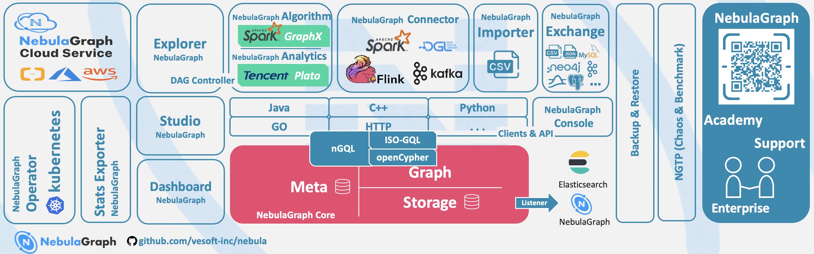
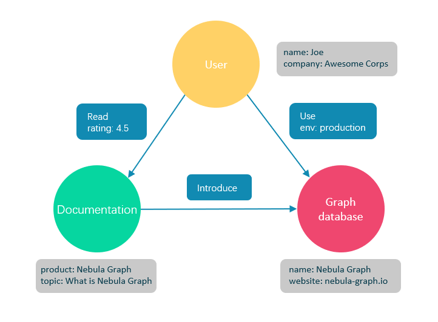

# 简介

> NebulaGraph 是一款开源的、分布式的、易扩展的原生图数据库。
>
> 官方表示 -> 能够承载包含数千亿个点和数万亿条边的超大规模数据集，并且提供毫秒级查询。

[官网](https://www.vesoft.com/)

[官方文档](https://docs.nebula-graph.com.cn/)

[GitHub](https://github.com/vesoft-inc/nebula)

# 什么是图数据库

> 图数据库是专门存储庞大的图形网络并从中检索信息的数据库。
>
> 它可以将图中的数据高效存储为点（Vertex）和边（Edge），还可以将属性（Property）附加到点和边上。

图数据库适合存储大多数从现实抽象出的数据类型

- 世界上几乎所有领域的事物都有**内在联系**

- 像关系型数据库这样的建模系统会提取实体之间的关系
    - 将关系单独存储到表和列中(**映射表**)
    - 实体的类型和属性存储在其他列甚至其他表中(**信息表**)

NebulaGraph 作为一个典型的图数据库，可以将丰富的关系通过边及其类型和属性自然地呈现(**拓扑结构**)

