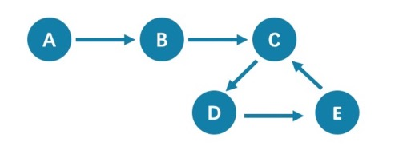
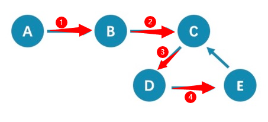
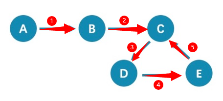
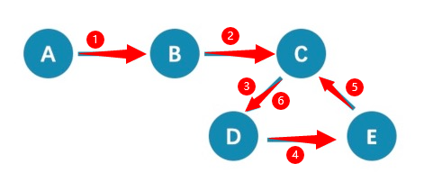
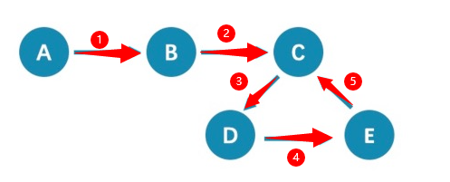
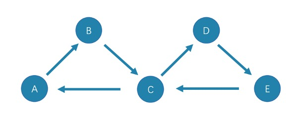
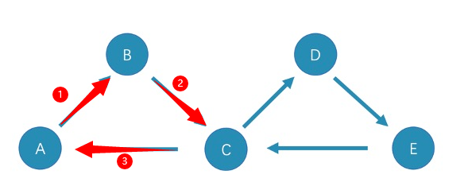
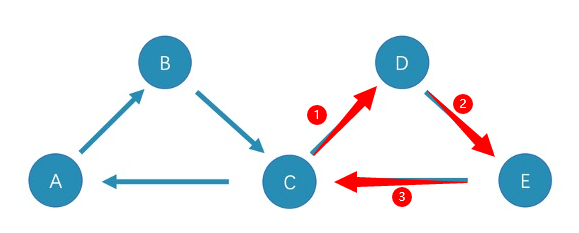
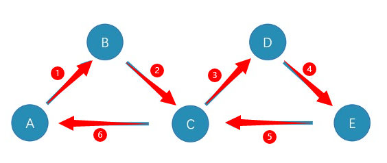
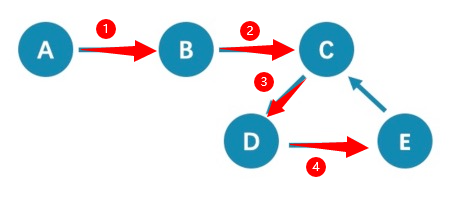

# 路径的作用

> 图论中一个非常重要的概念是路径，路径是指一个有限或无限的边序列，这些边连接着一系列的点。

- 一个拓扑结果的图, 可能很多方向延申, 也可能在某个时候又绕回来构成死循环
- 就有了路径的概念

# 路径的类型

> 路径的类型分为三种：`walk`、`trail`、`path`。

以下图为例进行简单介绍(可以选择任意的点为起点开始, 举例默认从A开始):

## 先说结论

- `walk`: 无限循环无限制, 点和边可以随意重复使用

- `trail`: 限制性限制是否可以经过重复的点或者重复的边
- `path`: 点和边都不可以重复使用

## 1.walk

> `walk`类型的路径由有限或无限的边序列构成。遍历时点和边可以重复。

由于 C、D、E 构成了一个环，因此该图包含无限个路径

例如`A->B->C->D->E`、`A->B->C->D->E->C`、`A->B->C->D->E->C->D`, 以此类推...

补充:

`GO`语句采用的是`walk`类型路径。

## 2.trail

> `trail`类型的路径由有限的边序列构成。遍历时只有点可以重复，边不可以重复。

柯尼斯堡七桥问题的路径类型就是`trail`: 一个步行者怎样才能不重复、不遗漏地一次走完七座桥，最后回到出发点。

由于**边不可以重复**，所以该图包含有限个路径

**最长路径**由 5 条边组成：`A->B->C->D->E->C`(你可以在最长路径的任意位置停下来)

补充:

`MATCH`、`FIND PATH`和`GET SUBGRAPH`语句采用的是`trail`类型路径。

> 在 trail 类型中，还有`cycle`和`circuit`两种特殊的路径类型

以下图为例对这两种特殊的路径类型进行介绍(可以选择任意的点为起点开始):

cycle 是封闭的 `trail` 类型的路径，遍历时**边不可以重复，起点和终点重复，并且没有其他点重复**。

- 最长路径由三条边组成：`A->B->C->A`或`C->D->E->C`

circuit 也是封闭的 `trail` 类型的路径，遍历时边不可以重复，除起点和终点重复外，可能存在其他点重复。

- 最长路径为：`A->B->C->D->E->C->A

## 3.path

> `path`类型的路径由有限的边序列构成。遍历时点和边都不可以重复。

由于点和边都不可以重复，所以该图包含有限个路径

最长路径由 4 条边组成：`A->B->C->D->E`。

