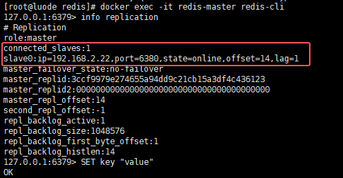

### 部署主从

我们可以使用 `luode0320/redis:latest` 容器来部署一个简单的 Redis 主从复制环境。

### 步骤 1: 准备 Docker 环境

首先，确保你的 Docker 环境已经安装好，并且可以正常使用。

- 你也可以来我这里下载离线包, 用sh脚本一键安装 -> [docker](https://github.com/luode0320/docker)

### 步骤 2: 创建 Redis 配置文件

我们需要创建 Redis 配置文件，一个用于主节点，另一个用于从节点。

- 我默认部署在一台服务器上, 注意ip地址的调整

```sh
cd /usr/local/src
mkdir -p redis
cd redis
vi redis-conf.sh
```

```sh
#!/bin/bash

# 创建目录
cd /usr/local/src
mkdir -p redis

# 主节点
IP="192.168.2.22"
PORT=6379

########################## 主节点配置文件 ########################## 
cat > redis/redis-master.conf <<EOF
port 6379
bind 0.0.0.0
# 关闭保护模式, Redis可以不设置密码
protected-mode no
EOF

echo "创建 Redis 主节点 6379 配置文件."
chmod 777 redis/redis-master.conf

########################## 从节点配置文件 ##########################
cat > redis/redis-slave.conf <<EOF
port 6380
bind 0.0.0.0
# 关闭保护模式, Redis可以不设置密码
protected-mode no

# 设置从节点, 并指定主节点
slaveof $IP $PORT

# 启用 AOF 持久化, 每秒+不强制同步+达到 100% 时重写+文件最小大小+RDB格式作为AOF文件的前缀
appendonly yes
appendfsync everysec
no-appendfsync-on-rewrite no
auto-aof-rewrite-percentage 100
auto-aof-rewrite-min-size 64mb
aof-use-rdb-preamble yes
appendfilename "appendonly.aof"
# 设置 RDB 持久化, 频率+是否压缩 RDB 文件+计算文件的校验和+文件保存目录+文件名
save 900 1
save 300 10
save 60 10000
rdbcompression yes
rdbchecksum yes 
dbfilename "dump.rdb"
EOF

echo "创建 Redis 从节点 6380 配置文件."
chmod 777 redis/redis-slave.conf

echo "创建 Redis 配置文件完成."
```

```sh
chmod 777 redis-conf.sh
./redis-conf.sh
```


### 步骤 3: 启动

```sh
# 启动主节点
docker run -d \
  --net host \
  --restart=always \
  --name redis-master \
  -p 6379:6379 \
  -v "/usr/local/src/redis/master:/data" \
  -v "/usr/local/src/redis/redis-master.conf:/etc/redis/redis.conf" \
  luode0320/redis:latest \
  redis-server /etc/redis/redis.conf
  
# 启动从节点
docker run -d \
  --net host \
  --restart=always \
  --name redis-slave \
  -p 6380:6380 \
  -v "/usr/local/src/redis/slave:/data" \
  -v "/usr/local/src/redis/redis-slave.conf:/etc/redis/redis.conf" \
  luode0320/redis:latest \
  redis-server /etc/redis/redis.conf
```

### 步骤 4: 验证

1. **验证主节点**： 使用 `redis-cli` 连接到主节点，并查看从节点信息。

```sh
# 验证
docker exec -it redis-master redis-cli info replication 
# 设置一个key
docker exec -it redis-master redis-cli SET key "value"
```



2. 验证从节点：

```sh
# 验证
docker exec -it redis-slave redis-cli -p 6380 info replication 
# 查询
docker exec -it redis-slave redis-cli -p 6380 GET key
# 从节点尝试设置一个key, 会报错, 默认只读
docker exec -it redis-slave redis-cli -p 6380 SET key0 "value"
# (error) READONLY You can't write against a read only replica.
```


